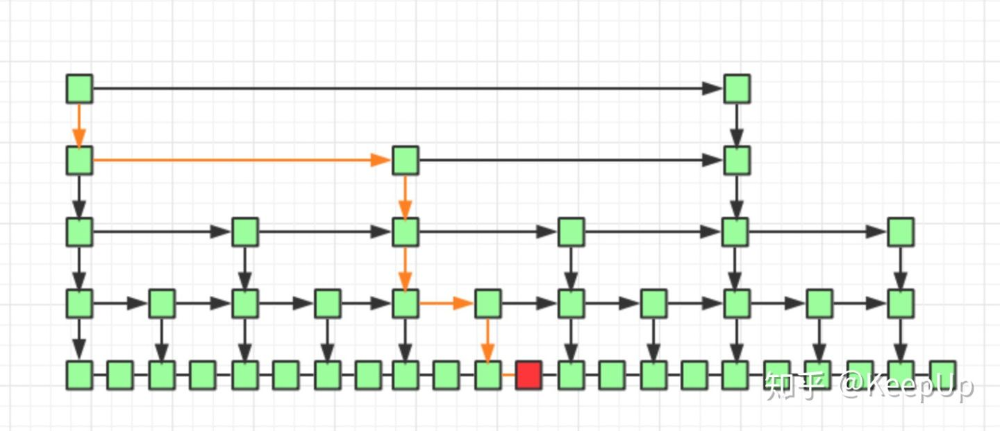
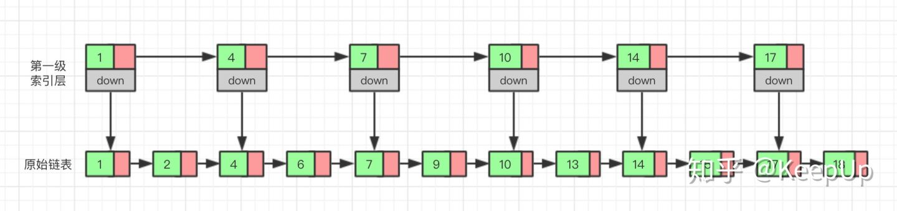

# 树

树是由结点或顶点和边组成的(可能是非线性的)且不存在着任何环的一种数据结构

## 二叉树

每个节点关联的子节点至多有两个

左子树键值小于根的键值，右字数的键值大于根的键值

### 平衡二叉树

满足二叉树的定义，且满足任何节点的两个子树的高度最大差为一

## B树

为磁盘或其他直接存取的辅助存储设备而设计的一种平衡搜索树

### B+树

所有记录节点都是按键值的大小顺序存放在同一层的叶子节点上，由各叶子节点指针进行连接

## 红黑树

### 特点

1. 每个节点或者是黑色，或者是红色
2. 根节点是黑色
3. 每个叶子节点（NIL）是黑色。 [注意：这里叶子节点，是指为空(NIL或NULL)的叶子节点！]
4. 如果一个节点是红色的，则它的子节点必须是黑色的
5. 从一个节点到该节点的子孙节点的所有路径上包含相同数目的黑节点

### 复杂度

时间: O(lgn)

## 跳表

跳跃列表，它允许快速查询，插入和删除一个有序连续元素的数据链表

查找： 每次查找data在链表的位置，不用从头到尾遍历链表   从最高级索引往下遍历逐步确定范围

新增： 先通过索引查找 找到data在链表中应该存的位置，然后插入到链表中，然后判断是否上升索引

删除： 先找到最高级索引位置，如果有就删除，依次往下进行直到将原链表节点删除

每两个节点提取一个结点到上一级

### 复杂度

时间: O(logn)
空间: O(n)

### 演化过程

对于单链表来说，即使数据是已经排好序的，想要查询其中的一个数据，只能从头开始遍历链表，这样效率很低，时间复杂度很高，是 O(n)。
我们可以为链表建立一个“索引”，这样查找起来就会更快，如下图所示，我们在原始链表的基础上，每两个结点提取一个结点建立索引，我们把抽取出来的结点叫做`索引层`或者`索引`，down 表示指向原始链表结点的指针

现在如果我们想查找一个数据，比如说 15，我们首先在索引层遍历，当我们遍历到索引层中值为 14 的结点时，我们发现下一个结点的值为 17，所以我们要找的 15 肯定在这两个结点之间。这时我们就通过 14 结点的 down 指针，回到原始链表，然后继续遍历

