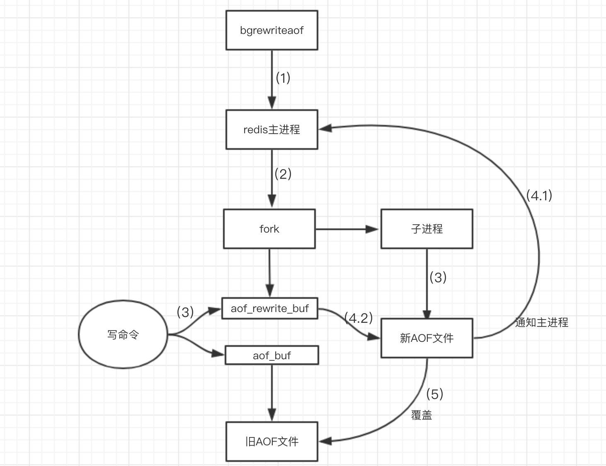

## RDB

将当前数据生成快照保存到硬盘的过程，分为手动触发和自动触发

### 触发机制
#### 手动

* save: 阻塞当前服务器

* bgsave: fork子进程

#### 自动触发

```shell
save m n # 表示m秒内存在n次修改
```

### 执行流程


### 优劣

#### 优点

* RDB文件紧凑，全量备份，非常适合用于进行备份和灾难恢复。
* 生成RDB文件的时候，redis主进程会fork()一个子进程来处理所有保存工作，主进程不需要进行任何磁盘IO操作。
* RDB 在恢复大数据集时的速度比 AOF 的恢复速度要快

#### 缺点

## AOF

AOF(append only file),以独立日志的方式记录每次写命令

### 命令写入

以文本协议格式写入文件，所有的写命令会追加到 `aof_buf` 中

### 文件同步

* appendfsync always。每次有新命令追加到 AOF 文件时就执行一次 fsync ：非常慢，也非常安全。
* appendfsync everysec。每秒 fsync 一次：足够快（和使用 RDB 持久化差不多），并且在故障时只会丢失 1 秒钟的数据。
* appendfsync no。从不 fsync ：将数据交给操作系统来处理。更快，也更不安全的选择

### 重写机制

使用重写机制来压缩文件体积，将进程内的数据转化成写命令同步到新的AOF文件里



1. 执行重写请求
2. 父进程fork子进程
    * 主进程继续响应命令，所有的命令依然写入aof缓存区
    * 使用aof_rewrite_buf（aof重写缓冲区）保存新的数据
3. 子进程按照命令合并规则写入新的AOF文件
4. 子进程完成AOF
    * 子进程完成后发送信号给进程，父进程更新统计信息
    * 父进程把AOF重写缓冲区的数据写入到新的AOF文件
5. 新文件替代旧的文件

### 重启加载

## 混合持久化

子进程先将共享的内存副本全量的以RDB方式写入aof文件，然后在将 `aof_rewrite_buf` 重写缓冲区的增量命令以AOF方式写入到文件，
写入完成后通知主进程更新统计信息，并将新的含有RDB格式和AOF格式的AOF文件替换旧的的AOF文件
