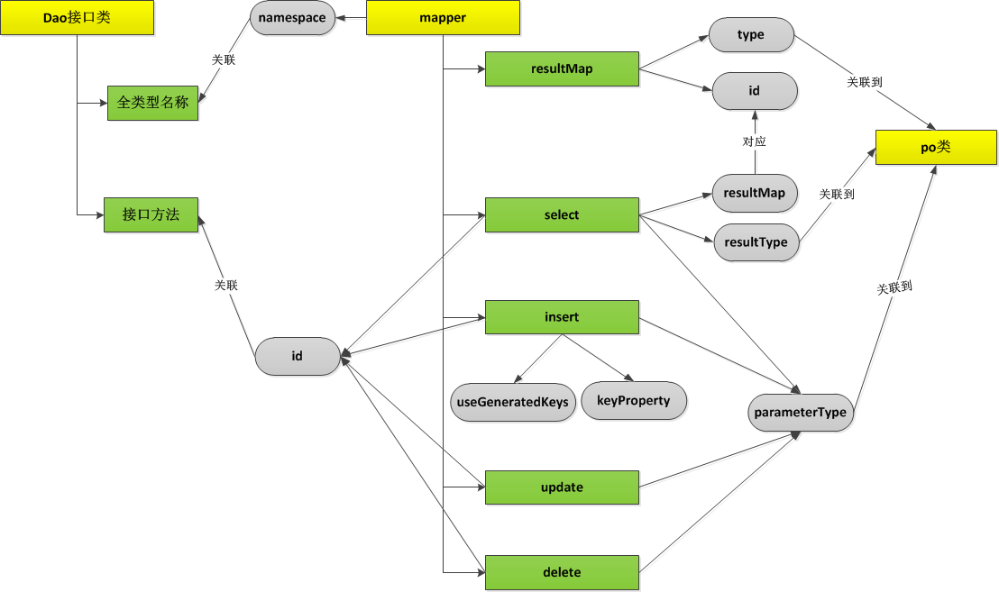

## SqlSessionFactoryBuilder

根据配置信息或代码生成 `SqlSessionFactory`

## SqlSessionFactory

使用工厂生成 `SqlSession`. `SqlSessionFactory` 只是一个接口

```java
public interface SqlSessionFactory {

  SqlSession openSession();

  SqlSession openSession(boolean autoCommit);

  SqlSession openSession(Connection connection);

  SqlSession openSession(TransactionIsolationLevel level);

  SqlSession openSession(ExecutorType execType);

  SqlSession openSession(ExecutorType execType, boolean autoCommit);

  SqlSession openSession(ExecutorType execType, TransactionIsolationLevel level);

  SqlSession openSession(ExecutorType execType, Connection connection);

  Configuration getConfiguration();

}
```

### DefaultSqlSessionFactory

`DefaultSqlSessionFactory` 是 `SqlSessionFactory` 默认的实现

```java
public class DefaultSqlSessionFactory implements SqlSessionFactory {

    // 配置环境
    private final Configuration configuration;

    public DefaultSqlSessionFactory(Configuration configuration) {
        this.configuration = configuration;
    }

    @Override
  public SqlSession openSession() {
    return openSessionFromDataSource(configuration.getDefaultExecutorType(), null, false);
  }

  private SqlSession openSessionFromDataSource(ExecutorType execType, TransactionIsolationLevel level, boolean autoCommit) {
    Transaction tx = null;
    try {
        // 获得环境变量
      final Environment environment = configuration.getEnvironment();
      // 事务工厂
      final TransactionFactory transactionFactory = getTransactionFactoryFromEnvironment(environment);
      // 创建事务
      tx = transactionFactory.newTransaction(environment.getDataSource(), level, autoCommit);
      // 执行器
      final Executor executor = configuration.newExecutor(tx, execType);
      // 创建 SqlSession
      return new DefaultSqlSession(configuration, executor, autoCommit);
    } catch (Exception e) {
        // 异常关闭事务
      closeTransaction(tx); // may have fetched a connection so lets call close()
      throw ExceptionFactory.wrapException("Error opening session.  Cause: " + e, e);
    } finally {
      ErrorContext.instance().reset();
    }
  }
}
```

## SqlSession

四大组件:

* Execute 调度执行 StatementHandler、ParmmeterHandler、ResultHandler执行相应的SQL语句；
* StatementHandler 使用数据库中Statement（PrepareStatement）执行操作，即底层是封装好了的prepareStatement；
* ParammeterHandler 处理SQL参数；
* ResultHandler 结果集ResultSet封装处理返回

### 执行流程

SqlSession的运行主要是依靠 Executor执行器调用（调度）StatementHandler、parameterHanlder、ResultSetHandler，Executor首先通过创建StamentHandler执行预编译并设置参数运行


### Executor 执行器

真正执行Java与数据库的交互

#### 执行器类型

```java
public enum ExecutorType {
  SIMPLE, // 普通
  REUSE, // 会重用预处理器
  BATCH // 重用语句并执行批量更新
}
```

#### Executor

```java
public interface Executor {

  ResultHandler NO_RESULT_HANDLER = null;

    // 更新
  int update(MappedStatement ms, Object parameter) throws SQLException;

    // 查询
  <E> List<E> query(MappedStatement ms, Object parameter, RowBounds rowBounds, ResultHandler resultHandler, CacheKey cacheKey, BoundSql boundSql) throws SQLException;

    // 查询
  <E> List<E> query(MappedStatement ms, Object parameter, RowBounds rowBounds, ResultHandler resultHandler) throws SQLException;

  <E> Cursor<E> queryCursor(MappedStatement ms, Object parameter, RowBounds rowBounds) throws SQLException;

  List<BatchResult> flushStatements() throws SQLException;

    // 提交事务
  void commit(boolean required) throws SQLException;
    // 回滚事务
  void rollback(boolean required) throws SQLException;

    // 创建缓存key
  CacheKey createCacheKey(MappedStatement ms, Object parameterObject, RowBounds rowBounds, BoundSql boundSql);

  boolean isCached(MappedStatement ms, CacheKey key);

  void clearLocalCache();

  void deferLoad(MappedStatement ms, MetaObject resultObject, String property, CacheKey key, Class<?> targetType);

  Transaction getTransaction();

  void close(boolean forceRollback);

  boolean isClosed();

  void setExecutorWrapper(Executor executor);
}
```

#### 如何创建


1. 选择相应的执行器生成

```java
// DefaultSqlSessionFactory.java
// execType = configuration.getDefaultExecutorType() 使用 SIMPLE
final Executor executor = configuration.newExecutor(tx, execType);

// Configuration.java
public Executor newExecutor(Transaction transaction, ExecutorType executorType) {
    // 判断执行器类型
    executorType = executorType == null ? defaultExecutorType : executorType;
    executorType = executorType == null ? ExecutorType.SIMPLE : executorType;
    Executor executor;
    if (ExecutorType.BATCH == executorType) {
      executor = new BatchExecutor(this, transaction);
    } else if (ExecutorType.REUSE == executorType) {
      executor = new ReuseExecutor(this, transaction);
    } else {
    // 默认
      executor = new SimpleExecutor(this, transaction);
    }
    // 开启缓存
    if (cacheEnabled) {
      executor = new CachingExecutor(executor);
    }
    // 插件
    executor = (Executor) interceptorChain.pluginAll(executor);
    return executor;
}
```

2. 在执行器中StatementHandler是根据Configuration构建的
3. Executor会执行StatementHandler的prepare()方法进行预编译---->填入connection对象等参数---->再调用parameterize()方法设置参数---->完成预编译


### StatementHandler

专门处理数据库会话,进行预编译并且调用 `ParameterHandler` 的 `setParameters()`方法设置参数

```java
public interface StatementHandler {

  Statement prepare(Connection connection, Integer transactionTimeout)
      throws SQLException;

  void parameterize(Statement statement)
      throws SQLException;

  void batch(Statement statement)
      throws SQLException;

  int update(Statement statement)
      throws SQLException;

  <E> List<E> query(Statement statement, ResultHandler resultHandler)
      throws SQLException;

  <E> Cursor<E> queryCursor(Statement statement)
      throws SQLException;

  BoundSql getBoundSql();

  ParameterHandler getParameterHandler();

}

```
处理过程

```java
@Override
public <E> List<E> doQuery(MappedStatement ms, Object parameter, RowBounds rowBounds, ResultHandler resultHandler, BoundSql boundSql) throws SQLException {
    Statement stmt = null;
    try {
      Configuration configuration = ms.getConfiguration();
      StatementHandler handler = configuration.newStatementHandler(wrapper, ms, parameter, rowBounds, resultHandler, boundSql);
      stmt = prepareStatement(handler, ms.getStatementLog());
      return handler.query(stmt, resultHandler);
    } finally {
      closeStatement(stmt);
    }
  }

// configuration
public StatementHandler newStatementHandler(Executor executor, MappedStatement mappedStatement, Object parameterObject, RowBounds rowBounds, ResultHandler resultHandler, BoundSql boundSql) {
    // 选择对应的数据库会话处理器 SimpleStatementHandler、PrepareStatementHandler、CallableStatementHandler
    StatementHandler statementHandler = new RoutingStatementHandler(executor, mappedStatement, parameterObject, rowBounds, resultHandler, boundSql);
    statementHandler = (StatementHandler) interceptorChain.pluginAll(statementHandler);
    return statementHandler;
}
```


### ParameterHandler

对预编译中参数进行设置

```java
public interface ParameterHandler {
  // 获取参数
  Object getParameterObject();

  // 设置参数
  void setParameters(PreparedStatement ps) throws SQLException;
}

// 默认的设置器
public class DefaultParameterHandler implements ParameterHandler {
}
```

### ResultSetHandler

组装结果返回结果集

```java
public interface ResultSetHandler {

  <E> List<E> handleResultSets(Statement stmt) throws SQLException;

  <E> Cursor<E> handleCursorResultSets(Statement stmt) throws SQLException;

  void handleOutputParameters(CallableStatement cs) throws SQLException;
}
```

## SQL Mapper

作用:
* 定义参数类型
* 描述缓存
* 描述SQL语句
* 定义查询结果和POJO的映射关系



1. 基于java注解生成
2. xml文件定义

### 参数
* cache – 该命名空间的缓存配置。
* cache-ref – 引用其它命名空间的缓存配置。
* resultMap – 描述如何从数据库结果集中加载对象，是最复杂也是最强大的元素。
* sql – 可被其它语句引用的可重用语句块。
* insert – 映射插入语句。
* update – 映射更新语句。
* delete – 映射删除语句。
* select – 映射查询语句。

[映射器](./映射器.md)


## 参考

[mybatis 官方文档](https://mybatis.org/mybatis-3/zh/index.html)
