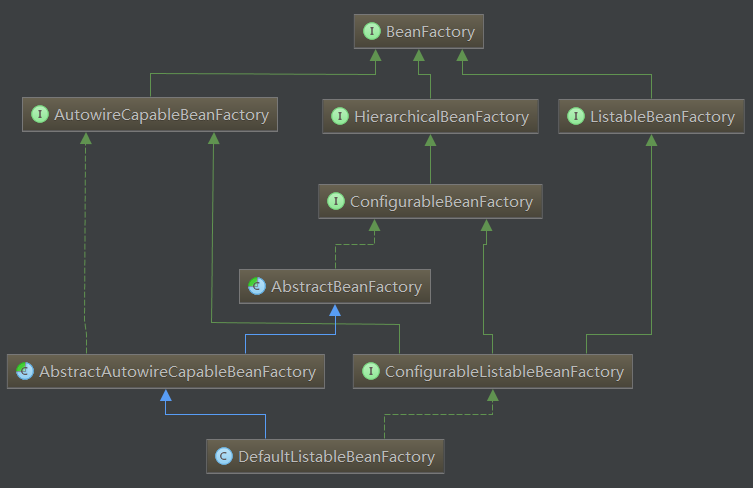

## BeanFactory

BeanFactory负责配置、创建、管理Bean。它有一个子接口ApplicationContext，也被称为Spring上下文，容器同时还管理着Bean和Bean之间的依赖关系

### 结构图


#### BeanFactory的三个子接口：
* HierarchicalBeanFactory：提供父容器的访问功能
* ListableBeanFactory：提供了批量获取Bean的方法
* AutowireCapableBeanFactory：在BeanFactory基础上实现对已存在实例的管理

#### ConfigurableBeanFactory

主要单例bean的注册，生成实例，以及统计单例bean

#### ConfigurableListableBeanFactory

继承了上述的所有接口，增加了其他功能：比如类加载器,类型转化,属性编辑器,BeanPostProcessor,作用域,bean定义,处理bean依赖关系, bean如何销毁

#### DefaultListableBeanFactory

实现了 ConfigurableListableBeanFactory，实现上述BeanFactory所有功能。它还可以注册BeanDefinition

### 源码

```java
public interface BeanFactory {
    String FACTORY_BEAN_PREFIX = "&";
    // 获取 Bean
    Object getBean(String name) throws BeansException;
    <T> T getBean(String name, Class<T> requiredType) throws BeansException;
    Object getBean(String name, Object... args) throws BeansException;
    <T> T getBean(Class<T> requiredType) throws BeansException;
    <T> T getBean(Class<T> requiredType, Object... args) throws BeansException;
    <T> ObjectProvider<T> getBeanProvider(Class<T> requiredType);
    <T> ObjectProvider<T> getBeanProvider(ResolvableType requiredType);
    // 是否含有bean
    boolean containsBean(String name);
    // 是否单利
    boolean isSingleton(String name) throws NoSuchBeanDefinitionException;
    // 是否原型
    boolean isPrototype(String name) throws NoSuchBeanDefinitionException;
    boolean isTypeMatch(String name, ResolvableType typeToMatch) throws NoSuchBeanDefinitionException;
    boolean isTypeMatch(String name, Class<?> typeToMatch) throws NoSuchBeanDefinitionException;
    // 获取 bean的类型
    Class<?> getType(String name) throws NoSuchBeanDefinitionException;
    Class<?> getType(String name, boolean allowFactoryBeanInit) throws NoSuchBeanDefinitionException;
    // bean 别名
    String[] getAliases(String name);
}
```

## DefaultListableBeanFactory

```java
public class DefaultListableBeanFactory extends AbstractAutowireCapableBeanFactory
		implements ConfigurableListableBeanFactory, BeanDefinitionRegistry, Serializable {

    public DefaultListableBeanFactory() {
        // AbstractAutowireCapableBeanFactory()
		super();
	}
}
```


#### AbstractAutowireCapableBeanFactory

```java
public abstract class AbstractAutowireCapableBeanFactory extends AbstractBeanFactory
		implements AutowireCapableBeanFactory {

    public AbstractAutowireCapableBeanFactory() {
        // AbstractBeanFactory()
		super();
        // 需要被忽视的Bean
		ignoreDependencyInterface(BeanNameAware.class);
		ignoreDependencyInterface(BeanFactoryAware.class);
		ignoreDependencyInterface(BeanClassLoaderAware.class);
	}
}
```

#### AbstractBeanFactory

```java
public abstract class AbstractBeanFactory extends FactoryBeanRegistrySupport implements ConfigurableBeanFactory {
    public AbstractBeanFactory() {
	}
}
```
