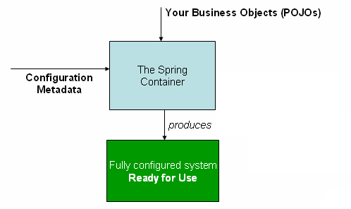

这一部分涵盖了Spring框架中不可或缺的所有技术。

其中最重要的是Spring框架的控制反转(IoC)容器。对Spring框架的IoC容器进行彻底的处理之后，紧接着是对Spring面向方面编程(AOP)技术的全面覆盖。Spring框架有自己的AOP框架，它在概念上很容易理解，并且成功地解决了Java企业编程中AOP需求的80%的最佳点。

还提供了Spring与AspectJ集成的内容(就特性而言，AspectJ目前是最丰富的，当然也是Java企业空间中最成熟的AOP实现)。

## 1 The IoC Container

本章讨论Spring的反转控制(IoC)容器。

### 1.1 介绍Spring IoC容器和bean
   本章介绍了控制反转(IoC)原理的Spring框架实现。IoC也称为依赖注入(dependency injection, DI)。这是一个过程，在这个过程中，对象仅通过构造函数参数、工厂方法的参数或对象实例构造或从工厂方法返回后在该对象实例上设置的属性来定义它们的依赖关系(即与它们一起工作的其他对象)。然后容器在创建bean时注入这些依赖项。这个过程本质上与bean本身相反(因此称为控制反转)，bean本身通过直接构造类或一种机制(如服务定位器模式)来控制依赖项的实例化或位置。

`org.springframework.beans`和`org.springframework.context`包是Spring Framework的IoC容器的基础。`BeanFactory`接口提供了能够管理任何类型对象的高级配置机制。`ApplicationContext`是`BeanFactory`的子接口。它补充道:

* 更容易与Spring的AOP特性集成

* 消息资源处理(用于国际化)

* 事件发布

* 应用程序层特定的上下文，如web应用程序中使用的`WebApplicationContext`。

简而言之，`BeanFactory`提供了配置框架和基本功能，而`ApplicationContext`添加了更多企业特定的功能。`ApplicationContext`是`BeanFactory`的一个完整超集，在本章描述Spring的IoC容器时仅使用它。有关使用`BeanFactory`而不是`ApplicationContext`的更多信息，请参见`BeanFactory`。

在Spring中，构成应用程序主干并由Spring IoC容器管理的对象称为bean。bean是由Spring IoC容器实例化、组装和管理的对象。否则，bean只是应用程序中的许多对象之一。bean及其之间的依赖关系反映在容器使用的配置元数据中。

### 1.2 Container 概述
`org.springframework.context.ApplicationContext`接口表示Spring IoC容器，负责实例化、配置和组装bean。容器通过读取配置元数据获取关于要实例化、配置和组装哪些对象的指令。配置元数据用XML、Java注释或Java代码表示。它允许您表达组成应用程序的对象以及这些对象之间丰富的相互依赖关系。

Spring提供了`ApplicationContext`接口的几个实现。在独立应用程序中，通常创建`ClassPathXmlApplicationContext`或`FileSystemXmlApplicationContext`的实例。虽然XML一直是定义配置元数据的传统格式，但是您可以通过提供少量XML配置来声明支持这些额外的元数据格式，从而指示容器使用Java注释或代码作为元数据格式。

在大多数应用程序场景中，不需要显式用户代码来实例化Spring IoC容器的一个或多个实例。例如，在web应用程序场景中，在应用程序的web.xml文件中使用8行左右的简单样例web描述符XML就足够了(请参阅web应用程序的方便的`ApplicationContext`实例化)。如果使用Spring工具套件(一个eclipse支持的开发环境)，只需单击几下鼠标或按键，就可以轻松创建这个样板配置。

下图显示了Spring如何工作的高级视图。您的应用程序类与配置元数据相结合，这样，在创建并初始化`ApplicationContext`之后，您就拥有了一个完全配置的可执行系统或应用程序。


图1所示。Spring IoC容器

#### 1.2.1 配置元数据
如上图所示，Spring IoC容器使用一种配置元数据形式。此配置元数据表示作为应用程序开发人员，您如何告诉Spring容器实例化、配置和组装应用程序中的对象。

配置元数据通常以简单直观的XML格式提供，本章的大部分内容都使用这种格式来传达Spring IoC容器的关键概念和特性。
> 基于xml的元数据不是惟一允许的配置元数据形式。Spring IoC容器本身与实际编写配置元数据的格式完全解耦。现在，许多开发人员为他们的Spring应用程序选择基于java的配置。

有关在Spring容器中使用其他形式的元数据的信息，请参见:

* 基于注释的配置:Spring 2.5引入了对基于注释的配置元数据的支持。

* 基于java的配置:从Spring 3.0开始，Spring JavaConfig项目提供的许多特性成为Spring核心框架的一部分。因此，您可以使用Java而不是XML文件来定义应用程序类外部的bean。要使用这些新特性，请参见`@Configuration`、`@Bean`、`@Import`和`@DependsOn`注释。

Spring配置包含容器必须管理的至少一个bean定义，并且通常包含多个bean定义。基于xml的配置元数据将这些bean配置为顶级`<beans/>`元素中的`<bean/>`元素。Java配置通常在`@Configuration`类中使用`@ bean`注释的方法。

这些bean定义对应于组成应用程序的实际对象。通常，您定义服务层对象、数据访问对象(DAOs)、表示对象(如Struts操作实例)、基础设施对象(如`Hibernate SessionFactories`)、JMS队列等等。通常，不会在容器中配置细粒度域对象，因为通常由dao和业务逻辑负责创建和加载域对象。不过，您可以使用Spring与AspectJ的集成来配置在IoC容器控制之外创建的对象。请参阅使用AspectJ使用Spring来依赖注入域对象。

下面的例子展示了基于xml的配置元数据的基本结构:
```xml
<?xml version="1.0" encoding="UTF-8"?>
<beans xmlns="http://www.springframework.org/schema/beans"
    xmlns:xsi="http://www.w3.org/2001/XMLSchema-instance"
    xsi:schemaLocation="http://www.springframework.org/schema/beans
        http://www.springframework.org/schema/beans/spring-beans.xsd">

    <bean id="..." class="...">   
        <!-- collaborators and configuration for this bean go here -->
    </bean>

    <bean id="..." class="...">
        <!-- collaborators and configuration for this bean go here -->
    </bean>

    <!-- more bean definitions go here -->

</beans>
```

> id属性是标识单个bean定义的字符串。
> class属性定义bean的类型并使用完全限定的类名。

id属性的值引用协作对象。本例中没有显示用于引用协作对象的XML。有关更多信息，请参见依赖项。

#### 1.2.2 实例化一个容器
提供给`ApplicationContext`构造函数的位置路径或路径是资源字符串，允许容器从各种外部资源(如本地文件系统、Java `CLASSPATH`等)加载配置元数据。
```java
ApplicationContext context = new ClassPathXmlApplicationContext("services.xml", "daos.xml");
```
> 在了解了Spring的IoC容器之后，您可能想了解更多关于Spring的`Resource`抽象的信息，它提供了一种方便的机制，可以从URI语法中定义的位置读取InputStream。特别是，`Resource`路径用于构造应用程序上下文，如应用程序上下文和资源路径中所述。

下面的示例显示了服务层对象(services.xml)配置文件:

```xml
<?xml version="1.0" encoding="UTF-8"?>
<beans xmlns="http://www.springframework.org/schema/beans"
    xmlns:xsi="http://www.w3.org/2001/XMLSchema-instance"
    xsi:schemaLocation="http://www.springframework.org/schema/beans
        http://www.springframework.org/schema/beans/spring-beans.xsd">

    <!-- services -->

    <bean id="petStore" class="org.springframework.samples.jpetstore.services.PetStoreServiceImpl">
        <property name="accountDao" ref="accountDao"/>
        <property name="itemDao" ref="itemDao"/>
        <!-- additional collaborators and configuration for this bean go here -->
    </bean>

    <!-- more bean definitions for services go here -->

</beans>
```
下面的例子展示了数据访问对象`daos.xml`文件:

```xml
<?xml version="1.0" encoding="UTF-8"?>
<beans xmlns="http://www.springframework.org/schema/beans"
    xmlns:xsi="http://www.w3.org/2001/XMLSchema-instance"
    xsi:schemaLocation="http://www.springframework.org/schema/beans
        http://www.springframework.org/schema/beans/spring-beans.xsd">

    <bean id="accountDao"
        class="org.springframework.samples.jpetstore.dao.jpa.JpaAccountDao">
        <!-- additional collaborators and configuration for this bean go here -->
    </bean>

    <bean id="itemDao" class="org.springframework.samples.jpetstore.dao.jpa.JpaItemDao">
        <!-- additional collaborators and configuration for this bean go here -->
    </bean>

    <!-- more bean definitions for data access objects go here -->

</beans>
```
在前面的示例中，服务层由`PetStoreServiceImpl`类和`JpaAccountDao`和`JpaItemDao`类型的两个数据访问对象(基于JPA对象关系映射标准)组成。`property name`元素引用JavaBean属性的名称，`ref`元素引用另一个bean定义的名称。`id`和`ref`元素之间的这种链接表示协作对象之间的依赖关系。有关配置对象依赖项的详细信息，请参见依赖项。

##### 组合基于xml的配置元数据

让bean定义跨多个XML文件是很有用的。通常，每个单独的XML配置文件表示体系结构中的逻辑层或模块。

您可以使用应用程序上下文构造函数从所有这些XML片段加载bean定义。这个构造函数接受多个`Resource`位置，如前一节所示。或者，使用一个或多个出现的`<import/>`元素从另一个或多个文件加载bean定义。下面的例子说明了如何做到这一点:

```xml
<beans>
    <import resource="services.xml"/>
    <import resource="resources/messageSource.xml"/>
    <import resource="/resources/themeSource.xml"/>

    <bean id="bean1" class="..."/>
    <bean id="bean2" class="..."/>
</beans>
```

在前面的示例中，外部bean定义从三个文件加载服务 `services.xml`, `messageSource.xml` 和 `themeSource.xml`。所有位置路径都相对于执行导入的定义文件，因此`services.xml`必须与执行导入的文件位于相同的目录或类路径位置，而`messageSource.xml`和`themeSource.xml`必须位于导入文件位置下方的`resources`位置。可以看到，前面的斜杠被忽略了。但是，由于这些路径是相对的，所以最好不要使用斜杠。根据Spring模式，导入的文件的内容，包括顶层`<beans/>`元素，必须是有效的XML bean定义。

> 它是可能的，但不推荐，在父目录中引用文件使用一个相对"../”路径。这样做会创建对当前应用程序外部文件的依赖。特别地，这个引用不推荐用于类路径url(例如，类路径:../services.xml)，其中运行时解析过程选择“最近的”类路径根，然后查看其父目录。类路径配置更改可能导致选择不同的、不正确的目录。
> 
> 您总是可以使用完全限定的资源位置，而不是相对路径:例如，`file:C:/config/services.xml`或`classpath:/config/services.xml`。但是，请注意，您正在将应用程序的配置耦合到特定的绝对位置。通常更可取的做法是为这些绝对位置保留一个间接的位置——例如，通过“${…}”占位符，这些占位符在运行时根据JVM系统属性解析。

名称空间本身提供导入指令特性。除了普通bean定义之外，Spring提供的XML名称空间的选择还提供了其他配置特性——例如`context`和`util`名称空间。

##### Groovy Bean定义DSL

作为外部化配置元数据的另一个示例，bean定义也可以用Spring的Groovy bean定义DSL表示，Grails框架中有这样的定义。通常，这样的配置位于".groovy" 文件，其结构如下例所示:
```
beans {
    dataSource(BasicDataSource) {
        driverClassName = "org.hsqldb.jdbcDriver"
        url = "jdbc:hsqldb:mem:grailsDB"
        username = "sa"
        password = ""
        settings = [mynew:"setting"]
    }
    sessionFactory(SessionFactory) {
        dataSource = dataSource
    }
    myService(MyService) {
        nestedBean = { AnotherBean bean ->
            dataSource = dataSource
        }
    }
}
```

这种配置风格在很大程度上等同于XML bean定义，甚至支持Spring的XML配置名称空间。它还允许通过`importBeans`指令导入XML bean定义文件。

#### 1.2.3 使用容器
`ApplicationContext`是高级工厂的接口，该工厂能够维护不同bean及其依赖项的注册表。通过使用方法`T getBean(String name, Class<T> requiredType)`，可以检索bean的实例。

`ApplicationContext`允许您读取bean定义并访问它们，如下面的示例所示:

```groovy
// create and configure beans
ApplicationContext context = new ClassPathXmlApplicationContext("services.xml", "daos.xml");

// retrieve configured instance
PetStoreService service = context.getBean("petStore", PetStoreService.class);

// use configured instance
List<String> userList = service.getUsernameList();
```

对于Groovy配置，引导看起来非常类似。它有一个不同的上下文实现类，它支持groovy(但也理解XML bean定义)。下面的示例显示了Groovy配置:

```groovy
ApplicationContext = new GenericGroovyApplicationContext("services.groovy","daos.groovy");
```
最灵活的变体是`GenericApplicationContext`与reader委托相结合——例如，使用`XmlBeanDefinitionReader`来处理XML文件，如下例所示:

```groovy
GenericApplicationContext context = new GenericApplicationContext();
new XmlBeanDefinitionReader(context).loadBeanDefinitions("services.xml", "daos.xml");
context.refresh();
```

您还可以对Groovy文件使用`GroovyBeanDefinitionReader`，如下面的示例所示:
```groovy
GenericApplicationContext context = new GenericApplicationContext();
new GroovyBeanDefinitionReader(context).loadBeanDefinitions("services.groovy", "daos.groovy");
context.refresh();
```

您可以在相同的`ApplicationContext`上混合和匹配这样的reader委托，从不同的配置源读取bean定义。

然后可以使用`getBean`检索bean的实例。`ApplicationContext`接口还有一些用于检索bean的其他方法，但在理想情况下，应用程序代码不应该使用它们。实际上，您的应用程序代码应该完全不调用`getBean()`方法，因此完全不依赖于Spring api。例如，Spring与web框架的集成为各种web框架组件(如控制器和jsf管理的bean)提供了依赖注入，允许您通过元数据(如自动装配注释)声明对特定bean的依赖。


### 1.4 依赖关系
典型的企业应用程序不包含单个对象(或者用Spring的说法是bean)。即使是最简单的应用程序也有几个对象一起工作，以呈现最终用户所看到的一致的应用程序。下一节将解释如何从定义许多独立的bean定义过渡到完全实现的应用程序，其中对象通过协作来实现目标。

#### 1.4.1 依赖注入
依赖项注入(Dependency injection, DI)是一个过程，在这个过程中，对象仅通过构造函数参数、到工厂方法的参数或从工厂方法构造或返回对象实例后在对象实例上设置的属性来定义它们的依赖项(即与它们一起工作的其他对象)。然后容器在创建bean时注入这些依赖项。这个过程本质上是bean本身的逆过程(因此称为逆控制)，通过直接构造类或服务定位器模式来控制依赖项的实例化或位置。

使用DI原则，代码更简洁，当对象具有依赖关系时，解耦更有效。对象不查找其依赖项，也不知道依赖项的位置或类。因此，您的类变得更容易测试，特别是当依赖关系位于接口或抽象基类上时，这允许在单元测试中使用存根或模拟实现。

DI存在两种主要变体:基于构造函数的依赖项注入和基于sett的依赖项注入。

##### Constructor-based依赖注入

基于构造函数的DI是由容器调用一个构造函数来完成的，该构造函数有许多参数，每个参数表示一个依赖项。调用具有特定参数的`static`工厂方法来构造bean几乎是等价的，本讨论同样处理构造函数和`static`工厂方法的参数。下面的例子显示了一个只能依赖注入构造函数注入的类:
```java
public class SimpleMovieLister {

    // the SimpleMovieLister has a dependency on a MovieFinder
    private MovieFinder movieFinder;

    // a constructor so that the Spring container can inject a MovieFinder
    public SimpleMovieLister(MovieFinder movieFinder) {
        this.movieFinder = movieFinder;
    }

    // business logic that actually uses the injected MovieFinder is omitted...
}
```

注意，这个类没有什么特别之处。它是一个不依赖于容器特定接口、基类或注释的POJO。

构造函数参数解析

构造函数参数解析匹配通过使用参数的类型进行。如果bean定义的构造函数参数中不存在潜在的歧义，则在bean定义中定义构造函数参数的顺序与在实例化bean时将这些参数提供给适当构造函数的顺序相同。考虑以下类别:

```java
package x.y;
public class ThingOne {
    public ThingOne(ThingTwo thingTwo, ThingThree thingThree) {
        // ...
    }
}
```
假设`ThingTwo`和`ThingThree`类没有继承关系，那么就不存在潜在的歧义。因此，下面的配置工作得很好，您不需要在`<constructor-arg/>`元素中显式地指定构造函数参数索引或类型。
```xml
<beans>
    <bean id="beanOne" class="x.y.ThingOne">
        <constructor-arg ref="beanTwo"/>
        <constructor-arg ref="beanThree"/>
    </bean>

    <bean id="beanTwo" class="x.y.ThingTwo"/>

    <bean id="beanThree" class="x.y.ThingThree"/>
</beans>
```
当引用另一个bean时，类型是已知的，可以进行匹配(就像前面的例子一样)。当使用简单类型时，例如`<value>true</value>`， Spring无法确定值的类型，因此在没有帮助的情况下无法按类型匹配。考虑以下类别:
```java
package examples;

public class ExampleBean {

    // Number of years to calculate the Ultimate Answer
    private int years;

    // The Answer to Life, the Universe, and Everything
    private String ultimateAnswer;

    public ExampleBean(int years, String ultimateAnswer) {
        this.years = years;
        this.ultimateAnswer = ultimateAnswer;
    }
}
```

构造函数参数类型匹配
在前面的场景中，如果使用`type`属性显式指定构造函数参数的类型，则容器可以使用与简单类型匹配的类型。如下例所示:

```xml
<bean id="exampleBean" class="examples.ExampleBean">
    <constructor-arg type="int" value="7500000"/>
    <constructor-arg type="java.lang.String" value="42"/>
</bean>
```
构造函数参数指标
可以使用index属性显式指定构造函数参数的索引，如下例所示:

```xml
<bean id="exampleBean" class="examples.ExampleBean">
    <constructor-arg index="0" value="7500000"/>
    <constructor-arg index="1" value="42"/>
</bean>
```
除了解决多个简单值的模糊性外，指定索引还解决了构造函数具有相同类型的两个参数时的模糊性。
> The index is 0-based.
> 

构造函数参数的名字
您还可以使用构造函数参数名进行值消歧，如下面的示例所示:
```xml
<bean id="exampleBean" class="examples.ExampleBean">
    <constructor-arg name="years" value="7500000"/>
    <constructor-arg name="ultimateAnswer" value="42"/>
</bean>
```

请记住，要使此功能开箱即用，必须在编译代码时启用debug标志，以便Spring可以从构造函数中查找参数名。如果不能或不希望使用debug标志编译代码，可以使用@ConstructorProperties JDK注释显式地命名构造函数参数。然后，示例类必须如下所示:
```java
package examples;

public class ExampleBean {

    // Fields omitted

    @ConstructorProperties({"years", "ultimateAnswer"})
    public ExampleBean(int years, String ultimateAnswer) {
        this.years = years;
        this.ultimateAnswer = ultimateAnswer;
    }
}
```

##### Setter-based依赖注入

基于setter的DI是通过容器调用bean上的setter方法来实现的，这些方法是在调用无参数构造函数或无参数静态工厂方法来实例化bean之后调用的。

下面的示例显示了一个只能通过使用纯setter注入注入依赖关系的类。这个类是传统的Java。它是一个不依赖于容器特定接口、基类或注释的POJO。
```java
public class SimpleMovieLister {

    // the SimpleMovieLister has a dependency on the MovieFinder
    private MovieFinder movieFinder;

    // a setter method so that the Spring container can inject a MovieFinder
    public void setMovieFinder(MovieFinder movieFinder) {
        this.movieFinder = movieFinder;
    }

    // business logic that actually uses the injected MovieFinder is omitted...
}
```
`ApplicationContext` 为它管理的bean支持基于构造函数和基于setter的DI。在通过构造函数方法注入了一些依赖项之后，它还支持基于setter的DI。您可以以bean定义的形式配置依赖项，并将其与`PropertyEditor`实例结合使用，将属性从一种格式转换为另一种格式。然而，大多数Spring用户并不直接使用这些类(也就是说，通过编程)，而是使用XML bean定义、带注释的组件(也就是说，使用`@Component`、`@Controller`等注释的类)或基于java的`@Configuration`类中的`@Bean`方法。然后，这些源在内部转换为bean定义的实例，并用于加载整个Spring IoC容器实例。

基于构造函数还是基于setter的DI?
由于可以混合使用基于构造函数和基于setter的DI，因此对于强制依赖项使用构造函数，对于可选依赖项使用setter方法或配置方法，这是一个很好的经验法则。注意，可以使用setter方法上的@Required注释使属性成为必需的依赖项。

Spring团队通常提倡构造函数注入，因为它允许您将应用程序组件实现为不可变的对象，并确保所需的依赖项不是空的。此外，注入构造函数的组件总是以完全初始化的状态返回给客户机(调用)代码。附带说明一下，大量构造函数参数是一种不好的代码味道，这意味着类可能有太多的责任，应该进行重构，以便更好地处理关注点的适当分离。

Setter注入主要应该只用于可选的依赖项，这些依赖项可以在类中分配合理的默认值。否则，必须在代码使用依赖项的任何地方执行非空检查。setter注入的一个好处是，setter方法使该类的对象能够稍后重新配置或重新注入。因此，通过JMX mbean进行管理是setter注入的一个引人注目的用例。

使用对特定类最有意义的DI样式。有时候，当处理您没有源的第三方类时，就会为您做出选择。例如，如果第三方类没有公开任何setter方法，那么构造函数注入可能是惟一可用的DI形式。

##### 依赖性解析过程

容器执行bean依赖项解析如下:

* ApplicationContext是用描述所有bean的配置元数据创建和初始化的。配置元数据可以由XML、Java代码或注释指定。

* 对于每个bean，其依赖关系都以属性、构造函数参数或静态工厂方法的参数的形式表示(如果您使用静态工厂方法而不是普通构造函数)。这些依赖项在bean实际创建时提供给bean。

* 每个属性或构造函数参数都是要设置的值的实际定义，或对容器中另一个bean的引用。

* 值的每个属性或构造函数参数都从其指定的格式转换为该属性或构造函数参数的实际类型。默认情况下，Spring可以将以字符串格式提供的值转换为所有内置类型，比如int、long、string、boolean等等。

在创建容器时，Spring容器验证每个bean的配置。但是，在实际创建bean之前不会设置bean属性本身。在创建容器时创建单例作用域的bean，并将其设置为预实例化(默认值)。作用域是在Bean作用域中定义的。否则，只有在请求bean时才会创建它。当bean的依赖项及其依赖项的依赖项(等等)被创建和分配时，bean的创建可能会创建bean图。注意，这些依赖项之间的解析不匹配可能会出现得很晚——也就是说，在首次创建受影响的bean时。

<p>循环依赖
如果主要使用构造函数注入，则可能创建无法解析的循环依赖关系场景。

例如:类A需要一个类B通过构造函数注入的实例，而类B需要一个类A通过构造函数注入的实例。如果您将bean配置为类A和类B相互注入，Spring IoC容器将在运行时检测到这个循环引用，并抛出一个`BeanCurrentlyInCreationException`异常。

一种可能的解决方案是编辑一些类的源代码，这些类由setter而不是构造函数配置。或者，避免构造函数注入，只使用setter注入。换句话说，尽管不建议这样做，但您可以使用setter注入配置循环依赖项。

与典型情况(没有循环依赖关系)不同，bean a和bean B之间的循环依赖关系强制在完全初始化之前将其中一个bean注入另一个bean(典型的先有鸡还是先有蛋的场景)。</p>

您通常可以相信Spring会做正确的事情。它在容器加载时检测配置问题，例如对不存在的bean的引用和循环依赖关系。Spring在实际创建bean时尽可能晚地设置属性和解析依赖项。这意味着，如果在创建对象或其依赖项时出现问题(例如，bean由于缺少或无效的属性而抛出异常)，当您请求对象时，已正确加载的Spring容器稍后可以生成异常。一些配置问题的潜在延迟可见性是`ApplicationContext`实现默认情况下预实例化单例bean的原因。以在实际需要这些bean之前创建它们的前期时间和内存为代价，您将在创建`ApplicationContext`时发现配置问题，而不是稍后。您仍然可以覆盖此默认行为，以便单例bean可以延迟初始化，而不是预先实例化。

如果不存在循环依赖关系，当一个或多个协作bean被注入到一个依赖bean中时，每个协作bean在被注入到依赖bean之前都已完全配置好。这意味着,如果bean依赖bean B, B Spring IoC容器完全配置bean之前调用bean的setter方法A。换句话说,bean实例化(如果它不是一个单例预先实例化),其设置依赖项,相关的生命周期方法(如InitializingBean init方法或配置回调方法)调用。

##### 依赖注入的例子

下面的示例将基于xml的配置元数据用于基于setter的DI。Spring XML配置文件的一小部分指定了一些bean定义，如下所示:
```xml
<bean id="exampleBean" class="examples.ExampleBean">
    <!-- setter injection using the nested ref element -->
    <property name="beanOne">
        <ref bean="anotherExampleBean"/>
    </property>

    <!-- setter injection using the neater ref attribute -->
    <property name="beanTwo" ref="yetAnotherBean"/>
    <property name="integerProperty" value="1"/>
</bean>

<bean id="anotherExampleBean" class="examples.AnotherBean"/>
<bean id="yetAnotherBean" class="examples.YetAnotherBean"/>
```
下面的例子显示了相应的`ExampleBean`类:
```java
public class ExampleBean {

    private AnotherBean beanOne;

    private YetAnotherBean beanTwo;

    private int i;

    public void setBeanOne(AnotherBean beanOne) {
        this.beanOne = beanOne;
    }

    public void setBeanTwo(YetAnotherBean beanTwo) {
        this.beanTwo = beanTwo;
    }

    public void setIntegerProperty(int i) {
        this.i = i;
    }
}
```

在前面的示例中，声明setter以匹配XML文件中指定的属性。下面的例子使用基于构造函数的DI:
```xml
<bean id="exampleBean" class="examples.ExampleBean">
    <!-- constructor injection using the nested ref element -->
    <constructor-arg>
        <ref bean="anotherExampleBean"/>
    </constructor-arg>

    <!-- constructor injection using the neater ref attribute -->
    <constructor-arg ref="yetAnotherBean"/>

    <constructor-arg type="int" value="1"/>
</bean>

<bean id="anotherExampleBean" class="examples.AnotherBean"/>
<bean id="yetAnotherBean" class="examples.YetAnotherBean"/>
```
下面的例子显示了相应的`ExampleBean`类:
```java
public class ExampleBean {

    private AnotherBean beanOne;

    private YetAnotherBean beanTwo;

    private int i;

    public ExampleBean(
        AnotherBean anotherBean, YetAnotherBean yetAnotherBean, int i) {
        this.beanOne = anotherBean;
        this.beanTwo = yetAnotherBean;
        this.i = i;
    }
}

```

bean定义中指定的构造函数参数用作`ExampleBean`构造函数的参数。

现在考虑这个例子的一个变体，在这里，Spring不使用构造函数，而是调用一个静态工厂方法来返回对象的一个实例:
```xml
<bean id="exampleBean" class="examples.ExampleBean" factory-method="createInstance">
    <constructor-arg ref="anotherExampleBean"/>
    <constructor-arg ref="yetAnotherBean"/>
    <constructor-arg value="1"/>
</bean>

<bean id="anotherExampleBean" class="examples.AnotherBean"/>
<bean id="yetAnotherBean" class="examples.YetAnotherBean"/>
```
下面的例子显示了相应的`ExampleBean`类:
```java
public class ExampleBean {

    // a private constructor
    private ExampleBean(...) {
        ...
    }

    // a static factory method; the arguments to this method can be
    // considered the dependencies of the bean that is returned,
    // regardless of how those arguments are actually used.
    public static ExampleBean createInstance (
        AnotherBean anotherBean, YetAnotherBean yetAnotherBean, int i) {

        ExampleBean eb = new ExampleBean (...);
        // some other operations...
        return eb;
    }
}
```
静态工厂方法的参数由`<constructor-arg/>`元素提供，与实际使用构造函数的情况完全相同。工厂方法返回的类的类型不必与包含静态工厂方法的类的类型相同(尽管在本例中它是)。实例(非静态)工厂方法可以以本质上相同的方式使用(除了使用`factory-bean`属性而不是`class`属性之外)，因此我们不在这里讨论这些细节。


#### 1.4.2 详细介绍依赖项和配置

如前一节所述，可以将bean属性和构造函数参数定义为对其他托管bean(协作者)的引用，或者定义为内联的值。Spring基于xml的配置元数据支持其 `<property/>` 和 `<constructor-arg/>` 元素中的子元素类型。

##### 直接值(原语、字符串等)

元素的`value`属性将属性或构造函数参数指定为人类可读的字符串表示形式。Spring的转换服务用于将这些值从字符串转换为属性或参数的实际类型。下面的例子显示了正在设置的各种值:
```xml
<bean id="myDataSource" class="org.apache.commons.dbcp.BasicDataSource" destroy-method="close">
    <!-- results in a setDriverClassName(String) call -->
    <property name="driverClassName" value="com.mysql.jdbc.Driver"/>
    <property name="url" value="jdbc:mysql://localhost:3306/mydb"/>
    <property name="username" value="root"/>
    <property name="password" value="masterkaoli"/>
</bean>
```

下面的示例使用`p-namespace` 进行更简洁的XML配置:

```xml
<beans xmlns="http://www.springframework.org/schema/beans"
    xmlns:xsi="http://www.w3.org/2001/XMLSchema-instance"
    xmlns:p="http://www.springframework.org/schema/p"
    xsi:schemaLocation="http://www.springframework.org/schema/beans
    http://www.springframework.org/schema/beans/spring-beans.xsd">

    <bean id="myDataSource" class="org.apache.commons.dbcp.BasicDataSource"
        destroy-method="close"
        p:driverClassName="com.mysql.jdbc.Driver"
        p:url="jdbc:mysql://localhost:3306/mydb"
        p:username="root"
        p:password="masterkaoli"/>

</beans>
```

前面的XML更简洁。但是，打字错误是在运行时而不是设计时发现的，除非您使用IDE(如`IntelliJ IDEA`或Spring工具套件)来支持在创建bean定义时自动完成属性。强烈建议提供这种IDE帮助。

您还可以配置`java.util.Properties`实例，如下:

```xml
<bean id="mappings"
    class="org.springframework.beans.factory.config.PropertyPlaceholderConfigurer">

    <!-- typed as a java.util.Properties -->
    <property name="properties">
        <value>
            jdbc.driver.className=com.mysql.jdbc.Driver
            jdbc.url=jdbc:mysql://localhost:3306/mydb
        </value>
    </property>
</bean>
```

Spring容器将<value/>元素中的文本转换为`java.util.Properties`。通过使用javabean PropertyEditor机制实现属性实例。这是一个很好的快捷方式，也是Spring团队喜欢使用嵌套的 `<value/>` 元素而不是value属性样式的少数地方之一。

`idref`元素

`idref`元素只是将容器中另一个bean的id(字符串值，而不是引用)传递给`<constructor-arg/>`或`<property/>`元素的一种防止错误的方法。下面的例子展示了如何使用它:

```xml
<bean id="theTargetBean" class="..."/>

<bean id="theClientBean" class="...">
    <property name="targetName">
        <idref bean="theTargetBean"/>
    </property>
</bean>
```

上面的bean定义片段(在运行时)与下面的片段完全等价:

```xml
<bean id="theTargetBean" class="..." />

<bean id="client" class="...">
    <property name="targetName" value="theTargetBean"/>
</bean>
```

第一种表单比第二种更可取，因为使用`idref`标记可以让容器在部署时验证引用的命名bean是否确实存在。在第二个变体中，对传递给`client`bean的`targetName`属性的值不执行验证。只有在实际实例化客户机bean时才会发现拼写错误(很可能导致致命的结果)。如果客户机bean是原型bean，则只有在部署容器之后很长时间才会发现这个输入错误和由此产生的异常。

> 在4.0 bean XSD中不再支持idref元素上的本地属性，因为它不再提供超过常规bean引用的值。升级到4.0模式时，更改对idref bean的现有idref本地引用。

`<idref/>`元素带来价值的一个常见位置(至少在Spring 2.0之前的版本中)是ProxyFactoryBean bean定义中的AOP拦截器配置。在指定拦截器名称时使用<idref/>元素可以防止拼写错误。

##### 对其他bean的引用(协作者)

`ref`元素是`<constructor-arg/>`或`<property/>`定义元素中的最后一个元素。在这里，您将bean的指定属性的值设置为对容器管理的另一个bean(合作者)的引用。所引用的bean是要设置其属性的bean的依赖项，并且在设置属性之前根据需要对其进行初始化(如果合作者是单例bean，那么容器可能已经对其进行了初始化)。所有引用最终都是对另一个对象的引用。作用域和验证取决于是否通过`bean`, `local`,or `parent`指定其他对象的ID或名称。

通过`<ref/>`标记的bean属性指定目标bean是最常见的形式，并且允许在同一个容器或父容器中创建对任何bean的引用，无论它是否在同一个XML文件中。bean属性的值可以与目标bean的id属性相同，也可以与目标bean的name属性中的值相同。下面的例子展示了如何使用ref元素:

```xml
<ref bean="someBean"/>
```
通过parent属性指定目标bean将创建对当前容器的父容器中的bean的引用。父属性的值可以与目标bean的id属性相同，也可以与目标bean的name属性中的值相同。目标bean必须位于当前bean的父容器中。您应该主要在拥有容器层次结构并且希望用与父bean同名的代理将现有bean包装在父容器中时使用此bean引用变体。

下面的两个清单显示了如何使用父属性:

```xml
<!-- in the parent context -->
<bean id="accountService" class="com.something.SimpleAccountService">
    <!-- insert dependencies as required as here -->
</bean>
```

```xml
<!-- in the child (descendant) context -->
<bean id="accountService" <!-- bean name is the same as the parent bean -->
    class="org.springframework.aop.framework.ProxyFactoryBean">
    <property name="target">
        <ref parent="accountService"/> <!-- notice how we refer to the parent bean -->
    </property>
    <!-- insert other configuration and dependencies as required here -->
</bean>
```

4.0 bean XSD不再支持ref元素上的本地属性，因为它不再提供超过常规bean引用的值。升级到4.0模式时，更改现有的ref本地引用到ref bean。

##### 内部Beans

在`<property/>`或`<constructor-arg/>`元素中定义一个内部bean，如下面的例子所示:

```xml
<bean id="outer" class="...">
    <!-- instead of using a reference to a target bean, simply define the target bean inline -->
    <property name="target">
        <bean class="com.example.Person"> <!-- this is the inner bean -->
            <property name="name" value="Fiona Apple"/>
            <property name="age" value="25"/>
        </bean>
    </property>
</bean>
```

内部bean定义不需要已定义的ID或名称。如果指定，容器不会使用这样的值作为标识符。容器在创建时也会忽略作用域标志，因为内部bean始终是匿名的，并且总是用外部bean创建的。不可能独立地访问内部bean，也不可能将它们注入到协作bean而不是封闭bean中。

作为一种特殊情况，可以从自定义范围接收销毁回调——例如，对于包含在单例bean中的请求范围的内部bean。内部bean实例的创建与其包含的bean绑定在一起，但是销毁回调允许它参与请求范围的生命周期。这不是一个常见的场景。内部bean通常只是简单地共享其包含的bean的范围。

##### 集合

`<list/>`、`<set/>`、`<map/>`和`<props/>`元素分别设置Java Collection `List`、`Set`、`Map`和`Properties`的属性和参数。下面的例子展示了如何使用它们:

```xml
<bean id="moreComplexObject" class="example.ComplexObject">
    <!-- results in a setAdminEmails(java.util.Properties) call -->
    <property name="adminEmails">
        <props>
            <prop key="administrator">administrator@example.org</prop>
            <prop key="support">support@example.org</prop>
            <prop key="development">development@example.org</prop>
        </props>
    </property>
    <!-- results in a setSomeList(java.util.List) call -->
    <property name="someList">
        <list>
            <value>a list element followed by a reference</value>
            <ref bean="myDataSource" />
        </list>
    </property>
    <!-- results in a setSomeMap(java.util.Map) call -->
    <property name="someMap">
        <map>
            <entry key="an entry" value="just some string"/>
            <entry key ="a ref" value-ref="myDataSource"/>
        </map>
    </property>
    <!-- results in a setSomeSet(java.util.Set) call -->
    <property name="someSet">
        <set>
            <value>just some string</value>
            <ref bean="myDataSource" />
        </set>
    </property>
</bean>
```

map键或值或集合值的值也可以是以下任何元素:

```
bean | ref | idref | list | set | map | props | value | null
```

收集合并

Spring容器还支持合并集合。应用程序开发人员可以定义父元素`<list/>`、`<map/>`、`<set/>`或`<props/>`元素，并让子元素`<list/>`、`<map/>`、`<set/>`或`<props/>`从父集合继承和覆盖值。也就是说，子集合的值是父集合和子集合元素合并的结果，子集合元素覆盖父集合中指定的值。

本节将讨论父-子bean机制。不熟悉父bean和子bean定义的读者可能希望在继续之前阅读相关部分。

下面的例子演示了集合合并:

```xml
<beans>
    <bean id="parent" abstract="true" class="example.ComplexObject">
        <property name="adminEmails">
            <props>
                <prop key="administrator">administrator@example.com</prop>
                <prop key="support">support@example.com</prop>
            </props>
        </property>
    </bean>
    <bean id="child" parent="parent">
        <property name="adminEmails">
            <!-- the merge is specified on the child collection definition -->
            <props merge="true">
                <prop key="sales">sales@example.com</prop>
                <prop key="support">support@example.co.uk</prop>
            </props>
        </property>
    </bean>
<beans>
```

注意，在子bean定义的`adminEmails`属性的`<props/>`元素上使用`merge=true`属性。当容器解析并实例化子bean时，生成的实例有一个`adminEmails`属性集合，其中包含将子bean的`adminEmails`集合与父bean的`adminEmails`集合合并的结果。下面的清单显示了结果:

```
administrator=administrator@example.com
sales=sales@example.com
support=support@example.co.uk
```

子属性集合的值集继承父`<props/>`中的所有属性元素，支持值的子值覆盖父集合中的值。

这种合并行为类似地应用于`<list/>`、`<map/>`和`<set/>`集合类型。在`<list/>`元素的特定情况下，将维护与list集合类型(即值的有序集合的概念)相关联的语义。父列表的值位于子列表的所有值之前。对于映射、集合和属性集合类型，不存在排序。因此，对于容器内部使用的关联映射、集合和属性实现类型的基础上的集合类型，没有有效的排序语义。

集合合并的限制

不能合并不同的集合类型(例如映射和列表)。如果您尝试这样做，将抛出一个适当的异常。merge属性必须在较低的继承子定义上指定。在父集合定义上指定merge属性是冗余的，并且不会导致所需的合并。

强类型集合

通过在Java 5中引入泛型类型，您可以使用强类型集合。也就是说，可以声明一个集合类型，使其只能包含(例如)字符串元素。如果使用Spring向bean注入强类型集合，则可以利用Spring的类型转换支持，以便在将强类型集合实例的元素添加到集合之前将其转换为适当的类型。下面的Java类和bean定义说明了如何做到这一点:

```java
public class SomeClass {

    private Map<String, Float> accounts;

    public void setAccounts(Map<String, Float> accounts) {
        this.accounts = accounts;
    }
}
```

```xml
<beans>
    <bean id="something" class="x.y.SomeClass">
        <property name="accounts">
            <map>
                <entry key="one" value="9.99"/>
                <entry key="two" value="2.75"/>
                <entry key="six" value="3.99"/>
            </map>
        </property>
    </bean>
</beans>
```

当something bean的accounts属性准备注入时，强类型映射<String, Float>的元素类型的泛型信息通过反射可用。因此，Spring的类型转换基础设施将各种值元素识别为Float类型，并将字符串值(9.99、2.75和3.99)转换为实际的Float类型。

##### 空字符串值和空字符串值

Spring将属性的空参数等作为空字符串处理。下面基于xml的配置元数据片段将email属性设置为空字符串值("")。

```xml
<bean class="ExampleBean">
    <property name="email" value=""/>
</bean>
```

上面的例子等价于下面的Java代码:

```java
exampleBean.setEmail("");
```

`<null/>`元素处理空值。下面的清单显示了一个例子:

```java
<bean class="ExampleBean">
    <property name="email">
        <null/>
    </property>
</bean>
```

上述配置相当于以下Java代码:

```
exampleBean.setEmail(null);
```

##### 使用p-namespace的XML快捷方式

p-namespace允许使用bean元素的属性(而不是嵌套的`<property/>`元素)来描述协作bean的属性值，或者两者都使用。

Spring支持带有名称空间的可扩展配置格式，名称空间基于XML模式定义。本章讨论的bean配置格式是在XML模式文档中定义的。但是，`p-namespace`没有在XSD文件中定义，只存在于Spring的核心中。

下面的示例显示了两个解析为相同结果的XML片段(第一个使用标准XML格式，第二个使用`p-namespace`):

```xml
<beans xmlns="http://www.springframework.org/schema/beans"
    xmlns:xsi="http://www.w3.org/2001/XMLSchema-instance"
    xmlns:p="http://www.springframework.org/schema/p"
    xsi:schemaLocation="http://www.springframework.org/schema/beans
        http://www.springframework.org/schema/beans/spring-beans.xsd">

    <bean name="classic" class="com.example.ExampleBean">
        <property name="email" value="someone@somewhere.com"/>
    </bean>

    <bean name="p-namespace" class="com.example.ExampleBean"
        p:email="someone@somewhere.com"/>
</beans>
```

该示例显示了`p-namespace`中的一个属性，在bean定义中称为`email`。这告诉Spring包含一个属性声明。如前所述，`p-namespace`没有模式定义，因此可以将属性名设置为属性名。

下一个例子包括另外两个bean定义，它们都有对另一个bean的引用:

```xml
<beans xmlns="http://www.springframework.org/schema/beans"
    xmlns:xsi="http://www.w3.org/2001/XMLSchema-instance"
    xmlns:p="http://www.springframework.org/schema/p"
    xsi:schemaLocation="http://www.springframework.org/schema/beans
        http://www.springframework.org/schema/beans/spring-beans.xsd">

    <bean name="john-classic" class="com.example.Person">
        <property name="name" value="John Doe"/>
        <property name="spouse" ref="jane"/>
    </bean>

    <bean name="john-modern"
        class="com.example.Person"
        p:name="John Doe"
        p:spouse-ref="jane"/>

    <bean name="jane" class="com.example.Person">
        <property name="name" value="Jane Doe"/>
    </bean>
</beans>
```

此示例不仅包含使用p-namespace的属性值，还使用特殊格式声明属性引用。第一个bean定义使用`<property name="spouse" ref="jane"/>`来创建从bean john到bean jane的引用，而第二个bean定义使用`p:spouse-ref="jane"`作为属性来执行完全相同的操作。在本例中，spouse是属性名，而`-ref`部分指出这不是一个直接的值，而是对另一个bean的引用。

##### 使用c-namespace的XML快捷方式

与带有`p-namespace`的XML快捷方式类似，Spring 3.1中引入的`c-namespace`允许配置构造函数参数的内联属性，而不是嵌套的`constructor-arg`元素。

下面的示例使用`c:` 命名空间执行与基于构造函数的依赖项注入相同的操作:

```xml
<beans xmlns="http://www.springframework.org/schema/beans"
    xmlns:xsi="http://www.w3.org/2001/XMLSchema-instance"
    xmlns:c="http://www.springframework.org/schema/c"
    xsi:schemaLocation="http://www.springframework.org/schema/beans
        http://www.springframework.org/schema/beans/spring-beans.xsd">

    <bean id="beanTwo" class="x.y.ThingTwo"/>
    <bean id="beanThree" class="x.y.ThingThree"/>

    <!-- traditional declaration with optional argument names -->
    <bean id="beanOne" class="x.y.ThingOne">
        <constructor-arg name="thingTwo" ref="beanTwo"/>
        <constructor-arg name="thingThree" ref="beanThree"/>
        <constructor-arg name="email" value="something@somewhere.com"/>
    </bean>

    <!-- c-namespace declaration with argument names -->
    <bean id="beanOne" class="x.y.ThingOne" c:thingTwo-ref="beanTwo"
        c:thingThree-ref="beanThree" c:email="something@somewhere.com"/>

</beans>
```

`c:`命名空间使用与`p: one`相同的约定(bean引用的尾随`-ref`)，用于根据构造函数参数的名称设置构造函数参数。类似地，即使没有在XSD模式中定义它(它存在于Spring核心中)，也需要在XML文件中声明它。

对于构造函数参数名不可用的少数情况(通常如果字节码是在没有调试信息的情况下编译的)，可以使用回退参数索引，如下所示:

```xml
<!-- c-namespace index declaration -->
<bean id="beanOne" class="x.y.ThingOne" c:_0-ref="beanTwo" c:_1-ref="beanThree"
    c:_2="something@somewhere.com"/>
```

> 由于XML语法的原因，索引表示法要求以 `_` 开头，因为XML属性名不能以数字开头(即使一些ide允许)。对于 `<constructor-arg>` 元素也可以使用相应的索引表示法，但由于声明的普通顺序通常已经足够，所以不常用。

在实践中，构造函数解析机制在匹配参数方面非常有效，所以除非确实需要，否则我们建议在配置过程中使用名称表示法。

##### 复合属性名

在设置bean属性时，可以使用复合或嵌套属性名，只要路径的所有组件(除了最终属性名之外)都不为空。考虑以下bean定义:

```xml
<bean id="something" class="things.ThingOne">
    <property name="fred.bob.sammy" value="123" />
</bean>
```

`something` bean有一个`fred`属性，一个`bob`属性，一个`sammy`属性，最后一个`sammy`属性被设置为`123`。为了使其工作，在构造bean之后，某些东西的`fred`属性和`fred`的`bob`属性必须不为空。否则，将抛出`NullPointerException`。


#### 1.4.3 `depends-on`
如果一个bean是另一个bean的依赖项，这通常意味着将一个bean设置为另一个bean的属性。通常使用基于xml的配置元数据中的 `<ref/>` 元素来完成此操作。然而，有时候bean之间的依赖关系不是那么直接。例如，需要触发类中的静态初始化器，例如数据库驱动程序注册。依赖项属性可以显式强制在使用此元素的bean初始化之前初始化一个或多个bean。下面的例子使用 `depends-on` 属性来表示对单个bean的依赖:

```xml
<bean id="beanOne" class="ExampleBean" depends-on="manager"/>
<bean id="manager" class="ManagerBean" />
```

要表示对多个bean的依赖，可以提供一个bean名称列表作为`depends-on` 的值(逗号、空格和分号是有效的分隔符):

```xml
<bean id="beanOne" class="ExampleBean" depends-on="manager,accountDao">
    <property name="manager" ref="manager" />
</bean>

<bean id="manager" class="ManagerBean" />
<bean id="accountDao" class="x.y.jdbc.JdbcAccountDao" />
```


#### 1.4.4 延迟初始化的Bean

默认情况下，`ApplicationContext` 实现会在初始化过程中急切地创建和配置所有单例bean。通常，这种预实例化是可取的，因为配置或周围环境中的错误会立即被发现，而不是几小时甚至几天之后才发现。当不需要这种行为时，您可以通过将bean定义标记为延迟初始化来防止单例bean的预实例化。延迟初始化的bean告诉IoC容器在第一次请求时创建bean实例，而不是在启动时。

在XML中，这种行为由 `<bean/>` 元素上的 `lazy-init` 属性控制，如下例所示:

```xml
<bean id="lazy" class="com.something.ExpensiveToCreateBean" lazy-init="true"/>
<bean name="not.lazy" class="com.something.AnotherBean"/>
```

当前面的配置被 `ApplicationContext` 使用时，当`ApplicationContext`启动时，`lazy bean`不会被急切地预先实例化。而`not.lazy bean` 被急切地预先实例化。

然而，当延迟初始化的bean是未延迟初始化的单例bean的依赖项时，`ApplicationContext` 在启动时创建延迟初始化的bean，因为它必须满足单例的依赖项。延迟初始化的bean被注入到其他没有延迟初始化的单例bean中。

您还可以使用`<beans/>`元素上的`default-lazy-init`属性来控制容器级别的延迟初始化，下面的示例显示:

```xml
<beans default-lazy-init="true">
    <!-- no beans will be pre-instantiated... -->
</beans>
```

#### 1.4.5 自动装配的合作者
Spring容器可以自动连接协作bean之间的关系。通过检查`ApplicationContext`的内容，您可以让Spring为您的bean自动解析协作者(其他bean)。自动装配具有以下优点:

* 自动装配可以显著减少指定属性或构造函数参数的需要。(本章其他地方讨论的其他机制，如bean模板，在这方面也很有价值。)

* 自动装配可以随着对象的发展更新配置。例如，如果需要向类添加依赖项，则可以自动满足该依赖项，而不需要修改配置。因此，自动装配在开发过程中特别有用，当代码库变得更加稳定时，自动装配不会否定切换到显式连接的选项。

当使用基于xml的配置元数据(请参阅依赖项注入)时，可以使用 `<bean/>` 元素的`autowire` 属性为bean定义指定autowire模式。自动装配功能有四种模式。您可以为每个bean指定自动装配，因此可以选择要自动装配哪些bean。

下表描述了四种自动装配模式:

| Mode          | Explanation                                                  |
| :------------ | :----------------------------------------------------------- |
| `no`          | (默认)没有自动装配。Bean引用必须由' ref '元素定义。对于较大的部署，不建议更改默认设置，因为显式地指定协作者可以提供更好的控制和清晰度。在某种程度上，它记录了系统的结构。 |
| `byName`      | 通过属性名自动拖拽。Spring寻找与需要自动装配的属性具有相同名称的bean。例如，如果bean定义按名称设置为autowire，并且它包含一个' master '属性(也就是说，它有一个' setMaster(..) '方法)，Spring将查找一个名为' master '的bean定义并使用它来设置属性。 |
| `byType`      | 如果容器中恰好存在一个属性类型的bean，则允许自动调用属性。如果存在多个异常，则抛出一个致命异常，这表明您不能为该bean使用“byType”自动装配。如果没有匹配的bean，则什么也不会发生(属性没有设置)。 |
| `constructor` | 类似于' byType '，但适用于构造函数参数。如果容器中没有构造函数参数类型的bean，则会引发致命错误。 |

使用`byType` 或`constructor`自动装配模式，您可以连接数组和类型化集合。在这种情况下，将提供容器中与预期类型匹配的所有autowire候选项，以满足依赖性。如果期望的键类型是String，则可以自动生成强类型映射实例。自动装配映射实例的值由所有匹配预期类型的bean实例组成，映射实例的键包含相应的bean名称。

##### 自动装配的局限性和缺点

自动装配在整个项目中一致使用时效果最好。如果通常不使用autowiring，那么开发人员可能会对仅使用它连接一个或两个bean定义感到困惑。

考虑自动装配的局限性和缺点:

* 属性和构造函数-参数设置中的显式依赖项总是覆盖自动装配。不能自动生成简单的属性，如原语、字符串和类(以及此类简单属性的数组)。这种限制是由设计造成的。

* 自动装配不如显式连接精确。尽管如前面的表中所述，Spring谨慎地避免猜测，以免产生可能产生意外结果的歧义。spring管理对象之间的关系不再明确地记录下来。

* 连接信息可能对从Spring容器生成文档的工具不可用。

* 容器中的多个bean定义可以匹配要自动装配的setter方法或构造函数参数指定的类型。对于数组、集合或映射实例，这并不一定是个问题。然而，对于期望单个值的依赖项，这种模糊性不是任意解决的。如果没有惟一的bean定义可用，则抛出异常。

在后一种情况下，您有几个选项:

* 放弃自动装配，采用显式连接。

* 通过将bean定义的`autowire-candidate`属性设置为false，可以避免bean定义的自动装配，如下一节所述。

* 通过将其`<bean/>`元素的主属性设置为true，将单个bean定义指定为主要候选。

* 实现基于注释的配置提供的更细粒度的控制，如基于注释的容器配置中所述。

##### 从自动装配中排除Bean

在每个bean的基础上，可以将bean排除在自动装配之外。在Spring的XML格式中，将<bean/>元素的`autowire-candidate`属性设置为false。容器使特定的bean定义对自动装配基础设施不可用(包括`@Autowired`之类的注释样式配置)。

> `autowire-candidate` 属性被设计为只影响基于类型的自动装配。它不影响按名称显式引用，即使指定的bean没有标记为autowire候选bean，也会解析这些引用。因此，如果名称匹配，按名称自动装配仍然会注入bean。

您还可以根据bean名称的模式匹配来限制自动装配候选项。顶级`<beans/>`元素在其`default-autowire-candidate`属性中接受一个或多个模式。例如，要将autowire候选状态限制为名称以`Repository`结尾的任何bean，请提供一个值`*Repository`。要提供多个模式，请在逗号分隔的列表中定义它们。bean定义的`autowire-candidate`属性的显式值true或false总是优先。对于这样的bean，不应用模式匹配规则。

这些技术对于您不希望通过自动装配将bean注入到其他bean的bean非常有用。这并不意味着一个被排除的bean本身不能通过使用自动装配来配置。相反，bean本身不是自动装配其他bean的候选对象。

#### 1.4.6 方法注射
在大多数应用程序场景中，容器中的大多数bean都是单例的。当一个单例bean需要与另一个单例bean协作，或者一个非单例bean需要与另一个非单例bean协作时，通常通过将一个bean定义为另一个bean的属性来处理依赖关系。当bean的生命周期不同时，就会出现问题。假设单例bean A需要使用非单例(原型)bean B，可能是在A上的每个方法调用上。容器只创建单例bean A一次，因此只有一次机会设置属性。容器不能每次需要bean B的新实例时都向bean A提供一个。

一种解决办法是放弃某种反向控制。您可以通过实现applicationcontext - ware接口，以及在bean A每次需要bean B实例时对容器发出getBean(“B”)调用来让bean A知道容器。下面的例子展示了这种方法:

```java
// a class that uses a stateful Command-style class to perform some processing
package fiona.apple;

// Spring-API imports
import org.springframework.beans.BeansException;
import org.springframework.context.ApplicationContext;
import org.springframework.context.ApplicationContextAware;

public class CommandManager implements ApplicationContextAware {

    private ApplicationContext applicationContext;

    public Object process(Map commandState) {
        // grab a new instance of the appropriate Command
        Command command = createCommand();
        // set the state on the (hopefully brand new) Command instance
        command.setState(commandState);
        return command.execute();
    }

    protected Command createCommand() {
        // notice the Spring API dependency!
        return this.applicationContext.getBean("command", Command.class);
    }

    public void setApplicationContext(
            ApplicationContext applicationContext) throws BeansException {
        this.applicationContext = applicationContext;
    }
}
```

前一种方法是不可取的，因为业务代码知道Spring框架并与之耦合。方法注入是Spring IoC容器的一个比较高级的特性，它允许您干净地处理这个用例。

您可以在这篇博客文章中阅读更多关于方法注入的动机。

##### 查找方法注入

查找方法注入是容器覆盖容器管理bean上的方法并返回容器中另一个命名bean的查找结果的能力。查找通常涉及到原型bean，如上一节描述的场景所示。Spring框架通过使用来自CGLIB库的字节码生成来动态生成覆盖该方法的子类来实现此方法注入。

> * 要使这个动态子类工作，Spring bean容器子类的类不能是`final`，要重写的方法也不能是`final`。
>
> * 单元测试具有抽象方法的类需要您自己子类化该类并提供抽象方法的存根实现。
>
> * 组件扫描也需要具体的方法，这需要具体的类来拾取。
>
> * 另一个关键限制是查找方法不能与工厂方法一起工作，特别是配置类中的`@Bean`方法，因为在这种情况下，容器不负责创建实例，因此不能动态地创建运行时生成的子类。

对于前面代码片段中的 `CommandManager` 类，Spring容器动态地覆盖 `createCommand()`方法的实现。`CommandManager` 类没有任何Spring依赖项，正如重新处理的示例所示:

```java
package fiona.apple;

// no more Spring imports!

public abstract class CommandManager {

    public Object process(Object commandState) {
        // grab a new instance of the appropriate Command interface
        Command command = createCommand();
        // set the state on the (hopefully brand new) Command instance
        command.setState(commandState);
        return command.execute();
    }

    // okay... but where is the implementation of this method?
    protected abstract Command createCommand();
}
```

在包含要注入的方法的client类中(本例中为CommandManager)，要注入的方法需要以下形式的签名:

```
<public|protected> [abstract] <return-type> theMethodName(no-arguments);
```
如果方法是抽象的，则动态生成的子类实现该方法。否则，动态生成的子类将覆盖在原始类中定义的具体方法。考虑下面的例子:
```xml
<!-- a stateful bean deployed as a prototype (non-singleton) -->
<bean id="myCommand" class="fiona.apple.AsyncCommand" scope="prototype">
    <!-- inject dependencies here as required -->
</bean>

<!-- commandProcessor uses statefulCommandHelper -->
<bean id="commandManager" class="fiona.apple.CommandManager">
    <lookup-method name="createCommand" bean="myCommand"/>
</bean>
```
标识为commandManager的bean在需要myCommand bean的新实例时调用自己的createCommand()方法。如果实际需要的话，您必须小心地将myCommand bean部署为原型。如果它是单例的，那么每次都会返回相同的myCommand bean实例。

或者，在基于注释的组件模型中，可以通过@Lookup注释声明查找方法，如下例所示:
```java
public abstract class CommandManager {

    public Object process(Object commandState) {
        Command command = createCommand();
        command.setState(commandState);
        return command.execute();
    }
    
    @Lookup("myCommand")
    protected abstract Command createCommand();
}
```
注意，您通常应该使用一个具体的存根实现来声明这些带注释的查找方法，以便它们与Spring的组件扫描规则兼容，在默认情况下抽象类会被忽略。此限制不适用于显式注册或显式导入的bean类。

>  访问范围不同的目标bean的另一种方法是`ObjectFactory/ Provider`注入点。请将作用域bean视为依赖项。
>
>  您还可以在 `org.springframework.beans.factory.config`中找到 `ServiceLocatorFactoryBean`。

##### 任意的方法替换

与查找方法注入相比，方法注入的一种不太有用的形式是能够用另一种方法实现替换托管bean中的任意方法。在实际需要此功能之前，可以安全地跳过本节的其余部分。

使用基于xml的配置元数据，您可以使用replace -method元素将已部署bean的现有方法实现替换为其他方法实现。考虑下面的类，它有一个名为computeValue的方法，我们想重写它:
```java
public class MyValueCalculator {

    public String computeValue(String input) {
        // some real code...
    }
    
    // some other methods...
}
```
实现 `org.springframework.beans.factory.support.MethodReplacer` 接口提供了新的方法定义，如下例所示:
```java
/**
 * meant to be used to override the existing computeValue(String)
 * implementation in MyValueCalculator
 */
public class ReplacementComputeValue implements MethodReplacer {

    public Object reimplement(Object o, Method m, Object[] args) throws Throwable {
        // get the input value, work with it, and return a computed result
        String input = (String) args[0];
        ...
        return ...;
    }
}
```
部署原始类并指定方法覆盖的bean定义类似于下面的示例:
```xml
<bean id="myValueCalculator" class="x.y.z.MyValueCalculator">
    <!-- arbitrary method replacement -->
    <replaced-method name="computeValue" replacer="replacementComputeValue">
        <arg-type>String</arg-type>
    </replaced-method>
</bean>
```
```xml
<bean id="replacementComputeValue" class="a.b.c.ReplacementComputeValue"/>
````

您可以在 `<replaced-method/>` 元素中使用一个或多个`< arg-type />`元素来指示被重写方法的方法签名。只有当方法重载且类中存在多个变量时，才需要对参数进行签名。为了方便起见，参数的类型字符串可以是完全限定类型名称的子字符串。例如，以下所有匹配`java.lang.String`:
```
java.lang.String
String
Str
```
因为参数的数量通常足以区分每种可能的选择，所以通过只输入与参数类型匹配的最短字符串，这种快捷方式可以节省大量输入。

### 1.5 Bean范围