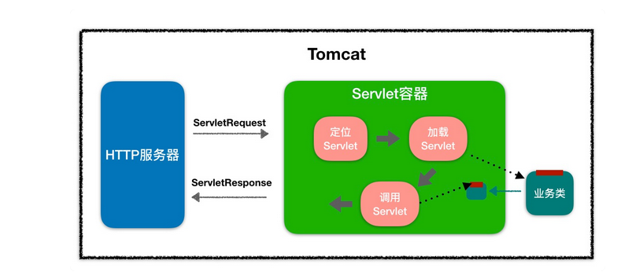
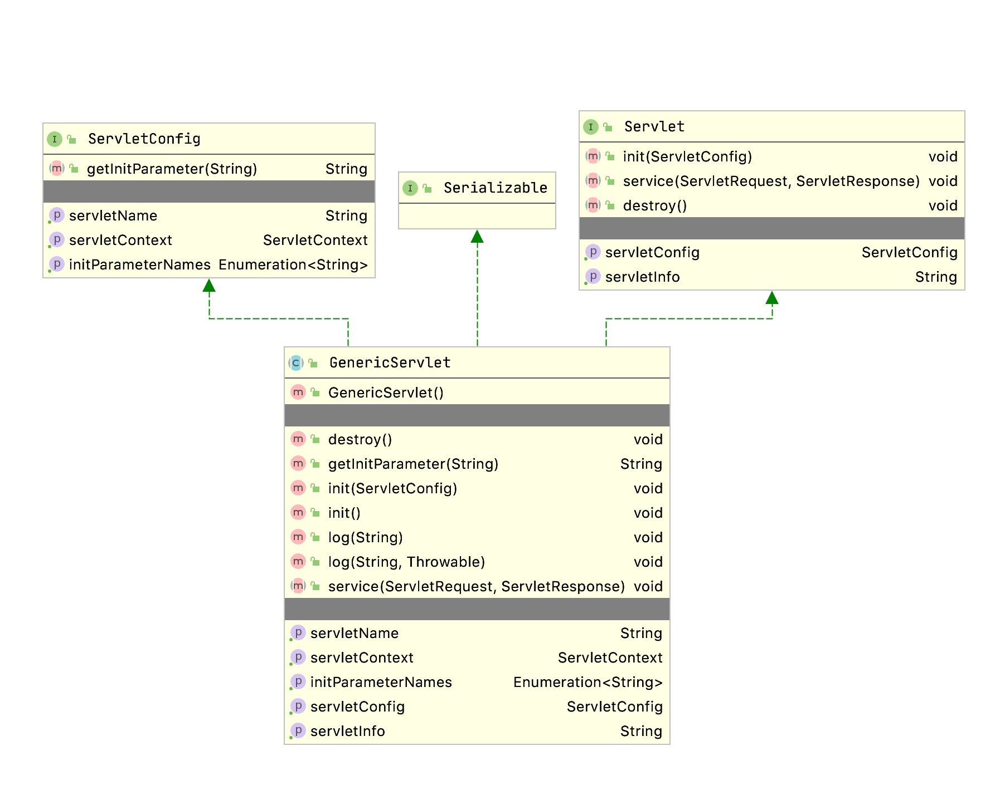

Java Servlet 是运行在 Web 服务器或应用服务器上的程序，它是作为来自 Web 浏览器或其他 HTTP 客户端的请求和 HTTP 服务器上的数据库或应用程序之间的中间层

* 读取客户端（浏览器）发送的显式的数据。这包括网页上的 HTML 表单，或者也可以是来自 applet 或自定义的 HTTP 客户端程序的表单。
* 读取客户端（浏览器）发送的隐式的 HTTP 请求数据。这包括 cookies、媒体类型和浏览器能理解的压缩格式等等。
* 处理数据并生成结果。这个过程可能需要访问数据库，执行 RMI 或 CORBA 调用，调用 Web 服务，或者直接计算得出对应的响应。
* 发送显式的数据（即文档）到客户端（浏览器）。该文档的格式可以是多种多样的，包括文本文件（HTML 或 XML）、二进制文件（GIF 图像）、Excel 等。
* 发送隐式的 HTTP 响应到客户端（浏览器）。这包括告诉浏览器或其他客户端被返回的文档类型（例如 HTML），设置 cookies 和缓存参数，以及其他类似的任务

## Servlet

默认线程不安全，单例多线程

### 定义

```java
package javax.servlet;

public interface Servlet {
    public void init(ServletConfig config) throws ServletException;
    public ServletConfig getServletConfig();
    public void service(ServletRequest req, ServletResponse res)
            throws ServletException, IOException;
    public String getServletInfo();
    public void destroy();
}

```

* 客户请求某一个资源时，Http服务器会用一个ServletRequest对象把客户的请求信息封装起来
* 调用Servlet容器的service方法，Servlet容器拿到请求后，根据请求的URL和Servlet的映射关系，找到相应的Servlet
* 如果Servlet还没有被加载，就用反射机制创建这个Servlet，并调用Servlet的init方法来完成初始化，接着调用Servlet的service方法来处理请求，把ServletResponse对象返回给Http服务器 
* Http服务器会把响应发送给客户端



### 生命周期


#### init

init 方法被设计成只调用一次

#### service

service() 方法是执行实际任务的主要方法

#### doGet/doPost
#### destroy

destroy() 方法只会被调用一次，在 Servlet 生命周期结束时被调用。destroy() 方法可以让您的 Servlet 关闭数据库连接、停止后台线程、把 Cookie 列表或点击计数器写入到磁盘，并执行其他类似的清理活动

### ServletConfig

通过ServletConfig 获取Servlet的初始化参数

```java
public interface ServletConfig {
    public String getServletName();
    public ServletContext getServletContext();
    public String getInitParameter(String name);
    public Enumeration<String> getInitParameterNames();
}
```

### ServletContext

Servlet 应用上下文，全局唯一，不同的Servlet的版本部分内容不同

```java
public interface ServletContext {

    // 返回web应用的上下文路径
    public String getContextPath();

    public ServletContext getContext(String uripath);

    // 返回初始化参数
    public String getInitParameter(String name);

    // 返回servlet容器的名称和版本，格式为servername/versionnumber
    public String getServerInfo();

    // 记录日志
    public void log(String msg);

    // 根据传入的路径，列出该路径下的所有资源路径
    public Set<String> getResourcePaths(String path);

    // 指定路径的资源封装成URL实例并返回
    public URL getResource(String path) throws MalformedURLException;

    // 返回/设置 Session 超时时间
    public int getSessionTimeout();
    public void setSessionTimeout(int sessionTimeout)
    ...
}
```

### GenericServlet



实现了 Servlet 接口的 init()方法, 在容器调用init()方法时将传入的ServletConfig封装起来

```java
@Override
public void init(ServletConfig config) throws ServletException {
    this.config = config;
    this.init();
}
```

对ServletConfig接口所定义方法都做了简单实现，实现内容主要是通过ServletConfig来取得一些相关信息

### ServletRequest

获取客户端请求信息

```java
public interface ServletRequest {
    public Object getAttribute(String name);
    public String getCharacterEncoding();
    public int getContentLength();
    public String getContentType();
    // 输入流
    public ServletInputStream getInputStream() throws IOException;

    // 获取参数
    public String getParameter(String name);
    public Enumeration<String> getParameterNames();
    public Map<String, String[]> getParameterMap();

    public String getProtocol();
    public String getRemoteAddr();
    public String getRemoteHost();
    ...
}
```

### ServletResponse

返回给客户端

```java
public interface ServletResponse {
    public String getContentType();
    public ServletOutputStream getOutputStream() throws IOException;
    public PrintWriter getWriter() throws IOException;
    public void setCharacterEncoding(String charset);
    public boolean isCommitted();
    // 缓存区操作
    public void reset();
    public void setBufferSize(int size);
    public int getBufferSize();
    public void flushBuffer() throws IOException;
}
```

## 过滤器

### 注册/映射

```xml
<filter>
    <filter-name>FirstFilter</filter-name>
    <filter-class>FirstFilter</filter-class>
    <init-param>
        <param-name>encoding</param-name>
        <param-value>GB2312</param-value>
    </init-param>
</filter>

<filter-mapping>
    <filter-name>FirstFilter</filter-name>
    <url-pattern>/*</url-pattern>
</filter-mapping>
```

### Filter

过滤器接口

```java
public interface Filter {
    // web 服务器将创建Filter 的实例对象，并调用其init方法，读取web.xml配置，完成对象的初始化功能
    public default void init(FilterConfig filterConfig) throws ServletException {}

    // 该方法完成实际的过滤操作，当客户端请求方法与过滤器设置匹配的URL时，Servlet容器将先调用过滤器的doFilter方法
    public void doFilter(ServletRequest request, ServletResponse response,
            FilterChain chain) throws IOException, ServletException;

    // 销毁过滤器实例前调用该方法
    public default void destroy() {}
}
```

### FilterConfig

获取过滤器配置

```java
public interface FilterConfig {
    public String getFilterName();
    public ServletContext getServletContext();
    public String getInitParameter(String name);
    public Enumeration<String> getInitParameterNames();
}
```
### FilterChain

定义过滤器链

```java
public interface FilterChain {
    public void doFilter(ServletRequest request, ServletResponse response)
            throws IOException, ServletException;
}
```

FilterChain 接口的 doFilter 方法用于通知 Web 容器把请求交给 Filter 链中的下一个 Filter 去处理，如果当前调用此方法的 Filter 对象是Filter 链中的最后一个 Filter，那么将把请求交给目标 Servlet 程序去处理

## 参考

[JavaWeb--ServletContext](https://www.jianshu.com/p/31d27181d542)

[Filter、FilterChain、FilterConfig 介绍](https://www.runoob.com/w3cnote/filter-filterchain-filterconfig-intro.html)