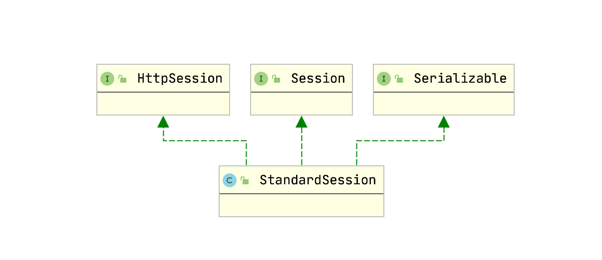
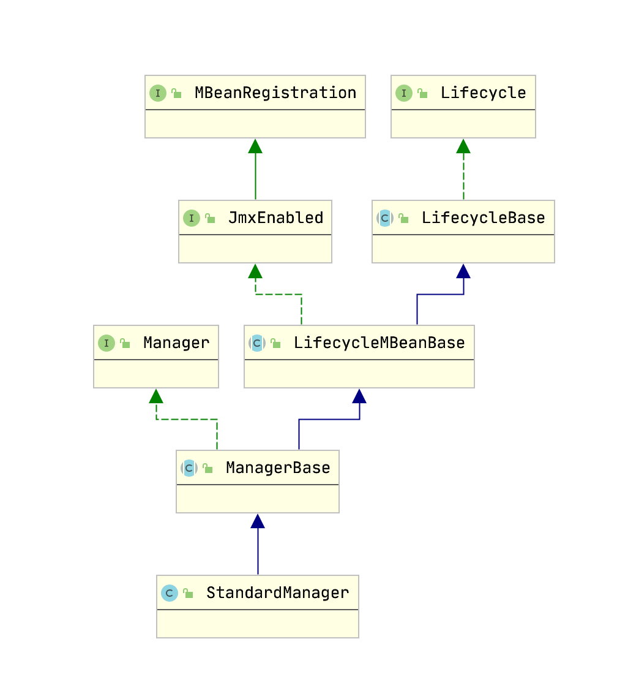
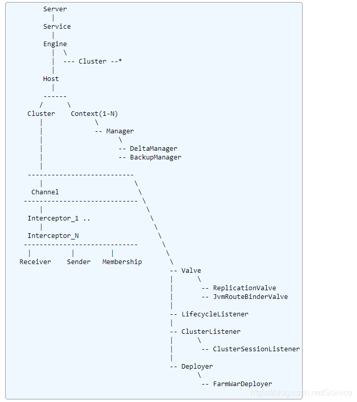

## Session/Cookies

* session 在服务器端，cookie 在客户端（浏览器）
* session 默认被存在在服务器的一个文件里（不是内存）
* session 的运行依赖 session id，而 session id 是存在 cookie 中的，也就是说，如果浏览器禁用了 cookie ，同时 session 也会失效（但是可以通过其它方式实现，比如在 url 中传递 session_id）
* session 可以放在 文件、数据库、或内存中都可以。
* 用户验证这种场合一般会用 session


### Session

session机制是一种服务器端的机制，服务器使用一种类似于散列表的结构（也可能就是使用散列表）来保存信息

当程序需要为某个客户端的请求创建一个session时，服务器首先检查这个客户端的请求里是否已包含了一个session标识（称为session id），如果已包含则说明以前已经为此客户端创建过session，服务器就按照session id把这个session检索出来使用（检索不到，会新建一个），如果客户端请求不包含session id，则为此客户端创建一个session并且生成一个与此session相关联的session id，session id的值应该是一个既不会重复，又不容易被找到规律以仿造的字符串，这个session id将被在本次响应中返回给客户端保存

### servlet 定义的 HttpSession

```java
public interface HttpSession {
    // Session 创建时间戳
    public long getCreationTime();
    // Session Id
    public String getId();

    // 最后一次访问时间
    public long getLastAccessedTime();

    public ServletContext getServletContext();

    // 获取和设置最大存活时间
    public void setMaxInactiveInterval(int interval);
    public int getMaxInactiveInterval();

    public Object getAttribute(String name);

    // 将session设置为失效
    public void invalidate();
    public boolean isNew();
}
```

## Tomcat实现方式

### 核心类

#### StandardSession



默认的session的类，是对session的系统抽象

```java
public class StandardSession implements HttpSession, Session, Serializable {

    protected long creationTime = 0L;

    // 存储session的数据结构
    protected ConcurrentMap<String, Object> attributes = new ConcurrentHashMap<>();

    // 获取 session 值
    @Override
    public Object getAttribute(String name) {
        if (!isValidInternal())
            throw new IllegalStateException
                (sm.getString("standardSession.getAttribute.ise"));

        if (name == null) return null;

        // 从 ConcurrentMap 取出值
        return attributes.get(name);
    }
}
```

#### StandardManager



默认的session管理类，管理session的创建、加载、持久化等


### 创建Session过程

#### 案例
```java
@GetMapping("/getSession")
public void get(HttpServletRequest request) {
    // get
    HttpSession session = request.getSession();

    System.out.println(session.getId());

    String sessionKey = "a";
    session.setAttribute(sessionKey, 1);
    System.out.println(session.getAttribute(sessionKey));
}
```

#### RequestFacade
```java
public class RequestFacade implements HttpServletRequest {

    @Override
    public HttpSession getSession() {
        // 请求检查
        if (request == null) {
            throw new IllegalStateException(
                            sm.getString("requestFacade.nullRequest"));
        }

        return getSession(true);
    }

    @Override
    public HttpSession getSession(boolean create) {

        if (request == null) {
            throw new IllegalStateException(
                            sm.getString("requestFacade.nullRequest"));
        }

        if (SecurityUtil.isPackageProtectionEnabled()){
            return AccessController.doPrivileged(new GetSessionPrivilegedAction(create));
        } else {
            // 默认进入这里
            return request.getSession(create);
        }
    }
}
```

#### Request

```java
public class Request implements HttpServletRequest {
    @Override
    public HttpSession getSession(boolean create) {
        // 获取或创建Session
        Session session = doGetSession(create);
        if (session == null) {
            return null;
        }

        return session.getSession();
    }

    protected Session doGetSession(boolean create) {

        // There cannot be a session if no context has been assigned yet
        Context context = getContext();
        if (context == null) {
            return null;
        }

        // 如果当前存在 session 且有效 返回
        if ((session != null) && !session.isValid()) {
            session = null;
        }
        if (session != null) {
            return session;
        }

        // 如果存在且有效，则返回所请求的会话
        Manager manager = context.getManager();
        if (manager == null) {
            return null;      // Sessions are not supported
        }
        // 如果SessionId 不为空，从 manager 查找
        if (requestedSessionId != null) {
            try {
                session = manager.findSession(requestedSessionId);
            } catch (IOException e) {
                if (log.isDebugEnabled()) {
                    log.debug(sm.getString("request.session.failed", requestedSessionId, e.getMessage()), e);
                } else {
                    log.info(sm.getString("request.session.failed", requestedSessionId, e.getMessage()));
                }
                session = null;
            }
            if ((session != null) && !session.isValid()) {
                session = null;
            }
            if (session != null) {
                session.access();
                return session;
            }
        }

        // 如果请求而响应未提交，则创建一个新会话
        if (!create) {
            return null;
        }
        boolean trackModesIncludesCookie =
                context.getServletContext().getEffectiveSessionTrackingModes().contains(SessionTrackingMode.COOKIE);
        if (trackModesIncludesCookie && response.getResponse().isCommitted()) {
            throw new IllegalStateException(sm.getString("coyoteRequest.sessionCreateCommitted"));
        }

        // Re-use session IDs provided by the client in very limited
        // circumstances.
        String sessionId = getRequestedSessionId();
        if (requestedSessionSSL) {
            // If the session ID has been obtained from the SSL handshake then
            // use it.
        } else if (("/".equals(context.getSessionCookiePath())
                && isRequestedSessionIdFromCookie())) {
             //此处是为了跨浏览器相同sessionID的访问
            if (context.getValidateClientProvidedNewSessionId()) {
                boolean found = false;
                for (Container container : getHost().findChildren()) {
                    Manager m = ((Context) container).getManager();
                    if (m != null) {
                        try {
                            if (m.findSession(sessionId) != null) {
                                found = true;
                                break;
                            }
                        } catch (IOException e) {
                            // Ignore. Problems with this manager will be
                            // handled elsewhere.
                        }
                    }
                }
                if (!found) {
                    sessionId = null;
                }
            }
        } else {
            sessionId = null;
        }
        // 创建 Session
        session = manager.createSession(sessionId);

        // Creating a new session cookie based on that session
        if (session != null && trackModesIncludesCookie) {
            Cookie cookie = ApplicationSessionCookieConfig.createSessionCookie(
                    context, session.getIdInternal(), isSecure());

            response.addSessionCookieInternal(cookie);
        }

        if (session == null) {
            return null;
        }

        // 记录最后方位时间
        session.access();
        return session;
    }
}
```

#### ManagerBase

管理 session

```java
public abstract class ManagerBase extends LifecycleMBeanBase implements Manager {

    // 保存 Session
    protected Map<String, Session> sessions = new ConcurrentHashMap<>();

    @Override
    public Session createSession(String sessionId) {

        if ((maxActiveSessions >= 0) && (getActiveSessions() >= maxActiveSessions)) {
            rejectedSessions++;
            throw new TooManyActiveSessionsException(
                    sm.getString("managerBase.createSession.ise"),
                    maxActiveSessions);
        }

        // 回收或创建会话实例
        Session session = createEmptySession();

        // 初始化新会话的属性并返回它
        session.setNew(true);
        session.setValid(true);
        session.setCreationTime(System.currentTimeMillis());
        session.setMaxInactiveInterval(getContext().getSessionTimeout() * 60);
        String id = sessionId;
        if (id == null) {
            // 生成一个 sessionId
            id = generateSessionId();
        }

// 设置 Id 和 把 session 放入容器
        session.setId(id);
        sessionCounter++;

        SessionTiming timing = new SessionTiming(session.getCreationTime(), 0);
        synchronized (sessionCreationTiming) {
            sessionCreationTiming.add(timing);
            sessionCreationTiming.poll();
        }
        return session;
    }

    @Override
    public Session createEmptySession() {
        return getNewSession();
    }

    protected StandardSession getNewSession() {
        return new StandardSession(this);
    }

    protected String generateSessionId() {
        String result = null;
        do {
            if (result != null) {
                duplicates++;
            }

            // 生成Id
            result = sessionIdGenerator.generateSessionId();
        // 循环防止重复Id
        } while (sessions.containsKey(result));

        return result;
    }

    // 根据 sessionId 查找 Session
    @Override
    public Session findSession(String id) throws IOException {
        if (id == null) {
            return null;
        }
        return sessions.get(id);
    }

    @Override
    public void add(Session session) {
        // 把 session 放入容器中
        sessions.put(session.getIdInternal(), session);

        // 是否超过容量最大限制
        int size = getActiveSessions();
        if( size > maxActive ) {
            synchronized(maxActiveUpdateLock) {
                if( size > maxActive ) {
                    maxActive = size;
                }
            }
        }
    }
}

```

#### StandardSession

Session key-value 管理

```java
public class StandardSession implements HttpSession, Session, Serializable {
    public StandardSession(Manager manager) {

        super();
        this.manager = manager;

        // Initialize access count
        if (ACTIVITY_CHECK) {
            accessCount = new AtomicInteger();
        }

    }

    @Override
    public void access() {
        // 记录访问时间
        this.thisAccessedTime = System.currentTimeMillis();

        if (ACTIVITY_CHECK) {
            accessCount.incrementAndGet();
        }
    }

    @Override
    public void setId(String id) {
        setId(id, true);
    }

    @Override
    public void setId(String id, boolean notify) {

        if ((this.id != null) && (manager != null))
            manager.remove(this);

        this.id = id;

        if (manager != null)
            manager.add(this);

        // 监听事件
        if (notify) {
            tellNew();
        }
    }
}
```

### 设置/查找

```java

// session.getAttribute(sessionKey)
// session.setAttribute(sessionKey, 1);
public class StandardSession implements HttpSession, Session, Serializable {
    // 保存 session key-value
    protected ConcurrentMap<String, Object> attributes = new ConcurrentHashMap<>();

    @Override
    public Object getAttribute(String name) {
        if (!isValidInternal())
            throw new IllegalStateException
                (sm.getString("standardSession.getAttribute.ise"));

        if (name == null) return null;

        // get
        return attributes.get(name);
    }

    // 设置 Session
    public void setAttribute(String name, Object value, boolean notify) {

        // Name cannot be null
        if (name == null) {
            throw new IllegalArgumentException(
                    sm.getString("standardSession.setAttribute.namenull"));
        }

        // Null value is the same as removeAttribute()
        if (value == null) {
            removeAttribute(name);
            return;
        }

        // Validate our current state
        if (!isValidInternal()) {
            throw new IllegalStateException(
                    sm.getString("standardSession.setAttribute.ise", getIdInternal()));
        }

        Context context = manager.getContext();

        if (context.getDistributable() && !isAttributeDistributable(name, value) && !exclude(name, value)) {
            throw new IllegalArgumentException(sm.getString("standardSession.setAttribute.iae", name));
        }
        // Construct an event with the new value
        HttpSessionBindingEvent event = null;

        // Call the valueBound() method if necessary
        if (notify && value instanceof HttpSessionBindingListener) {
            // Don't call any notification if replacing with the same value
            // unless configured to do so
            Object oldValue = attributes.get(name);
            if (value != oldValue || manager.getNotifyBindingListenerOnUnchangedValue()) {
                event = new HttpSessionBindingEvent(getSession(), name, value);
                try {
                    ((HttpSessionBindingListener) value).valueBound(event);
                } catch (Throwable t){
                    manager.getContext().getLogger().error(
                            sm.getString("standardSession.bindingEvent"), t);
                }
            }
        }

        // Replace or add this attribute
        Object unbound = attributes.put(name, value);

        // Call the valueUnbound() method if necessary
        if (notify && unbound instanceof HttpSessionBindingListener) {
            // Don't call any notification if replacing with the same value
            // unless configured to do so
            if (unbound != value || manager.getNotifyBindingListenerOnUnchangedValue()) {
                try {
                    ((HttpSessionBindingListener) unbound).valueUnbound
                        (new HttpSessionBindingEvent(getSession(), name));
                } catch (Throwable t) {
                    ExceptionUtils.handleThrowable(t);
                    manager.getContext().getLogger().error
                        (sm.getString("standardSession.bindingEvent"), t);
                }
            }
        }

        if (!notify) {
            return;
        }

        // Notify interested application event listeners
        Object listeners[] = context.getApplicationEventListeners();
        if (listeners == null) {
            return;
        }
        for (Object o : listeners) {
            if (!(o instanceof HttpSessionAttributeListener)) {
                continue;
            }
            HttpSessionAttributeListener listener = (HttpSessionAttributeListener) o;
            try {
                if (unbound != null) {
                    if (unbound != value || manager.getNotifyAttributeListenerOnUnchangedValue()) {
                        context.fireContainerEvent("beforeSessionAttributeReplaced", listener);
                        if (event == null) {
                            event = new HttpSessionBindingEvent(getSession(), name, unbound);
                        }
                        listener.attributeReplaced(event);
                        context.fireContainerEvent("afterSessionAttributeReplaced", listener);
                    }
                } else {
                    context.fireContainerEvent("beforeSessionAttributeAdded", listener);
                    if (event == null) {
                        event = new HttpSessionBindingEvent(getSession(), name, value);
                    }
                    listener.attributeAdded(event);
                    context.fireContainerEvent("afterSessionAttributeAdded", listener);
                }
            } catch (Throwable t) {
                ExceptionUtils.handleThrowable(t);
                try {
                    if (unbound != null) {
                        if (unbound != value ||
                                manager.getNotifyAttributeListenerOnUnchangedValue()) {
                            context.fireContainerEvent("afterSessionAttributeReplaced", listener);
                        }
                    } else {
                        context.fireContainerEvent("afterSessionAttributeAdded", listener);
                    }
                } catch (Exception e) {
                    // Ignore
                }
                manager.getContext().getLogger().error(
                        sm.getString("standardSession.attributeEvent"), t);
            }
        }
    }
}
```

## Session 共享

### Tomcat 集群

配置tomcat 集群，自动会共享session

```xml
<!-- 第1步：修改server.xml，在Host节点下添加如下Cluster节点 -->
<Cluster className="org.apache.catalina.ha.tcp.SimpleTcpCluster" channelSendOptions="8">
<!-- 在节点间拷贝Session , 默认all-to-all会话复制 -->
    <Manager className="org.apache.catalina.ha.session.DeltaManager" 
                expireSessionsOnShutdown="false" 
                notifyListenersOnReplication="true" />

    <Channel className="org.apache.catalina.tribes.group.GroupChannel">
        <Membership className="org.apache.catalina.tribes.membership.McastService" address="228.0.0.4" 
                    port="45564" frequency="500" dropTime="3000" />

        <Receiver className="org.apache.catalina.tribes.transport.nio.NioReceiver" 
                    address="auto" 
                    port="4000" 
                    autoBind="100" 
                    selectorTimeout="5000" 
                    maxThreads="6" />

        <Sender className="org.apache.catalina.tribes.transport.ReplicationTransmitter">
            <Transport className="org.apache.catalina.tribes.transport.nio.PooledParallelSender" />
        </Sender>

        <Interceptor className="org.apache.catalina.tribes.group.interceptors.TcpFailureDetector" />
        <Interceptor className="org.apache.catalina.tribes.group.interceptors.MessageDispatchInterceptor" />
    </Channel>

    <Valve className="org.apache.catalina.ha.tcp.ReplicationValve" filter="" />
    <Valve className="org.apache.catalina.ha.session.JvmRouteBinderValve" />

    <Deployer className="org.apache.catalina.ha.deploy.FarmWarDeployer" tempDir="/tmp/war-temp/" 
              deployDir="/tmp/war-deploy/" watchDir="/tmp/war-listen/" watchEnabled="false" />

    <ClusterListener className="org.apache.catalina.ha.session.ClusterSessionListener" />
</Cluster>
 
<!-- 第2步：在web.xml中添加如下节点 -->
<distributable/>
```
#### 步骤

1. 修改 `server.xml`，在 `Host` 节点下添加如下 `Cluster` 节点

2. 在 `web.xml` 中添加 `<distributable/>`

> cluster: [ˈklʌstə(r)] <br/>
> distributable: [di'stribjutəbl]

#### 配置说明



* Manager

用来在节点间拷贝Session，默认使用DeltaManager，DeltaManager采用的一种all-to-all的工作方式，即集群中的节点会把Session数据向所有其他节点拷贝，而不管其他节点是否部署了当前应用。

当集群中的节点数量很多并且部署着不同应用时，可以使用BackupManager，BackManager仅向部署了当前应用的节点拷贝Session

* Channel
负责对tomcat集群的IO层进行配置
    * Membership 用于发现集群中的其他节点，这里的address用的是组播地址（Multicast address
    * Receiver 用于各个节点接收其他节点发送的数据，在默认配置下tomcat会从4000-4100间依次选取一个可用的端口进行接收
    * Sender 用于向其他节点发送数据 PooledParallelSender是从tcp连接池中获取连接，可以实现并行发送，即集群中的多个节点可以同时向其他所有节点发送数据而互不影响

* Valve

用于在节点向客户端响应前进行检测或进行某些操作

* Deployer

用于集群的farm功能，监控应用中文件的更新，以保证集群中所有节点应用的一致性

* Listener

用于跟踪集群中节点发出和收到的数据，也有点类似Valve的功能

### Spring Session

```xml
<dependency>
    <groupId>org.springframework.boot</groupId>
    <artifactId>spring-boot-starter-data-redis</artifactId>
</dependency>
<dependency>
    <groupId>org.springframework.session</groupId>
    <artifactId>spring-session-data-redis</artifactId>
</dependency>

<!-- @EnableRedisHttpSession -->
```

## 参考

[tomcat集群Cluster实现原理剖析](https://blog.csdn.net/zengdeqing2012/article/details/50127139)