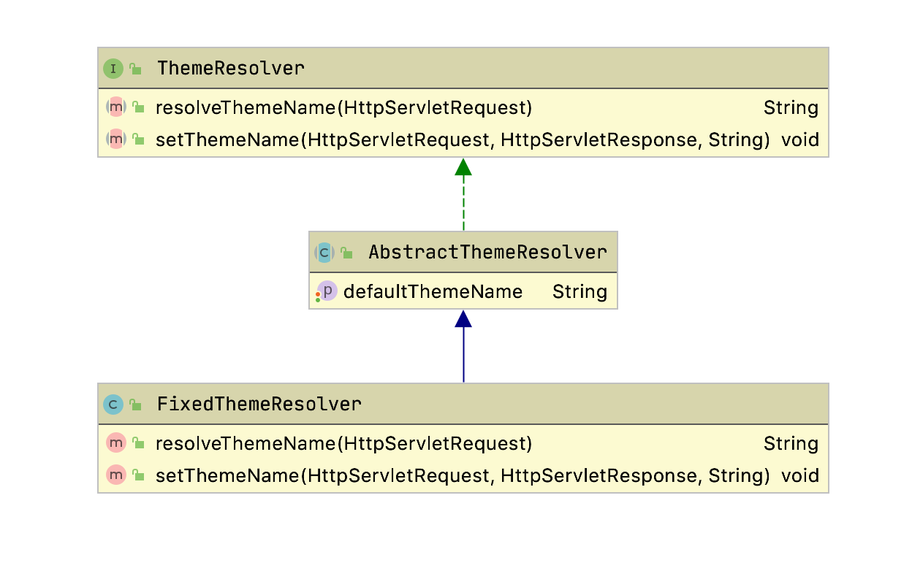
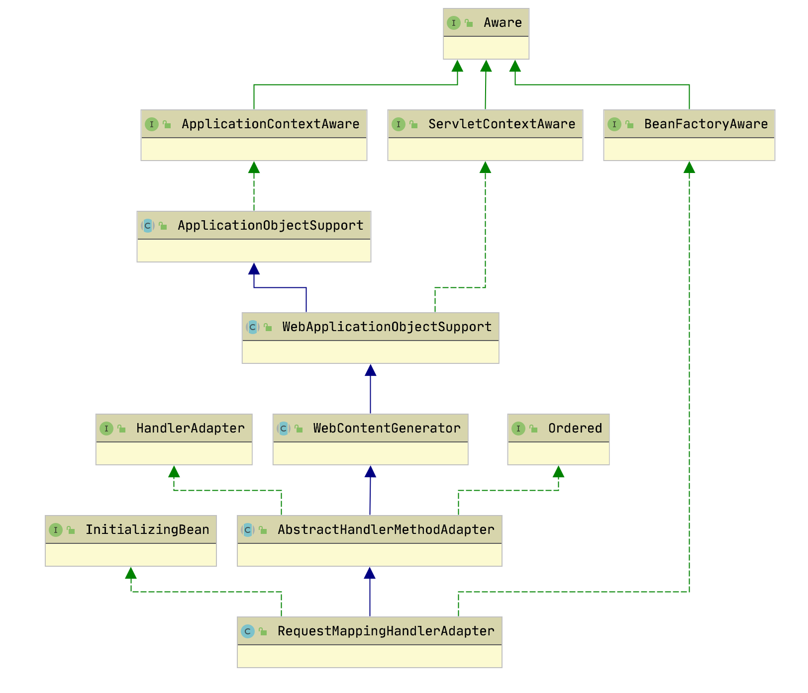

## LocaleResolver
>  Locale [ləʊˈkɑːl]， resolver [riː'zɒlvə]

区域处理器用来识别用户的地区，可以实现国际化

### Locale

表示语言和国家/地区信息的本地化类

```java
public final class Locale implements Cloneable, Serializable {
    static public final Locale US = createConstant("en", "US");
    static public final Locale SIMPLIFIED_CHINESE = createConstant("zh", "CN");
}
```

### 接口定义 LocaleResolver
 
```java
public interface LocaleResolver {
    // 解析当前请求，获取请求对应的Locale
    Locale resolveLocale(HttpServletRequest request);
    // 设置当前请求和响应对应的Locale
    void setLocale(HttpServletRequest request, @Nullable HttpServletResponse response, @Nullable Locale locale);
}
```

### AcceptHeaderLocaleResolver

检验HTTP请求的 `accept-language` 头部来解析区域，springmvc 默认的处理机制

```java
public class AcceptHeaderLocaleResolver implements LocaleResolver {
    @Override
	public Locale resolveLocale(HttpServletRequest request) {
		// 获取默认的 Locale
		Locale defaultLocale = getDefaultLocale();
		// Accept-Language 为空，返回 defaultLocale
		if (defaultLocale != null && request.getHeader("Accept-Language") == null) {
			return defaultLocale;
		}

		// 获取请求Locale，底层通过解析头部 Accept-Language
		Locale requestLocale = request.getLocale();
		// 找到本地实例配置的支持的Locale列表
		List<Locale> supportedLocales = getSupportedLocales();
		// 支持的列表为空，或支持 requestLocale，直接返回
		if (supportedLocales.isEmpty() || supportedLocales.contains(requestLocale)) {
			return requestLocale;
		}
		// supportedLocales 不为空且请求的Locale支持的列表内
		Locale supportedLocale = findSupportedLocale(request, supportedLocales);
		if (supportedLocale != null) {
			return supportedLocale;
		}
		return (defaultLocale != null ? defaultLocale : requestLocale);
    }
    
    @Override
	public void setLocale(HttpServletRequest request, @Nullable HttpServletResponse response, @Nullable Locale locale) {
        // 不支持设置 Locale
		throw new UnsupportedOperationException(
				"Cannot change HTTP accept header - use a different locale resolution strategy");
	}
}
```

#### LocaleContext

```java
protected final void processRequest(HttpServletRequest request, HttpServletResponse response)
			throws ServletException, IOException {
    protected final void processRequest(HttpServletRequest request, HttpServletResponse response)
			throws ServletException, IOException {
        long startTime = System.currentTimeMillis();
        // 获取 原先的Locale 上下文
        LocaleContext previousLocaleContext = LocaleContextHolder.getLocaleContext();
        // 创建新的Locale 上下文
        LocaleContext localeContext = buildLocaleContext(request);
    }
    
        
    @Nullable
	protected LocaleContext buildLocaleContext(HttpServletRequest request) {
		return new SimpleLocaleContext(request.getLocale());
	}
```

### 国际化配置

#### 步骤
1. 添加对应的文件国际化文件

* `messages.properties` 默认
* `messages_zh_CN.properties` 中文
* `messages_en_US.properties` 英文

```properties
# 内容
message=成功
```

2. 获取 `MessageSource`

```java
// 把 MessageSource 注入spring
@Autowired
private MessageSource messageSource;

// 获取上下文中的Locale
Locale locale = LocaleContextHolder.getLocale();
String msg = messageSource.getMessage("message", null, locale)
// msg=成功
```

#### 原理

MessageSource 接口，以用于支持信息的国际化和包含参数的信息的替换。

## ThemeResolver

主题解析器，`org.springframework.web.servlet.theme` 包下主题相关类

### ThemeResolver 接口

```java
public interface ThemeResolver {
    // 根据请求解析主题名
    String resolveThemeName(HttpServletRequest request);
    // 设置主题名
    void setThemeName(HttpServletRequest request, @Nullable HttpServletResponse response, @Nullable String themeName);
}
```
### FixedThemeResolver

默认的主题解析器实现类



#### FixedThemeResolver

```java
public class FixedThemeResolver extends AbstractThemeResolver {

	@Override
	public String resolveThemeName(HttpServletRequest request) {
        // 调用 AbstractThemeResolver.getDefaultThemeName()
		return getDefaultThemeName();
	}

	@Override
	public void setThemeName(HttpServletRequest request, @Nullable HttpServletResponse response, @Nullable String themeName) {

		throw new UnsupportedOperationException("Cannot change theme - use a different theme resolution strategy");
	}
}
```

#### AbstractThemeResolver

```java
public abstract class AbstractThemeResolver implements ThemeResolver {
    // 定义默认的主题名称
	public static final String ORIGINAL_DEFAULT_THEME_NAME = "theme";
    private String defaultThemeName = ORIGINAL_DEFAULT_THEME_NAME;
    
	public void setDefaultThemeName(String defaultThemeName) {
		this.defaultThemeName = defaultThemeName;
	}
	public String getDefaultThemeName() {
		return this.defaultThemeName;
	}

}
```

## MultipartResolver

### MultipartResolver 接口

```java
public interface MultipartResolver {
    // 判断是佛是多块请求
    boolean isMultipart(HttpServletRequest request);
    // 解析多块请求，返回新的 MultipartHttpServletRequest，封装多块请求的相关方法和属性
    MultipartHttpServletRequest resolveMultipart(HttpServletRequest request) throws MultipartException;
    // 请求完成后清理操作
    void cleanupMultipart(MultipartHttpServletRequest request);
}
```

### StandardServletMultipartResolver

默认实现类

```java
public class StandardServletMultipartResolver implements MultipartResolver {
    private boolean resolveLazily = false;
    public void setResolveLazily(boolean resolveLazily) {
		this.resolveLazily = resolveLazily;
    }

    @Override
	public boolean isMultipart(HttpServletRequest request) {
        // 判断 ContentType 是否是以 'multipart/' 为前缀
		return StringUtils.startsWithIgnoreCase(request.getContentType(), "multipart/");
	}

	@Override
	public MultipartHttpServletRequest resolveMultipart(HttpServletRequest request) throws MultipartException {
        // 返回 StandardMultipartHttpServletRequest
		return new StandardMultipartHttpServletRequest(request, this.resolveLazily);
	}

	@Override
	public void cleanupMultipart(MultipartHttpServletRequest request) {
		if (!(request instanceof AbstractMultipartHttpServletRequest) ||
				((AbstractMultipartHttpServletRequest) request).isResolved()) {
			try {
                // 遍历所有的请求块
				for (Part part : request.getParts()) {
                    // 如果对于的请求块包含文件，则删除文件
					if (request.getFile(part.getName()) != null) {
						part.delete();
					}
				}
			}
			catch (Throwable ex) {
				LogFactory.getLog(getClass()).warn("Failed to perform cleanup of multipart items", ex);
			}
		}
	}
}
```

### StandardMultipartHttpServletRequest

```java
public class StandardMultipartHttpServletRequest extends AbstractMultipartHttpServletRequest {
	@Nullable
    private Set<String> multipartParameterNames;
    
    public StandardMultipartHttpServletRequest(HttpServletRequest request, boolean lazyParsing)
			throws MultipartException {

		super(request);
		if (!lazyParsing) {
			// 解析请求
			parseRequest(request);
		}
	}
	
	private void parseRequest(HttpServletRequest request) {
		try {
			// 获取请求块
			Collection<Part> parts = request.getParts();
			// 保存请求块的参数名称
			this.multipartParameterNames = new LinkedHashSet<>(parts.size());
			// 保存请求文件
			MultiValueMap<String, MultipartFile> files = new LinkedMultiValueMap<>(parts.size());
			for (Part part : parts) {
				// 获取请求头 Content-Disposition 的值
				String headerValue = part.getHeader(HttpHeaders.CONTENT_DISPOSITION);
				// 解析 Content-Disposition 的值
				ContentDisposition disposition = ContentDisposition.parse(headerValue);
				// 文件名称
				String filename = disposition.getFilename();
				if (filename != null) {
					if (filename.startsWith("=?") && filename.endsWith("?=")) {
						filename = MimeDelegate.decode(filename);
					}

					// 保存文件
					files.add(part.getName(), new StandardMultipartFile(part, filename));
				}
				else {
					// 不是文件类型的请求，将块名称放入请求参数集合
					this.multipartParameterNames.add(part.getName());
				}
			}
			// 在本实例保存多块请求，防止被篡改
			setMultipartFiles(files);
		}
		catch (Throwable ex) {
			handleParseFailure(ex);
		}
    }
}
```

### 文件上传

1. 依赖引入

```xml
<dependency>
    <groupId>commons-fileupload</groupId>
    <artifactId>commons-fileupload</artifactId>
    <version>1.3.2</version>
</dependency>
```

2. 前端上传

```html
<form action="/upload" enctype="multipart/form-data" method="post">
  	<input type="file" name="file"><br><br>
  	<input type="submit" value="上传">
</form>
```

3. 后台接收

```java
@RequestMapping("/upload")
public String upload(@RequestParam("file") MultipartFile file, HttpServletRequest req)
		throws IllegalStateException, IOException {
	// 判断文件是否为空，空则返回失败页面
	if (file.isEmpty()) {
		return "failed";
    }
    
	// 获取文件存储路径（绝对路径）
	String path = req.getServletContext().getRealPath("/WEB-INF/file");
	// 获取原文件名
	String fileName = file.getOriginalFilename();
	// 创建文件实例
	File filePath = new File(path, fileName);
	// 如果文件目录不存在，创建目录
	if (!filePath.getParentFile().exists()) {
		filePath.getParentFile().mkdirs();
		System.out.println("创建目录" + filePath);
	}
	// 写入文件
	file.transferTo(filePath);
	return "success";
}  
```

## HandlerMapping
## HandlerAdapter

> Adapter [ə'dæptə]

处理适配器

### HandlerAdapter 接口
```java
public interface HandlerAdapter {
    // 判断该处理适配器是否支持这个处理器
    boolean supports(Object handler);
    // 执行核心处理逻辑，返回 ModelAndView
    ModelAndView handle(HttpServletRequest request, HttpServletResponse response, Object handler) throws Exception;
    // 最近一次的修改时间
    long getLastModified(HttpServletRequest request, Object handler);
}
```

### HttpRequestHandlerAdapter

适配 `HttpRequestHandler` 类型的处理器

```java
public class HttpRequestHandlerAdapter implements HandlerAdapter {

	@Override
	public boolean supports(Object handler) {
		return (handler instanceof HttpRequestHandler);
	}

	@Override
	@Nullable
	public ModelAndView handle(HttpServletRequest request, HttpServletResponse response, Object handler)
			throws Exception {

		((HttpRequestHandler) handler).handleRequest(request, response);
		return null;
	}

	@Override
	public long getLastModified(HttpServletRequest request, Object handler) {
		if (handler instanceof LastModified) {
			return ((LastModified) handler).getLastModified(request);
		}
		return -1L;
	}

}
```
### SimpleControllerHandlerAdapter

适配 `ControllerHandler` 的适配器

```java
public class SimpleControllerHandlerAdapter implements HandlerAdapter {

	@Override
	public boolean supports(Object handler) {
		return (handler instanceof Controller);
	}

	@Override
	@Nullable
	public ModelAndView handle(HttpServletRequest request, HttpServletResponse response, Object handler)
			throws Exception {

		return ((Controller) handler).handleRequest(request, response);
	}

	@Override
	public long getLastModified(HttpServletRequest request, Object handler) {
		if (handler instanceof LastModified) {
			return ((LastModified) handler).getLastModified(request);
		}
		return -1L;
	}

}
```

### RequestMappingHandlerAdapter

适配 `HandlerMethod`（使用 `@RequestMapping`） 的处理器



#### AbstractHandlerMethodAdapter

`HandlerAdapter` 的抽象实现类

```java
public abstract class AbstractHandlerMethodAdapter extends WebContentGenerator implements HandlerAdapter, Ordered {
    @Override
	public final boolean supports(Object handler) {
        // 判断 handler 是否 HandlerMethod 类型的
		// supportsInternal 交给子类 RequestMappingHandlerAdapter 实现，默认返回true
		return (handler instanceof HandlerMethod && supportsInternal((HandlerMethod) handler));
    }
    
    // 子类 RequestMappingHandlerAdapter 实现，默认返回true
    protected abstract boolean supportsInternal(HandlerMethod handlerMethod);
    
    @Override
	@Nullable
	public final ModelAndView handle(HttpServletRequest request, HttpServletResponse response, Object handler)
			throws Exception {
        // 执行处理器，交给 RequestMappingHandlerAdapter 处理
		return handleInternal(request, response, (HandlerMethod) handler);
	}

	@Nullable
	protected abstract ModelAndView handleInternal(HttpServletRequest request,
			HttpServletResponse response, HandlerMethod handlerMethod) throws Exception;
    @Override


	public final long getLastModified(HttpServletRequest request, Object handler) {
		return getLastModifiedInternal(request, (HandlerMethod) handler);
	}

	protected abstract long getLastModifiedInternal(HttpServletRequest request, HandlerMethod handlerMethod);
}
```

#### RequestMappingHandlerAdapter

```java
public class RequestMappingHandlerAdapter extends AbstractHandlerMethodAdapter
		implements BeanFactoryAware, InitializingBean {

    @Override
	protected boolean supportsInternal(HandlerMethod handlerMethod) {
		return true;
	}
}
```

## HandlerExceptionResolver
异常解析器

### HandlerExceptionResolver 接口

```java
public interface HandlerExceptionResolver {
    @Nullable
	ModelAndView resolveException(
			HttpServletRequest request, HttpServletResponse response, @Nullable Object handler, Exception ex);
}
```

### AbstractHandlerExceptionResolver

```java
public abstract class AbstractHandlerExceptionResolver implements HandlerExceptionResolver, Ordered {
    @Override
	@Nullable
	public ModelAndView resolveException(
			HttpServletRequest request, HttpServletResponse response, @Nullable Object handler, Exception ex) {
		// 判断此异常处理器是否对该请求和处理器提供支持
		if (shouldApplyTo(request, handler)) {
			// 预处理响应
			prepareResponse(ex, response);
			// 解析异常，子类实现
			ModelAndView result = doResolveException(request, response, handler, ex);
			// 打印结果
			if (result != null) {
				// Print debug message when warn logger is not enabled.
				if (logger.isDebugEnabled() && (this.warnLogger == null || !this.warnLogger.isWarnEnabled())) {
					logger.debug("Resolved [" + ex + "]" + (result.isEmpty() ? "" : " to " + result));
				}
				// Explicitly configured warn logger in logException method.
				logException(ex, request);
			}
			return result;
		}
		else {
			return null;
		}
	}
}
```

### ExceptionHandlerExceptionResolver

用于处理 `@ExceptionHandler` 的配置的异常方法

```java
public class ExceptionHandlerExceptionResolver extends AbstractHandlerMethodExceptionResolver
		implements ApplicationContextAware, InitializingBean {
}
```

### ResponseStatusExceptionResolver

处理 `@ResponseStatus`注解的异常信息

```java
public class ResponseStatusExceptionResolver extends AbstractHandlerExceptionResolver implements MessageSourceAware {
    // 国级化信息
    private MessageSource messageSource;

    @Override
	@Nullable
	protected ModelAndView doResolveException(
			HttpServletRequest request, HttpServletResponse response, @Nullable Object handler, Exception ex) {

		try {
			if (ex instanceof ResponseStatusException) {
				return resolveResponseStatusException((ResponseStatusException) ex, request, response, handler);
			}

			ResponseStatus status = AnnotatedElementUtils.findMergedAnnotation(ex.getClass(), ResponseStatus.class);
			if (status != null) {
				// 处理异常信息
				return resolveResponseStatus(status, request, response, handler, ex);
			}

			if (ex.getCause() instanceof Exception) {
				// 递归调用
				return doResolveException(request, response, handler, (Exception) ex.getCause());
			}
		}
		catch (Exception resolveEx) {
			if (logger.isWarnEnabled()) {
				logger.warn("Failure while trying to resolve exception [" + ex.getClass().getName() + "]", resolveEx);
			}
		}
		return null;
	}
}
```


### 统一异常处理

#### @ControllerAdvice 注解

>  Advice [ədˈvaɪs]

* `@ControllerAdvice` `@RestControllerAdvice` 表示这是一个控制器增强类
* `@ExceptionHandler` 声明捕获的异常

```java
// @ControllerAdvice
@RestControllerAdvice
public class GlobalExceptionHandler {
    @ExceptionHandler(NullPointerException.class)
    public String nullPointerException(HttpServletResponse response, NullPointerException ex){
        return "this is error msg!";
    }
}
```

#### ErrorController

自定义类实现 `ErrorController`

```java
@RestController
public class HttpErrorController implements ErrorController {

    private final static String ERROR_PATH = "/error";

    @RequestMapping(path = ERROR_PATH)
    public String error(HttpServletRequest request, HttpServletResponse response) {
        return "";
    }

    @Override
    public String getErrorPath() {
        return ERROR_PATH;
    }
}
```

#### 区别

1. 注解 `@ControllerAdvice` 方式只能处理控制器抛出的异常。此时请求已经进入控制器中。

2. 类 `ErrorController` 方式可以处理所有的异常，包括未进入控制器的错误，比如404,401等错误

3. 如果应用中两者共同存在，则 `@ControllerAdvice` 方式处理控制器抛出的异常，类 `ErrorController` 方式处理未进入控制器的异常。

4. `@ControllerAdvice` 方式可以定义多个拦截方法，拦截不同的异常类，并且可以获取抛出的异常信息，自由度更大