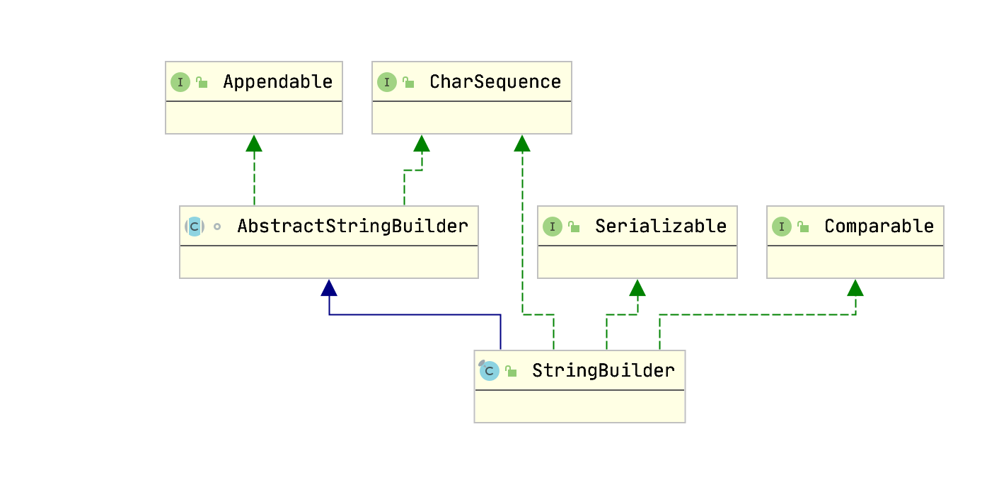

## 定义

> String 被声明为 final，因此它不可被继承。  
> 在 Java 8 中，String 内部使用 char 数组存储数据  
> 在 Java 9 之后，String 类的实现改用 byte 数组存储字符串，同时使用 coder 来标识使用了哪种编码

```java
public final class String
    implements java.io.Serializable, Comparable<String>, CharSequence{

    @Stable
    private final byte[] value;

    public String(byte bytes[], int offset, int length) {
        checkBoundsOffCount(offset, length, bytes.length);
        StringCoding.Result ret = StringCoding.decode(bytes, offset, length);
        this.value = ret.value;
        this.coder = ret.coder;
    }

    // 手动将字符串放入常量池
    public native String intern();
}
```

String对象在内存(堆)中被创建出来，他就无法被修改。String类的所有方法都没有改变字符串本身的值，都是返回了一个新的对象

## 常量池

### 字符串常量池

> 在JVM中，为了减少相同的字符串的重复创建，为了达到节省内存的目的, 会单独开辟一块内存，用于保存字符串常量，这个内存区域被叫做字符串常量池

长度限制
编译器 65534，运行期 2^31-1 约等于4G

### Class常量池

Class 文件包含常量池结构 `Constant pool`，当虚拟机运行时，需要从常量池获得对应的符号引用，再在类创建时或运行时解析、翻译到具体的内存地址之中

```java
public class StringDemo {
    public static void main(String[] args) {
        String s1 = "常量字符串1";
        String s2 = "常量字符串2";
    }
}

// 编译文件
javac StringDemo

// 查看class
javap -v StringDemo.class
```


### 运行时常量池

运行时常量池（ Runtime Constant Pool）是每一个类或接口的常量池（ Constant_Pool）的运行时表示形式

每一个运行时常量池都在Java虚拟机的方法区中分配，在加载类和接口到虚拟机后，就创建对应的运行时常量池

### 运行时常量池、Class常量池、字符串常量池的区别与联系

> 运行时常量池和静态常量池存放在元空间中，而字符串常量池依然存放在堆中

虚拟机启动过程中，会将各个Class文件中的常量池载入到运行时常量池中。

所以，Class常量池只是一个媒介场所。在JVM真的运行时，需要把常量池中的常量加载到内存中，进入到运行时常量池。

字符串常量池可以理解为运行时常量池分出来的部分。加载时，对于class的静态常量池，如果字符串会被装到字符串常量池中。

## StringBuilder、StringBuffer

### StringBuilder.class



```java
public final class StringBuilder
    extends AbstractStringBuilder
    implements java.io.Serializable, Comparable<StringBuilder>, CharSequence
{

    @HotSpotIntrinsicCandidate
    public StringBuilder() {
        super(16);
    }
}
```

### StringBuffer.class


```java
public final class StringBuffer
    extends AbstractStringBuilder
    implements java.io.Serializable, Comparable<StringBuffer>, CharSequence
{

    // toString() 返回 toStringCache，每次修改时清空
    private transient String toStringCache;

    @HotSpotIntrinsicCandidate
    public StringBuffer() {
        super(16);
    }

    @Override
    public synchronized StringBuffer append(Object obj) {
        toStringCache = null;
        super.append(String.valueOf(obj));
        return this;
    }
}
```

### AbstractStringBuilder.class

```java
abstract class AbstractStringBuilder implements Appendable, CharSequence {
    // 存储
    byte[] value;
    // 编码
    byte coder;
    // 实际字符数
    int count;

    // 空值
    private static final byte[] EMPTYVALUE = new byte[0];
    // 最大容量
    private static final int MAX_ARRAY_SIZE = Integer.MAX_VALUE - 8;

    // 构造函数
    AbstractStringBuilder(int capacity) {
        if (COMPACT_STRINGS) {
            // 初始化大小 默认16
            value = new byte[capacity];
            coder = LATIN1;
        } else {
            value = StringUTF16.newBytesFor(capacity);
            coder = UTF16;
        }
    }

    public AbstractStringBuilder append(String str) {
        if (str == null) {
            // 设为 null
            return appendNull();
        }

        int len = str.length();
        // 扩容 历史大小+追加字符串大小
        ensureCapacityInternal(count + len);

        // 多线程下不安全
        putStringAt(count, str);
        count += len;
        return this;
    }

    // 当前容量
    public int capacity() {
        return value.length >> coder;
    }

    private void ensureCapacityInternal(int minimumCapacity) {
        // 判断是否需要扩容
        int oldCapacity = value.length >> coder;
        if (minimumCapacity - oldCapacity > 0) {
            // 扩容后复制old数据
            value = Arrays.copyOf(value, newCapacity(minimumCapacity) << coder);
        }
    }

    private int newCapacity(int minCapacity) {
        int oldCapacity = value.length >> coder;
        // 长度 2倍+2
        int newCapacity = (oldCapacity << 1) + 2;
        if (newCapacity - minCapacity < 0) {
            // 扩充后的长度不够，直接扩充到所需的容量大小
            newCapacity = minCapacity;
        }

        int SAFE_BOUND = MAX_ARRAY_SIZE >> coder;
        return (newCapacity <= 0 || SAFE_BOUND - newCapacity < 0)
            ? hugeCapacity(minCapacity)
            : newCapacity;
    }

    private int hugeCapacity(int minCapacity) {
        int SAFE_BOUND = MAX_ARRAY_SIZE >> coder;
        int UNSAFE_BOUND = Integer.MAX_VALUE >> coder;
        if (UNSAFE_BOUND - minCapacity < 0) { // overflow
            throw new OutOfMemoryError();
        }
        return (minCapacity > SAFE_BOUND)
            ? minCapacity : SAFE_BOUND;
    }

    // 设置数组大小
    public void setLength(int newLength) {
        if (newLength < 0) {
            throw new StringIndexOutOfBoundsException(newLength);
        }
        ensureCapacityInternal(newLength);
        if (count < newLength) {
            if (isLatin1()) {
                StringLatin1.fillNull(value, count, newLength);
            } else {
                StringUTF16.fillNull(value, count, newLength);
            }
        }
        count = newLength;
    }
}
```

### 区别

* 都继承 `AbstractStringBuilder`

* `StringBuilder`、`StringBuffer` 都是可变字符串

* 性能比较

`StringBuilder` > `StringBuffer` > `String`

* StringBuffer 线程安全,内部使用 synchronized 进行同步