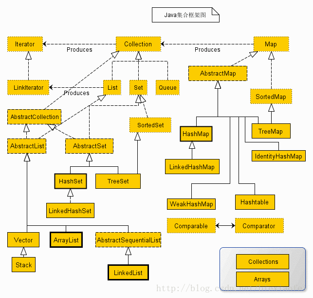

Collection是最基本的集合接口，一个Collection代表一组Object，即Collection的元素（Elements）

Collection下面又分了三个子接口，分别是Set,List和Queue

## Collection接口类

```java
public interface Collection<E> extends Iterable<E> {
    int size();
    boolean isEmpty();
    boolean contains(Object o);
    Iterator<E> iterator();
    Object[] toArray();
    <T> T[] toArray(T[] a);
    default <T> T[] toArray(IntFunction<T[]> generator) {
        return toArray(generator.apply(0));
    }
    boolean add(E e);
    boolean remove(Object o);
    boolean containsAll(Collection<?> c);
    boolean addAll(Collection<? extends E> c);
    boolean removeAll(Collection<?> c);
    default boolean removeIf(Predicate<? super E> filter) {
        Objects.requireNonNull(filter);
        boolean removed = false;
        final Iterator<E> each = iterator();
        while (each.hasNext()) {
            if (filter.test(each.next())) {
                each.remove();
                removed = true;
            }
        }
        return removed;
    }
    boolean retainAll(Collection<?> c);
    void clear();
    boolean equals(Object o);
    int hashCode();
    @Override
    default Spliterator<E> spliterator() {
        return Spliterators.spliterator(this, 0);
    }
    default Stream<E> stream() {
        return StreamSupport.stream(spliterator(), false);
    }

    default Stream<E> parallelStream() {
        return StreamSupport.stream(spliterator(), true);
    }
}
```

## Iterator 接口

用于遍历集合中元素的,只能向后遍历，无法修改修改

```java
public interface Iterator<E> {
    boolean hasNext();
    E next();

    default void remove() {
        throw new UnsupportedOperationException("remove");
    }

    // 为每个剩余元素执行给定的操作,直到所有的元素都已经被处理或行动将抛出一个异常
    default void forEachRemaining(Consumer<? super E> action) {
        Objects.requireNonNull(action);
        while (hasNext())
            action.accept(next());
    }
}

// 使用
Iterator it = collection.iterator();
while(it.hasNext()) {
	Object obj = it.next(); // 得到下一个元素
}
```

## ListIterator

1. 允许向前、向后两个方向遍历 List
2. 在遍历时修改 List 的元素
3. 遍历时获取迭代器当前游标所在位置

```java
public interface ListIterator<E> extends Iterator<E> {
    boolean hasNext();
    E next();

    boolean hasPrevious();
    E previous();

    int nextIndex();
    int previousIndex();

    void remove();
    void set(E e);
    void add(E e);
}
```
