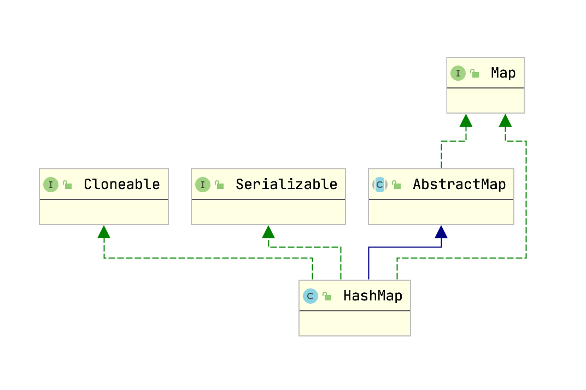
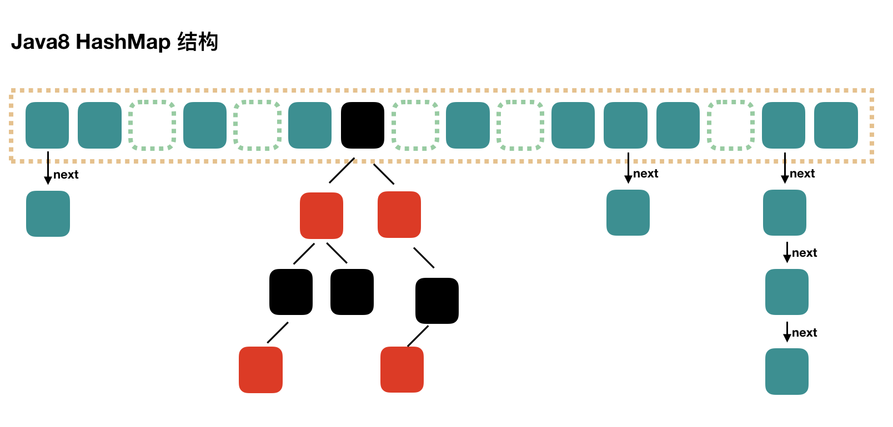
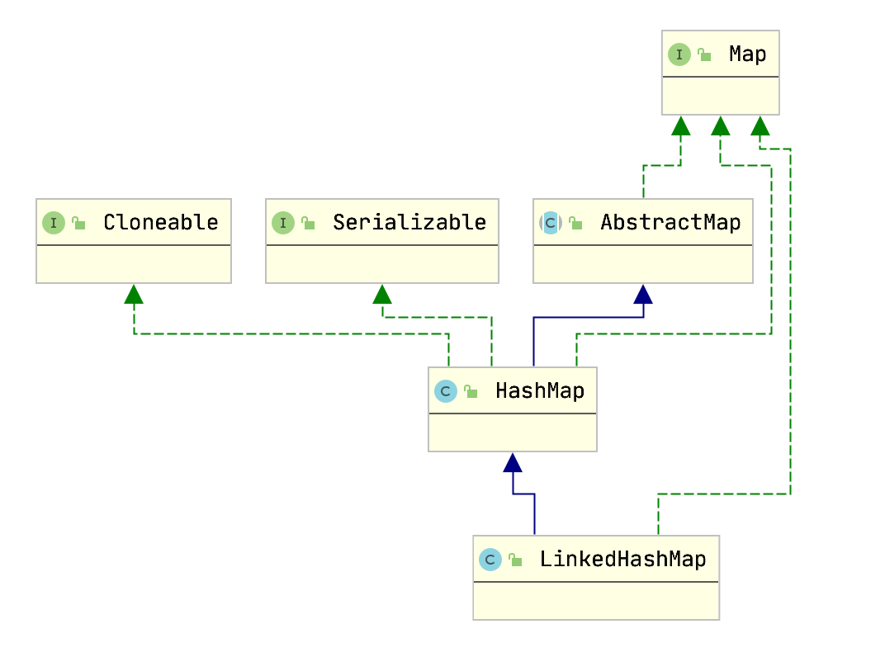

## Map.class

HashMap是Map接口基于哈希表的实现。
这种实现提供了所有可选的Map操作，并允许key和value为null（除了HashMap是unsynchronized的和允许使用null外，HashMap和HashTable大致相同。）。

不保证映射的顺序，特别是它不保证该顺序恒久不变。

此实现假设哈希函数在桶内适当地分布元素，为基本实现(get 和 put)提供了稳定的性能。迭代 collection 视图所需的时间与 HashMap 实例的“容量”（桶的数量）及其大小（键-值映射关系数）成比例。如果遍历操作很重要，就不要把初始化容量initial capacity设置得太高（或将加载因子load factor设置得太低），否则会严重降低遍历的效率。

HashMap有两个影响性能的重要参数：初始化容量 `initial capacity` 、加载因子 `load factor`。
* 容量是哈希表中桶的数量，初始容量只是哈希表在创建时的容量。
* 加载因子是哈希表在其容量自动增加之前可以达到多满的一种尺度。

initial capacity * load factor 就是当前允许的最大元素数目，超过initial capacity*load factor之后，HashMap就会进行rehashed操作来进行扩容，扩容后的的容量为之前的两倍。

通常，默认加载因子 (0.75) 在时间和空间成本上寻求一种折衷。加载因子过高虽然减少了空间开销，但同时也增加了查询成本（在大多数 HashMap类的操作中，包括 get 和 put 操作，都反映了这一点）。

在设置初始容量时应该考虑到映射中所需的条目数及其加载因子，以便最大限度地减少rehash操作次数。如果初始容量大于最大条目数除以加载因子，则不会发生rehash 操作。

如果很多映射关系要存储在 HashMap 实例中，则相对于按需执行自动的 rehash 操作以增大表的容量来说，使用足够大的初始容量创建它将使得映射关系能更有效地存储。
注意，此实现不是同步的。如果多个线程同时访问一个哈希映射，而其中至少一个线程从结构上修改了该映射，则它必须保持外部同步。（结构上的修改是指添加或删除一个或多个映射关系的任何操作；仅改变与实例已经包含的键关联的值不是结构上的修改。）这一般通过对自然封装该映射的对象进行同步操作来完成。

如果不存在这样的对象，则应该使用 Collections.synchronizedMap 方法来“包装”该映射。最好在创建时完成这一操作，以防止对映射进行意外的非同步访问，
如下所示： 
Map m = Collections.synchronizedMap(new HashMap(…));

由所有此类的“collection 视图方法”所返回的迭代器都是fail-fast 的：在迭代器创建之后，如果从结构上对映射进行修改，除非通过迭代器本身的remove方法，其他任何时间任何方式的修改，迭代器都将抛出 ConcurrentModificationException。

因此，面对并发的修改，迭代器很快就会完全失败，而不冒在将来不确定的时间发生任意不确定行为的风险。

注意，迭代器的快速失败行为不能得到保证，一般来说，存在非同步的并发修改时，不可能作出任何坚决的保证。快速失败迭代器尽最大努力抛出 ConcurrentModificationException。

因此，编写依赖于此异常的程序的做法是错误的，正确做法是：迭代器的快速失败行为应该仅用于检测bug。

```java
public interface Map<K, V> {
    int size();
    boolean isEmpty();
    boolean containsKey(Object key);
    boolean containsValue(Object value);
    V get(Object key);
    V put(K key, V value);
    V remove(Object key);
    void putAll(Map<? extends K, ? extends V> m);
    void clear();
    Set<K> keySet();
    Collection<V> values();
    Set<Map.Entry<K, V>> entrySet();
    boolean equals(Object o);
    int hashCode();

    interface Entry<K, V> {
        K getKey();
        V getValue();
        V setValue(V value);
        boolean equals(Object o);
        int hashCode();

        // 比较器
        public static <K extends Comparable<? super K>, V> Comparator<Map.Entry<K, V>> comparingByKey() {
            return (Comparator<Map.Entry<K, V>> & Serializable)
                (c1, c2) -> c1.getKey().compareTo(c2.getKey());
        }

        public static <K, V> Comparator<Map.Entry<K, V>> comparingByKey(Comparator<? super K> cmp) {
            Objects.requireNonNull(cmp);
            return (Comparator<Map.Entry<K, V>> & Serializable)
                (c1, c2) -> cmp.compare(c1.getKey(), c2.getKey());
        }

        public static <K, V> Comparator<Map.Entry<K, V>> comparingByValue(Comparator<? super V> cmp) {
            Objects.requireNonNull(cmp);
            return (Comparator<Map.Entry<K, V>> & Serializable)
                (c1, c2) -> cmp.compare(c1.getValue(), c2.getValue());
        }
    }
}
```

### 嵌套接口

* 它是逻辑分组仅在一个地方使用的接口的一种方式。
* 它增加了封装。
* 嵌套接口可以导致更易读和可维护的代码。
* 内部接口都是静态的

## HashMap.class

### 架构图



### 数据结构



### 源码

```java
public class HashMap<K,V> extends AbstractMap<K,V>
    implements Map<K,V>, Cloneable, Serializable {
    
    // 初始容器大小 16
    static final int DEFAULT_INITIAL_CAPACITY = 1 << 4;
    // 容器最大容量
    static final int MAXIMUM_CAPACITY = 1 << 30;
    // 负载因子
    static final float DEFAULT_LOAD_FACTOR = 0.75f;
    // 树化阀值
    static final int TREEIFY_THRESHOLD = 8;
    // 恢复成链式结构的桶大小临界值
    static final int UNTREEIFY_THRESHOLD = 6;
    // 当哈希表的大小超过这个阈值，才会把链式结构转化成树型结构，否则仅采取扩容来尝试减少冲突。
    // 应该至少 4 * TREEIFY_THRESHOLD 来避免扩容和树形结构化之间的冲突
    // 原因: 数组的性能好于数结构
    static final int MIN_TREEIFY_CAPACITY = 64;

    // 容器数组
    transient Node<K,V>[] table;
    transient Set<Map.Entry<K,V>> entrySet;
	// 实际存储的key-value键值对的个数
    transient int size;
    // 修改次数
    transient int modCount;
    // 临界值 threshold= capacity*loadFactory
    int threshold;
    // 加载因子默认为0.75, 实际元素比 大于loadFactor则扩容
    final float loadFactor;

    static class Node<K,V> implements Map.Entry<K,V> {
        final int hash;
        final K key;
        V value;
        Node<K,V> next;

        Node(int hash, K key, V value, Node<K,V> next) {
            this.hash = hash;
            this.key = key;
            this.value = value;
            this.next = next;
        }

        public final K getKey()        { return key; }
        public final V getValue()      { return value; }
        public final String toString() { return key + "=" + value; }

        public final int hashCode() {
            return Objects.hashCode(key) ^ Objects.hashCode(value);
        }

        public final V setValue(V newValue) {
            V oldValue = value;
            value = newValue;
            return oldValue;
        }

        public final boolean equals(Object o) {
            if (o == this)
                return true;
            if (o instanceof Map.Entry) {
                Map.Entry<?,?> e = (Map.Entry<?,?>)o;
                if (Objects.equals(key, e.getKey()) &&
                    Objects.equals(value, e.getValue()))
                    return true;
            }
            return false;
        }
    }

    // 构造函数 指定初始大小和负载因子
    public HashMap(int initialCapacity, float loadFactor) {
        if (initialCapacity < 0)
            throw new IllegalArgumentException("Illegal initial capacity: " +
                                               initialCapacity);
        if (initialCapacity > MAXIMUM_CAPACITY)
            initialCapacity = MAXIMUM_CAPACITY;
        if (loadFactor <= 0 || Float.isNaN(loadFactor))
            throw new IllegalArgumentException("Illegal load factor: " +
                                               loadFactor);
        this.loadFactor = loadFactor;
        // 计算临界值
        this.threshold = tableSizeFor(initialCapacity);
    }

    public HashMap(int initialCapacity) {
        this(initialCapacity, DEFAULT_LOAD_FACTOR);
    }

    public HashMap() {
        this.loadFactor = DEFAULT_LOAD_FACTOR; // all other fields defaulted
    }

    public HashMap(Map<? extends K, ? extends V> m) {
        this.loadFactor = DEFAULT_LOAD_FACTOR;
        putMapEntries(m, false);
    }

    static final int tableSizeFor(int cap) {
        int n = -1 >>> Integer.numberOfLeadingZeros(cap - 1);
        return (n < 0) ? 1 : (n >= MAXIMUM_CAPACITY) ? MAXIMUM_CAPACITY : n + 1;
    }

    // 添加值
    public V put(K key, V value) {
        // 计算key的hash值
        return putVal(hash(key), key, value, false, true);
    }

    final V putVal(int hash, K key, V value, boolean onlyIfAbsent, boolean evict) {
        Node<K,V>[] tab;
        Node<K,V> p; // hash 指向的节点
        int n, i; // n 是容器数组长度
        // 如果table为空或者长度为0 则扩容
        if ((tab = table) == null || (n = tab.length) == 0)
            n = (tab = resize()).length;

        // tab 当前位置为空，直接插入（多线程下容易数据被覆盖）
        if ((p = tab[i = (n - 1) & hash]) == null)
            tab[i] = newNode(hash, key, value, null);
        else {
            // hash 冲突
            Node<K,V> e; K k;
            // key 相同
            if (p.hash == hash && ((k = p.key) == key || (key != null && key.equals(k))))
                e = p;
            // key 不同且是使用红黑树处理冲突
            else if (p instanceof TreeNode)
                e = ((TreeNode<K,V>)p).putTreeVal(this, tab, hash, key, value);
            else {
                // 使用链表处理冲突
                // 遍历链表
                for (int binCount = 0; ; ++binCount) {
                    // 链表的尾端也没有找到key值相同的节点，则生成一个新的Node
                    if ((e = p.next) == null) {
                        p.next = newNode(hash, key, value, null);

                        // 是否树化
                        if (binCount >= TREEIFY_THRESHOLD - 1) // -1 for 1st
                            treeifyBin(tab, hash);
                        break;
                    }

                    // 找到相同的 key
                    if (e.hash == hash && ((k = e.key) == key || (key != null && key.equals(k))))
                        break;
                    p = e;
                }
            }

            if (e != null) { // existing mapping for key
                // 替换旧的值
                V oldValue = e.value;
                if (!onlyIfAbsent || oldValue == null)
                    e.value = value;
                afterNodeAccess(e);
                return oldValue;
            }
        }
        // 修改次数
        ++modCount;
        // 实际容量大于临界值 扩容
        if (++size > threshold)
            resize();
        afterNodeInsertion(evict);
        return null;
    }

    // 扩容并复制数据
    final Node<K,V>[] resize() {
        Node<K,V>[] oldTab = table;
        int oldCap = (oldTab == null) ? 0 : oldTab.length;
        int oldThr = threshold;
        int newCap, newThr = 0;
        // 容器实际容量大于0
        if (oldCap > 0) {
             // 判断当前Node的长度，如果当前长度超过 MAXIMUM_CAPACITY（最大容量值）
            if (oldCap >= MAXIMUM_CAPACITY) {
                // 新增阀值为 Integer.MAX_VALUE
                threshold = Integer.MAX_VALUE;
                return oldTab;
            }
            // 如果小于这个 MAXIMUM_CAPACITY（最大容量值），并且大于 DEFAULT_INITIAL_CAPACITY （默认16）
            else if ((newCap = oldCap << 1) < MAXIMUM_CAPACITY && oldCap >= DEFAULT_INITIAL_CAPACITY)
                // 2倍扩容
                newThr = oldThr << 1; // double threshold
        }
        else if (oldThr > 0) // initial capacity was placed in threshold
            // 指定新增阀值
            newCap = oldThr;
        else {               // zero initial threshold signifies using defaults
        // 如果数组为空
            //使用默认的加载因子(0.75)
            newCap = DEFAULT_INITIAL_CAPACITY;
             // 新增的阀值也就为 16 * 0.75 = 12
            newThr = (int)(DEFAULT_LOAD_FACTOR * DEFAULT_INITIAL_CAPACITY);
        }
        if (newThr == 0) {
            // 按照给定的初始大小计算扩容后的新增阀值
            float ft = (float)newCap * loadFactor;
            newThr = (newCap < MAXIMUM_CAPACITY && ft < (float)MAXIMUM_CAPACITY ?
                      (int)ft : Integer.MAX_VALUE);
        }
        // 扩容后的新增阀值
        threshold = newThr;

        // 扩容后的Node数组
        Node<K,V>[] newTab = (Node<K,V>[])new Node[newCap];
        table = newTab;
         // 如果数组不为空，将原数组中的元素放入扩容后的数组中
        if (oldTab != null) {
            for (int j = 0; j < oldCap; ++j) {
                Node<K,V> e;
                if ((e = oldTab[j]) != null) {
                    oldTab[j] = null;
                    // 如果节点为空，则直接计算在新数组中的位置，放入即可
                    if (e.next == null)
                        newTab[e.hash & (newCap - 1)] = e;
                    else if (e instanceof TreeNode)
                        // 拆分树节点
                        ((TreeNode<K,V>)e).split(this, newTab, j, oldCap);
                    else { // preserve order
                        // 如果节点不为空，且为单链表，则将原数组中单链表元素进行拆分
                        Node<K,V> loHead = null, loTail = null; // 保存在原有索引的链表
                        Node<K,V> hiHead = null, hiTail = null; // 保存在新索引的链表
                        Node<K,V> next;
                        do {
                            next = e.next;
                            // 哈希值和原数组长度进行&操作，为0则在原数组的索引位置
                            // 非0则在原数组索引位置+原数组长度的新位置
                            if ((e.hash & oldCap) == 0) {
                                if (loTail == null)
                                    loHead = e;
                                else
                                    loTail.next = e;
                                loTail = e;
                            }
                            else {
                                if (hiTail == null)
                                    hiHead = e;
                                else
                                    hiTail.next = e;
                                hiTail = e;
                            }
                        } while ((e = next) != null);
                        if (loTail != null) {
                            loTail.next = null;
                            newTab[j] = loHead;
                        }
                        if (hiTail != null) {
                            hiTail.next = null;
                            newTab[j + oldCap] = hiHead;
                        }
                    }
                }
            }
        }
        return newTab;
    }

    // 创建新的节点
    Node<K,V> newNode(int hash, K key, V value, Node<K,V> next) {
        return new Node<>(hash, key, value, next);
    }

    // hash函数
    // (1) 取key的hashCode值，h = key.hashCode()； 
    // (2) 高位参与运算，h ^ (h >>> 16)； 
    // (3) 取模运算，h & (length-1)。
    static final int hash(Object key) {
        int h;
        return (key == null) ? 0 : (h = key.hashCode()) ^ (h >>> 16);
    }

    // 红黑树结构实现 简略部分代码
    static final class TreeNode<K,V> extends LinkedHashMap.Entry<K,V> {
        TreeNode<K,V> parent;  // red-black tree links
        TreeNode<K,V> left;
        TreeNode<K,V> right;
        TreeNode<K,V> prev;    // needed to unlink next upon deletion
        boolean red;
        TreeNode(int hash, K key, V val, Node<K,V> next) {
            super(hash, key, val, next);
        }

        // 把放入红黑树中
        final TreeNode<K,V> putTreeVal(HashMap<K,V> map, Node<K,V>[] tab,
                                       int h, K k, V v) {
            Class<?> kc = null;
            boolean searched = false;
            TreeNode<K,V> root = (parent != null) ? root() : this;
            for (TreeNode<K,V> p = root;;) {
                int dir, ph; K pk;
                if ((ph = p.hash) > h)
                    dir = -1;
                else if (ph < h)
                    dir = 1;
                else if ((pk = p.key) == k || (k != null && k.equals(pk)))
                    return p;
                else if ((kc == null &&
                          (kc = comparableClassFor(k)) == null) ||
                         (dir = compareComparables(kc, k, pk)) == 0) {
                    if (!searched) {
                        TreeNode<K,V> q, ch;
                        searched = true;
                        if (((ch = p.left) != null &&
                             (q = ch.find(h, k, kc)) != null) ||
                            ((ch = p.right) != null &&
                             (q = ch.find(h, k, kc)) != null))
                            return q;
                    }
                    dir = tieBreakOrder(k, pk);
                }

                TreeNode<K,V> xp = p;
                if ((p = (dir <= 0) ? p.left : p.right) == null) {
                    Node<K,V> xpn = xp.next;
                    TreeNode<K,V> x = map.newTreeNode(h, k, v, xpn);
                    if (dir <= 0)
                        xp.left = x;
                    else
                        xp.right = x;
                    xp.next = x;
                    x.parent = x.prev = xp;
                    if (xpn != null)
                        ((TreeNode<K,V>)xpn).prev = x;
                    moveRootToFront(tab, balanceInsertion(root, x));
                    return null;
                }
            }
        }

        final TreeNode<K,V> getTreeNode(int h, Object k) {
            return ((parent != null) ? root() : this).find(h, k, null);
        }

        // 查找红黑树
        final TreeNode<K,V> find(int h, Object k, Class<?> kc) {
            TreeNode<K,V> p = this;
            do {
                int ph, dir; K pk;
                TreeNode<K,V> pl = p.left, pr = p.right, q;
                if ((ph = p.hash) > h)
                    p = pl;
                else if (ph < h)
                    p = pr;
                else if ((pk = p.key) == k || (k != null && k.equals(pk)))
                    return p;
                else if (pl == null)
                    p = pr;
                else if (pr == null)
                    p = pl;
                else if ((kc != null ||
                          (kc = comparableClassFor(k)) != null) &&
                         (dir = compareComparables(kc, k, pk)) != 0)
                    p = (dir < 0) ? pl : pr;
                else if ((q = pr.find(h, k, kc)) != null)
                    return q;
                else
                    p = pl;
            } while (p != null);
            return null;
        }
    }

    // 获取值
    public V get(Object key) {
        Node<K,V> e;
        return (e = getNode(hash(key), key)) == null ? null : e.value;
    }

    final Node<K,V> getNode(int hash, Object key) {
        Node<K,V>[] tab; 
        Node<K,V> first, e; 
        int n; 
        K k;

        // table不为空且长度大于0且值存在
        if ((tab = table) != null && (n = tab.length) > 0 && (first = tab[(n - 1) & hash]) != null) {
            // 先检查头结点
            if (first.hash == hash &&  ((k = first.key) == key || (key != null && key.equals(k))))
                return first;
            // 遍历
            if ((e = first.next) != null) {
                // 遍历红黑数
                if (first instanceof TreeNode)
                    return ((TreeNode<K,V>)first).getTreeNode(hash, key);
                do {
                    // 遍历链表
                    if (e.hash == hash && ((k = e.key) == key || (key != null && key.equals(k))))
                        return e;
                } while ((e = e.next) != null);
            }
        }
        return null;
    }

    // 数化
    final void treeifyBin(Node<K,V>[] tab, int hash) {
        int n, index; 
        Node<K,V> e;
        
        // 容器小于 MIN_TREEIFY_CAPACITY 扩容
        if (tab == null || (n = tab.length) < MIN_TREEIFY_CAPACITY)
            resize();
        else if ((e = tab[index = (n - 1) & hash]) != null) {
            // 树化操作
            TreeNode<K,V> hd = null, tl = null;
            do {
                TreeNode<K,V> p = replacementTreeNode(e, null);
                if (tl == null)
                    hd = p;
                else {
                    p.prev = tl;
                    tl.next = p;
                }
                tl = p;
            } while ((e = e.next) != null);
            if ((tab[index] = hd) != null)
                hd.treeify(tab);
        }
    }

}
```

### hash 

`tab[i = (n - 1) & hash]` 用来定位桶位置

`(n - 1) & hash` 位运算得到的值小于 (n-1)

### 为什么会hash冲突

就是根据key即经过一个函数f(key)得到的结果的作为地址去存放当前的key，value键值对(这个是hashmap的存值方式)，但是却发现算出来的地址上已经有数据。

hash冲突的几种情况:

* 两个节点的key值相同（hash值一定相同），导致冲突 
* 两个节点的key值不同，由于hash函数的局限性导致hash值相同，导致冲突 
* 两个节点的key值不同，hash值不同，但hash值对数组长度取模后相同，导致冲突 

#### 解决hash冲突
1. 开放寻址法--线性探测

当一个Key通过hash函数获得对应的数组下标已被占用的时候，就可以寻找下一个空档位置

2. 链表法
### 线程不安全的表现

在JDK1.8中，在并发执行put操作时会发生数据覆盖的情况

```java
if ((p = tab[i = (n - 1) & hash]) == null)
        tab[i] = newNode(hash, key, value, null);
```

发生场景:
1. 假设两个线程A、B都在进行put操作，并且hash函数计算出的插入下标是相同的
2. 当线程A执行完上面代码后由于时间片耗尽导致被挂起，而线程B得到时间片后在该下标处插入了元素，完成了正常的插入
3. 然后线程A获得时间片，由于之前已经进行了hash碰撞的判断，所有此时不会再进行判断，而是直接进行插入，

这就导致了线程B插入的数据被线程A覆盖了，从而线程不安全


## LinkedHashMap.class

* LinkedHashMap是继承于HashMap，是基于HashMap和双向链表来实现的。
* HashMap无序；LinkedHashMap有序，可分为插入顺序（先进先出）和访问顺序（最近最少）两种。    
如果是访问顺序，那put和get操作已存在的Entry时，都会把Entry移动到双向链表的表尾(其实是先删除再插入)。
* LinkedHashMap存取数据，还是跟HashMap一样使用的Entry[]的方式，双向链表只是为了保证顺序。
* LinkedHashMap是线程不安全的。

### 架构图



### 源码

```java
public class LinkedHashMap<K,V>
    extends HashMap<K,V>
    implements Map<K,V>
{
    transient LinkedHashMap.Entry<K,V> head;
    transient LinkedHashMap.Entry<K,V> tail;
    // 表示迭代顺序，true表示访问顺序，false表示插入顺序
    final boolean accessOrder;
}
```

#### put 方法

LinkedHashMap 没有重写put方法，所以还是调用HashMap得到put方法

```java

// HashMap.class
public V put(K key, V value) {
    return putVal(hash(key), key, value, false, true);
}

final V putVal(int hash, K key, V value, boolean onlyIfAbsent,
                boolean evict) {
    ...
    afterNodeInsertion(evict);
    return null;
}

void afterNodeInsertion(boolean evict) { }


// LinkedHashMap.class
void afterNodeInsertion(boolean evict) { // possibly remove eldest
    LinkedHashMap.Entry<K,V> first;
    if (evict && (first = head) != null && removeEldestEntry(first)) {
        K key = first.key;
        removeNode(hash(key), key, null, false, true);
    }
}

protected boolean removeEldestEntry(Map.Entry<K,V> eldest) {
    return false;
}
```

## 参考内容
[Java8 HashMap详解](https://www.cnblogs.com/myseries/p/10876828.html)