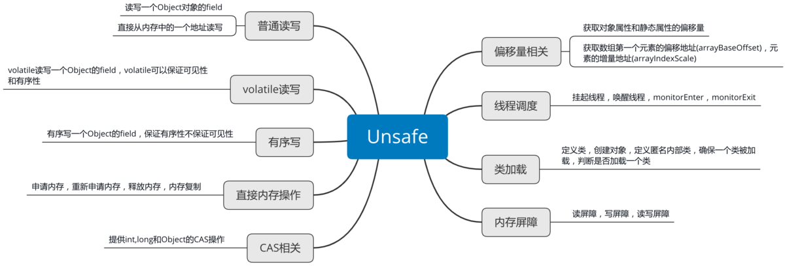

## 原子操作

`java.util.concurrent.atomic` 包提供了一种语法简单、性能高效、线程安全的更新一个变量的方式.

使用 `Unsafe` 实现的包装类

## Unsafe

Java中的Unsafe类为我们提供手动管理内存的能力

### 提供的功能图



### 源码

```java
public final class Unsafe {
    // 不允许外部初始化实例
    private Unsafe() {}

    // 单利模式
    private static final Unsafe theUnsafe = new Unsafe();
    public static Unsafe getUnsafe() {
        return theUnsafe;
    }

//// 普通读写
    // getInt用于从对象的指定偏移地址处读取一个int。putInt用于在对象指定偏移地址处写入一个int
    @HotSpotIntrinsicCandidate
    public native void putInt(Object o, long offset, int x);

    @HotSpotIntrinsicCandidate
    public native int getInt(Object o, long offset);

//// volatile 读写
    // 普通的读写无法保证可见性和有序性，而 volatile 读写就可以保证可见性和有序性

    // getIntVolatile 方法用于在对象指定偏移地址处volatile读取一个int
    @HotSpotIntrinsicCandidate
    public native int     getIntVolatile(Object o, long offset);

    // putIntVolatile 方法用于在对象指定偏移地址处volatile写入一个int
    @HotSpotIntrinsicCandidate
    public native void    putIntVolatile(Object o, long offset, int x);

//// 内存操作
    // 分配内存
    private native long allocateMemory0(long bytes);
    // 重新分配内存
    private native long reallocateMemory0(long address, long bytes);
    // 清除内存
    private native void freeMemory0(long address);
    // 内存初始化
    private native void setMemory0(Object o, long offset, long bytes, byte value);
    // 内存复制
    @HotSpotIntrinsicCandidate
    private native void copyMemory0(Object srcBase, long srcOffset, Object destBase, long destOffset, long bytes);
    private native void copySwapMemory0(Object srcBase, long srcOffset, Object destBase, long destOffset, long bytes, long elemSize);

//// CAS操作
    @HotSpotIntrinsicCandidate
    public final native boolean compareAndSetInt(Object o, long offset,
                                                 int expected,
                                                 int x);
    @HotSpotIntrinsicCandidate
    public final native boolean compareAndSetObject(Object o, long offset,
                                                    Object expected,
                                                    Object x);
    }

//// 偏移量相关
    // 获取静态属性Field在对象中的偏移量，读写静态属性时必须获取其偏移量
    private native long staticFieldOffset0(Field f);
    // 获取非静态属性Field在对象实例中的偏移量，读写对象的非静态属性时会用到这个偏移量
    private native long objectFieldOffset0(Field f);
    // 返回Field所在的对象
    private native Object staticFieldBase0(Field f);

//// 线程调度
    // 唤醒线程
    @HotSpotIntrinsicCandidate
    public native void unpark(Object thread);

    // 挂起线程
    @HotSpotIntrinsicCandidate
    public native void park(boolean isAbsolute, long time);

//// 类加载
    // 定义一个类，用于动态地创建类
    public native Class<?> defineClass0(String name, byte[] b, int off, int len,
                                        ClassLoader loader,
                                        ProtectionDomain protectionDomain);
    // 用于动态的创建一个匿名内部类
    private native Class<?> defineAnonymousClass0(Class<?> hostClass, byte[] data, Object[] cpPatches);

    // 用于创建一个类的实例，但是不会调用这个实例的构造方法，如果这个类还未被初始化，则初始化这个类
    @HotSpotIntrinsicCandidate
    public native Object allocateInstance(Class<?> cls) throws InstantiationException;

    // 用于判断是否需要初始化一个类
    private native boolean shouldBeInitialized0(Class<?> c);

    // 用于保证已经初始化过一个类
    private native void ensureClassInitialized0(Class<?> c);

//// 内存屏障
    // 保证在这个屏障之前的所有读操作都已经完成 禁止load重排序
    @HotSpotIntrinsicCandidate
    public native void loadFence();

    // 保证在这个屏障之前的所有写操作都已经完成 禁止store重排序
    @HotSpotIntrinsicCandidate
    public native void storeFence();

    // 保证在这个屏障之前的所有读写操作都已经完成 禁止store load重排序
    @HotSpotIntrinsicCandidate
    public native void fullFence();

//// 系统信息
    // 获取地址大小
    private native int addressSize0();

    // 页大小
    public native int pageSize();

//// 数组的偏移量
    public static final int ARRAY_INT_BASE_OFFSET = theUnsafe.arrayBaseOffset(int[].class)
    public static final int ARRAY_OBJECT_BASE_OFFSET = theUnsafe.arrayBaseOffset(Object[].class);

    // 第一个元素与数组对象两者间起始地址之差(首元素与对象头的相对偏移量）
    private native int arrayBaseOffset0(Class<?> arrayClass);
    // 相邻元素间相对偏移量的位移表示(返回值的二进制形式的有效位数是x，那么相邻元素的偏移量就是2的x次方)
    private native int arrayIndexScale0(Class<?> arrayClass);
}
```

## 基本类型

* `AtomicBoolean`
* `AtomicInteger`
* `AtomicLong`

### AtomicInteger.class

```java
public class AtomicInteger extends Number implements java.io.Serializable {
    private static final jdk.internal.misc.Unsafe U = jdk.internal.misc.Unsafe.getUnsafe();
    private static final long VALUE = U.objectFieldOffset(AtomicInteger.class, "value");

    private volatile int value;

    // 构造函数
    public AtomicInteger(int initialValue) {
        value = initialValue;
    }

    public AtomicInteger() {
    }

    public final int getAndIncrement() {
        return U.getAndAddInt(this, VALUE, 1);
    }
}

// 实现类
public final class Unsafe {
    @HotSpotIntrinsicCandidate
    public final int getAndAddInt(Object o, long offset, int delta) {
        int v;
        do {
            // 获取对象中偏移地址对应的值
            v = getIntVolatile(o, offset);
        } while (!weakCompareAndSetInt(o, offset, v, v + delta));
        return v;
    }

    @HotSpotIntrinsicCandidate
    public native int     getIntVolatile(Object o, long offset);

    @HotSpotIntrinsicCandidate
    public final boolean weakCompareAndSetInt(Object o, long offset,
                                              int expected,
                                              int x) {
        return compareAndSetInt(o, offset, expected, x);
    }

    @HotSpotIntrinsicCandidate
    public final native boolean compareAndSetInt(Object o, long offset,
                                                 int expected,
                                                 int x);
}
```

## 数组类型

* `AtomicIntegerArray`
* `AtomicLongArray`
* `AtomicReferenceArray<E>`

### AtomicIntegerArray.class

```java
public class AtomicIntegerArray implements java.io.Serializable {
    private static final long serialVersionUID = 2862133569453604235L;
    private static final VarHandle AA = MethodHandles.arrayElementVarHandle(int[].class);
    private final int[] array;

    // 创建数组
    public AtomicIntegerArray(int length) {
        array = new int[length];
    }

    // 复制数组，修改值不影响旧的数组
    public AtomicIntegerArray(int[] array) {
        this.array = array.clone();
    }

    // 获取i位置的值
    public final int get(int i) {
        return (int)AA.getVolatile(array, i);
    }

    // 将i位置的值设为newValue, 直接覆盖
    public final void set(int i, int newValue) {
        AA.setVolatile(array, i, newValue);
    }

    // cas 设置值
    public final boolean weakCompareAndSetVolatile(int i, int expectedValue, int newValue) {
        return AA.weakCompareAndSet(array, i, expectedValue, newValue);
    }
}
```

## 引用类型

* `AtomicReference`
* `AtomicReferenceFieldUpdater`
* `AtomicMarkableReference`

### AtomicReference.class

```java
public class AtomicReference<V> implements java.io.Serializable {
    private static final VarHandle VALUE;
    private volatile V value;

    public AtomicReference(V initialValue) {
        value = initialValue;
    }

    public AtomicReference() {
    }

    public final boolean compareAndSet(V expectedValue, V newValue) {
        return VALUE.compareAndSet(this, expectedValue, newValue);
    }
}
```

## 更新字段

* `AtomicLongFieldUpdater<T>`
* `AtomicIntegerFieldUpdater<T>`
* `AtomicStampedReference`

### AtomicIntegerFieldUpdater.class

```java
public abstract class AtomicIntegerFieldUpdater<T> {
    @CallerSensitive
    public static <U> AtomicIntegerFieldUpdater<U> newUpdater(Class<U> tclass,
                                                              String fieldName) {
        return new AtomicIntegerFieldUpdaterImpl<U>
            (tclass, fieldName, Reflection.getCallerClass());
    }

    public abstract boolean compareAndSet(T obj, int expect, int update);
}
```

`@CallerSensitive` 主要是针对于方法调用者所做的一些控制
