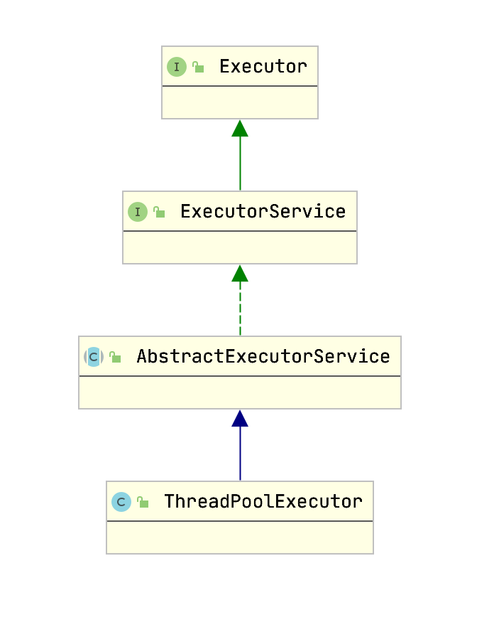
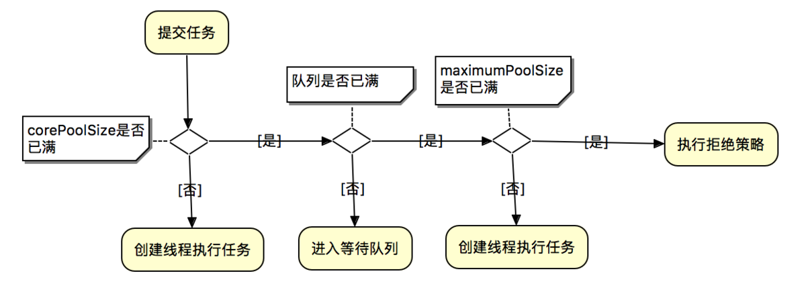
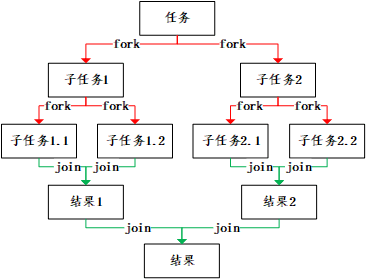
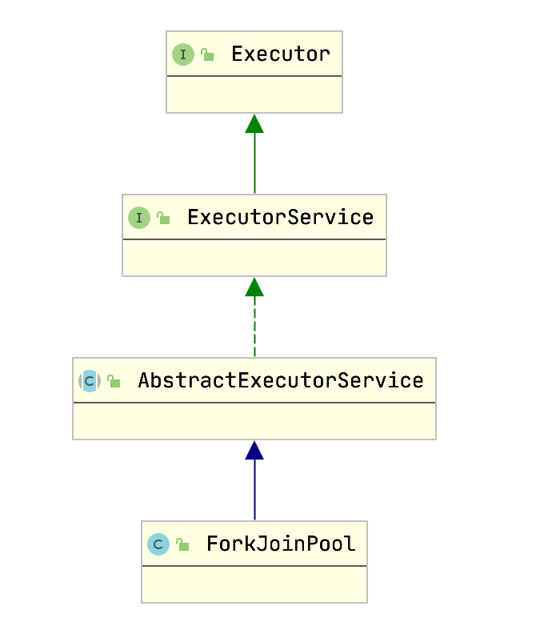

## 线程池简介
在使用线程池之后，创建线程变成了从线程池获得空闲线程，关闭线程变成了向线程池归还线程。  

好处:
* 降低资源消耗。通过重复利用已创建的线程降低线程创建和销毁造成的消耗。
* 提高响应速度。当任务到达时，任务可以不需要等到线程创建就能立即执行。
* 提高线程的可管理性。线程是稀缺资源，如果无限制的创建，不仅会消耗系统资源，还会降低系统的稳定性，使用线程池可以进行统一的分配，调优和监控。

### Executor 框架

java线程被一对一的映射成本地操作系统线程，操作系统会调度所有的线程并分配可用的CPU.


## 架构图


### 核心类
#### Executor.class
```java
public interface Executor {
    void execute(Runnable command);
}
```

是 `Executor` 框架的基础，将任务的提交和任务的执行分离开

#### ExecutorService.class
```java
public interface ExecutorService extends Executor {
    /**
     * 关闭执行器, 主要有以下特点:
     * 1. 已经提交给该执行器的任务将会继续执行, 但是不再接受新任务的提交;
     * 2. 如果执行器已经关闭了, 则再次调用没有副作用.
     */
    void shutdown();
    /**
     * 立即关闭执行器, 主要有以下特点:
     * 1. 尝试停止所有正在执行的任务, 无法保证能够停止成功, 但会尽力尝试(例如, 通过 Thread.interrupt中断任务, 但是不响应中断的任务可能无法终止);
     * 2. 暂停处理已经提交但未执行的任务;
     *
     * @return 返回已经提交但未执行的任务列表
     */
    List<Runnable> shutdownNow();

    // 如果该执行器已经关闭, 则返回true.
    boolean isShutdown();

    /**
     * 判断执行器是否已经【终止】.
     * <p>
     * 仅当执行器已关闭且所有任务都已经执行完成, 才返回true.
     * 注意: 除非首先调用 shutdown 或 shutdownNow, 否则该方法永远返回false.
     */
    boolean isTerminated();
    // 阻塞调用线程, 等待执行器到达【终止】状态.
    boolean awaitTermination(long timeout, TimeUnit unit)throws InterruptedException;

    // 提交一个具有返回值的任务用于执行.
    <T> Future<T> submit(Callable<T> task);
    // 提交一个 Runnable 任务用于执行.
    <T> Future<T> submit(Runnable task, T result);
    // 提交一个 Runnable 任务用于执行.
    Future<?> submit(Runnable task);

    // 执行给定集合中的所有任务, 当所有任务都执行完成后, 返回保持任务状态和结果的 Future 列表.
    <T> List<Future<T>> invokeAll(Collection<? extends Callable<T>> tasks)
        throws InterruptedException;

    // 执行给定集合中的所有任务, 当所有任务都执行完成后或超时期满时（无论哪个首先发生）, 返回保持任务状态和结果的 Future 列表
    <T> List<Future<T>> invokeAll(Collection<? extends Callable<T>> tasks,
                                  long timeout, TimeUnit unit)
        throws InterruptedException;
    // 执行给定集合中的任务, 只有其中某个任务率先成功完成（未抛出异常）, 则返回其结果. 一旦正常或异常返回后, 则取消尚未完成的任务.
    <T> T invokeAny(Collection<? extends Callable<T>> tasks)
        throws InterruptedException, ExecutionException;

    // 执行给定集合中的任务, 如果在给定的超时期满前, 某个任务已成功完成（未抛出异常）, 则返回其结果. 一旦正常或异常返回后, 则取消尚未完成的任务
    <T> T invokeAny(Collection<? extends Callable<T>> tasks,
                    long timeout, TimeUnit unit)
        throws InterruptedException, ExecutionException, TimeoutException;
}

```
继承 Executor，增强了对任务的控制，和对自身生命周期的管理

* 关闭线程池
* 监视执行器的状态
* 对异步的支持
* 对批处理任务的支持

#### AbstractExecutorService.class
```java
public abstract class AbstractExecutorService implements ExecutorService {
    protected <T> RunnableFuture<T> newTaskFor(Runnable runnable, T value) {
        return new FutureTask<T>(runnable, value);
    }

    protected <T> RunnableFuture<T> newTaskFor(Callable<T> callable) {
        return new FutureTask<T>(callable);
    }

    public Future<?> submit(Runnable task) {
        if (task == null) throw new NullPointerException();
        RunnableFuture<Void> ftask = newTaskFor(task, null);
        execute(ftask);
        return ftask;
    }

    public <T> Future<T> submit(Runnable task, T result) {
        if (task == null) throw new NullPointerException();
        RunnableFuture<T> ftask = newTaskFor(task, result);
        execute(ftask);
        return ftask;
    }

    public <T> Future<T> submit(Callable<T> task) {
        if (task == null) throw new NullPointerException();
        RunnableFuture<T> ftask = newTaskFor(task);
        execute(ftask);
        return ftask;
    }

    private <T> T doInvokeAny(Collection<? extends Callable<T>> tasks,
                              boolean timed, long nanos)
        throws InterruptedException, ExecutionException, TimeoutException {
        if (tasks == null)
            throw new NullPointerException();
        int ntasks = tasks.size();
        if (ntasks == 0)
            throw new IllegalArgumentException();
        ArrayList<Future<T>> futures = new ArrayList<>(ntasks);
        ExecutorCompletionService<T> ecs =
            new ExecutorCompletionService<T>(this);
        try {
            // Record exceptions so that if we fail to obtain any
            // result, we can throw the last exception we got.
            ExecutionException ee = null;
            final long deadline = timed ? System.nanoTime() + nanos : 0L;
            Iterator<? extends Callable<T>> it = tasks.iterator();

            // Start one task for sure; the rest incrementally
            futures.add(ecs.submit(it.next()));
            --ntasks;
            int active = 1;

            for (;;) {
                Future<T> f = ecs.poll();
                if (f == null) {
                    if (ntasks > 0) {
                        --ntasks;
                        futures.add(ecs.submit(it.next()));
                        ++active;
                    }
                    else if (active == 0)
                        break;
                    else if (timed) {
                        f = ecs.poll(nanos, NANOSECONDS);
                        if (f == null)
                            throw new TimeoutException();
                        nanos = deadline - System.nanoTime();
                    }
                    else
                        f = ecs.take();
                }
                if (f != null) {
                    --active;
                    try {
                        return f.get();
                    } catch (ExecutionException eex) {
                        ee = eex;
                    } catch (RuntimeException rex) {
                        ee = new ExecutionException(rex);
                    }
                }
            }

            if (ee == null)
                ee = new ExecutionException();
            throw ee;

        } finally {
            cancelAll(futures);
        }
    }

    public <T> T invokeAny(Collection<? extends Callable<T>> tasks)
        throws InterruptedException, ExecutionException {
        try {
            return doInvokeAny(tasks, false, 0);
        } catch (TimeoutException cannotHappen) {
            assert false;
            return null;
        }
    }

    public <T> T invokeAny(Collection<? extends Callable<T>> tasks,
                           long timeout, TimeUnit unit)
        throws InterruptedException, ExecutionException, TimeoutException {
        return doInvokeAny(tasks, true, unit.toNanos(timeout));
    }

    public <T> List<Future<T>> invokeAll(Collection<? extends Callable<T>> tasks)
        throws InterruptedException {
        if (tasks == null)
            throw new NullPointerException();
        ArrayList<Future<T>> futures = new ArrayList<>(tasks.size());
        try {
            for (Callable<T> t : tasks) {
                RunnableFuture<T> f = newTaskFor(t);
                futures.add(f);
                execute(f);
            }
            for (int i = 0, size = futures.size(); i < size; i++) {
                Future<T> f = futures.get(i);
                if (!f.isDone()) {
                    try { f.get(); }
                    catch (CancellationException | ExecutionException ignore) {}
                }
            }
            return futures;
        } catch (Throwable t) {
            cancelAll(futures);
            throw t;
        }
    }

    public <T> List<Future<T>> invokeAll(Collection<? extends Callable<T>> tasks,
                                         long timeout, TimeUnit unit)
        throws InterruptedException {
        if (tasks == null)
            throw new NullPointerException();
        final long nanos = unit.toNanos(timeout);
        final long deadline = System.nanoTime() + nanos;
        ArrayList<Future<T>> futures = new ArrayList<>(tasks.size());
        int j = 0;
        timedOut: try {
            for (Callable<T> t : tasks)
                futures.add(newTaskFor(t));

            final int size = futures.size();

            // Interleave time checks and calls to execute in case
            // executor doesn't have any/much parallelism.
            for (int i = 0; i < size; i++) {
                if (((i == 0) ? nanos : deadline - System.nanoTime()) <= 0L)
                    break timedOut;
                execute((Runnable)futures.get(i));
            }

            for (; j < size; j++) {
                Future<T> f = futures.get(j);
                if (!f.isDone()) {
                    try { f.get(deadline - System.nanoTime(), NANOSECONDS); }
                    catch (CancellationException | ExecutionException ignore) {}
                    catch (TimeoutException timedOut) {
                        break timedOut;
                    }
                }
            }
            return futures;
        } catch (Throwable t) {
            cancelAll(futures);
            throw t;
        }
        // Timed out before all the tasks could be completed; cancel remaining
        cancelAll(futures, j);
        return futures;
    }

    private static <T> void cancelAll(ArrayList<Future<T>> futures) {
        cancelAll(futures, 0);
    }

    private static <T> void cancelAll(ArrayList<Future<T>> futures, int j) {
        for (int size = futures.size(); j < size; j++)
            futures.get(j).cancel(true);
    }
}
```

`ExecutorService` 类的抽象实现

## ThreadPoolExecutor

`ThreadPoolExecutor` 是线程池的核心实现类，用来执行被提交的任务

### 结构图



### 执行流程



### ThreadPoolExecutor.class

```java
public class ThreadPoolExecutor extends AbstractExecutorService {
    
    private final AtomicInteger ctl = new AtomicInteger(ctlOf(RUNNING, 0));

    private final BlockingQueue<Runnable> workQueue;
    private volatile ThreadFactory threadFactory;
    private volatile RejectedExecutionHandler handler;
    private volatile long keepAliveTime;
    private volatile int corePoolSize;
    private volatile int maximumPoolSize;
    private static final RejectedExecutionHandler defaultHandler = new AbortPolicy();

    private int largestPoolSize;

    /**
     * @param corePoolSize 核心线程数
     * @param maximumPoolSize 最大线程数
     * @param keepAliveTime 线程活动保持时间
     * @param unit 时间单位
     * @param workQueue 排队策略
     * @param threadFactory 线程工厂
     * @param handler 拒绝策略
     */
    public ThreadPoolExecutor(int corePoolSize,
                              int maximumPoolSize,
                              long keepAliveTime,
                              TimeUnit unit,
                              BlockingQueue<Runnable> workQueue,
                              ThreadFactory threadFactory,
                              RejectedExecutionHandler handler) {
        if (corePoolSize < 0 ||
            maximumPoolSize <= 0 ||
            maximumPoolSize < corePoolSize ||
            keepAliveTime < 0)
            throw new IllegalArgumentException();
        if (workQueue == null || threadFactory == null || handler == null)
            throw new NullPointerException();
        this.corePoolSize = corePoolSize;
        this.maximumPoolSize = maximumPoolSize;
        this.workQueue = workQueue;
        this.keepAliveTime = unit.toNanos(keepAliveTime);
        this.threadFactory = threadFactory;
        this.handler = handler;
    }

    public void execute(Runnable command) {
        if (command == null)
            throw new NullPointerException();
        /*
         * Proceed in 3 steps:
         *
         * 1. If fewer than corePoolSize threads are running, try to
         * start a new thread with the given command as its first
         * task.  The call to addWorker atomically checks runState and
         * workerCount, and so prevents false alarms that would add
         * threads when it shouldn't, by returning false.
         *
         * 2. If a task can be successfully queued, then we still need
         * to double-check whether we should have added a thread
         * (because existing ones died since last checking) or that
         * the pool shut down since entry into this method. So we
         * recheck state and if necessary roll back the enqueuing if
         * stopped, or start a new thread if there are none.
         *
         * 3. If we cannot queue task, then we try to add a new
         * thread.  If it fails, we know we are shut down or saturated
         * and so reject the task.
         */
        int c = ctl.get();
        // 小于核心线程数，则创建线程并执行任务
        if (workerCountOf(c) < corePoolSize) {
            if (addWorker(command, true))
                return;
            c = ctl.get();
        }
        
        // 线程数>=核心线程数，将任务放入工作队列
        if (isRunning(c) && workQueue.offer(command)) {
            int recheck = ctl.get();
            if (! isRunning(recheck) && remove(command))
                reject(command);
            else if (workerCountOf(recheck) == 0)
                addWorker(null, false);
        }
        // 无法放入工作队列，执行拒绝策略
        else if (!addWorker(command, false))
            reject(command);
    }

    private boolean addWorker(Runnable firstTask, boolean core) {
        retry:
        for (int c = ctl.get();;) {
            // Check if queue empty only if necessary.
            if (runStateAtLeast(c, SHUTDOWN)
                    && (runStateAtLeast(c, STOP)
                    || firstTask != null
                    || workQueue.isEmpty()))
                return false;

            for (;;) {
                if (workerCountOf(c)
                    >= ((core ? corePoolSize : maximumPoolSize) & COUNT_MASK))
                    return false;
                if (compareAndIncrementWorkerCount(c))
                    break retry;
                c = ctl.get();  // Re-read ctl
                if (runStateAtLeast(c, SHUTDOWN))
                    continue retry;
                // else CAS failed due to workerCount change; retry inner loop
            }
        }

        // 线程启动标志位
        boolean workerStarted = false;
        // 线程是否加入workers 标志位
        boolean workerAdded = false;
        Worker w = null;
        try {
            // 创建 worker
            w = new Worker(firstTask);
            final Thread t = w.thread;
            if (t != null) {
                final ReentrantLock mainLock = this.mainLock;
                mainLock.lock();
                try {
                    // 获取到锁以后仍需检查ctl，可能在上一个获取到锁处理的线程可能会改变runState
                    // 如 ThreadFactory 创建失败 或线程池被 shut down等
                    int c = ctl.get();

                    if (isRunning(c) ||
                        (runStateLessThan(c, STOP) && firstTask == null)) {
                        if (t.getState() != Thread.State.NEW)
                            throw new IllegalThreadStateException();
                        // 加入到工作队列
                        workers.add(w);
                        workerAdded = true;
                        int s = workers.size();
                        if (s > largestPoolSize)
                            largestPoolSize = s;
                    }
                } finally {
                    mainLock.unlock();
                }
                if (workerAdded) {
                    // 启动线程
                    t.start();
                    // 已启动
                    workerStarted = true;
                }
            }
        } finally {
            // 线程加入失败
            if (! workerStarted)
                addWorkerFailed(w);
        }
        return workerStarted;
    }

    private static boolean isRunning(int c) {
        return c < SHUTDOWN;
    }

    public boolean remove(Runnable task) {
        boolean removed = workQueue.remove(task);
        tryTerminate(); // In case SHUTDOWN and now empty
        return removed;
    }

    // 拒绝策略
    final void reject(Runnable command) {
        handler.rejectedExecution(command, this);
    }

    public BlockingQueue<Runnable> getQueue() {
        return workQueue;
    }

    public ThreadFactory getThreadFactory() {
        return threadFactory;
    }

    // 关闭线程池
    public void shutdown() {
        final ReentrantLock mainLock = this.mainLock;
        mainLock.lock();
        try {
            checkShutdownAccess();
            advanceRunState(SHUTDOWN);
            interruptIdleWorkers();
            onShutdown(); // hook for ScheduledThreadPoolExecutor
        } finally {
            mainLock.unlock();
        }
        tryTerminate();
    }

    private void interruptIdleWorkers() {
        interruptIdleWorkers(false);
    }

    private void interruptIdleWorkers(boolean onlyOne) {
        final ReentrantLock mainLock = this.mainLock;
        mainLock.lock();
        try {
            // 遍历工作队列
            for (Worker w : workers) {
                Thread t = w.thread;
                if (!t.isInterrupted() && w.tryLock()) {
                    try {
                        t.interrupt();
                    } catch (SecurityException ignore) {
                    } finally {
                        w.unlock();
                    }
                }
                if (onlyOne)
                    break;
            }
        } finally {
            mainLock.unlock();
        }
    }

    // 执行任务
    final void runWorker(Worker w) {
        Thread wt = Thread.currentThread();
        Runnable task = w.firstTask;
        w.firstTask = null;
        w.unlock(); // allow interrupts
        boolean completedAbruptly = true;
        try {
            // loop 直至 task = null （线程池关闭、超时等）
            while (task != null || (task = getTask()) != null) {
                w.lock();
                // If pool is stopping, ensure thread is interrupted;
                // if not, ensure thread is not interrupted.  This
                // requires a recheck in second case to deal with
                // shutdownNow race while clearing interrupt
                if ((runStateAtLeast(ctl.get(), STOP) ||
                     (Thread.interrupted() &&
                      runStateAtLeast(ctl.get(), STOP))) &&
                    !wt.isInterrupted())
                    wt.interrupt();
                try {
                    beforeExecute(wt, task);
                    try {
                        task.run();
                        afterExecute(task, null);
                    } catch (Throwable ex) {
                        afterExecute(task, ex);
                        throw ex;
                    }
                } finally {
                    task = null;
                    w.completedTasks++;
                    w.unlock();
                }
            }
            completedAbruptly = false;
        } finally {
            processWorkerExit(w, completedAbruptly);
        }
    }

    // 从工作队列中返回一个任务
    private Runnable getTask() {
        // 最近一次 poll() 是否超时
        boolean timedOut = false;

        for (;;) {
            int c = ctl.get();

            // 是否继续处理任务
            if (runStateAtLeast(c, SHUTDOWN) && (runStateAtLeast(c, STOP) || workQueue.isEmpty())) {
                decrementWorkerCount();
                return null;
            }

            int wc = workerCountOf(c);

            // 是否允许超时
            boolean timed = allowCoreThreadTimeOut || wc > corePoolSize;

            if ((wc > maximumPoolSize || (timed && timedOut))
                && (wc > 1 || workQueue.isEmpty())) {
                if (compareAndDecrementWorkerCount(c))
                    return null;
                continue;
            }

            try {
                // 取出一个任务
                Runnable r = timed ?
                    workQueue.poll(keepAliveTime, TimeUnit.NANOSECONDS) :
                    workQueue.take();
                if (r != null)
                    return r;
                timedOut = true;
            } catch (InterruptedException retry) {
                timedOut = false;
            }
        }
    }

    private void processWorkerExit(Worker w, boolean completedAbruptly) {
        if (completedAbruptly) // If abrupt, then workerCount wasn't adjusted
            decrementWorkerCount();

        final ReentrantLock mainLock = this.mainLock;
        mainLock.lock();
        try {
            completedTaskCount += w.completedTasks;
            workers.remove(w);
        } finally {
            mainLock.unlock();
        }

        tryTerminate();

        int c = ctl.get();
        if (runStateLessThan(c, STOP)) {
            if (!completedAbruptly) {
                int min = allowCoreThreadTimeOut ? 0 : corePoolSize;
                if (min == 0 && ! workQueue.isEmpty())
                    min = 1;
                if (workerCountOf(c) >= min)
                    return; // replacement not needed
            }
            addWorker(null, false);
        }
    }

    protected void beforeExecute(Thread t, Runnable r) { }
    protected void afterExecute(Runnable r, Throwable t) { }
}
```

### Worker
```java
// Worker 实现了简单的 非重入互斥锁
private final class Worker
        extends AbstractQueuedSynchronizer
        implements Runnable
{
    private static final long serialVersionUID = 6138294804551838833L;

    // 每个worker有自己的内部线程，ThreadFactory创建失败时是null
    final Thread thread;
    // 初始化任务，可能是null
    Runnable firstTask;
    // 每个worker的完成任务数
    volatile long completedTasks;

    Worker(Runnable firstTask) {
        //  // 禁止线程在启动前被打断
        setState(-1);
        this.firstTask = firstTask;
        // 创建线程
        this.thread = getThreadFactory().newThread(this);
    }

    // 执行方法
    public void run() {
        runWorker(this);
    }

    // Lock methods
    //
    // The value 0 represents the unlocked state.
    // The value 1 represents the locked state.
    // state = 0 代表未锁；state = 1 代表已锁
    protected boolean isHeldExclusively() {
        return getState() != 0;
    }

    protected boolean tryAcquire(int unused) {
        if (compareAndSetState(0, 1)) {
            setExclusiveOwnerThread(Thread.currentThread());
            return true;
        }
        return false;
    }

    protected boolean tryRelease(int unused) {
        setExclusiveOwnerThread(null);
        setState(0);
        return true;
    }

    public void lock()        { acquire(1); }
    public boolean tryLock()  { return tryAcquire(1); }
    public void unlock()      { release(1); }
    public boolean isLocked() { return isHeldExclusively(); }

    void interruptIfStarted() {
        Thread t;
        if (getState() >= 0 && (t = thread) != null && !t.isInterrupted()) {
            try {
                t.interrupt();
            } catch (SecurityException ignore) {
            }
        }
    }
}
```

### 拒绝策略

```java
// 声明拒绝策略接口
public interface RejectedExecutionHandler {
    void rejectedExecution(Runnable r, ThreadPoolExecutor executor);
}

public static class AbortPolicy implements RejectedExecutionHandler {
    public AbortPolicy() { }
    // 直接抛出异常
    public void rejectedExecution(Runnable r, ThreadPoolExecutor e) {
        throw new RejectedExecutionException("Task " + r.toString() +
                                                " rejected from " +
                                                e.toString());
    }
}

public static class CallerRunsPolicy implements RejectedExecutionHandler {
    public CallerRunsPolicy() { }
    // 只用调用者所在线程来运行任务
    public void rejectedExecution(Runnable r, ThreadPoolExecutor e) {
        if (!e.isShutdown()) {
            r.run();
        }
    }
}

public static class DiscardPolicy implements RejectedExecutionHandler {
    public DiscardPolicy() { }
    // 不做处理，直接丢弃
    public void rejectedExecution(Runnable r, ThreadPoolExecutor e) {
    }
}

public static class DiscardOldestPolicy implements RejectedExecutionHandler {
    public DiscardOldestPolicy() { }
    // 丢弃工作队列最近的一个任务，并执行当前任务
    public void rejectedExecution(Runnable r, ThreadPoolExecutor e) {
        if (!e.isShutdown()) {
            // 移除队列头元素
            e.getQueue().poll();
            // 执行任务
            e.execute(r);
        }
    }
}
```

### 任务队列

* ArrayBlockingQueue 基于数组结构的有界阻塞队列FIFO
* LinkedBlockingQueue 基于链表结构的阻塞队列
* SynchronousQueue 不存储元素的阻塞队列，每个插入操作必须等到另一个线程调用移除
* PriorityBlockingQueue 具有优先级的无限阻塞队列

### 合理的配置线程池

* CPU密集型 N+1
* IO密集型 2*N
* 混合型

## Executors

```java
// 默认的线程工厂
public static ThreadFactory defaultThreadFactory() {
    return new DefaultThreadFactory();
}

private static class DefaultThreadFactory implements ThreadFactory {
    private static final AtomicInteger poolNumber = new AtomicInteger(1);
    private final ThreadGroup group;
    private final AtomicInteger threadNumber = new AtomicInteger(1);
    private final String namePrefix;

    DefaultThreadFactory() {
        SecurityManager s = System.getSecurityManager();
        // 线程组
        group = (s != null) ? s.getThreadGroup() : Thread.currentThread().getThreadGroup();
        namePrefix = "pool-" +
                        poolNumber.getAndIncrement() +
                        "-thread-";
    }

    public Thread newThread(Runnable r) {
        Thread t = new Thread(group, r,
                                namePrefix + threadNumber.getAndIncrement(),
                                0);
        if (t.isDaemon())
            t.setDaemon(false);
        if (t.getPriority() != Thread.NORM_PRIORITY)
            t.setPriority(Thread.NORM_PRIORITY);
        return t;
    }
}
```

### FixedThreadPool

创建定长的线程池

```java
public static ExecutorService newFixedThreadPool(int nThreads) {
    // 核心线程数和最大线程数相等，使用默认的线程工厂，基于链表的阻塞队列, 0L:空闲线程会立即终止
    return new ThreadPoolExecutor(nThreads, nThreads,
                                      0L, TimeUnit.MILLISECONDS,
                                      new LinkedBlockingQueue<Runnable>());
}
```

### SingleThreadExecutor

创建只有一个线程的线程池

```java
public static ExecutorService newSingleThreadExecutor() {
    return new FinalizableDelegatedExecutorService
        (new ThreadPoolExecutor(1, 1,
                                0L, TimeUnit.MILLISECONDS,
                                new LinkedBlockingQueue<Runnable>()));
}
```

### CachedThreadPool

可缓存线程池

```java
public static ExecutorService newCachedThreadPool() {
    return new ThreadPoolExecutor(0, Integer.MAX_VALUE,
                                    60L, TimeUnit.SECONDS,
                                    new SynchronousQueue<Runnable>());
}
```

### ScheduledThreadPool

创建一个定长线程池，支持定时及周期性任务执行

```java
public static ScheduledExecutorService newScheduledThreadPool(int corePoolSize, 
        ThreadFactory threadFactory) {
    return new ScheduledThreadPoolExecutor(corePoolSize, threadFactory);
}
```

### WorkStealingPool

基于工作窃取模式的线程池

```java
public static final ForkJoinWorkerThreadFactory defaultForkJoinWorkerThreadFactory 
        = new DefaultForkJoinWorkerThreadFactory();

public static ExecutorService newWorkStealingPool() {
    return new ForkJoinPool
        // 默认cpu核心数
        (Runtime.getRuntime().availableProcessors(),
            ForkJoinPool.defaultForkJoinWorkerThreadFactory,
            null, true);
}

// 指定cpu核心数
public static ExecutorService newWorkStealingPool(int parallelism) {
    return new ForkJoinPool
        (parallelism,
            ForkJoinPool.defaultForkJoinWorkerThreadFactory,
            null, true);
}
```

## Fork/Join 框架



核心思想是将大的任务拆分成多个小任务（即fork），然后在将多个小任务处理汇总到一个结果上

提供基本的线程池功能，支持设置最大并发线程数，支持任务排队，支持线程池停止，支持线程池使用情况监控，也是AbstractExecutorService的子类，主要引入了“工作窃取”机制，在多CPU计算机上处理性能更佳


* ForkJoinPool 

用于执行ForkJoinTask任务的执行池， 维护一个队列数组WorkQueue

* WorkQueue

双向列表,用于任务的有序执行,如果WorkQueue用于自己的执行线程Thread,线程默认将会从top端选取任务用来执行 - LIFO

因为只有owner的Thread才能从top端取任务,所以在设置变量时, int top; 不需要使用 volatile

* ForkJoinWorkThread

用于执行任务的线程,用于区别使用非ForkJoinWorkThread线程提交的task;启动一个该Thread,会自动注册一个WorkQueue到Pool,这里规定,拥有Thread的WorkQueue只能出现在WorkQueue数组的奇数位

* ForkJoinTask

任务, 它比传统的任务更加轻量，不再对是RUNNABLE的子类,提供fork/join方法用于分割任务以及聚合结果


### Work-Stealing 工作窃取算法

### ForkJoinTask

ForkJoinTask需要通过ForkJoinPool来执行

ForkJoinTask可以理解为类线程但比线程轻量的实体, 在ForkJoinPool中运行的少量ForkJoinWorkerThread可以持有大量的ForkJoinTask和它的子任务.

ForkJoinTask同时也是一个轻量的Future,使用时应避免较长阻塞和io

使用ForkJoin框架，必须首先创建一个ForkJoin任务，提供在任务中执行fork()和join()操作的机制.

子类:

* RecursiveAction 用于没有返回结果的任务
* RecursiveTask 用于有返回结果的任务。

> Recursive [rɪˈkɜːsɪv]

#### RecursiveTask.class

有返回值

```java
public abstract class RecursiveTask<V> extends ForkJoinTask<V> {
    private static final long serialVersionUID = 5232453952276485270L;

    /**
     * The result of the computation.
     */
    V result;

    // 子类重写此方法
    protected abstract V compute();

    public final V getRawResult() {
        return result;
    }

    protected final void setRawResult(V value) {
        result = value;
    }

    protected final boolean exec() {
        result = compute();
        return true;
    }

}
```

#### RecursiveAction.class

没有返回值

```java
public abstract class RecursiveAction extends ForkJoinTask<Void> {
    protected abstract void compute();
    public final Void getRawResult() { return null; }

    protected final void setRawResult(Void mustBeNull) { }

    protected final boolean exec() {
        compute();
        return true;
    }
}
```
`RecursiveAction` 和 `RecursiveTask`

#### ForkJoinTask.class

```java
public abstract class ForkJoinTask<V> implements Future<V>, Serializable {
    volatile int status;

    // 分割函数
    public final ForkJoinTask<V> fork() {
        Thread t;
        if ((t = Thread.currentThread()) instanceof ForkJoinWorkerThread)
            // 放入队列
            ((ForkJoinWorkerThread)t).workQueue.push(this);
        else
            ForkJoinPool.common.externalPush(this);
        return this;
    }

    public final V join() {
        int s;
        if (((s = doJoin()) & ABNORMAL) != 0)
            reportException(s);
        return getRawResult();
    }

    public abstract V getRawResult();

    // 获取当前任务的状态来判断返回什么结果
    private int doJoin() {
        int s; Thread t; ForkJoinWorkerThread wt; ForkJoinPool.WorkQueue w;

        // 如果执行完毕，返回任务状态
        return (s = status) < 0 ? s :
            ((t = Thread.currentThread()) instanceof ForkJoinWorkerThread) ?
            // 从任务数组里取出任务执行
            (w = (wt = (ForkJoinWorkerThread)t).workQueue).
            tryUnpush(this) && (s = doExec()) < 0 ? s :
            // 
            wt.pool.awaitJoin(w, this, 0L) :
            externalAwaitDone();
    }

    final int doExec() {
        int s; boolean completed;
        if ((s = status) >= 0) {
            try {
                completed = exec();
            } catch (Throwable rex) {
                completed = false;
                s = setExceptionalCompletion(rex);
            }
            if (completed)
                s = setDone();
        }
        return s;
    }

    protected abstract boolean exec();

    private int setDone() {
        int s;
        if (((s = (int)STATUS.getAndBitwiseOr(this, DONE)) & SIGNAL) != 0)
            synchronized (this) { notifyAll(); }
        return s | DONE;
    }

    // 适配器
    static final class RunnableExecuteAction extends ForkJoinTask<Void> {
        final Runnable runnable;
        RunnableExecuteAction(Runnable runnable) {
            if (runnable == null) throw new NullPointerException();
            this.runnable = runnable;
        }
        public final Void getRawResult() { return null; }
        public final void setRawResult(Void v) { }
        public final boolean exec() { runnable.run(); return true; }
        void internalPropagateException(Throwable ex) {
            rethrow(ex); // rethrow outside exec() catches.
        }
        private static final long serialVersionUID = 5232453952276885070L;
    }
}
```

### ForkJoinPool.class

ForkJoinTask需要通过ForkJoinPool来执行，任务分割出的子任务会添加到当前工作线程所维护的双端队列中，进入队列的头部

#### 结构图



#### 原理

```java
public class ForkJoinPool extends AbstractExecutorService {
    public static interface ForkJoinWorkerThreadFactory {
        public ForkJoinWorkerThread newThread(ForkJoinPool pool);
    }

    // 线程工厂
    private static final class DefaultForkJoinWorkerThreadFactory implements ForkJoinWorkerThreadFactory {

        private static final AccessControlContext ACC = contextWithPermissions(
            new RuntimePermission("getClassLoader"),
            new RuntimePermission("setContextClassLoader"));

        // 创建 ForkJoinWorkerThread 线程
        public final ForkJoinWorkerThread newThread(ForkJoinPool pool) {
            return AccessController.doPrivileged(
                new PrivilegedAction<>() {
                    public ForkJoinWorkerThread run() {
                        return new ForkJoinWorkerThread(
                            pool, ClassLoader.getSystemClassLoader()); }},
                ACC);
        }
    }

    // 工作队列
    @jdk.internal.vm.annotation.Contended
    static final class WorkQueue {

        final void push(ForkJoinTask<?> task) {
            ForkJoinTask<?>[] a;
            int s = top, d, cap, m;
            ForkJoinPool p = pool;
            if ((a = array) != null && (cap = a.length) > 0) {
                // 放入ForkJoinTask数组队列里
                QA.setRelease(a, (m = cap - 1) & s, task);
                top = s + 1;
                if (((d = s - (int)BASE.getAcquire(this)) & ~1) == 0 && p != null) {                 // size 0 or 1
                    VarHandle.fullFence();
                    // 唤醒或创建一个工作线程执行任务
                    p.signalWork();
                }
                else if (d == m)
                    growArray(false);
            }
        }
    }

    public void execute(ForkJoinTask<?> task) {
        externalSubmit(task);
    }

    public void execute(Runnable task) {
        if (task == null)
            throw new NullPointerException();
        ForkJoinTask<?> job;
        if (task instanceof ForkJoinTask<?>) // avoid re-wrap
            job = (ForkJoinTask<?>) task;
        else
            // 转换成 ForkJoinTask
            job = new ForkJoinTask.RunnableExecuteAction(task);
        externalSubmit(job);
    }

    private <T> ForkJoinTask<T> externalSubmit(ForkJoinTask<T> task) {
        Thread t; ForkJoinWorkerThread w; WorkQueue q;
        if (task == null)
            throw new NullPointerException();
        if (((t = Thread.currentThread()) instanceof ForkJoinWorkerThread) &&
            (w = (ForkJoinWorkerThread)t).pool == this &&
            (q = w.workQueue) != null)
            // 放入工作队列中
            q.push(task);
        else
            externalPush(task);
        return task;
    }

    final void externalPush(ForkJoinTask<?> task) {
        int r;                                // initialize caller's probe
        if ((r = ThreadLocalRandom.getProbe()) == 0) {
            ThreadLocalRandom.localInit();
            r = ThreadLocalRandom.getProbe();
        }
        for (;;) {
            WorkQueue q;
            int md = mode, n;
            WorkQueue[] ws = workQueues;
            if ((md & SHUTDOWN) != 0 || ws == null || (n = ws.length) <= 0)
                throw new RejectedExecutionException();
            else if ((q = ws[(n - 1) & r & SQMASK]) == null) { // add queue
                int qid = (r | QUIET) & ~(FIFO | OWNED);
                Object lock = workerNamePrefix;
                ForkJoinTask<?>[] qa =
                    new ForkJoinTask<?>[INITIAL_QUEUE_CAPACITY];
                q = new WorkQueue(this, null);
                q.array = qa;
                q.id = qid;
                q.source = QUIET;
                if (lock != null) {     // unless disabled, lock pool to install
                    synchronized (lock) {
                        WorkQueue[] vs; int i, vn;
                        if ((vs = workQueues) != null && (vn = vs.length) > 0 &&
                            vs[i = qid & (vn - 1) & SQMASK] == null)
                            vs[i] = q;  // else another thread already installed
                    }
                }
            }
            else if (!q.tryLockPhase()) // move if busy
                r = ThreadLocalRandom.advanceProbe(r);
            else {
                if (q.lockedPush(task))
                    signalWork();
                return;
            }
        }
    }

    // 唤醒或创建一个工作线程执行任务
    final void signalWork() {
        for (;;) {
            long c; int sp; WorkQueue[] ws; int i; WorkQueue v;
            if ((c = ctl) >= 0L)                      // enough workers
                break;
            else if ((sp = (int)c) == 0) {            // no idle workers
                if ((c & ADD_WORKER) != 0L)           // too few workers
                    tryAddWorker(c);
                break;
            }
            else if ((ws = workQueues) == null)
                break;                                // unstarted/terminated
            else if (ws.length <= (i = sp & SMASK))
                break;                                // terminated
            else if ((v = ws[i]) == null)
                break;                                // terminating
            else {
                int np = sp & ~UNSIGNALLED;
                int vp = v.phase;
                long nc = (v.stackPred & SP_MASK) | (UC_MASK & (c + RC_UNIT));
                Thread vt = v.owner;
                if (sp == vp && CTL.compareAndSet(this, c, nc)) {
                    v.phase = np;
                    if (vt != null && v.source < 0)
                        // 唤醒工作线程
                        LockSupport.unpark(vt);
                    break;
                }
            }
        }
    }

    private void tryAddWorker(long c) {
        do {
            long nc = ((RC_MASK & (c + RC_UNIT)) |
                       (TC_MASK & (c + TC_UNIT)));
            if (ctl == c && CTL.compareAndSet(this, c, nc)) {
                createWorker();
                break;
            }
        } while (((c = ctl) & ADD_WORKER) != 0L && (int)c == 0);
    }

    // 创建工作线程
    private boolean createWorker() {
        ForkJoinWorkerThreadFactory fac = factory;
        Throwable ex = null;
        ForkJoinWorkerThread wt = null;
        try {
            if (fac != null && (wt = fac.newThread(this)) != null) {
                wt.start();
                return true;
            }
        } catch (Throwable rex) {
            ex = rex;
        }
        deregisterWorker(wt, ex);
        return false;
    }

    final void runWorker(WorkQueue w) {
        int r = (w.id ^ ThreadLocalRandom.nextSecondarySeed()) | FIFO; // rng
        w.array = new ForkJoinTask<?>[INITIAL_QUEUE_CAPACITY]; // initialize
        for (;;) {
            int phase;
            if (scan(w, r)) {                     // scan until apparently empty
                r ^= r << 13; r ^= r >>> 17; r ^= r << 5; // move (xorshift)
            }
            else if ((phase = w.phase) >= 0) {    // enqueue, then rescan
                long np = (w.phase = (phase + SS_SEQ) | UNSIGNALLED) & SP_MASK;
                long c, nc;
                do {
                    w.stackPred = (int)(c = ctl);
                    nc = ((c - RC_UNIT) & UC_MASK) | np;
                } while (!CTL.weakCompareAndSet(this, c, nc));
            }
            else {                                // already queued
                int pred = w.stackPred;
                Thread.interrupted();             // clear before park
                w.source = DORMANT;               // enable signal
                long c = ctl;
                int md = mode, rc = (md & SMASK) + (int)(c >> RC_SHIFT);
                if (md < 0)                       // terminating
                    break;
                else if (rc <= 0 && (md & SHUTDOWN) != 0 &&
                         tryTerminate(false, false))
                    break;                        // quiescent shutdown
                else if (rc <= 0 && pred != 0 && phase == (int)c) {
                    long nc = (UC_MASK & (c - TC_UNIT)) | (SP_MASK & pred);
                    long d = keepAlive + System.currentTimeMillis();
                    LockSupport.parkUntil(this, d);
                    if (ctl == c &&               // drop on timeout if all idle
                        d - System.currentTimeMillis() <= TIMEOUT_SLOP &&
                        CTL.compareAndSet(this, c, nc)) {
                        w.phase = QUIET;
                        break;
                    }
                }
                else if (w.phase < 0)
                    LockSupport.park(this);       // OK if spuriously woken
                w.source = 0;                     // disable signal
            }
        }
    }
}
```

#### ForkJoinWorkerThread.class

```java
public class ForkJoinWorkerThread extends Thread {
    final ForkJoinPool pool;
    final ForkJoinPool.WorkQueue workQueue;

    protected ForkJoinWorkerThread(ForkJoinPool pool) {
        super("aForkJoinWorkerThread");
        this.pool = pool;
        this.workQueue = pool.registerWorker(this);
    }

    public ForkJoinPool getPool() {
        return pool;
    }

    public int getPoolIndex() {
        return workQueue.getPoolIndex();
    }

    public void run() {
        if (workQueue.array == null) { // only run once
            Throwable exception = null;
            try {
                onStart();
                pool.runWorker(workQueue);
            } catch (Throwable ex) {
                exception = ex;
            } finally {
                try {
                    onTermination(exception);
                } catch (Throwable ex) {
                    if (exception == null)
                        exception = ex;
                } finally {
                    pool.deregisterWorker(this, exception);
                }
            }
        }
    }

    protected void onStart() {
    }

    protected void onTermination(Throwable exception) {
    }
}
```