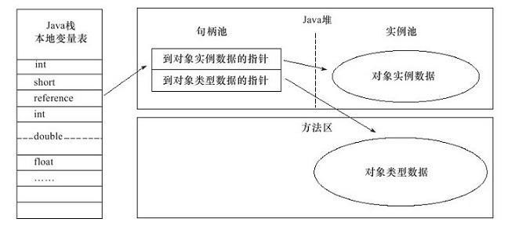
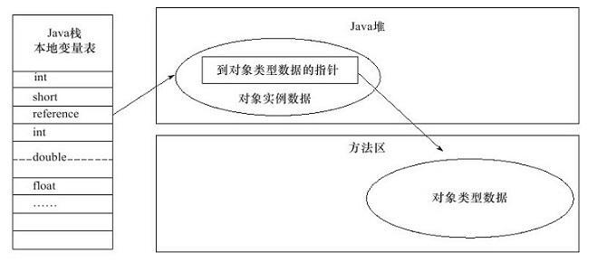
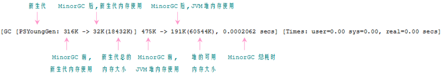
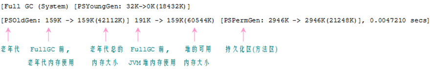
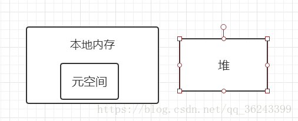

## jvm类加载过程

> JVM把class文件加载到内存里面，并对数据进行校验、准备、解析和初始化，最终能够被形成被JVM可以直接使用的Java类型的过程。

### 加载

1. 将class文件加载在内存中。
2. 将静态数据结构(数据存在于class文件的结构)转化成方法区中运行时的数据结构(数据存在于JVM时的数据结构)。
3. 在堆中生成一个代表这个类的java.lang.Class对象，作为数据访问的入口。  

### 验证

确保Class文件的字节流中包含的信息是否符合当前虚拟机的要求，并且不会危害虚拟机自身的安全
### 准备

为类变量分配内存并设置类变量的初始值阶段，即在方法区中分配这些变量所使用的内存空间
### 解析

指虚拟机将常量池中的符号引用替换为直接引用的过程

> 符号引用与虚拟机实现的布局无关，引用的目标并不一定要已经加载到内存中。各种虚拟机实现的内存布局可以各不相同，但是它们能接受的符号引用必须是一致的，因为符号引用的字面量形式明确定义在Java虚拟机规范的Class文件格式中。

> 直接引用可以是指向目标的指针，相对偏移量或是一个能间接定位到目标的句柄。如果有了直接引用，那引用的目标必定已经在内存中存在。

### 初始化

初始化阶段是类加载最后一个阶段，前面的类加载阶段之后，除了在加载阶段可以自定义类加载器以外，其它操作都由JVM主导。到了初始阶段，才开始真正执行类中定义的Java程序代码。

注意以下几种情况不会执行类初始化：

1. 通过子类引用父类的静态字段，只会触发父类的初始化，而不会触发子类的初始化。
2. 定义对象数组，不会触发该类的初始化。
3. 常量在编译期间会存入调用类的常量池中，本质上并没有直接引用定义常量的类，不会触发定义常量所在的类。
4. 通过类名获取Class对象，不会触发类的初始化。
5. 通过Class.forName加载指定类时，如果指定参数initialize为false时，也不会触发类初始化，其实这个参数是告诉虚拟机，是否要对类进行初始化。
6. 通过ClassLoader默认的loadClass方法，也不会触发初始化动作。

## 类加载器

虚拟机设计团队把加载动作放到JVM外部实现，以便让应用程序决定如何获取所需的类，JVM提供了3种类加载器：  

1. 启动类加载器(Bootstrap ClassLoader)：负责加载 JAVA_HOME\lib 目录中的，或通过-Xbootclasspath参数指定路径中的，且被虚拟机认可（按文件名识别，如rt.jar）的类。
2. 扩展类加载器(Extension ClassLoader)：负责加载 JAVA_HOME\lib\ext 目录中的，或通过java.ext.dirs系统变量指定路径中的类库。
3. 应用程序类加载器(Application ClassLoader)：负责加载用户路径（classpath）上的类库。
    JVM通过双亲委派模型进行类的加载，当然我们也可以通过继承java.lang.ClassLoader实现自定义的类加载器。
      
    当一个类加载器收到类加载任务，会先交给其父类加载器去完成，因此最终加载任务都会传递到顶层的启动类加载器，只有当父类加载器无法完成加载任务时，才会尝试执行加载任务。  
### 采用双亲委派的好处  
> 1. 采用双亲委派的一个好处是比如加载位于rt.jar包中的类java.lang.Object，不管是哪个加载器加载这个类，最终都是委托给顶层的启动类加载器进行加载，这样就保证了使用不同的类加载器最终得到的都是同样一个Object对象，避免类的重复加载  
> 2. 防止核心API库被随意篡改

## jvm 对象分配内存

### 指针碰撞方法

> 这种方法是在java堆中，将已用内存和未用的内存分开成两部分，两部分内存之间放这一个指针作为分界点，当有新的实例对象需要分配内存空间时，指针向未用内存一侧移动相应大小的距离，将新的实例对象存储在该内存空间上。这种方式需要内存是规整的。

### 空闲列表方法

> 这种方法分配空间是随机，每次分配内存空间都是从空闲的内存中选取一块分配给实例对象。那么就需要一个列表来存放这些空闲的内存空间地址，每当有实例对象需要空间，就从这个列表中选取出一块内存分配给实例对象。这种情况下内存是不规则的。

>两种方法的选择取决于内存的结构是否规整，而内存结构是否规整则取决于采用的垃圾回收器是否带有压缩整理功能。

例如：Serial、ParNew等带有compact过程的收集器，就是带有压缩整理功能的
     CMS这种基于Mark—Sweep算法的收集器就是没有压缩整理功能的
#### 处理多线程内存覆盖
    有些时候，创建对象操作很频繁，这样就有可能导致指针刚刚分配好，还没来得及创建对象，就被另一个线程抢先，先占用了指针，这时候就会产生问题，解决这种问题主要有两种办法：
> 一：对创建对象动作行为进行同步处理，这种同步处理实质是CAS配上失败重试的方式实现保证更新操作的原子性的
> 二：把每一个创建对象的动作行为按照线程划分为不同的空间中进行，这种方式就是将创建对象行为放入到线程中，为每一个线程分配一小块内存空间（TLAB），每个线程要分配内存就在自己的TLAB上运行分配，只有当TLAB满了，需要重新分配TLAB时，才需要进行同步锁定。

>TLAB方式的开启需要通过-XX:+/-UseTLAB参数设定。

## 对象的内存布局
> 在HotSpot虚拟机中，对象在内存中存储的布局可以分为3块区域：对象头(Header)、实例数据(Instance Data)和对齐填充(Padding)。

### 对象头
> HotSpot虚拟机的对象头包括两部分信息。  

1. 第一部分用于存储对象自身的运行时数据，如哈希码（HashCode）、GC分代年龄、锁状态标志、线程持有的锁、偏向线程ID、偏向时间戳等。
HotSpot虚拟机对象头Mark Word
2. 另外一个部分是类型指针，即对象指向它的类元数据的指针，虚拟机通过这个指针来确定这个对象是哪个类的实例。
如果对象是一个Java数组，那在对象头中还必须有一块用于记录数组长度的数据，因为虚拟机可以通过普通Java对象的元数据信息确定Java对象的大小，但是从数组的元数据中无法确定数组的大小。 
(并不是所有的虚拟机实现都必须在对象数据上保留类型指针，换句话说，查找对象的元数据并不一定要经过对象本身，可参考 三对象的访问定位)  
这里是图片描述

#### 实例数据：
> 实例数据部分是对象真正存储的有效信息，也是在程序代码中所定义的各种类型的字段内容。无论是从父类 
中继承下来的，还是在子类中定义的，都需要记录下来。 
> HotSpot虚拟机默认的分配策略为longs/doubles、ints、shorts/chars、bytes/booleans、oop，从分配策略中可以看出，相同宽度的字段总是分配到一起。

### 对齐填充：

> 对齐填充并不是必然存在的，也没有特定的含义，仅仅起着占位符的作用。 
> 由于HotSpot虚拟机的自动内存管理系统要求对象的起始地址必须是8字节的整数倍，也就是对象的大小必须是8字节的整数倍。而对象头部分正好是8字节的倍数（1倍或者2倍），因此，当对象实例数据部分没有对齐的时候，就需要通过对齐填充来补全。

### 对象的访问定位

建立对象是为了使用对象，我们的Java程序需要通过栈上的引用数据来操作堆上的具体对象。 
对象的访问方式取决于虚拟机实现，目前主流的访问方式有使用句柄和直接指针两种。

#### 使用句柄  
如果使用句柄的话，那么Java堆中将会划分出一块内存来作为句柄池，引用中存储的就是对象的句柄地址，而句柄中包含了对象实例数据与类型数据各自的具体地址信息。

> 优势：引用中存储的是稳定的句柄地址，在对象被移动(垃圾收集时移动对象是非常普遍的行为)时只会改变句柄中的实例数据指针，而引用本身不需要修改。

#### 直接指针
如果使用直接指针访问，那么Java堆对象的布局中就必须考虑如何放置访问类型数据的相关信息，而引用中存储的直接就是对象地址。 

> 优势：速度更快，节省了一次指针定位的时间开销。由于对象的访问在Java中非常频繁，因此这类开销积少成多后也是非常可观的执行成本。（例如HotSpot）

## GC分代年龄
### 堆划分
> Java 中的堆是 JVM 所管理的最大的一块内存空间，主要用于存放各种类的实例对象。
在 Java 中，堆被划分成两个不同的区域：新生代 ( Young )、老年代 ( Old )。新生代 ( Young ) 又被划分为三个区域：Eden、From Survivor、To Survivor。

堆大小 = 新生代 + 老年代,堆的大小可以通过参数 –Xms、-Xmx 来指定

默认的，Edem : from : to = 8 : 1 : 1 ( 可以通过参数 –XX:SurvivorRatio 来设定 )，即： Eden = 8/10 的新生代空间大小，from = to = 1/10 的新生代空间大小。
JVM 每次只会使用 Eden 和其中的一块 Survivor 区域来为对象服务，所以无论什么时候，总是有一块 Survivor 区域是空闲着的。
因此，新生代实际可用的内存空间为 9/10 ( 即90% )的新生代空间

Java 中的堆也是 GC 收集垃圾的主要区域。GC 分为两种：Minor GC、Full GC ( 或称为 Major GC )。

### 对象分配规则

对象优先分配在Eden区，如果Eden区没有足够的空间时，虚拟机执行一次Minor GC。  

1. 大对象直接进入老年代（大对象是指需要大量连续内存空间的对象）  
这样做的目的是避免在Eden区和两个Survivor区之间发生大量的内存拷贝（新生代采用复制算法收集内存）。

2. 长期存活的对象进入老年代  
 虚拟机为每个对象定义了一个年龄计数器，如果对象经过了1次Minor GC那么对象会进入Survivor区，之后每经过一次Minor GC那么对象的年龄加1，知道达到阀值（默认15）对象进入老年区。

3. 动态判断对象的年龄
 如果Survivor区中相同年龄的所有对象大小的总和大于Survivor空间的一半，年龄大于或等于该年龄的对象可以直接进入老年代。
4. 空间分配担保  
每次进行Minor GC时，JVM会计算Survivor区移至老年区的对象的平均大小，如果这个值大于老年区的剩余值大小则进行一次Full GC，如果小于检查HandlePromotionFailure设置，如果true则只进行Monitor GC,如果false则进行Full GC。

### GC日志
> 设置 JVM 参数为 -XX:+PrintGCDetails，使得控制台能够显示 GC 相关的日志信息，执行上面代码，下面是其中一次执行的结果  

### JDK8 变化
> 运行时数据区把方法区移除了，变成了元数据区

> 在jdk1.8之前的版本，我们通常把堆分为新生代，老年代和永久代（方法区）（我们通常认为方法区也是属于堆的），新生代又包含了eden，from和to（survivor），当对象存活了超过两个survivor的时候（在To里面通常由个年龄阈值作为晋升判断）会被转移到老年代中，这时候这个对象的数据就会存储在方法区内（GC在方法区的收益甚微），当这边的内存不够时就会报OOMError：PermGen，这时候就可能会发生内存泄露问题。为了解决这个问题，jdk1.8完全把存放元数据的永久内存从堆内存转到了本地内存。

