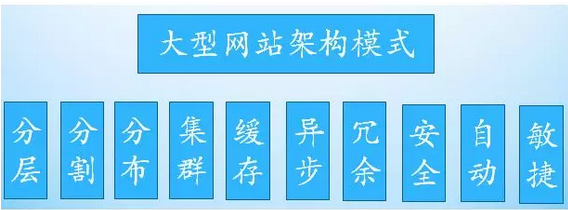
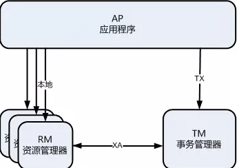

## 分布式

### CAP

* 一致性：在分布式系统中的所有数据备份，在同一时刻是否同样的值。
* 可用性：在集群中一部分节点故障后，集群整体是否还能响应客户端的读写请求。
* 分区容忍性：分区容忍性就是允许系统通过网络协同工作，分区容忍性要解决由于网络分区导致数据的不完整及无法访问等问题

### BASE理论

* Basically Available（基本可用）
* Soft state（软状态）
* Eventually consistent（最终一致性）

### 分布式ID

* 唯一性：确保生成的ID是全网唯一的。
* 有序递增性：确保生成的ID是对于某个用户或者业务是按一定的数字有序递增的。
* 高可用性：确保任何时候都能正确的生成ID。
* 带时间：ID里面包含时间，一眼扫过去就知道哪天的交易

1. 数据库自增ID

业务系统每次需要一个ID时，都需要请求数据库获取，性能低，并且如果此数据库实例下线了，那么将影响所有的业务系统

2. UUID

没有排序，无法保证趋势递增。
UUID往往是使用字符串存储，查询的效率比较低

3. 雪花算法

4. Redis生成ID

incr 和 increby 这样的自增原子命令

## 高并发

### 高并发下如何使用redis

不是使用单机模式，主从结构（读写分离），集群模式

### 集群、微服务、分布式

1. 分布式：一个业务分拆多个子业务，部署在不同的服务器上

2. 集群：同一个业务，部署在多个服务器上

3. 微服务 微服务是一种架构风格，一个大型复杂软件应用由一个或多个微服务组成

### 如何设计高可用架构

可分为前端优化、浏览器优化、应用层优化、代码层优化与存储层优化：

前端优化：网站业务逻辑之前的部分。

浏览器优化：减少 HTTP 请求数，使用浏览器缓存，启用压缩，CSS JS 位置，JS 异步，减少 Cookie 传输；CDN 加速，反向代理。

应用层优化：处理网站业务的服务器。使用缓存，异步，集群。

代码优化：合理的架构，多线程，资源复用（对象池，线程池等），良好的数据结构，JVM调优，单例，Cache 等。

存储优化：缓存、固态硬盘、光纤传输、优化读写、磁盘冗余、分布式存储（HDFS）、NoSQL 等

应用层：一般设计为无状态的，对于每次请求，使用哪一台服务器处理是没有影响的。一般使用负载均衡技术（需要解决 Session 同步问题）实现高可用。

服务层：负载均衡，分级管理，快速失败（超时设置），异步调用，服务降级，幂等设计等。

数据层：冗余备份（冷，热备[同步，异步]，温备），失效转移（确认，转移，恢复）。数据高可用方面著名的理论基础是 CAP 理论。（持久性，可用性，数据一致性[强一致，用户一致，最终一致]）

### 分布式一致性

Paxos

### 消息队列选型

在实际生产应用中，通常会使用kafka作为**消息传输的数据管道**，rabbitmq作为交易数据作为**数据传输管道**，主要的取舍因素则是是否存在丢数据的可能；
rabbitmq 在金融场景中经常使用，具有较高的严谨性，数据丢失的可能性更小，同事具备更高的实时性；
而kafka优势主要体现在吞吐量上，虽然可以通过策略实现数据不丢失，但从严谨性角度来讲，大不如rabbitmq；
而且由于kafka保证每条消息最少送达一次，有较小的概率会出现数据重复发送的情况

## rabbitmq

### 使用RabbitMQ有什么好处？

1. 解耦，系统A在代码中直接调用系统B和系统C的代码，如果将来D系统接入，系统A还需要修改代码，过于麻烦！

2. 异步，将消息写入消息队列，非必要的业务逻辑以异步的方式运行，加快响应速度

3. 削峰，并发量大的时候，所有的请求直接怼到数据库，造成数据库连接异常

### channel、exchange 和 queue

queue 具有自己的 erlang 进程；exchange 内部实现为保存 binding 关系的查找表；channel 是实际进行路由工作的实体，即负责按照 routing_key 将 message 投递给 queue

### vhost 是什么？起什么作用？

可以理解为虚拟 broker。其内部均含有独立的 queue、exchange 和 binding 等，但最最重要的是，其拥有独立的权限系统，可以做到 vhost 范围的用户控制

### 消息基于什么传输？

RabbitMQ使用信道的方式来传输数据。信道是建立在真实的TCP连接内的虚拟连接，且每条TCP连接上的信道数量没有限制

由于TCP连接的创建和销毁开销较大，且并发数受系统资源限制，会造成性能瓶颈。

### 常用的交换器

* Direct

直连型交换机，根据消息携带的路由键将消息投递给对应队列
大致流程，
1. 有一个队列绑定到一个直连交换机上，同时赋予一个路由键 routing key
2. 然后当一个消息携带着路由值为X，这个消息通过生产者发送给交换机时，交换机就会根据这个路由值X去寻找绑定值也是X的队列

* Fanout

交换机在接收到消息后，会直接转发到绑定到它上面的所有队列

* Topic

使用topic交换器时，可以使用通配符，比如：“*” 匹配特定位置的任意文本， “.” 把路由键分为了几部分，“#” 匹配所有规则等

可以使来自不同源头的消息能够到达同一个队列

### 队列类型

1. Work queues(工作队列)

作队列的主要思想就是将资源密集型的任务分配给多个终端处理，可以理解为轮询机制

2. Publish/Subscribe(发布/订阅)

将生产者发布的消息以广播的形式发送给所有消费者

3. Routing(路由)
4. Topics(通配符)

### 如何解决丢数据的问题?

1. 生产者丢数据

RabbitMQ提供 `transaction` 和 `confirm` 模式来确保生产者不丢消息

#### transaction

transaction机制就是说，发送消息前，开启事物(channel.txSelect())，然后发送消息，如果发送过程中出现什么异常，事物就会回滚(channel.txRollback())，如果发送成功则提交事物(channel.txCommit())

#### confirm

一旦channel进入confirm模式，所有在该信道上面发布的消息都将会被指派一个唯一的ID(从1开始)，一旦消息被投递到所有匹配的队列之后，rabbitMQ就会发送一个Ack给生产者(包含消息的唯一ID)，这就使得生产者知道消息已经正确到达目的队列了

2. 消息队列丢数据

开启持久化磁盘的配置

3. 消费者丢数据

①自动确认模式，消费者挂掉，待ack的消息回归到队列中。消费者抛出异常，消息会不断的被重发，直到处理成功。不会丢失消息，即便服务挂掉，没有处理完成的消息会重回队列，但是异常会让消息不断重试。

②手动确认模式，如果消费者来不及处理就死掉时，没有响应ack时会重复发送一条信息给其他消费者；如果监听程序处理异常了，且未对异常进行捕获，会一直重复接收消息，然后一直抛异常；如果对异常进行了捕获，但是没有在finally里ack，也会一直重复发送消息(重试机制)。

③不确认模式，acknowledge="none" 不使用确认机制，只要消息发送完成会立即在队列移除，无论客户端异常还是断开，只要发送完就移除，不会重发

### 死信队列和延迟队列的使用

### 分布式事务

本地事务就是用关系数据库来控制事务，关系数据库通常都具有ACID特性

单机模式下的事务，出现异常可以正常的回滚。而分布式模式，一个节点出现异常，无法互相感知

1. 两阶段提交（2PC）

* 第一阶段：准备阶段（prepare）
协调者通知参与者准备提交订单，参与者开始投票。
协调者完成准备工作向协调者回应Yes。

* 第二阶段：提交(commit)/回滚(rollback)阶段
协调者根据参与者的投票结果发起最终的提交指令。
如果有参与者没有准备好则发起回滚指令。
一个下单减库存的例子：

2. 补偿事务（TCC）

针对每个操作，都要注册一个与其对应的确认和补偿（撤销）操作。它分为三个阶段：

* Try 阶段主要是对业务系统做检测及资源预留

* Confirm 阶段主要是对业务系统做确认提交，Try阶段执行成功并开始执行 Confirm阶段时，默认 Confirm阶段是不会出错的。即：只要Try成功，Confirm一定成功。

* Cancel 阶段主要是在业务执行错误，需要回滚的状态下执行的业务取消，预留资源释放

### 什么是幂等性？

幂等性是指同一个操作无论请求多少次，其结果都相同

幂等操作实现方式有：

1. 操作之前对业务方法进行判断 如果执行过了就不再执行。
2. 缓存所有请求和处理的结果，已经处理的请求则直接返回结果。
3. 在数据库表中加一个状态字段（未处理，已处理），数据操作时判断未处理时再处理。

### 分布式协议

X/Open XA协议

XA是一个分布式事务协议，由Tuxedo提出。

XA规范主要定义了（全局）事务管理器（Transaction Manager）和（局部）资源管理器（Resource Manager）之间的接口。

XA接口是双向的系统接口，在事务管理器Transaction Manager）以及一个或多个资源管理器（Resource Manager）之间形成通信桥梁

XA协议采用两阶段提交方式来管理分布式事务。XA接口提供资源管理器与事务管理器之间进行通信的标准接口。

* TC (Transaction Coordinator) - 事务协调者

维护全局和分支事务的状态，驱动全局事务提交或回滚。

* TM (Transaction Manager) - 事务管理器

定义全局事务的范围：开始全局事务、提交或回滚全局事务。

* RM (Resource Manager) - 资源管理器

管理分支事务处理的资源，与TC交谈以注册分支事务和报告分支事务的状态，并驱动分支事务提交或回滚。

### Seata

第一阶段

Seata 的 JDBC 数据源代理通过对业务 SQL 的解析，把业务数据在更新前后的数据镜像组织成回滚日志，利用 本地事务 的 ACID 特性，将业务数据的更新和回滚日志的写入在同一个 本地事务 中提交

第二阶段

如果决议是全局提交，此时分支事务此时已经完成提交，不需要同步协调处理（只需要异步清理回滚日志）

流程

Seata的全局事务是基于XID和 Branch ID，主要通过feign把xid在各服务之间传递，而通过xid+branchId唯一确定一条undo_log数据（此时是阶段一，因为已经插入一条undo_log了），拿 UNDO LOG 中的后镜与当前数据进行比较，如果有不同，说明数据被当前全局事务之外的动作做了修改（此时是阶段二）

### 云服务模型

#### Saas

SaaS，Software as a service，软件即服务

服务商提供一个线上服务平台，客户根据自己的实际需求订购相应服务模块。按订购的服务多少和时间长短向服务商支付费用。

* 优点: 可重复使用; 成本较低; 灵活的定价模式，符合企业的发展模式; 为企业减少所需的IT资源
* 缺点: 无法提供定制化的内容

#### PaaS

平台即服务,某些时候也叫做中间件

为某些软件提供云组件，这些组件主要用于应用程序

#### IaaS

基础架构即服务

IaaS公司会提供场外服务器，存储和网络硬件，你可以租用