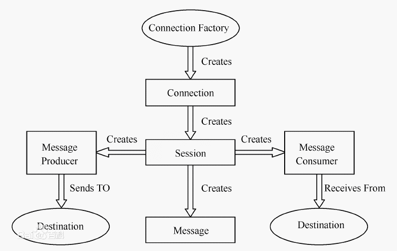
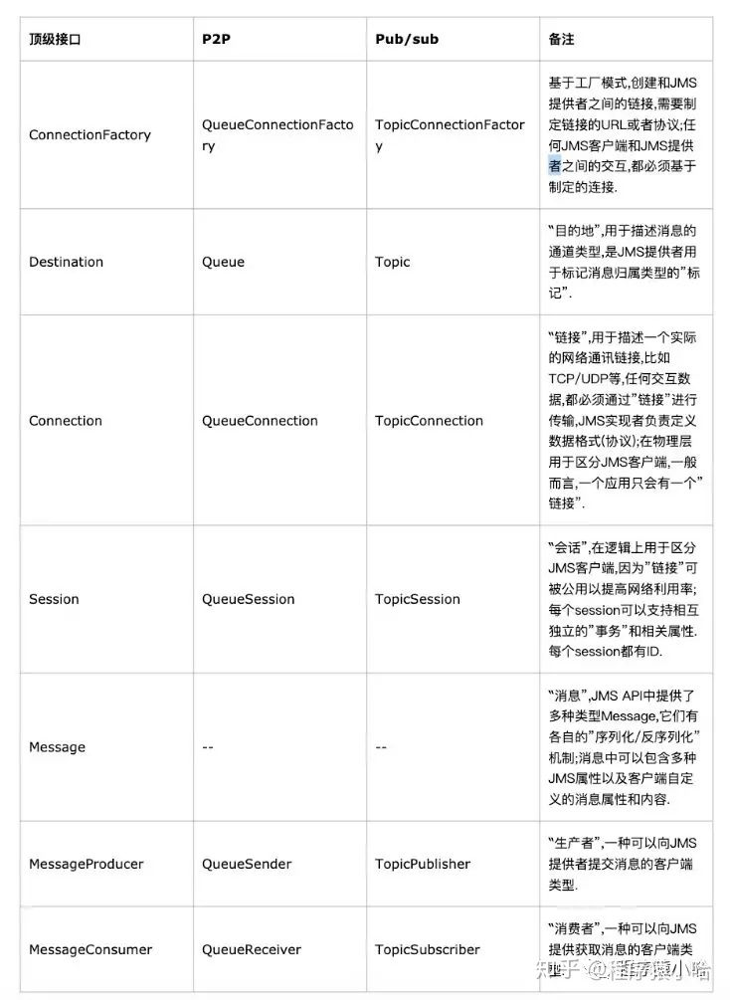

## 简介

JMS（Java Messaging Service）是Java平台上有关面向消息中间件(MOM)的技术规范，它便于消息系统中的Java应用程序进行消息交换,并且通过提供标准的产生、发送、接收消息的接口简化企业应用的开发

## 架构

### 对象模型

### 消息类型

1. 点对点（Point-to-Point）

在点对点的消息系统中，消息分发给一个单独的使用者。点对点消息往往与队列（Queue）相关联。

2. 发布/订阅（Publish/Subscribe）

发布/订阅消息系统支持一个事件驱动模型，消息生产者和消费者都参与消息的传递。生产者发布事件，而使用者订阅感兴趣的事件，并使用事件。

### 核心 API

### message 结构

1. 消息头

设置消息的通用属性,类似http消息头,可以设置消息的过期时间,是否持久化,投递的目的地(队列名/topic名),最主要的设置消息的唯一标识messageId来标识消息的唯一性(JMS会模认生成, 也可以使用自定义的id格式来生成唯一标识)

2. 消息体

消息实际存放数据的地方,有多种类型的消息,text/map/bytes/Stream/Object等.发送和接收需要使用同一类型

3. 消息属性

如果需要除消息头外的值,可以使用消息属性(消息头的属性是固定的,类似于自定义字段),可以识别/去重/重点标注相同消息头和消息体的消息

### 消息可靠性机制

1. 持久化

当服务器宕机时,数据不丢失,会保存在服务器本地

2. 事务(transaction)

ACID 生产者/消费者为了保证多条消息发送保证同步提交和同步消费,可以开启事务功能,需要提交事务

3. ACK确认机制
* 自动ACK 消费者自动ack 
* 手动ACK 需要自己手动提交ACK信息 
* 运行重复签收 用于可以多消费者签收的消息