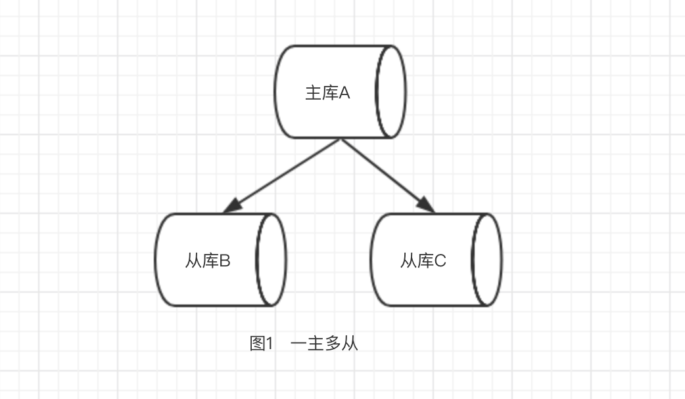
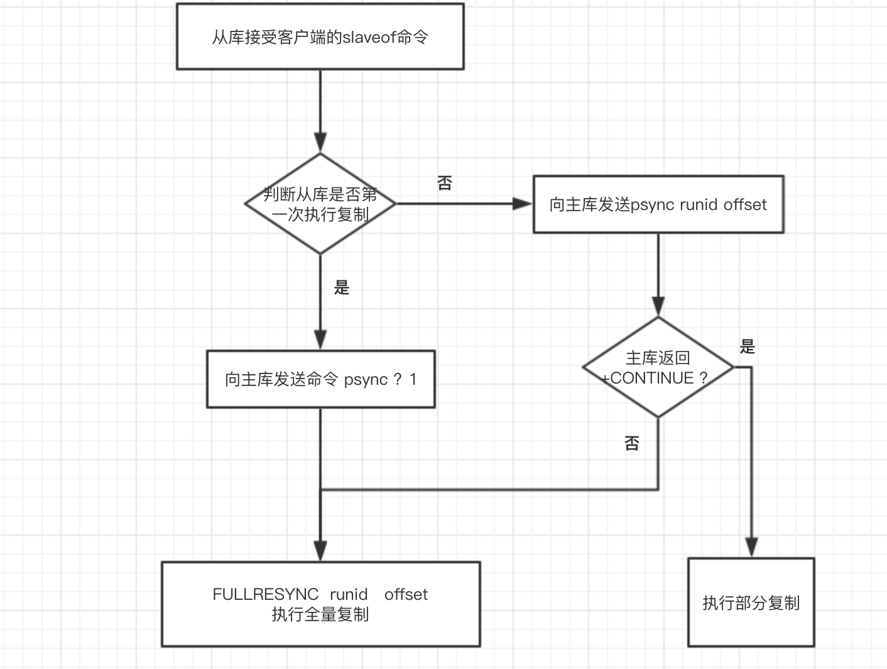

将数据复制多个副本部署到其他的机器

## 配置

参入复制的实例划分为主节点和从节点。复制的数据是单向流动的。默认情况下，从节点为只读状态

### 建立连接

1. 配置文件

修改从节点的配置文件
```
slaveof {masterHost} {masterPost}
```

2. 启动命令后

```shell
redis-server --slaveof {masterHost} {masterPost}
```

3. 命令行

```shell
cli > slaveof {masterHost} {masterPost}
```

### 断开连接

使用命令断开主从节点的复制.

```shell
slaveof no one
```

1. 断开与主节点的复制关系
2. 从节点升级为主节点

> 断开后不会情况数据

### 传输延迟

redis 通过 `repl-disable-tcp-nodelay` 参数控制TCP 传输延迟

* 开启时 主节点会合并tcp数据包从而节省带宽，默认40ms发送一次
* 关闭时 主节点实时的将数据传输到从节点

## 拓扑结构

1. 一主一从
2. 一主多从



3. 数状主从结构


## 复制原理

### 复制过程


1. 从节点保存主节点信息

2. 尝试建立主从连接

3. 发送ping命令

4. 权限认证

5. 同步数据

6. 命令持续复制

### 数据同步方式

* 复制偏移量

主库和从库分别各自维护一个复制偏移量（可以使用info replication查看），用于标识自己复制的情况，在主库中代表主节点向从节点传递的字节数，在从库中代表从库同步的字节数.

主节点在处理完写入命令会命令的字节长度做累加记录。

* 复制积压缓冲区

复制积压缓冲区是一个固定长度的FIFO队列，大小由配置参数repl-backlog-size指定，默认大小1MB。需要注意的是该缓冲区由master维护并且有且只有一个，所有slave共享此缓冲区，其作用在于备份最近主库发送给从库的数据

主从命令传播阶段，主节点除了将写命令发送给从节点外，还会发送一份到复制积压缓冲区，作为写命令的备份

* run_id

每个redis实例在启动时候，都会随机生成一个长度为40的唯一字符串来标识当前运行的redis节点

1. 如果从节点保存的runid与主节点现在的runid相同，说明主从节点之前同步过，主节点会更具offset偏移量之后的数据判断是否执行部分复制，如果offset偏移量之后的数据仍然都在复制积压缓冲区里，则执行部分复制，否则执行全量复制；
2. 如果从节点保存的runid与主节点现在的runid不同，说明从节点在断线前同步的redis节点并不是当前的主节点，只能进行全量复制

* psync



#### 全量复制

用于初次复制或其他无法进行部分复制的情况，将主节点中的所有数据都发送给从节点，是一个非常重型的操作

#### 部分复制

用于网络中断等情况后的复制，只将中断期间主节点执行的写命令发送给从节点，与全量复制相比更加高效。需要注意的是，如果网络中断时间过长，导致主节点没有能够完整地保存中断期间执行的写命令，则无法进行部分复制，仍使用全量复制

