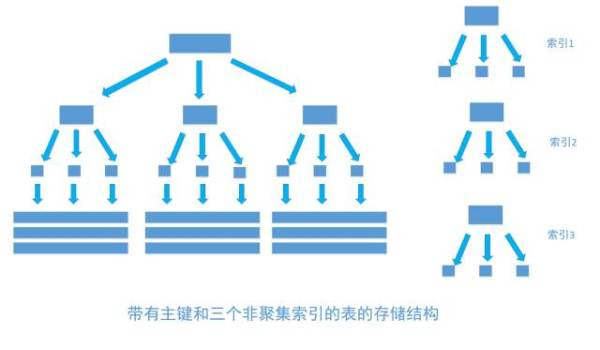

### 索引
在关系数据库中，索引是一种单独的、物理的对数据库表中一列或多列的值进行排序的一种存储结构
优点
1.大大加快数据的检索速度;
2.创建唯一性索引，保证数据库表中每一行数据的唯一性;
3.加速表和表之间的连接;
4.在使用分组和排序子句进行数据检索时，可以显著减少查询中分组和排序的时间。
缺点
1.索引需要占物理空间。
2.当对表中的数据进行增加、删除和修改的时候，索引也要动态的维护，降低了数据的维护速度。

### 索引操作
```
ALTER TABLE my_table ADD [UNIQUE] INDEX index_name(column_name);
或者
CREATE INDEX index_name ON my_table(column_name);
```
> 1、索引需要占用磁盘空间，因此在创建索引时要考虑到磁盘空间是否足够
2、创建索引时需要对表加锁，因此实际操作中需要在业务空闲期间进行


### 索引的分类
常见的索引类型有：主键索引、唯一索引、普通索引、全文索引、组合索引
1、主键索引：即主索引，根据主键pk_clolum（length）建立索引，不允许重复，不允许空值；
ALTER TABLE 'table_name' ADD PRIMARY KEY pk_index('col')；

2、唯一索引：用来建立索引的列的值必须是唯一的，允许空值
ALTER TABLE 'table_name' ADD UNIQUE index_name('col')；

3、普通索引：用表中的普通列构建的索引，没有任何限制
ALTER TABLE 'table_name' ADD INDEX index_name('col')；

4、全文索引：用大文本对象的列构建的索引（下一部分会讲解）
ALTER TABLE 'table_name' ADD FULLTEXT INDEX ft_index('col')；

5、组合索引：用多个列组合构建的索引，这多个列中的值不允许有空值
ALTER TABLE 'table_name' ADD INDEX index_name('col1','col2','col3')；
遵循`最左前缀`原则，把最常用作为检索或排序的列放在最左，依次递减，组合索引相当于建立了col1,col1col2,col1col2col3三个索引，而col2或者col3是不能使用索引的。

### 索引原理

主流的RDBMS都是把平衡树当做数据表默认的索引数据结构的
B+Tree对比BTree的优点：
1、磁盘读写代价更低
提升查找速度的关键就在于尽可能少的磁盘I/O，那么可以知道，每个节点中的key个数越多，那么树的高度越小，需要I/O的次数越少，因此一般来说B+Tree比BTree更快，因为B+Tree的非叶节点中不存储data，就可以存储更多的key。
2、查询速度更稳定
由于B+Tree非叶子节点不存储数据（data），因此所有的数据都要查询至叶子节点，而叶子节点的高度都是相同的，因此所有数据的查询速度都是一样的。

我们平时建表的时候都会为表加上主键， 在某些关系数据库中， 如果建表时不指定主键，数据库会拒绝建表的语句执行。 事实上， 一个加了主键的表，并不能被称之为「表」。一个没加主键的表，它的数据无序的放置在磁盘存储器上，一行一行的排列的很整齐， 跟我认知中的「表」很接近。如果给表上了主键，那么表在磁盘上的存储结构就由整齐排列的结构转变成了树状结构，也就是上面说的「平衡树」结构，换句话说，就是整个表就变成了一个索引。没错， 再说一遍， 整个表变成了一个索引，也就是所谓的「聚集索引」。 这就是为什么一个表只能有一个主键， 一个表只能有一个「聚集索引」，因为主键的作用就是把「表」的数据格式转换成「索引（平衡树）」的格式放置


其中树的所有结点（底部除外）的数据都是由主键字段中的数据构成，也就是通常我们指定主键的id字段


假如我们执行一个SQL语句：
select * from table where id = 1256;
首先根据索引定位到1256这个值所在的叶结点，然后再通过叶结点取到id等于1256的数据行


非聚集索引和聚集索引一样， 同样是采用平衡树作为索引的数据结构
每次给字段建一个新索引， 字段中的数据就会被复制一份出来， 用于生成索引。 因此， 给表添加索引，会增加表的体积， 占用磁盘存储空间。

非聚集索引和聚集索引的区别在于， 通过聚集索引可以查到需要查找的数据， 而通过非聚集索引可以查到记录对应的主键值 ， 再使用主键的值通过聚集索引查找到需要的数据，如下图

不管以任何方式查询表， 最终都会利用主键通过聚集索引来定位到数据， 聚集索引（主键）是通往真实数据所在的唯一路径。

聚簇索引和非聚簇索引

分析了MySQL的索引结构的实现原理，然后我们来看看具体的存储引擎怎么实现索引结构的，MySQL中最常见的两种存储引擎分别是MyISAM和InnoDB，分别实现了非聚簇索引和聚簇索引。

* 聚簇索引的解释是: 聚簇索引的顺序就是数据的物理存储顺序
* 非聚簇索引的解释是: 索引顺序与数据物理排列顺序无关


### 索引的使用策略
#### 什么时候要使用索引？

* 主键自动建立唯一索引；
* 经常作为查询条件在WHERE或者ORDER BY 语句中出现的列要建立索引；
* 作为排序的列要建立索引；
* 查询中与其他表关联的字段，外键关系建立索引
* 高并发条件下倾向组合索引；
* 用于聚合函数的列可以建立索引，例如使用了max(column_1)或者count(column_1)时的column_1就需要建立索引
#### 什么时候不要使用索引？

* 经常增删改的列不要建立索引；
* 有大量重复的列不建立索引；
* 表记录太少不要建立索引。只有当数据库里已经有了足够多的测试数据时，它的性能测试结果才有实际参考价值。如果在测试数据库里只有几百条数据记录，它们往往在执行完第一条查询命令之后就被全部加载到内存里，这将使后续的查询命令都执行得非常快--不管有没有使用索引。只有当数据库里的记录超过了1000条、数据总量也超过了MySQL服务器上的内存总量时，数据库的性能测试结果才有意义。
#### 索引失效的情况：

* 在组合索引中不能有列的值为NULL，如果有，那么这一列对组合索引就是无效的。
* 在一个SELECT语句中，索引只能使用一次，如果在WHERE中使用了，那么在ORDER BY中就不要用了。
* LIKE操作中，'%aaa%'不会使用索引，也就是索引会失效，但是‘aaa%’可以使用索引。
* 在索引的列上使用表达式或者函数会使索引失效，例如：select * from users where YEAR(adddate)<2007，将在每个行上进行运算，这将导致索引失效而进行全表扫描，因此我们可以改成：select * from users where adddate<’2007-01-01′。其它通配符同样，也就是说，在查询条件中使用正则表达式时，只有在搜索模板的第一个字符不是通配符的情况下才能使用索引。
* 在查询条件中使用不等于，包括<符号、>符号和！=会导致索引失效。特别的是如果对主键索引使用！=则不会使索引失效，如果对主键索引或者整数类型的索引使用<符号或者>符号不会使索引失效。（经erwkjrfhjwkdb同学提醒，不等于，包括&lt;符号、>符号和！，如果占总记录的比例很小的话，也不会失效）
* 在查询条件中使用IS NULL或者IS NOT NULL会导致索引失效。
* 字符串不加单引号会导致索引失效。更准确的说是类型不一致会导致失效，比如字段email是字符串类型的，使用WHERE email=99999 则会导致失败，应该改为WHERE email='99999'。
* 在查询条件中使用OR连接多个条件会导致索引失效，除非OR链接的每个条件都加上索引，这时应该改为两次查询，然后用UNION ALL连接起来。
* 如果排序的字段使用了索引，那么select的字段也要是索引字段，否则索引失效。特别的是如果排序的是主键索引则select * 也不会导致索引失效。
* 尽量不要包括多列排序，如果一定要，最好为这队列构建组合索引；

### 索引的优化
1、最左前缀
索引的最左前缀和和B+Tree中的“最左前缀原理”有关，举例来说就是如果设置了组合索引<col1,col2,col3>那么以下3中情况可以使用索引：col1，<col1,col2>，<col1,col2,col3>，其它的列，比如<col2,col3>，<col1,col3>，col2，col3等等都是不能使用索引的。

根据最左前缀原则，我们一般把排序分组频率最高的列放在最左边，以此类推。

2、带索引的模糊查询优化
在上面已经提到，使用LIKE进行模糊查询的时候，'%aaa%'不会使用索引，也就是索引会失效。如果是这种情况，只能使用全文索引来进行优化（上文有讲到）。

3、为检索的条件构建全文索引，然后使用
SELECT * FROM tablename MATCH(index_colum) ANGAINST(‘word’);

4、使用短索引
对串列进行索引，如果可能应该指定一个前缀长度。例如，如果有一个CHAR(255)的 列，如果在前10 个或20 个字符内，多数值是惟一的，那么就不要对整个列进行索引。短索引不仅可以提高查询速度而且可以节省磁盘空间和I/O操作。