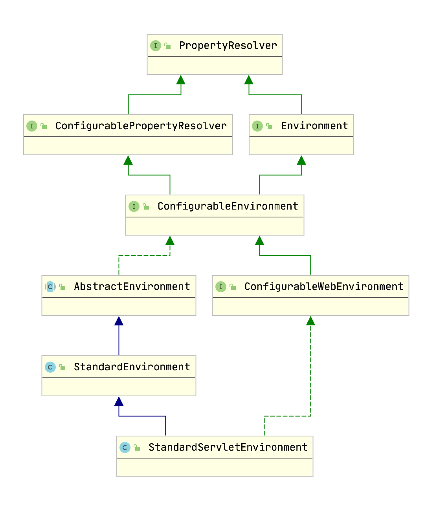

## 启动过程

### 流程图


1. 创建 SpringApplication
2. 执行 SpringApplication.run()

### main方法

```java
@SpringBootApplication
public class SpringBootDemoApplication {

    public static void main(String[] args) {
        SpringApplication.run(SpringBootDemoApplication.class, args);
    }
}
```

### SpringApplication

```java
public class SpringApplication {
    // 启动方法
    public static ConfigurableApplicationContext run(Class<?> primarySource, String... args) {
		return run(new Class<?>[] { primarySource }, args);
	}

    // 创建 应用
    public static ConfigurableApplicationContext run(Class<?>[] primarySources, String[] args) {
        // run(args)
		return new SpringApplication(primarySources).run(args);
	}

    // 构造函数
    public SpringApplication(Class<?>... primarySources) {
		this(null, primarySources);
	}

    public SpringApplication(ResourceLoader resourceLoader, Class<?>... primarySources) {
		//1、初始化资源加载器
        this.resourceLoader = resourceLoader;
        //2、断言资源加载类不能为 null
        Assert.notNull(primarySources, "PrimarySources must not be null");
        //3、初始化加载资源类集合并去重
        this.primarySources = new LinkedHashSet<>(Arrays.asList(primarySources));
        //4、推断应用类型是Standard还是Web
        this.webApplicationType = WebApplicationType.deduceFromClasspath();
        //5、设置应用上下文初始化器
        setInitializers((Collection)getSpringFactoriesInstances(ApplicationContextInitializer.class));
        //6、设置监听器
        setListeners((Collection)getSpringFactoriesInstances(ApplicationListener.class));
        //7、推断应用入口类
        this.mainApplicationClass = deduceMainApplicationClass();
	}

    private Class<?> deduceMainApplicationClass() {
		try {
			StackTraceElement[] stackTrace = new RuntimeException().getStackTrace();
			for (StackTraceElement stackTraceElement : stackTrace) {
                // 查找 main 方法
				if ("main".equals(stackTraceElement.getMethodName())) {
					return Class.forName(stackTraceElement.getClassName());
				}
			}
		}
		catch (ClassNotFoundException ex) {
			// Swallow and continue
		}
		return null;
	}

    private <T> Collection<T> getSpringFactoriesInstances(Class<T> type) {
		return getSpringFactoriesInstances(type, new Class<?>[] {});
	}

// 使用 SpringFactoriesLoader 加载配置类
	private <T> Collection<T> getSpringFactoriesInstances(Class<T> type, Class<?>[] parameterTypes, Object... args) {
        // 获取类加载器
		ClassLoader classLoader = getClassLoader();
		
		Set<String> names = new LinkedHashSet<>(SpringFactoriesLoader.loadFactoryNames(type, classLoader));
        // 创建配置类实例
		List<T> instances = createSpringFactoriesInstances(type, parameterTypes, classLoader, args, names);
        // 排序配置类实例
		AnnotationAwareOrderComparator.sort(instances);
		return instances;
	}

// 创建配置类实例
    private <T> List<T> createSpringFactoriesInstances(Class<T> type, Class<?>[] parameterTypes,
			ClassLoader classLoader, Object[] args, Set<String> names) {
		List<T> instances = new ArrayList<>(names.size());
		for (String name : names) {
			try {
                // 反射创建实例
				Class<?> instanceClass = ClassUtils.forName(name, classLoader);
				Assert.isAssignable(type, instanceClass);
				Constructor<?> constructor = instanceClass.getDeclaredConstructor(parameterTypes);
				T instance = (T) BeanUtils.instantiateClass(constructor, args);
				instances.add(instance);
			}
			catch (Throwable ex) {
				throw new IllegalArgumentException("Cannot instantiate " + type + " : " + name, ex);
			}
		}
		return instances;
	}

    public ClassLoader getClassLoader() {
		if (this.resourceLoader != null) {
			return this.resourceLoader.getClassLoader();
		}
        // 默认的类加载器
		return ClassUtils.getDefaultClassLoader();
	}
}
```

#### SpringFactoriesLoader

```java
public final class SpringFactoriesLoader {
    // 位置
    public static final String FACTORIES_RESOURCE_LOCATION = "META-INF/spring.factories";
    // 缓存
    private static final Map<ClassLoader, MultiValueMap<String, String>> cache = new ConcurrentReferenceHashMap<>();

    public static List<String> loadFactoryNames(Class<?> factoryType, @Nullable ClassLoader classLoader) {
		String factoryTypeName = factoryType.getName();
		return loadSpringFactories(classLoader).getOrDefault(factoryTypeName, Collections.emptyList());
	}

	private static Map<String, List<String>> loadSpringFactories(@Nullable ClassLoader classLoader) {
		MultiValueMap<String, String> result = cache.get(classLoader);
		if (result != null) {
			return result;
		}

		try {
			Enumeration<URL> urls = (classLoader != null ?
					classLoader.getResources(FACTORIES_RESOURCE_LOCATION) :
					ClassLoader.getSystemResources(FACTORIES_RESOURCE_LOCATION));
			result = new LinkedMultiValueMap<>();
			while (urls.hasMoreElements()) {
				URL url = urls.nextElement();
				UrlResource resource = new UrlResource(url);
				Properties properties = PropertiesLoaderUtils.loadProperties(resource);
				for (Map.Entry<?, ?> entry : properties.entrySet()) {
					String factoryTypeName = ((String) entry.getKey()).trim();
					for (String factoryImplementationName : StringUtils.commaDelimitedListToStringArray((String) entry.getValue())) {
						result.add(factoryTypeName, factoryImplementationName.trim());
					}
				}
			}
			cache.put(classLoader, result);
			return result;
		}
		catch (IOException ex) {
			throw new IllegalArgumentException("Unable to load factories from location [" +
					FACTORIES_RESOURCE_LOCATION + "]", ex);
		}
	}
}
```

### run
```java
public class SpringApplication {
    private static final String SYSTEM_PROPERTY_JAVA_AWT_HEADLESS = "java.awt.headless";

    public static final String DEFAULT_SERVLET_WEB_CONTEXT_CLASS = "org.springframework.boot."
			+ "web.servlet.context.AnnotationConfigServletWebServerApplicationContext";

    public ConfigurableApplicationContext run(String... args) {
        // StopWatch是一个计时类，用来记录任务的开始时间，结束时间等
		StopWatch stopWatch = new StopWatch();
        // 记录
		stopWatch.start();
        // 声明上下文
		ConfigurableApplicationContext context = null;
        // 异常报告器
		Collection<SpringBootExceptionReporter> exceptionReporters = new ArrayList<>();
		configureHeadlessProperty();
        // 获取监听器
		SpringApplicationRunListeners listeners = getRunListeners(args);
        // 执行监听器
		listeners.starting();
		try {
			ApplicationArguments applicationArguments = new DefaultApplicationArguments(args);
            // 配置环境
			ConfigurableEnvironment environment = prepareEnvironment(listeners, applicationArguments);
			configureIgnoreBeanInfo(environment);
            // 打印Banner
			Banner printedBanner = printBanner(environment);
            // 创建应用上下文
			context = createApplicationContext();
			exceptionReporters = getSpringFactoriesInstances(SpringBootExceptionReporter.class,
					new Class[] { ConfigurableApplicationContext.class }, context);

            // 准备上下文
			prepareContext(context, environment, listeners, applicationArguments, printedBanner);
            // 刷新上下文
			refreshContext(context);
            // 刷新上下文后执行 留给子类扩展
			afterRefresh(context, applicationArguments);
            // 停止计时器
			stopWatch.stop();
			if (this.logStartupInfo) {
				new StartupInfoLogger(this.mainApplicationClass).logStarted(getApplicationLog(), stopWatch);
			}
            // 开始执行监听器
			listeners.started(context);
            // 调用 Runner 类
			callRunners(context, applicationArguments);
		}
		catch (Throwable ex) {
			handleRunFailure(context, ex, exceptionReporters, listeners);
			throw new IllegalStateException(ex);
		}

		try {
            // 监听器执行中
			listeners.running(context);
		}
		catch (Throwable ex) {
			handleRunFailure(context, ex, exceptionReporters, null);
			throw new IllegalStateException(ex);
		}
		return context;
	}

    private void configureHeadlessProperty() {
		System.setProperty(SYSTEM_PROPERTY_JAVA_AWT_HEADLESS,
				System.getProperty(SYSTEM_PROPERTY_JAVA_AWT_HEADLESS, Boolean.toString(this.headless)));
	}

    private SpringApplicationRunListeners getRunListeners(String[] args) {
		Class<?>[] types = new Class<?>[] { SpringApplication.class, String[].class };
		return new SpringApplicationRunListeners(logger,
				getSpringFactoriesInstances(SpringApplicationRunListener.class, types, this, args));
	}

    private ConfigurableEnvironment prepareEnvironment(SpringApplicationRunListeners listeners,
			ApplicationArguments applicationArguments) {
		// 获取或创建配置环境
		ConfigurableEnvironment environment = getOrCreateEnvironment();
		configureEnvironment(environment, applicationArguments.getSourceArgs());
		ConfigurationPropertySources.attach(environment);
		listeners.environmentPrepared(environment);
		bindToSpringApplication(environment);
		if (!this.isCustomEnvironment) {
			environment = new EnvironmentConverter(getClassLoader()).convertEnvironmentIfNecessary(environment,
					deduceEnvironmentClass());
		}
		ConfigurationPropertySources.attach(environment);
		return environment;
	}

    protected ConfigurableApplicationContext createApplicationContext() {
		Class<?> contextClass = this.applicationContextClass;
		if (contextClass == null) {
			try {
                // web l类型
				switch (this.webApplicationType) {
				case SERVLET:
					contextClass = Class.forName(DEFAULT_SERVLET_WEB_CONTEXT_CLASS);
					break;
				case REACTIVE:
					contextClass = Class.forName(DEFAULT_REACTIVE_WEB_CONTEXT_CLASS);
					break;
				default:
					contextClass = Class.forName(DEFAULT_CONTEXT_CLASS);
				}
			}
			catch (ClassNotFoundException ex) {
				throw new IllegalStateException(
						"Unable create a default ApplicationContext, please specify an ApplicationContextClass", ex);
			}
		}
		return (ConfigurableApplicationContext) BeanUtils.instantiateClass(contextClass);
	}
}
```

## StopWatch
```java
public class StopWatch {
    private final String id;

	private boolean keepTaskList = true;

	private final List<TaskInfo> taskList = new LinkedList<>();

	/** Start time of the current task. */
	private long startTimeNanos;

	/** Name of the current task. */
	@Nullable
	private String currentTaskName;

	@Nullable
	private TaskInfo lastTaskInfo;

	private int taskCount;

	/** Total running time. */
	private long totalTimeNanos;

    public void start(String taskName) throws IllegalStateException {
		if (this.currentTaskName != null) {
			throw new IllegalStateException("Can't start StopWatch: it's already running");
		}
		this.currentTaskName = taskName;
		this.startTimeNanos = System.nanoTime();
	}

    public void stop() throws IllegalStateException {
		if (this.currentTaskName == null) {
			throw new IllegalStateException("Can't stop StopWatch: it's not running");
		}
		long lastTime = System.nanoTime() - this.startTimeNanos;
		this.totalTimeNanos += lastTime;
		this.lastTaskInfo = new TaskInfo(this.currentTaskName, lastTime);
		if (this.keepTaskList) {
			this.taskList.add(this.lastTaskInfo);
		}
		++this.taskCount;
		this.currentTaskName = null;
	}
}
```

## 运行监听器

用来在整个启动流程中接收不同执行点事件通知的监听者

> ＭETA-INF/spring.factories ApplicationContextInitializer、ApplicationListener、SpringBootExceptionReporter SpringApplicationRunListeners 等接口的实现类

### 流程

```java
// SpringApplication.run()
SpringApplicationRunListeners listeners = getRunListeners(args);
listeners.starting();
listeners.started(context);
listeners.running(context);

// 解析 ＭETA-INF/spring.factories
private SpringApplicationRunListeners getRunListeners(String[] args) {
    Class<?>[] types = new Class<?>[] { SpringApplication.class, String[].class };
    return new SpringApplicationRunListeners(logger,
            getSpringFactoriesInstances(SpringApplicationRunListener.class, types, this, args));
}

// 加载并实例化 SpringApplicationRunListeners
private <T> Collection<T> getSpringFactoriesInstances(Class<T> type, Class<?>[] parameterTypes, Object... args) {
    ClassLoader classLoader = getClassLoader();
    // Use names and ensure unique to protect against duplicates
    Set<String> names = new LinkedHashSet<>(SpringFactoriesLoader.loadFactoryNames(type, classLoader));
    List<T> instances = createSpringFactoriesInstances(type, parameterTypes, classLoader, args, names);
    AnnotationAwareOrderComparator.sort(instances);
    return instances;
}
```

### SpringApplicationRunListeners

`SpringApplicationRunListeners` 封装了 `SpringApplicationRunListener`

```java
class SpringApplicationRunListeners {

    private final List<SpringApplicationRunListener> listeners;

    void starting() {
		for (SpringApplicationRunListener listener : this.listeners) {
			listener.starting();
		}
	}

    void started(ConfigurableApplicationContext context) {
		for (SpringApplicationRunListener listener : this.listeners) {
			listener.started(context);
		}
	}

	void running(ConfigurableApplicationContext context) {
		for (SpringApplicationRunListener listener : this.listeners) {
			listener.running(context);
		}
	}
}
```

### SpringApplicationRunListener

运行监听器定义和实现类

```java
public interface SpringApplicationRunListener {
    // 开始启动
    default void starting() {
	}

//环境建立好时候
	default void environmentPrepared(ConfigurableEnvironment environment) {
	}
//上下文建立好的时候
	default void contextPrepared(ConfigurableApplicationContext context) {
	}
 //上下文载入配置时候
	default void contextLoaded(ConfigurableApplicationContext context) {
	}
// 已启动
	default void started(ConfigurableApplicationContext context) {
	}

// 正在运行
	default void running(ConfigurableApplicationContext context) {
	}
// 启动失败
	default void failed(ConfigurableApplicationContext context, Throwable exception) {
	}
}
```

### EventPublishingRunListener

```java
// 实现类
public class EventPublishingRunListener implements SpringApplicationRunListener, Ordered {
    private final SpringApplication application;
	private final String[] args;
    // 事件广播器
	private final SimpleApplicationEventMulticaster initialMulticaster;

	public EventPublishingRunListener(SpringApplication application, String[] args) {
		this.application = application;
		this.args = args;
		this.initialMulticaster = new SimpleApplicationEventMulticaster();
		for (ApplicationListener<?> listener : application.getListeners()) {
			this.initialMulticaster.addApplicationListener(listener);
		}
	}

    @Override
	public void starting() {
		this.initialMulticaster.multicastEvent(new ApplicationStartingEvent(this.application, this.args));
	}

    @Override
	public void started(ConfigurableApplicationContext context) {
        // 发布时间
		context.publishEvent(new ApplicationStartedEvent(this.application, this.args, context));
		AvailabilityChangeEvent.publish(context, LivenessState.CORRECT);
	}

    @Override
	public void running(ConfigurableApplicationContext context) {
		context.publishEvent(new ApplicationReadyEvent(this.application, this.args, context));
		AvailabilityChangeEvent.publish(context, ReadinessState.ACCEPTING_TRAFFIC);
	}
}
```
### 自定义监听器

1. 实现 `SpringApplicationRunListener` 接口，并重写相应的方法

```java
package service;
public class CustomSpringApplicationRunListener implements SpringApplicationRunListener {

    public CustomSpringApplicationRunListener(SpringApplication springApplication, String... args) {
        // todo
    }

    @Override
    public void started(ConfigurableApplicationContext context) {

    }

    @Override
    public void running(ConfigurableApplicationContext context) {
        System.out.println("running");
    }

    @Override
    public void failed(ConfigurableApplicationContext context, Throwable exception) {

    }
    ...
}
```

2. 配置SPI

配置 `ＭETA-INF/spring.factories`

```
// 加入实现类
org.springframework.boot.SpringApplicationRunListener=\
  service.CustomSpringApplicationRunListener
```

## 打印 Banner

[自定义配置](./基本特性.md)

```java
// SpringApplication.run()
Banner printedBanner = printBanner(environment);
```

## 加载环境变量

### Environment

外部化配置功能，该功能主要是通过外部的配置资源实现与代码的相互配合，来避免硬编码，提供应用数据或行为变化的灵活性

#### springboot 加载

```java
public class SpringApplication {
    public ConfigurableApplicationContext run(String... args) {
        ...
        ConfigurableEnvironment environment = prepareEnvironment(listeners, applicationArguments);
    }

    private ConfigurableEnvironment prepareEnvironment(SpringApplicationRunListeners listeners,
			ApplicationArguments applicationArguments) {
		// Create and configure the environment
		ConfigurableEnvironment environment = getOrCreateEnvironment();
		configureEnvironment(environment, applicationArguments.getSourceArgs());
		ConfigurationPropertySources.attach(environment);
		listeners.environmentPrepared(environment);
		bindToSpringApplication(environment);
		if (!this.isCustomEnvironment) {
			environment = new EnvironmentConverter(getClassLoader()).convertEnvironmentIfNecessary(environment,
					deduceEnvironmentClass());
		}
		ConfigurationPropertySources.attach(environment);
		return environment;
	}

    private ConfigurableEnvironment getOrCreateEnvironment() {
		if (this.environment != null) {
			return this.environment;
		}
		switch (this.webApplicationType) {
		case SERVLET:
            //  Servlet 环境
			return new StandardServletEnvironment();
		case REACTIVE:
			return new StandardReactiveWebEnvironment();
		default:
			return new StandardEnvironment();
		}
	}
}

```

#### Environment 接口

```java
public interface Environment extends PropertyResolver {
    // 获取激活的配置文件
    String[] getActiveProfiles();
    String[] getDefaultProfiles();
    boolean acceptsProfiles(Profiles profiles);
}
```

#### StandardServletEnvironment



```java
public class StandardServletEnvironment extends StandardEnvironment implements ConfigurableWebEnvironment {
    /** Servlet context init parameters property source name: {@value}. */
	public static final String SERVLET_CONTEXT_PROPERTY_SOURCE_NAME = "servletContextInitParams";

	/** Servlet config init parameters property source name: {@value}. */
	public static final String SERVLET_CONFIG_PROPERTY_SOURCE_NAME = "servletConfigInitParams";

    @Override
	protected void customizePropertySources(MutablePropertySources propertySources) {
        // 加载 servlet 变量
		propertySources.addLast(new StubPropertySource(SERVLET_CONFIG_PROPERTY_SOURCE_NAME));
		propertySources.addLast(new StubPropertySource(SERVLET_CONTEXT_PROPERTY_SOURCE_NAME));
		if (JndiLocatorDelegate.isDefaultJndiEnvironmentAvailable()) {
			propertySources.addLast(new JndiPropertySource(JNDI_PROPERTY_SOURCE_NAME));
		}
		super.customizePropertySources(propertySources);
	}
}

// StandardEnvironment
public class StandardEnvironment extends AbstractEnvironment {

	/** System environment property source name: {@value}. */
    // 系统属性
	public static final String SYSTEM_ENVIRONMENT_PROPERTY_SOURCE_NAME = "systemEnvironment";

	/** JVM system properties property source name: {@value}. */
    // 环境变量
	public static final String SYSTEM_PROPERTIES_PROPERTY_SOURCE_NAME = "systemProperties";


	// 加载java环境的变量
	@Override
	protected void customizePropertySources(MutablePropertySources propertySources) {
		propertySources.addLast(
				new PropertiesPropertySource(SYSTEM_PROPERTIES_PROPERTY_SOURCE_NAME, getSystemProperties()));
		propertySources.addLast(
				new SystemEnvironmentPropertySource(SYSTEM_ENVIRONMENT_PROPERTY_SOURCE_NAME, getSystemEnvironment()));
	}

}
```

#### PropertySource

配置源，官方定义它是外部化配置的API描述方式，是外部化配置的一个媒介

name : 外部化配置的名称
source : 存储配置中的数据，底层一般数据格式都是key value


## 创建应用上下文

```java
// // SpringApplication.run()
ConfigurableApplicationContext context = null;
context = createApplicationContext();

protected ConfigurableApplicationContext createApplicationContext() {
		Class<?> contextClass = this.applicationContextClass;
		if (contextClass == null) {
			try {
                // 判断 web 类型
				switch (this.webApplicationType) {
				case SERVLET:
                    // org.springframework.boot.web.servlet.context.AnnotationConfigServletWebServerApplicationContext
					contextClass = Class.forName(DEFAULT_SERVLET_WEB_CONTEXT_CLASS);
					break;
				case REACTIVE:
					contextClass = Class.forName(DEFAULT_REACTIVE_WEB_CONTEXT_CLASS);
					break;
				default:
					contextClass = Class.forName(DEFAULT_CONTEXT_CLASS);
				}
			}
			catch (ClassNotFoundException ex) {
				throw new IllegalStateException(
						"Unable create a default ApplicationContext, please specify an ApplicationContextClass", ex);
			}
		}
		return (ConfigurableApplicationContext) BeanUtils.instantiateClass(contextClass);
	}
```

## 异常上报处理

```java
Collection<SpringBootExceptionReporter> exceptionReporters = new ArrayList<>();
try {
    // 创建 exceptionReporters
    exceptionReporters = getSpringFactoriesInstances(SpringBootExceptionReporter.class,
					new Class[] { ConfigurableApplicationContext.class }, context);
} catch (Throwable ex) {
    // 发生异常之后，就将异常上报的exceptionReporters处理
    handleRunFailure(context, ex, exceptionReporters, listeners);
    throw new IllegalStateException(ex);
}

private void handleRunFailure(ConfigurableApplicationContext context, Throwable exception,
			Collection<SpringBootExceptionReporter> exceptionReporters, SpringApplicationRunListeners listeners) {
		try {
			try {
				handleExitCode(context, exception);
				if (listeners != null) {
					listeners.failed(context, exception);
				}
			}
			finally {
				reportFailure(exceptionReporters, exception);
				if (context != null) {
					context.close();
				}
			}
		}
		catch (Exception ex) {
			logger.warn("Unable to close ApplicationContext", ex);
		}
		ReflectionUtils.rethrowRuntimeException(exception);
	}

```

## 刷新上下文

```java
prepareContext(context, environment, listeners, applicationArguments, printedBanner);
refreshContext(context);
afterRefresh(context, applicationArguments);
```

## 启动 Runner

用于在 springboot 启动后执行一些任务，[实现方式](./基本特性.md#Runner类)

### 执行原理

```java
public class SpringApplication {
    private void callRunners(ApplicationContext context, ApplicationArguments args) {
		List<Object> runners = new ArrayList<>();
        // 获取 runner Bean 列表
		runners.addAll(context.getBeansOfType(ApplicationRunner.class).values());
		runners.addAll(context.getBeansOfType(CommandLineRunner.class).values());
        // 按声明的顺序排序
		AnnotationAwareOrderComparator.sort(runners);
        // 依次启动
		for (Object runner : new LinkedHashSet<>(runners)) {
			if (runner instanceof ApplicationRunner) {
				callRunner((ApplicationRunner) runner, args);
			}
			if (runner instanceof CommandLineRunner) {
				callRunner((CommandLineRunner) runner, args);
			}
		}
	}

// ApplicationRunner
    private void callRunner(ApplicationRunner runner, ApplicationArguments args) {
		try {
            // 执行 run 方法
			(runner).run(args);
		}
		catch (Exception ex) {
			throw new IllegalStateException("Failed to execute ApplicationRunner", ex);
		}
	}

// CommandLineRunner
    private void callRunner(CommandLineRunner runner, ApplicationArguments args) {
		try {
            // 执行 run 方法
			(runner).run(args.getSourceArgs());
		}
		catch (Exception ex) {
			throw new IllegalStateException("Failed to execute CommandLineRunner", ex);
		}
	}
}
```

### 设置执行顺序

`AnnotationAwareOrderComparator` 是 `OrderComparator` 的子类，用来支持Spring的 `Ordered` 类、`@Order` 注解和 `@Priority` 注解

```java
public class AnnotationAwareOrderComparator extends OrderComparator {
    public static final AnnotationAwareOrderComparator INSTANCE = new AnnotationAwareOrderComparator();

    public static void sort(List<?> list) {
		if (list.size() > 1) {
			list.sort(INSTANCE);
		}
	}
}
```