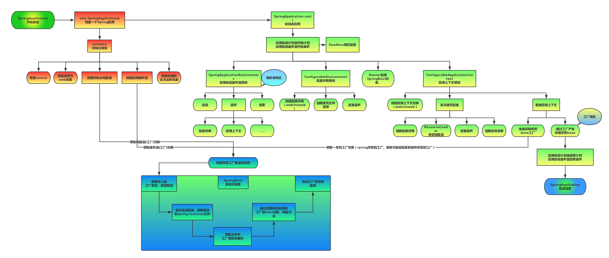

## springboot 启动源码

### 流程图



1. 创建 SpringApplication
2. 执行 SpringApplication.run()

### main方法

```java
@SpringBootApplication
public class SpringBootDemoApplication {

    public static void main(String[] args) {
        SpringApplication.run(SpringBootDemoApplication.class, args);
    }
}
```

### SpringApplication

```java
public class SpringApplication {
    // 启动方法
    public static ConfigurableApplicationContext run(Class<?> primarySource, String... args) {
		return run(new Class<?>[] { primarySource }, args);
	}

    // 创建 应用
    public static ConfigurableApplicationContext run(Class<?>[] primarySources, String[] args) {
        // run(args)
		return new SpringApplication(primarySources).run(args);
	}

    // 构造函数
    public SpringApplication(Class<?>... primarySources) {
		this(null, primarySources);
	}

    public SpringApplication(ResourceLoader resourceLoader, Class<?>... primarySources) {
		//1、初始化资源加载器
        this.resourceLoader = resourceLoader;
        //2、断言资源加载类不能为 null
        Assert.notNull(primarySources, "PrimarySources must not be null");
        //3、初始化加载资源类集合并去重
        this.primarySources = new LinkedHashSet<>(Arrays.asList(primarySources));
        //4、推断应用类型是Standard还是Web
        this.webApplicationType = WebApplicationType.deduceFromClasspath();
        //5、设置应用上下文初始化器
        setInitializers((Collection)getSpringFactoriesInstances(ApplicationContextInitializer.class));
        //6、设置监听器
        setListeners((Collection)getSpringFactoriesInstances(ApplicationListener.class));
        //7、推断应用入口类
        this.mainApplicationClass = deduceMainApplicationClass();
	}

    private Class<?> deduceMainApplicationClass() {
		try {
			StackTraceElement[] stackTrace = new RuntimeException().getStackTrace();
			for (StackTraceElement stackTraceElement : stackTrace) {
                // 查找 main 方法
				if ("main".equals(stackTraceElement.getMethodName())) {
					return Class.forName(stackTraceElement.getClassName());
				}
			}
		}
		catch (ClassNotFoundException ex) {
			// Swallow and continue
		}
		return null;
	}

    private <T> Collection<T> getSpringFactoriesInstances(Class<T> type) {
		return getSpringFactoriesInstances(type, new Class<?>[] {});
	}

// 使用 SpringFactoriesLoader 加载配置类
	private <T> Collection<T> getSpringFactoriesInstances(Class<T> type, Class<?>[] parameterTypes, Object... args) {
        // 获取类加载器
		ClassLoader classLoader = getClassLoader();
		
		Set<String> names = new LinkedHashSet<>(SpringFactoriesLoader.loadFactoryNames(type, classLoader));
        // 创建配置类实例
		List<T> instances = createSpringFactoriesInstances(type, parameterTypes, classLoader, args, names);
        // 排序配置类实例
		AnnotationAwareOrderComparator.sort(instances);
		return instances;
	}

// 创建配置类实例
    private <T> List<T> createSpringFactoriesInstances(Class<T> type, Class<?>[] parameterTypes,
			ClassLoader classLoader, Object[] args, Set<String> names) {
		List<T> instances = new ArrayList<>(names.size());
		for (String name : names) {
			try {
                // 反射创建实例
				Class<?> instanceClass = ClassUtils.forName(name, classLoader);
				Assert.isAssignable(type, instanceClass);
				Constructor<?> constructor = instanceClass.getDeclaredConstructor(parameterTypes);
				T instance = (T) BeanUtils.instantiateClass(constructor, args);
				instances.add(instance);
			}
			catch (Throwable ex) {
				throw new IllegalArgumentException("Cannot instantiate " + type + " : " + name, ex);
			}
		}
		return instances;
	}

    public ClassLoader getClassLoader() {
		if (this.resourceLoader != null) {
			return this.resourceLoader.getClassLoader();
		}
        // 默认的类加载器
		return ClassUtils.getDefaultClassLoader();
	}
}
```

#### SpringFactoriesLoader

```java
public final class SpringFactoriesLoader {
    // 位置
    public static final String FACTORIES_RESOURCE_LOCATION = "META-INF/spring.factories";
    // 缓存
    private static final Map<ClassLoader, MultiValueMap<String, String>> cache = new ConcurrentReferenceHashMap<>();

    public static List<String> loadFactoryNames(Class<?> factoryType, @Nullable ClassLoader classLoader) {
		String factoryTypeName = factoryType.getName();
		return loadSpringFactories(classLoader).getOrDefault(factoryTypeName, Collections.emptyList());
	}

	private static Map<String, List<String>> loadSpringFactories(@Nullable ClassLoader classLoader) {
		MultiValueMap<String, String> result = cache.get(classLoader);
		if (result != null) {
			return result;
		}

		try {
			Enumeration<URL> urls = (classLoader != null ?
					classLoader.getResources(FACTORIES_RESOURCE_LOCATION) :
					ClassLoader.getSystemResources(FACTORIES_RESOURCE_LOCATION));
			result = new LinkedMultiValueMap<>();
			while (urls.hasMoreElements()) {
				URL url = urls.nextElement();
				UrlResource resource = new UrlResource(url);
				Properties properties = PropertiesLoaderUtils.loadProperties(resource);
				for (Map.Entry<?, ?> entry : properties.entrySet()) {
					String factoryTypeName = ((String) entry.getKey()).trim();
					for (String factoryImplementationName : StringUtils.commaDelimitedListToStringArray((String) entry.getValue())) {
						result.add(factoryTypeName, factoryImplementationName.trim());
					}
				}
			}
			cache.put(classLoader, result);
			return result;
		}
		catch (IOException ex) {
			throw new IllegalArgumentException("Unable to load factories from location [" +
					FACTORIES_RESOURCE_LOCATION + "]", ex);
		}
	}
}
```

### run
```java
public class SpringApplication {
    private static final String SYSTEM_PROPERTY_JAVA_AWT_HEADLESS = "java.awt.headless";

    public static final String DEFAULT_SERVLET_WEB_CONTEXT_CLASS = "org.springframework.boot."
			+ "web.servlet.context.AnnotationConfigServletWebServerApplicationContext";

    public ConfigurableApplicationContext run(String... args) {
        // StopWatch是一个计时类，用来记录任务的开始时间，结束时间等
		StopWatch stopWatch = new StopWatch();
        // 记录
		stopWatch.start();
        // 声明上下文
		ConfigurableApplicationContext context = null;
        // 异常报告器
		Collection<SpringBootExceptionReporter> exceptionReporters = new ArrayList<>();
		configureHeadlessProperty();
        // 获取监听器
		SpringApplicationRunListeners listeners = getRunListeners(args);
        // 执行监听器
		listeners.starting();
		try {
			ApplicationArguments applicationArguments = new DefaultApplicationArguments(args);
            // 配置环境
			ConfigurableEnvironment environment = prepareEnvironment(listeners, applicationArguments);
			configureIgnoreBeanInfo(environment);
            // 打印Banner
			Banner printedBanner = printBanner(environment);
            // 创建应用上下文
			context = createApplicationContext();
			exceptionReporters = getSpringFactoriesInstances(SpringBootExceptionReporter.class,
					new Class[] { ConfigurableApplicationContext.class }, context);

            // 准备上下文
			prepareContext(context, environment, listeners, applicationArguments, printedBanner);
            // 刷新上下文
			refreshContext(context);
            // 刷新上下文后执行
			afterRefresh(context, applicationArguments);
            // 停止计时器
			stopWatch.stop();
			if (this.logStartupInfo) {
				new StartupInfoLogger(this.mainApplicationClass).logStarted(getApplicationLog(), stopWatch);
			}
            // 开始执行监听器
			listeners.started(context);
            // 调用 Runner 类
			callRunners(context, applicationArguments);
		}
		catch (Throwable ex) {
			handleRunFailure(context, ex, exceptionReporters, listeners);
			throw new IllegalStateException(ex);
		}

		try {
            // 监听器执行中
			listeners.running(context);
		}
		catch (Throwable ex) {
			handleRunFailure(context, ex, exceptionReporters, null);
			throw new IllegalStateException(ex);
		}
		return context;
	}

    private void configureHeadlessProperty() {
		System.setProperty(SYSTEM_PROPERTY_JAVA_AWT_HEADLESS,
				System.getProperty(SYSTEM_PROPERTY_JAVA_AWT_HEADLESS, Boolean.toString(this.headless)));
	}

    private SpringApplicationRunListeners getRunListeners(String[] args) {
		Class<?>[] types = new Class<?>[] { SpringApplication.class, String[].class };
		return new SpringApplicationRunListeners(logger,
				getSpringFactoriesInstances(SpringApplicationRunListener.class, types, this, args));
	}

    private ConfigurableEnvironment prepareEnvironment(SpringApplicationRunListeners listeners,
			ApplicationArguments applicationArguments) {
		// Create and configure the environment
		ConfigurableEnvironment environment = getOrCreateEnvironment();
		configureEnvironment(environment, applicationArguments.getSourceArgs());
		ConfigurationPropertySources.attach(environment);
		listeners.environmentPrepared(environment);
		bindToSpringApplication(environment);
		if (!this.isCustomEnvironment) {
			environment = new EnvironmentConverter(getClassLoader()).convertEnvironmentIfNecessary(environment,
					deduceEnvironmentClass());
		}
		ConfigurationPropertySources.attach(environment);
		return environment;
	}

    protected ConfigurableApplicationContext createApplicationContext() {
		Class<?> contextClass = this.applicationContextClass;
		if (contextClass == null) {
			try {
                // web l类型
				switch (this.webApplicationType) {
				case SERVLET:
					contextClass = Class.forName(DEFAULT_SERVLET_WEB_CONTEXT_CLASS);
					break;
				case REACTIVE:
					contextClass = Class.forName(DEFAULT_REACTIVE_WEB_CONTEXT_CLASS);
					break;
				default:
					contextClass = Class.forName(DEFAULT_CONTEXT_CLASS);
				}
			}
			catch (ClassNotFoundException ex) {
				throw new IllegalStateException(
						"Unable create a default ApplicationContext, please specify an ApplicationContextClass", ex);
			}
		}
		return (ConfigurableApplicationContext) BeanUtils.instantiateClass(contextClass);
	}
}
```
### 启动Spring