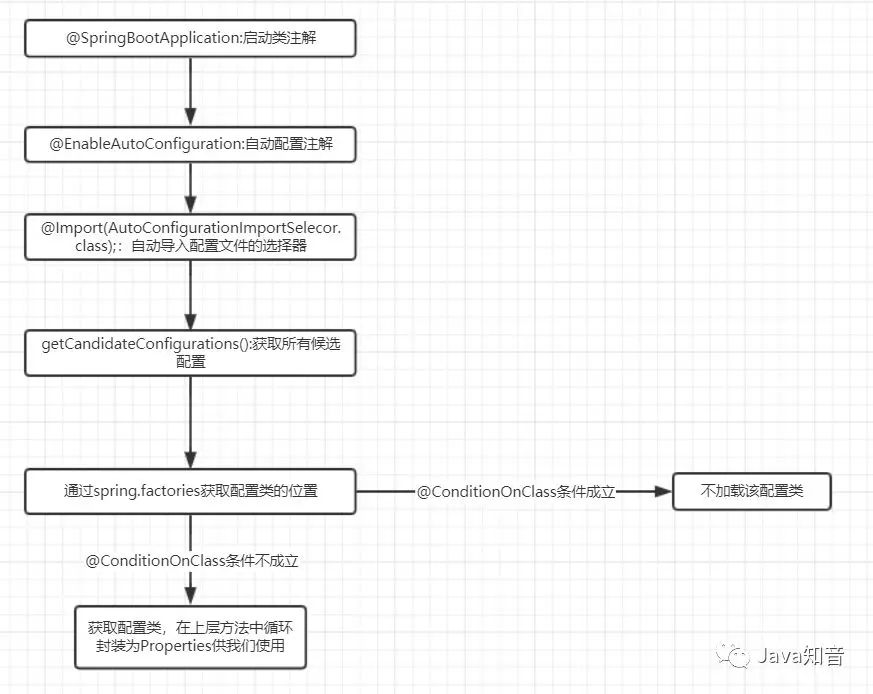

## @SpringBootApplication

### 原理图



```java
@Target(ElementType.TYPE)
@Retention(RetentionPolicy.RUNTIME)
@Documented
@Inherited
@SpringBootConfiguration
@EnableAutoConfiguration
@ComponentScan(excludeFilters = { 
            @Filter(type = FilterType.CUSTOM, classes = TypeExcludeFilter.class),
		    @Filter(type = FilterType.CUSTOM, classes = AutoConfigurationExcludeFilter.class) 
        })
public @interface SpringBootApplication {
	@AliasFor(annotation = EnableAutoConfiguration.class)
	Class<?>[] exclude() default {};

	@AliasFor(annotation = EnableAutoConfiguration.class)
	String[] excludeName() default {};

    // 组件扫描的基本包
	@AliasFor(annotation = ComponentScan.class, attribute = "basePackages")
	String[] scanBasePackages() default {};

	@AliasFor(annotation = ComponentScan.class, attribute = "basePackageClasses")
	Class<?>[] scanBasePackageClasses() default {};

	@AliasFor(annotation = ComponentScan.class, attribute = "nameGenerator")
	Class<? extends BeanNameGenerator> nameGenerator() default BeanNameGenerator.class;

	@AliasFor(annotation = Configuration.class)
	boolean proxyBeanMethods() default true;
}
```

* @SpringBootConfiguration
标注当前类是配置类，这个注解继承自 `@Configuration`。

并会将当前类内声明的一个或多个以 `@Bean` 注解标记的方法的实例纳入到srping容器中，并且实例名就是方法名

* @EnableAutoConfiguration

是自动配置的注解，这个注解会根据我们添加的组件jar来完成一些默认配置

* @ComponentScan

扫描当前包及其子包下被 `@Component` `@Controller` `@Service` `@Repository` 等注解标记的类并纳入到spring容器中进行管理

## @EnableAutoConfiguration

导入 `AutoConfigurationImportSelector`

```java
@Target(ElementType.TYPE)
@Retention(RetentionPolicy.RUNTIME)
@Documented
@Inherited
@AutoConfigurationPackage
@Import(AutoConfigurationImportSelector.class)
public @interface EnableAutoConfiguration {

	String ENABLED_OVERRIDE_PROPERTY = "spring.boot.enableautoconfiguration";

	Class<?>[] exclude() default {};

	String[] excludeName() default {};

}
```

### @AutoConfigurationPackage

作用是将 添加该注解的类所在的package 作为 自动配置package 进行管理

### @Import

@Import通过快速导入的方式实现把实例加入spring的IOC容器中

```java
// 收集需要导入的配置类
public interface ImportSelector {
	String[] selectImports(AnnotationMetadata importingClassMetadata);
	default Predicate<String> getExclusionFilter() {
		return null;
	}
}
```

### AutoConfigurationImportSelector

```java
public class AutoConfigurationImportSelector implements DeferredImportSelector, BeanClassLoaderAware,
		ResourceLoaderAware, BeanFactoryAware, EnvironmentAware, Ordered {

	@Override
	public String[] selectImports(AnnotationMetadata annotationMetadata) {
		if (!isEnabled(annotationMetadata)) {
			return NO_IMPORTS;
		}
		AutoConfigurationEntry autoConfigurationEntry = getAutoConfigurationEntry(annotationMetadata);
		return StringUtils.toStringArray(autoConfigurationEntry.getConfigurations());
	}

	protected AutoConfigurationEntry getAutoConfigurationEntry(AnnotationMetadata annotationMetadata) {
		if (!isEnabled(annotationMetadata)) {
			return EMPTY_ENTRY;
		}
		AnnotationAttributes attributes = getAttributes(annotationMetadata);
		List<String> configurations = getCandidateConfigurations(annotationMetadata, attributes);
		configurations = removeDuplicates(configurations);
		Set<String> exclusions = getExclusions(annotationMetadata, attributes);
		checkExcludedClasses(configurations, exclusions);
		configurations.removeAll(exclusions);
		configurations = getConfigurationClassFilter().filter(configurations);
		fireAutoConfigurationImportEvents(configurations, exclusions);
		return new AutoConfigurationEntry(configurations, exclusions);
	}

	// 从  META-INF/spring.factories 文件加载 EnableAutoConfiguration 注解的类
    protected List<String> getCandidateConfigurations(AnnotationMetadata metadata, AnnotationAttributes attributes) {
        // 加载 spring.factories 文件
		List<String> configurations = SpringFactoriesLoader.loadFactoryNames(getSpringFactoriesLoaderFactoryClass(),
				getBeanClassLoader());
		Assert.notEmpty(configurations, "No auto configuration classes found in META-INF/spring.factories. If you "
				+ "are using a custom packaging, make sure that file is correct.");
		return configurations;
	}
}
```

`spring-boot-autoconfigure-**.jar` jar文件下 `META-INF/spring.factories`

> `META-INF/spring.factories` 用来加载外部jar的配置

```factories
// 注解
org.springframework.boot.autoconfigure.EnableAutoConfiguration=\
// redis 自动配置
org.springframework.boot.autoconfigure.data.redis.RedisAutoConfiguration,\
```
配置类

```java
@Configuration(proxyBeanMethods = false)
// 条件加载
@ConditionalOnClass(RedisOperations.class)
// 加载参数
@EnableConfigurationProperties(RedisProperties.class)
// 导入 配置类
@Import({ LettuceConnectionConfiguration.class, JedisConnectionConfiguration.class })
public class RedisAutoConfiguration {

	// 注入Bean
	@Bean
	@ConditionalOnMissingBean(name = "redisTemplate")
	public RedisTemplate<Object, Object> redisTemplate(RedisConnectionFactory redisConnectionFactory)
			throws UnknownHostException {
		RedisTemplate<Object, Object> template = new RedisTemplate<>();
		template.setConnectionFactory(redisConnectionFactory);
		return template;
	}

	@Bean
	@ConditionalOnMissingBean
	public StringRedisTemplate stringRedisTemplate(RedisConnectionFactory redisConnectionFactory)
			throws UnknownHostException {
		StringRedisTemplate template = new StringRedisTemplate();
		template.setConnectionFactory(redisConnectionFactory);
		return template;
	}

}
```