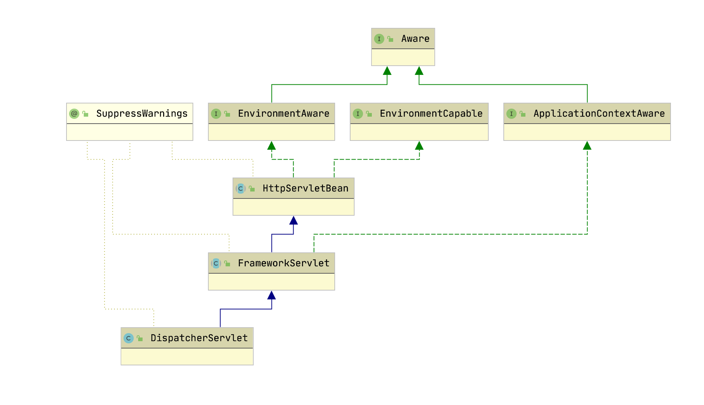
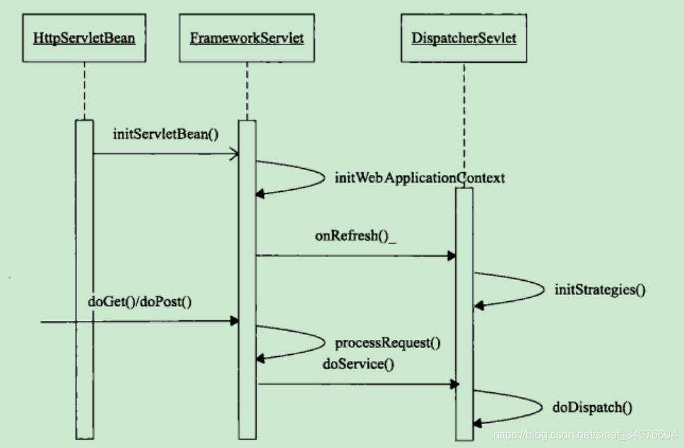
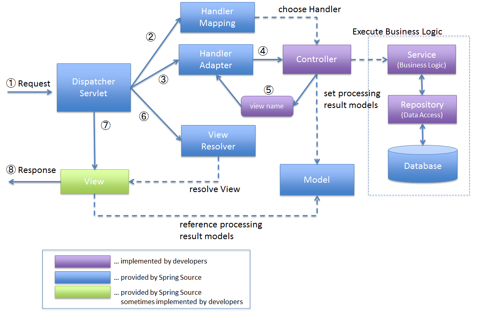

## DispatcherServlet

前端控制器模式

### 结构图



## 初始化




## 工作流程



### 流程说明

1. 客户端向服务器发送http请求,请求被前端控制器 `dispatcherServlet` 捕获

2. `dispatcherServlet` 根据配置,对url进行解析, 在根据uri调用 `HandlerMapping` 获取该 `Handler` 配置的有关对象(包括 `Handler` 对象以及 `Handler` 对象对应的拦截器), 最后以 `HandlerExecutionChain` 的形式返回

3. `dispatcherServlet` 根据获得的 `Handler` ,选择一个合适 `HandlerAdapter` (如果获得成功,就将执行拦截器对应的 `preHandler` 方法)

4. 适配器 `HandlerAdapter` 将 `Request` 中的模型数据传入 `Handler(Controller)`

5. `Handler(Controller)` 执行结束后,返回一个 `ModelAndView` 对象
6. 根据返回的 `ModelAndView` ,选择一个合适的已经注册到 `Spring `容器的 `ViewResolver` ,返回给 `dispatcherServlet`

7. `viewResolver` 结合 `Model` 和 `View` 渲染视图

8. `View` 视图负责将渲染结果返回给客户端

### 如何进入分发中心

#### HttpServlet

请求先到达 HttpServlet 的service方法，service决定调用具体的doGet，doPost等方法

```java
// HttpServlet 提供了对 Http 协议的 Servlet 实现
// GenericServlet 提供了默认的生命周期管理
public abstract class HttpServlet extends GenericServlet {
    @Override
    public void service(ServletRequest req, ServletResponse res)
        throws ServletException, IOException
    {
        HttpServletRequest  request;
        HttpServletResponse response;
        
        if (!(req instanceof HttpServletRequest &&
                res instanceof HttpServletResponse)) {
            throw new ServletException("non-HTTP request or response");
        }

        // 将 Servlet 转换成 HttpServlet
        request = (HttpServletRequest) req;
        response = (HttpServletResponse) res;

        // 调用
        service(request, response);
    }

    // service 方法
    protected void service(HttpServletRequest req, HttpServletResponse resp)
        throws ServletException, IOException
    {
        // 获取请求方法
        String method = req.getMethod();

        // 判断方法类型
        if (method.equals(METHOD_GET)) {
            long lastModified = getLastModified(req);
            if (lastModified == -1) {
                // servlet doesn't support if-modified-since, no reason
                // to go through further expensive logic
                doGet(req, resp);
            } else {
                long ifModifiedSince = req.getDateHeader(HEADER_IFMODSINCE);
                if (ifModifiedSince < lastModified) {
                    // If the servlet mod time is later, call doGet()
                    // Round down to the nearest second for a proper compare
                    // A ifModifiedSince of -1 will always be less
                    maybeSetLastModified(resp, lastModified);
                    doGet(req, resp);
                } else {
                    resp.setStatus(HttpServletResponse.SC_NOT_MODIFIED);
                }
            }

        } else if (method.equals(METHOD_HEAD)) {
            long lastModified = getLastModified(req);
            maybeSetLastModified(resp, lastModified);
            doHead(req, resp);

        } else if (method.equals(METHOD_POST)) {
            doPost(req, resp);
            
        } else if (method.equals(METHOD_PUT)) {
            doPut(req, resp);
            
        } else if (method.equals(METHOD_DELETE)) {
            doDelete(req, resp);
            
        } else if (method.equals(METHOD_OPTIONS)) {
            doOptions(req,resp);
            
        } else if (method.equals(METHOD_TRACE)) {
            doTrace(req,resp);
            
        } else {
            //
            // Note that this means NO servlet supports whatever
            // method was requested, anywhere on this server.
            //

            String errMsg = lStrings.getString("http.method_not_implemented");
            Object[] errArgs = new Object[1];
            errArgs[0] = method;
            errMsg = MessageFormat.format(errMsg, errArgs);
            
            resp.sendError(HttpServletResponse.SC_NOT_IMPLEMENTED, errMsg);
        }
    }
}
```

#### FrameworkServlet

1. FrameworkServlet 重写了 HttpServlet的doGet等方法，于是就会调用FrameworkServlet的doGet等方法

2. 在doGet等方法中都会调用 processRequest(request, response)方法

3. 调用doService(request, response). 由于doService在FrameworkServlet中为抽象方法，所以调用DispatcherServlet重写的doService方法

```java
public abstract class FrameworkServlet extends HttpServletBean implements ApplicationContextAware {

    @Override
	protected final void doGet(HttpServletRequest request, HttpServletResponse response)
			throws ServletException, IOException {

		processRequest(request, response);
    }
    
    protected final void processRequest(HttpServletRequest request, HttpServletResponse response)
			throws ServletException, IOException {

		long startTime = System.currentTimeMillis();
		Throwable failureCause = null;

		LocaleContext previousLocaleContext = LocaleContextHolder.getLocaleContext();
		LocaleContext localeContext = buildLocaleContext(request);

		RequestAttributes previousAttributes = RequestContextHolder.getRequestAttributes();
		ServletRequestAttributes requestAttributes = buildRequestAttributes(request, response, previousAttributes);

		WebAsyncManager asyncManager = WebAsyncUtils.getAsyncManager(request);
		asyncManager.registerCallableInterceptor(FrameworkServlet.class.getName(), new RequestBindingInterceptor());

		initContextHolders(request, localeContext, requestAttributes);

		try {
            // 抽象方法，调用 DispatcherServlet 重写的 doService方法
			doService(request, response);
		}
		catch (ServletException | IOException ex) {
			failureCause = ex;
			throw ex;
		}
		catch (Throwable ex) {
			failureCause = ex;
			throw new NestedServletException("Request processing failed", ex);
		}

		finally {
			resetContextHolders(request, previousLocaleContext, previousAttributes);
			if (requestAttributes != null) {
				requestAttributes.requestCompleted();
			}
			logResult(request, response, failureCause, asyncManager);
			publishRequestHandledEvent(request, response, startTime, failureCause);
		}
	}
}
```

#### DispatcherServlet

调用 doDispatch(request, response)

```java
public class DispatcherServlet extends FrameworkServlet {

    @Override
	protected void doService(HttpServletRequest request, HttpServletResponse response) throws Exception {
		logRequest(request);

		// Keep a snapshot of the request attributes in case of an include,
		// to be able to restore the original attributes after the include.
		Map<String, Object> attributesSnapshot = null;
		if (WebUtils.isIncludeRequest(request)) {
			attributesSnapshot = new HashMap<>();
			Enumeration<?> attrNames = request.getAttributeNames();
			while (attrNames.hasMoreElements()) {
				String attrName = (String) attrNames.nextElement();
				if (this.cleanupAfterInclude || attrName.startsWith(DEFAULT_STRATEGIES_PREFIX)) {
					attributesSnapshot.put(attrName, request.getAttribute(attrName));
				}
			}
		}

		// Make framework objects available to handlers and view objects.
		request.setAttribute(WEB_APPLICATION_CONTEXT_ATTRIBUTE, getWebApplicationContext());
		request.setAttribute(LOCALE_RESOLVER_ATTRIBUTE, this.localeResolver);
		request.setAttribute(THEME_RESOLVER_ATTRIBUTE, this.themeResolver);
		request.setAttribute(THEME_SOURCE_ATTRIBUTE, getThemeSource());

		if (this.flashMapManager != null) {
			FlashMap inputFlashMap = this.flashMapManager.retrieveAndUpdate(request, response);
			if (inputFlashMap != null) {
				request.setAttribute(INPUT_FLASH_MAP_ATTRIBUTE, Collections.unmodifiableMap(inputFlashMap));
			}
			request.setAttribute(OUTPUT_FLASH_MAP_ATTRIBUTE, new FlashMap());
			request.setAttribute(FLASH_MAP_MANAGER_ATTRIBUTE, this.flashMapManager);
		}

		try {
			doDispatch(request, response);
		}
		finally {
			if (!WebAsyncUtils.getAsyncManager(request).isConcurrentHandlingStarted()) {
				// Restore the original attribute snapshot, in case of an include.
				if (attributesSnapshot != null) {
					restoreAttributesAfterInclude(request, attributesSnapshot);
				}
			}
		}
    }
    
    // 请求分发中心
    protected void doDispatch(HttpServletRequest request, HttpServletResponse response) throws Exception {
		// 定义一个已处理请求，指向 request
		HttpServletRequest processedRequest = request;
		// 定义处理器执行链 内部封装拦截器列表和处理器
		HandlerExecutionChain mappedHandler = null;
		boolean multipartRequestParsed = false;

		// 获取和当前请求相关的异步管理器
		WebAsyncManager asyncManager = WebAsyncUtils.getAsyncManager(request);

		try {
			ModelAndView mv = null;
			Exception dispatchException = null;

			try {
				// 判断是否有文件上传，如果是，返回一个新的请求
				processedRequest = checkMultipart(request);
				multipartRequestParsed = (processedRequest != request);

				// getHandler 中遍历 HandlerMapping，获取对应的 HandlerExecutionChain
				// HandlerExecutionChain，包含 HandlerInterceptor 和HandlerMethod
				// Determine handler for the current request.
				mappedHandler = getHandler(processedRequest);
				if (mappedHandler == null) {
					// not found
					noHandlerFound(processedRequest, response);
					return;
				}

				// 获取支持该处理器的处理适配器
				HandlerAdapter ha = getHandlerAdapter(mappedHandler.getHandler());

				// 判断请求内容是否需要修改，如果未修改直接返回，浏览器使用本地缓存
				String method = request.getMethod();
				boolean isGet = "GET".equals(method);
				if (isGet || "HEAD".equals(method)) {
					long lastModified = ha.getLastModified(request, mappedHandler.getHandler());
					if (new ServletWebRequest(request, response).checkNotModified(lastModified) && isGet) {
						return;
					}
				}

				// 如果有拦截器的话，会执行拦截器的 preHandler 方法
				if (!mappedHandler.applyPreHandle(processedRequest, response)) {
					// 拦截器生效 返回
					return;
				}
				// 对请求进行处理，传入请求、响应、对应的处理器
				mv = ha.handle(processedRequest, response, mappedHandler.getHandler());

				// 判断是否是异步请求，后续操作均通过异步处理
				if (asyncManager.isConcurrentHandlingStarted()) {
					return;
				}

				// 当view为空时，根据request设置默认view
				applyDefaultViewName(processedRequest, mv);

				// 执行拦截器的 postHandle
				mappedHandler.applyPostHandle(processedRequest, response, mv);
			}
			catch (Exception ex) {
				// 发送异常 保存到 dispatchException
				dispatchException = ex;
			}
			catch (Throwable err) {
				// As of 4.3, we're processing Errors thrown from handler methods as well,
				// making them available for @ExceptionHandler methods and other scenarios.
				dispatchException = new NestedServletException("Handler dispatch failed", err);
			}

			// 对执行结果进行处理，包括处理适配器的结果和发送的异常
			processDispatchResult(processedRequest, response, mappedHandler, mv, dispatchException);
		}
		catch (Exception ex) {
			triggerAfterCompletion(processedRequest, response, mappedHandler, ex);
		}
		catch (Throwable err) {
			triggerAfterCompletion(processedRequest, response, mappedHandler,
					new NestedServletException("Handler processing failed", err));
		}
		finally {
			// 判断是否是异步请求
			if (asyncManager.isConcurrentHandlingStarted()) {
				// Instead of postHandle and afterCompletion
				if (mappedHandler != null) {
					mappedHandler.applyAfterConcurrentHandlingStarted(processedRequest, response);
				}
			}
			else {
				// 删除上传资源
				// Clean up any resources used by a multipart request.
				if (multipartRequestParsed) {
					cleanupMultipart(processedRequest);
				}
			}
		}
	}
}
```

## 请求分发详解

### 文件上传请求

```java
protected HttpServletRequest checkMultipart(HttpServletRequest request) throws MultipartException {
    // 判断是否为多块请求
    if (this.multipartResolver != null && this.multipartResolver.isMultipart(request)) {
        if (WebUtils.getNativeRequest(request, MultipartHttpServletRequest.class) != null) {
            if (request.getDispatcherType().equals(DispatcherType.REQUEST)) {
                logger.trace("Request already resolved to MultipartHttpServletRequest, e.g. by MultipartFilter");
            }
        }
        // 包含异常
        else if (hasMultipartException(request)) {
            logger.debug("Multipart resolution previously failed for current request - " +
                    "skipping re-resolution for undisturbed error rendering");
        }
        else {
            try {
                // 使用多块解析器解析多块请求，并返回多块请求解析器包装过的多块请求
                return this.multipartResolver.resolveMultipart(request);
            }
            catch (MultipartException ex) {
                if (request.getAttribute(WebUtils.ERROR_EXCEPTION_ATTRIBUTE) != null) {
                    logger.debug("Multipart resolution failed for error dispatch", ex);
                    // Keep processing error dispatch with regular request handle below
                }
                else {
                    throw ex;
                }
            }
        }
    }
    // If not returned before: return original request.
    return request;
}
```

### 查找请求处理器

Spring mvc 将请求处理的查找和执行分离开

```java
@Nullable
protected HandlerExecutionChain getHandler(HttpServletRequest request) throws Exception {
    if (this.handlerMappings != null) {
        // 遍历全部的处理器映射
        for (HandlerMapping mapping : this.handlerMappings) {
            // 获取与本次请求适配的处理器链
            HandlerExecutionChain handler = mapping.getHandler(request);
            // 返回，有多个处理器链只返回第一个
            if (handler != null) {
                return handler;
            }
        }
    }
    return null;
}
```

### 获取处理适配器

```java
protected HandlerAdapter getHandlerAdapter(Object handler) throws ServletException {
    if (this.handlerAdapters != null) {
        // 遍历处理适配器列表，调用supports方法，找到支持改处理器的适配器
        for (HandlerAdapter adapter : this.handlerAdapters) {
            // 找到后返回
            if (adapter.supports(handler)) {
                return adapter;
            }
        }
    }
    
    throw new ServletException("No adapter for handler [" + handler +
            "]: The DispatcherServlet configuration needs to include a HandlerAdapter that supports this handler");
}
```

### 处理Http缓存

为了提高 Http 请求效率，允许浏览器对Get 请求的获取到的资源进行缓存

```java
// 判断请求内容是否需要修改，如果未修改直接返回，浏览器使用本地缓存
String method = request.getMethod();
boolean isGet = "GET".equals(method);
// 只支持 "get head" 请求
if (isGet || "HEAD".equals(method)) {
    // 获取最后一次修改的时间
    long lastModified = ha.getLastModified(request, mappedHandler.getHandler());
    // 检查当前请求中携带的缓存信息是否过期
    if (new ServletWebRequest(request, response).checkNotModified(lastModified) && isGet) {
        return;
    }
}
```

### 执行前置拦截器链

```java
public class HandlerExecutionChain {
    boolean applyPreHandle(HttpServletRequest request, HttpServletResponse response) throws Exception {
		// 获取当前处理器执行链的所有拦截器
		HandlerInterceptor[] interceptors = getInterceptors();
		if (!ObjectUtils.isEmpty(interceptors)) {
			// 遍历拦截器
			for (int i = 0; i < interceptors.length; i++) {
				HandlerInterceptor interceptor = interceptors[i];
				// 执行拦截器的preHandle方法
				// 返回 false,停止执行
				if (!interceptor.preHandle(request, response, this.handler)) {
					triggerAfterCompletion(request, response, null);
					return false;
				}
				// 返回 true， 拦截器索引设为当前遍历索引
				this.interceptorIndex = i;
			}
		}
		// 执行完毕
		return true;
    }
}
```

### 处理适配器执行

```java
// 对请求进行处理，传入请求、响应、对应的处理器
mv = ha.handle(processedRequest, response, mappedHandler.getHandler());
```

### 返回值视图名处理

```java
private void applyDefaultViewName(HttpServletRequest request, @Nullable ModelAndView mv) throws Exception {
    // mv 不为空 且不包含视图
    if (mv != null && !mv.hasView()) {
        // 获取默认的视图名
        String defaultViewName = getDefaultViewName(request);
        if (defaultViewName != null) {
            // 默认的视图名不为空，则将其设置为 ModelAndView 的视图名
            mv.setViewName(defaultViewName);
        }
    }
}

@Nullable
protected String getDefaultViewName(HttpServletRequest request) throws Exception {
    return (this.viewNameTranslator != null ? this.viewNameTranslator.getViewName(request) : null);
}
```

### 执行后置拦截器链

```java
public class HandlerExecutionChain {
    void applyPostHandle(HttpServletRequest request, HttpServletResponse response, @Nullable ModelAndView mv)
			throws Exception {

		HandlerInterceptor[] interceptors = getInterceptors();
		if (!ObjectUtils.isEmpty(interceptors)) {
			for (int i = interceptors.length - 1; i >= 0; i--) {
                HandlerInterceptor interceptor = interceptors[i];
                // 执行，无返回值
				interceptor.postHandle(request, response, this.handler, mv);
			}
		}
    }
}
```

### 处理返回值和响应

```java
private void processDispatchResult(HttpServletRequest request, HttpServletResponse response,
        @Nullable HandlerExecutionChain mappedHandler, @Nullable ModelAndView mv,
        @Nullable Exception exception) throws Exception {

    // 标记是否是 error 视图
    boolean errorView = false;

    // 发生异常
    if (exception != null) {
        if (exception instanceof ModelAndViewDefiningException) {
            logger.debug("ModelAndViewDefiningException encountered", exception);
            mv = ((ModelAndViewDefiningException) exception).getModelAndView();
        }
        else {
            // 获取处理器
            Object handler = (mappedHandler != null ? mappedHandler.getHandler() : null);
            // 执行process处理器的异常方法，获取处理了异常结果后得到的ModelAndView结果
            mv = processHandlerException(request, response, handler, exception);
            // 返回异常视图
            errorView = (mv != null);
        }
    }

    // Did the handler return a view to render?
    // 视图和模型不为空，且视图与模型没哟标记为被清理
    if (mv != null && !mv.wasCleared()) {
        // 执行渲染视图的操作
        render(mv, request, response);
        // 如果是异常视图，渲染后需要清理请求属性的异常信息
        if (errorView) {
            WebUtils.clearErrorRequestAttributes(request);
        }
    }
    else {
        // 视图为空，打印日志
        if (logger.isTraceEnabled()) {
            logger.trace("No view rendering, null ModelAndView returned.");
        }
    }

    // 如果异步处理已经开始，则直接返回结束执行
    if (WebAsyncUtils.getAsyncManager(request).isConcurrentHandlingStarted()) {
        // Concurrent handling started during a forward
        return;
    }

    // 触发拦截器链的完成后方法
    if (mappedHandler != null) {
        // Exception (if any) is already handled..
        mappedHandler.triggerAfterCompletion(request, response, null);
    }
}
```

### 执行完成拦截器链

在请求过程中无论是 preHandle 提前返回 false,还是处理过程中发生了异常，或是正常处理完成，都会调用拦截器链的该方法

```java
public class HandlerExecutionChain {
    void triggerAfterCompletion(HttpServletRequest request, HttpServletResponse response, @Nullable Exception ex)
			throws Exception {

		HandlerInterceptor[] interceptors = getInterceptors();
		if (!ObjectUtils.isEmpty(interceptors)) {
			// 以 interceptorIndex 索引开始倒序遍历
			for (int i = this.interceptorIndex; i >= 0; i--) {
				HandlerInterceptor interceptor = interceptors[i];
				try {
					// 执行拦截器的 afterCompletion 方法
					interceptor.afterCompletion(request, response, this.handler, ex);
				}
				catch (Throwable ex2) {
					logger.error("HandlerInterceptor.afterCompletion threw exception", ex2);
				}
			}
		}
    }
}
```

### 清理资源

```java
protected void cleanupMultipart(HttpServletRequest request) {
    if (this.multipartResolver != null) {
        MultipartHttpServletRequest multipartRequest =
                WebUtils.getNativeRequest(request, MultipartHttpServletRequest.class);
        if (multipartRequest != null) {
            // 清理
            this.multipartResolver.cleanupMultipart(multipartRequest);
        }
    }
}
```