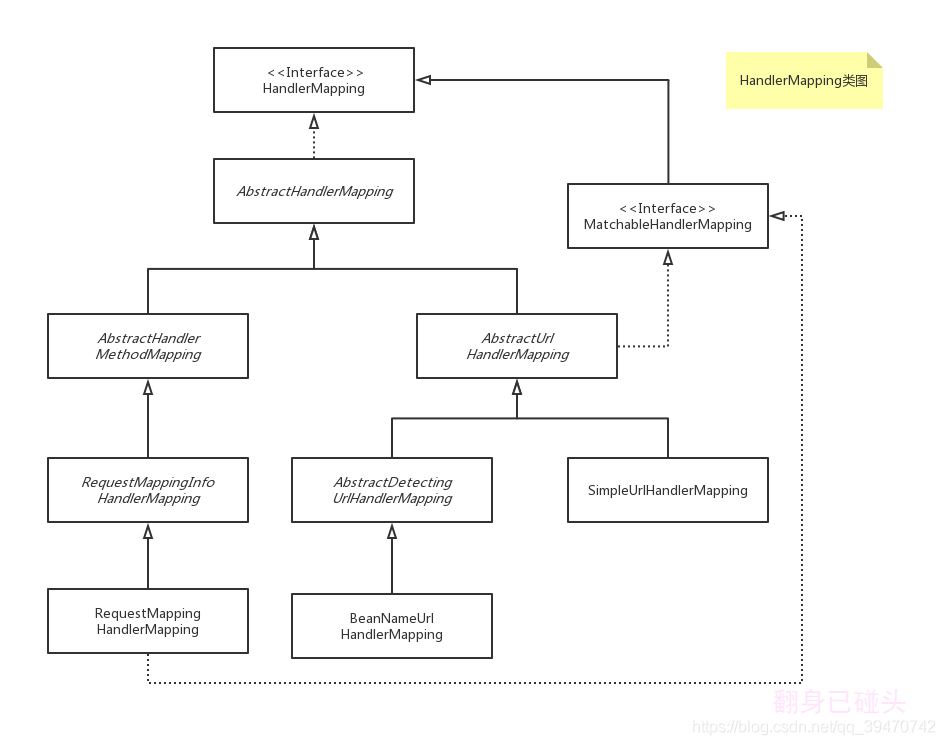

## @RequestMapping

用来处理请求地址映射的注解，可用于类或方法上

```java
@Target({ElementType.TYPE, ElementType.METHOD})
@Retention(RetentionPolicy.RUNTIME)
@Documented
@Mapping
public @interface RequestMapping {
    String name() default "";

    // 请求的实际地址
    @AliasFor("path")
    String[] value() default {};
    
    @AliasFor("value")
    String[] path() default {};
    // 请求的方法
    RequestMethod[] method() default {};
    // 指定request中必须包含某些参数值是，才让该方法处理
    String[] params() default {};
    // 指定request中必须包含某些指定的header值，才能让该方法处理请求
    String[] headers() default {};
    // 指定处理请求的提交内容类型（Content-Type）
    String[] consumes() default {};
    // 指定返回的内容类型，仅当request请求头中的(Accept)类型中包含该指定类型才返回
    String[] produces() default {};
}
```

## 注册



### RequestMappingHandlerMapping

继承了RequestMappingInfoHandlerMapping，处理方法的@ReqeustMapping注解，
将其与method handler与@ReqeustMapping注解构建的RequestMappingInfo关联。


```java
public class RequestMappingHandlerMapping extends RequestMappingInfoHandlerMapping
		implements MatchableHandlerMapping, EmbeddedValueResolverAware {

    public void afterPropertiesSet() {
		this.config = new RequestMappingInfo.BuilderConfiguration();
		this.config.setUrlPathHelper(getUrlPathHelper());
		this.config.setPathMatcher(getPathMatcher());
		this.config.setSuffixPatternMatch(useSuffixPatternMatch());
		this.config.setTrailingSlashMatch(useTrailingSlashMatch());
		this.config.setRegisteredSuffixPatternMatch(useRegisteredSuffixPatternMatch());
		this.config.setContentNegotiationManager(getContentNegotiationManager());

        // 调用父类 AbstractHandlerMethodMapping.afterPropertiesSet()
		super.afterPropertiesSet();
    }
    
    @Override
	protected boolean isHandler(Class<?> beanType) {
        // 判断是否是 Handler
		return (AnnotatedElementUtils.hasAnnotation(beanType, Controller.class) ||
				AnnotatedElementUtils.hasAnnotation(beanType, RequestMapping.class));
    }
    
    @Override
	@Nullable
	protected RequestMappingInfo getMappingForMethod(Method method, Class<?> handlerType) {
		RequestMappingInfo info = createRequestMappingInfo(method);
		if (info != null) {
			RequestMappingInfo typeInfo = createRequestMappingInfo(handlerType);
			if (typeInfo != null) {
				info = typeInfo.combine(info);
			}
			String prefix = getPathPrefix(handlerType);
			if (prefix != null) {
				info = RequestMappingInfo.paths(prefix).options(this.config).build().combine(info);
			}
		}
		return info;
    }
    
    @Nullable
	private RequestMappingInfo createRequestMappingInfo(AnnotatedElement element) {
		RequestMapping requestMapping = AnnotatedElementUtils.findMergedAnnotation(element, RequestMapping.class);
		RequestCondition<?> condition = (element instanceof Class ?
				getCustomTypeCondition((Class<?>) element) : getCustomMethodCondition((Method) element));
		return (requestMapping != null ? createRequestMappingInfo(requestMapping, condition) : null);
    }
    
    protected RequestMappingInfo createRequestMappingInfo(
			RequestMapping requestMapping, @Nullable RequestCondition<?> customCondition) {

		RequestMappingInfo.Builder builder = RequestMappingInfo
				.paths(resolveEmbeddedValuesInPatterns(requestMapping.path()))
				.methods(requestMapping.method())
				.params(requestMapping.params())
				.headers(requestMapping.headers())
				.consumes(requestMapping.consumes())
				.produces(requestMapping.produces())
				.mappingName(requestMapping.name());
		if (customCondition != null) {
			builder.customCondition(customCondition);
		}
		return builder.options(this.config).build();
	}
```

### AbstractHandlerMethodMapping

继承AbstractHandlerMapping,定义了method handler映射关系，每一个method handler都一个唯一的T关联

AbstractHandlerMethodMapping实现了 InitializaingBean 接口，通过afterProperties方法进行初始化

```java
public abstract class AbstractHandlerMethodMapping<T> extends AbstractHandlerMapping implements InitializingBean {
    private static final String SCOPED_TARGET_NAME_PREFIX = "scopedTarget.";

    @Override
	public void afterPropertiesSet() {
		initHandlerMethods();
    }
    
    protected void initHandlerMethods() {
        // 遍历所有的bean
		for (String beanName : getCandidateBeanNames()) {
			if (!beanName.startsWith(SCOPED_TARGET_NAME_PREFIX)) {
				processCandidateBean(beanName);
			}
		}
		handlerMethodsInitialized(getHandlerMethods());
    }
    
    protected String[] getCandidateBeanNames() {
		return (this.detectHandlerMethodsInAncestorContexts ?
				BeanFactoryUtils.beanNamesForTypeIncludingAncestors(obtainApplicationContext(), Object.class) :
				obtainApplicationContext().getBeanNamesForType(Object.class));
    }
    
    protected void processCandidateBean(String beanName) {
		Class<?> beanType = null;
		try {
			beanType = obtainApplicationContext().getType(beanName);
		}
		catch (Throwable ex) {
			// An unresolvable bean type, probably from a lazy bean - let's ignore it.
			if (logger.isTraceEnabled()) {
				logger.trace("Could not resolve type for bean '" + beanName + "'", ex);
			}
        }

        //  调用 RequestMappingHandlerMapping.isHandler()
		if (beanType != null && isHandler(beanType)) {
			detectHandlerMethods(beanName);
		}
    }
    
    // 探测 HandlerMethod
    protected void detectHandlerMethods(Object handler) {
		Class<?> handlerType = (handler instanceof String ?
				obtainApplicationContext().getType((String) handler) : handler.getClass());

		if (handlerType != null) {
            Class<?> userType = ClassUtils.getUserClass(handlerType);
            // 遍历处理的所有方法
			Map<Method, T> methods = MethodIntrospector.selectMethods(userType,
					(MethodIntrospector.MetadataLookup<T>) method -> {
						try {
                            // RequestMappingHandlerMapping.getMappingForMethod() 创建 RequestMappingInfo
							return getMappingForMethod(method, userType);
						}
						catch (Throwable ex) {
							throw new IllegalStateException("Invalid mapping on handler class [" +
									userType.getName() + "]: " + method, ex);
						}
					});
			if (logger.isTraceEnabled()) {
				logger.trace(formatMappings(userType, methods));
            }
            
			methods.forEach((method, mapping) -> {
                Method invocableMethod = AopUtils.selectInvocableMethod(method, userType);
                // 把映射信息、处理器和处理器方法注册到映射注册中
				registerHandlerMethod(handler, invocableMethod, mapping);
			});
		}
    }
    
    // 注册入口
    protected void registerHandlerMethod(Object handler, Method method, T mapping) {
		this.mappingRegistry.register(mapping, handler, method);
    }

    protected HandlerMethod createHandlerMethod(Object handler, Method method) {
		if (handler instanceof String) {
			return new HandlerMethod((String) handler,
					obtainApplicationContext().getAutowireCapableBeanFactory(), method);
		}
		return new HandlerMethod(handler, method);
	}
    
    class MappingRegistry {
        private final Map<T, MappingRegistration<T>> registry = new HashMap<>();

        public void register(T mapping, Object handler, Method method) {
			// Assert that the handler method is not a suspending one.
			if (KotlinDetector.isKotlinType(method.getDeclaringClass())) {
				Class<?>[] parameterTypes = method.getParameterTypes();
				if ((parameterTypes.length > 0) && "kotlin.coroutines.Continuation".equals(parameterTypes[parameterTypes.length - 1].getName())) {
					throw new IllegalStateException("Unsupported suspending handler method detected: " + method);
				}
            }
            // 加锁
			this.readWriteLock.writeLock().lock();
			try {
                // 创建 HandlerMethod
                HandlerMethod handlerMethod = createHandlerMethod(handler, method);
                validateMethodMapping(handlerMethod, mapping);
                // 查找注册表
				this.mappingLookup.put(mapping, handlerMethod);

				List<String> directUrls = getDirectUrls(mapping);
				for (String url : directUrls) {
					this.urlLookup.add(url, mapping);
				}

				String name = null;
				if (getNamingStrategy() != null) {
					name = getNamingStrategy().getName(handlerMethod, mapping);
					addMappingName(name, handlerMethod);
				}

                // 跨域配置
				CorsConfiguration corsConfig = initCorsConfiguration(handler, method, mapping);
				if (corsConfig != null) {
					this.corsLookup.put(handlerMethod, corsConfig);
				}

                // 注册到 映射表中
				this.registry.put(mapping, new MappingRegistration<>(mapping, handlerMethod, directUrls, name));
			}
			finally {
				this.readWriteLock.writeLock().unlock();
			}
        }
    }
}
```

### RequestMappingInfo

映射信息结构

```java
public final class RequestMappingInfo implements RequestCondition<RequestMappingInfo> {
    private final String name;

	private final PatternsRequestCondition patternsCondition;

	private final RequestMethodsRequestCondition methodsCondition;

	private final ParamsRequestCondition paramsCondition;

	private final HeadersRequestCondition headersCondition;

	private final ConsumesRequestCondition consumesCondition;

	private final ProducesRequestCondition producesCondition;

	private final RequestConditionHolder customConditionHolder;
}
```

## 查找

### DispatcherServlet

```java
public class DispatcherServlet extends FrameworkServlet {
    private List<HandlerMapping> handlerMappings;

    HttpServletRequest processedRequest = request;
    protected void doDispatch(HttpServletRequest request, HttpServletResponse response) throws Exception {
        mappedHandler = getHandler(processedRequest);
    }

    @Nullable
	protected HandlerExecutionChain getHandler(HttpServletRequest request) throws Exception {
		if (this.handlerMappings != null) {
			for (HandlerMapping mapping : this.handlerMappings) {
                // 调用 AbstractHandlerMapping.getHandler()
				HandlerExecutionChain handler = mapping.getHandler(request);
				if (handler != null) {
					return handler;
				}
			}
		}
		return null;
	}
}
```

### AbstractHandlerMapping

```java
public abstract class AbstractHandlerMapping extends WebApplicationObjectSupport
		implements HandlerMapping, Ordered, BeanNameAware {
    private final List<HandlerInterceptor> adaptedInterceptors = new ArrayList<>();

    @Override
	@Nullable
	public final HandlerExecutionChain getHandler(HttpServletRequest request) throws Exception {
		Object handler = getHandlerInternal(request);
		if (handler == null) {
			handler = getDefaultHandler();
		}
		if (handler == null) {
			return null;
		}
		// Bean name or resolved handler?
		if (handler instanceof String) {
			String handlerName = (String) handler;
			handler = obtainApplicationContext().getBean(handlerName);
		}

		HandlerExecutionChain executionChain = getHandlerExecutionChain(handler, request);

		if (logger.isTraceEnabled()) {
			logger.trace("Mapped to " + handler);
		}
		else if (logger.isDebugEnabled() && !request.getDispatcherType().equals(DispatcherType.ASYNC)) {
			logger.debug("Mapped to " + executionChain.getHandler());
		}

        // 跨域配置
		if (hasCorsConfigurationSource(handler) || CorsUtils.isPreFlightRequest(request)) {
			CorsConfiguration config = (this.corsConfigurationSource != null ? this.corsConfigurationSource.getCorsConfiguration(request) : null);
			CorsConfiguration handlerConfig = getCorsConfiguration(handler, request);
            config = (config != null ? config.combine(handlerConfig) : handlerConfig);
			executionChain = getCorsHandlerExecutionChain(request, executionChain, config);
		}

		return executionChain;
    }

    protected HandlerExecutionChain getCorsHandlerExecutionChain(HttpServletRequest request,
			HandlerExecutionChain chain, @Nullable CorsConfiguration config) {

		if (CorsUtils.isPreFlightRequest(request)) {
			HandlerInterceptor[] interceptors = chain.getInterceptors();
			chain = new HandlerExecutionChain(new PreFlightHandler(config), interceptors);
		}
		else {
			chain.addInterceptor(0, new CorsInterceptor(config));
		}
		return chain;
	}


    protected HandlerExecutionChain getHandlerExecutionChain(Object handler, HttpServletRequest request) {
		HandlerExecutionChain chain = (handler instanceof HandlerExecutionChain ?
				(HandlerExecutionChain) handler : new HandlerExecutionChain(handler));

        String lookupPath = this.urlPathHelper.getLookupPathForRequest(request, LOOKUP_PATH);
        // 添加拦截器
		for (HandlerInterceptor interceptor : this.adaptedInterceptors) {
			if (interceptor instanceof MappedInterceptor) {
				MappedInterceptor mappedInterceptor = (MappedInterceptor) interceptor;
				if (mappedInterceptor.matches(lookupPath, this.pathMatcher)) {
					chain.addInterceptor(mappedInterceptor.getInterceptor());
				}
			}
			else {
				chain.addInterceptor(interceptor);
			}
		}
		return chain;
	}
}
```

### HandlerExecutionChain

```java
public class HandlerExecutionChain {
    private final Object handler;

	@Nullable
	private HandlerInterceptor[] interceptors;

	@Nullable
	private List<HandlerInterceptor> interceptorList;

    private int interceptorIndex = -1;
    
    boolean applyPreHandle(HttpServletRequest request, HttpServletResponse response) throws Exception {
		HandlerInterceptor[] interceptors = getInterceptors();
		if (!ObjectUtils.isEmpty(interceptors)) {
            // 依次执行拦截器
			for (int i = 0; i < interceptors.length; i++) {
				HandlerInterceptor interceptor = interceptors[i];
				if (!interceptor.preHandle(request, response, this.handler)) {
					triggerAfterCompletion(request, response, null);
					return false;
				}
				this.interceptorIndex = i;
			}
		}
		return true;
    }
    
    void applyPostHandle(HttpServletRequest request, HttpServletResponse response, @Nullable ModelAndView mv)
			throws Exception {

		HandlerInterceptor[] interceptors = getInterceptors();
		if (!ObjectUtils.isEmpty(interceptors)) {
			for (int i = interceptors.length - 1; i >= 0; i--) {
				HandlerInterceptor interceptor = interceptors[i];
				interceptor.postHandle(request, response, this.handler, mv);
			}
		}
	}

	/**
	 * Trigger afterCompletion callbacks on the mapped HandlerInterceptors.
	 * Will just invoke afterCompletion for all interceptors whose preHandle invocation
	 * has successfully completed and returned true.
	 */
	void triggerAfterCompletion(HttpServletRequest request, HttpServletResponse response, @Nullable Exception ex)
			throws Exception {

		HandlerInterceptor[] interceptors = getInterceptors();
		if (!ObjectUtils.isEmpty(interceptors)) {
			for (int i = this.interceptorIndex; i >= 0; i--) {
				HandlerInterceptor interceptor = interceptors[i];
				try {
					interceptor.afterCompletion(request, response, this.handler, ex);
				}
				catch (Throwable ex2) {
					logger.error("HandlerInterceptor.afterCompletion threw exception", ex2);
				}
			}
		}
    }

    @Nullable
	public HandlerInterceptor[] getInterceptors() {
		if (this.interceptors == null && this.interceptorList != null) {
			this.interceptors = this.interceptorList.toArray(new HandlerInterceptor[0]);
		}
		return this.interceptors;
	}
}
```

## 拦截器

1. 实现 `HandlerInterceptor` 接口

```java
public class HandlerInterceptorImpl implements HandlerInterceptor {
    public boolean preHandle(HttpServletRequest request, HttpServletResponse response, Object handler)
            throws Exception {
        // to do someting
        return true;
    }
}
```

2. 添加到拦截器列表

```java
// 基于 springboot 配置
@Configuration
public class HandlerInterceptorConfig implements WebMvcConfigurer {

    @Override
    public void addInterceptors(InterceptorRegistry registry) {
        registry.addInterceptor(new HandlerInterceptorImpl());
    }
}
```

### WebMvcConfigurer

WebMvcConfigurer配置类其实是Spring内部的一种配置方式，采用JavaBean的形式来代替传统的xml配置文件形式进行针对框架个性化定制，可以自定义一些Handler，Interceptor，ViewResolver，MessageConverter

```java
public interface WebMvcConfigurer {
    default void configurePathMatch(PathMatchConfigurer configurer) {
    }

	default void configureContentNegotiation(ContentNegotiationConfigurer configurer) {
	}

	default void configureAsyncSupport(AsyncSupportConfigurer configurer) {
	}

	default void configureDefaultServletHandling(DefaultServletHandlerConfigurer configurer) {
	}

	default void addFormatters(FormatterRegistry registry) {
	}

// 拦截器配置 
	default void addInterceptors(InterceptorRegistry registry) {
	}

	default void addResourceHandlers(ResourceHandlerRegistry registry) {
    }
    
// 跨域配置
	default void addCorsMappings(CorsRegistry registry) {
    }
    
// 视图跳转控制器
	default void addViewControllers(ViewControllerRegistry registry) {
    }
    
// 配置视图解析器
	default void configureViewResolvers(ViewResolverRegistry registry) {
	}

	default void addArgumentResolvers(List<HandlerMethodArgumentResolver> resolvers) {
	}

	default void addReturnValueHandlers(List<HandlerMethodReturnValueHandler> handlers) {
	}

	default void configureMessageConverters(List<HttpMessageConverter<?>> converters) {
	}

	default void extendMessageConverters(List<HttpMessageConverter<?>> converters) {
	}

	default void configureHandlerExceptionResolvers(List<HandlerExceptionResolver> resolvers) {
	}

	default void extendHandlerExceptionResolvers(List<HandlerExceptionResolver> resolvers) {
	}

	@Nullable
	default Validator getValidator() {
		return null;
	}

	@Nullable
	default MessageCodesResolver getMessageCodesResolver() {
		return null;
	}
}
```