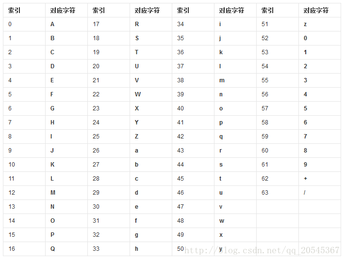
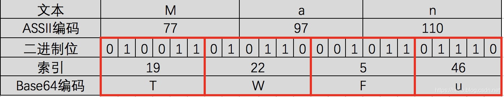

### Base64

Base64 是网络上最常见的用于传输 8Bit 字节码的编码方式之一，Base64就是一种基于64个可打印字符来表示二进制数据的方法。

Base64编码可用于在HTTP环境下传递较长的标识信息

### 索引表

### 编码步骤

* 第一步

'M'、'a'、'n' 对应的ASCII码值分别为77，97，110，对应的二进制值是01001101、01100001、01101110。

如图第二三行所示，由此组成一个24位的二进制字符串。

* 第二步

如图红色框，将24位每6位二进制位一组分成四组。

* 第三步

在上面每一组前面补两个0，扩展成32个二进制位，此时变为四个字节：00010011、00010110、00000101、00101110。

分别对应的值（Base64编码索引）为：19、22、5、46。

* 第四步

用上面的值在Base64编码表中进行查找，分别对应：T、W、F、u。因此“Man”Base64编码之后就变为：TWFu。
