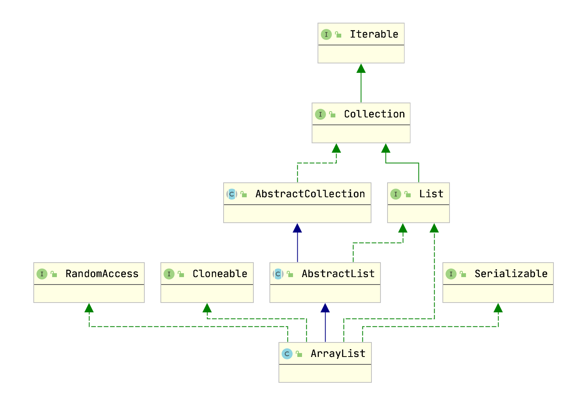
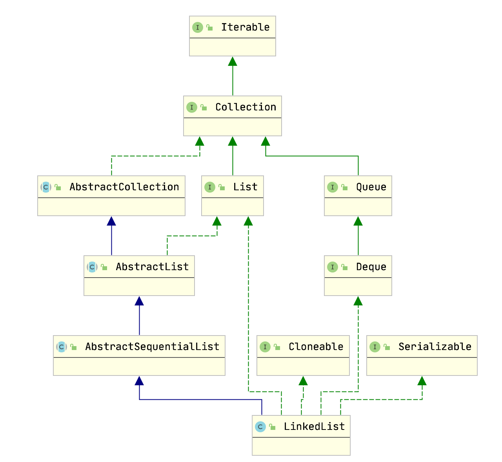
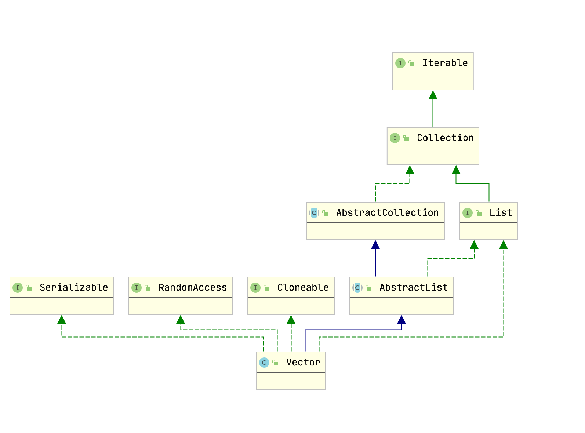

## List 接口类

```java
public interface List<E> extends Collection<E> {
    int size();
    boolean isEmpty();
    boolean contains(Object o);
    Iterator<E> iterator();
    Object[] toArray();

    <T> T[] toArray(T[] a);
    boolean add(E e);
    boolean remove(Object o);
    boolean containsAll(Collection<?> c);
    boolean addAll(Collection<? extends E> c);
    boolean addAll(int index, Collection<? extends E> c);
    boolean removeAll(Collection<?> c);
    boolean retainAll(Collection<?> c);
    default void replaceAll(UnaryOperator<E> operator) {
        Objects.requireNonNull(operator);
        final ListIterator<E> li = this.listIterator();
        while (li.hasNext()) {
            li.set(operator.apply(li.next()));
        }
    }

    @SuppressWarnings({"unchecked", "rawtypes"})
    default void sort(Comparator<? super E> c) {
        Object[] a = this.toArray();
        Arrays.sort(a, (Comparator) c);
        ListIterator<E> i = this.listIterator();
        for (Object e : a) {
            i.next();
            i.set((E) e);
        }
    }
    void clear();
    boolean equals(Object o);
    int hashCode();
    E get(int index);
    E set(int index, E element);
    void add(int index, E element);
    E remove(int index);
    int indexOf(Object o);
    int lastIndexOf(Object o);
    ListIterator<E> listIterator();
    ListIterator<E> listIterator(int index);
    List<E> subList(int fromIndex, int toIndex);

    @Override
    default Spliterator<E> spliterator() {
        if (this instanceof RandomAccess) {
            return new AbstractList.RandomAccessSpliterator<>(this);
        } else {
            return Spliterators.spliterator(this, Spliterator.ORDERED);
        }
    }
    static <E> List<E> of() {
        return ImmutableCollections.emptyList();
    }
    static <E> List<E> of(E e1) {
        return new ImmutableCollections.List12<>(e1);
    }
    static <E> List<E> of(E e1, E e2) {
        return new ImmutableCollections.List12<>(e1, e2);
    }
    static <E> List<E> of(E e1, E e2, E e3) {
        return new ImmutableCollections.ListN<>(e1, e2, e3);
    }
    static <E> List<E> of(E e1, E e2, E e3, E e4) {
        return new ImmutableCollections.ListN<>(e1, e2, e3, e4);
    }
    static <E> List<E> of(E e1, E e2, E e3, E e4, E e5) {
        return new ImmutableCollections.ListN<>(e1, e2, e3, e4, e5);
    }
    static <E> List<E> of(E e1, E e2, E e3, E e4, E e5, E e6) {
        return new ImmutableCollections.ListN<>(e1, e2, e3, e4, e5,
                                                e6);
    }
    static <E> List<E> of(E e1, E e2, E e3, E e4, E e5, E e6, E e7) {
        return new ImmutableCollections.ListN<>(e1, e2, e3, e4, e5,
                                                e6, e7);
    }
    static <E> List<E> of(E e1, E e2, E e3, E e4, E e5, E e6, E e7, E e8) {
        return new ImmutableCollections.ListN<>(e1, e2, e3, e4, e5,
                                                e6, e7, e8);
    }
    static <E> List<E> of(E e1, E e2, E e3, E e4, E e5, E e6, E e7, E e8, E e9) {
        return new ImmutableCollections.ListN<>(e1, e2, e3, e4, e5,
                                                e6, e7, e8, e9);
    }
    static <E> List<E> of(E e1, E e2, E e3, E e4, E e5, E e6, E e7, E e8, E e9, E e10) {
        return new ImmutableCollections.ListN<>(e1, e2, e3, e4, e5,
                                                e6, e7, e8, e9, e10);
    }

    @SafeVarargs
    @SuppressWarnings("varargs")
    static <E> List<E> of(E... elements) {
        switch (elements.length) { // implicit null check of elements
            case 0:
                return ImmutableCollections.emptyList();
            case 1:
                return new ImmutableCollections.List12<>(elements[0]);
            case 2:
                return new ImmutableCollections.List12<>(elements[0], elements[1]);
            default:
                return new ImmutableCollections.ListN<>(elements);
        }
    }

    static <E> List<E> copyOf(Collection<? extends E> coll) {
        return ImmutableCollections.listCopy(coll);
    }
}

```

## ArrayList

### 框架图



### 实现原理
AbstractCollection 抽象类，实现了Collection接口
```java
public abstract class AbstractCollection<E> implements Collection<E> {}
```

AbstractList.class
```java
public abstract class AbstractList<E> extends AbstractCollection<E> implements List<E> {}
```

ArrayList.class
```java
java.lang.Object
    java.util.AbstractCollection<E>
        java.util.AbstractList<E>
            java.util.ArrayList<E>
public class ArrayList<E> extends AbstractList<E>
        implements List<E>, RandomAccess, Cloneable, java.io.Serializable{...}
```

* 1.ArrayList继承了抽象类AbstractList，同时实现了List、RandomAccess、Cloneable、Serializable接口。

* 2.抽象类AbstractList继承自抽象类AbstractCollection同时实现了List接口。

* 3.抽象类AbstractCollection实现了Collection接口

* 4.List接口继承自Collection接口

* 5.Collection接口继承自Iterable接口

### 常用方法

```java
    // 初始容量被设置为10
    private static final int DEFAULT_CAPACITY = 10;
    // 空元素
    private static final Object[] EMPTY_ELEMENTDATA = {};
    // 初始化空元素
    private static final Object[] DEFAULTCAPACITY_EMPTY_ELEMENTDATA = {};
    // 数组实际元素大小
    private int size;
    // 数组修改次数 没修改一次加一
    protected transient int modCount = 0;

    // 数组最大个数
    private static final int MAX_ARRAY_SIZE = Integer.MAX_VALUE - 8;

    // 构造器创建实例并初始化元素
    public ArrayList(int initialCapacity) {
        if (initialCapacity > 0) {
            this.elementData = new Object[initialCapacity];
        } else if (initialCapacity == 0) {
            this.elementData = EMPTY_ELEMENTDATA;
        } else {
            throw new IllegalArgumentException("Illegal Capacity: "+
                                               initialCapacity);
        }
    }

    public ArrayList() {
        this.elementData = DEFAULTCAPACITY_EMPTY_ELEMENTDATA;
    }

    public ArrayList(Collection<? extends E> c) {
        Object[] a = c.toArray();
        if ((size = a.length) != 0) {
            if (c.getClass() == ArrayList.class) {
                elementData = a;
            } else {
                elementData = Arrays.copyOf(a, size, Object[].class);
            }
        } else {
            // replace with empty array.
            elementData = EMPTY_ELEMENTDATA;
        }
    }

    // 添加元素
    private void add(E e, Object[] elementData, int s) {
        // 判断是否需要扩容（第一次添加元素时初始化长度）
        if (s == elementData.length)
            elementData = grow();
        elementData[s] = e; // 数组值
        size = s + 1; // 数组元素长度加一
    }

    // 扩容
    private Object[] grow() {
        return grow(size + 1);
    }

    private Object[] grow(int minCapacity) {
        // 复制数据
        return elementData = Arrays.copyOf(elementData,
                                           newCapacity(minCapacity));
    }

    // 返回一次扩容的长度
    private int newCapacity(int minCapacity) {
        // overflow-conscious code
        int oldCapacity = elementData.length;
        // 新容量扩大到原容量的1.5倍(向下取整)
        int newCapacity = oldCapacity + (oldCapacity >> 1);
        if (newCapacity - minCapacity <= 0) {
            if (elementData == DEFAULTCAPACITY_EMPTY_ELEMENTDATA)
                return Math.max(DEFAULT_CAPACITY, minCapacity);
            if (minCapacity < 0) // overflow
                throw new OutOfMemoryError();
            return minCapacity;
        }

        // 判断扩容的容量是否大于设置的最大值
        return (newCapacity - MAX_ARRAY_SIZE <= 0)
            ? newCapacity
            : hugeCapacity(minCapacity);
    }

    private static int hugeCapacity(int minCapacity) {
        if (minCapacity < 0) // overflow
            throw new OutOfMemoryError();
        return (minCapacity > MAX_ARRAY_SIZE)
            ? Integer.MAX_VALUE
            : MAX_ARRAY_SIZE;
    }

    // 移除元素
    public E remove(int index) {
        // 检查
        Objects.checkIndex(index, size);
        // 定义操作数组副本
        final Object[] es = elementData;

        @SuppressWarnings("unchecked") E oldValue = (E) es[index];
        fastRemove(es, index);

        return oldValue;
    }

    private void fastRemove(Object[] es, int i) {
        // 修改次数
        modCount++;
        final int newSize;
        // 新数组大小
        if ((newSize = size - 1) > i)
            // 将i + 1后面的元素覆盖 i 后面的元素
            System.arraycopy(es, i + 1, es, i, newSize - i);
        es[size = newSize] = null;
    }
```

Arrays.class
```java
    // 复制数据
    public static <T> T[] copyOf(T[] original, int newLength) {
        return (T[]) copyOf(original, newLength, original.getClass());
    }

    /* @param <U> 源数组的类
     * @param <T> 返回的数组的类
     * @param original 需要复制的源数组
     * @param newLength 新数组的长度
     * @param newType 返回的数组的类型
     */
    @HotSpotIntrinsicCandidate
    public static <T,U> T[] copyOf(U[] original, int newLength, Class<? extends T[]> newType) {
        @SuppressWarnings("unchecked")
        // 创建指定长度的某种类型的数组
        T[] copy = ((Object)newType == (Object)Object[].class)
            ? (T[]) new Object[newLength]
            : (T[]) Array.newInstance(newType.getComponentType(), newLength);
        
        // 调用本地方法
        System.arraycopy(original, 0, copy, 0,
                         Math.min(original.length, newLength));
        return copy;
    }
```

System.class
```java
    @HotSpotIntrinsicCandidate
    public static native void arraycopy(Object src,  int  srcPos,
                                        Object dest, int destPos,
                                        int length);
```

@HotSpotIntrinsicCandidate

### 数组为什么快

#### 寻址操作次数链表要多一些
数组只需对 [基地址+元素大小*k] 就能找到第k+1个元素的地址，对其取地址就能获得该元素。
链表要获得第k个元素，首先要在其第k-1个元素寻找到其next指针偏移，再将next指针作为地址获得值，这样就要从第一个元素找起，多了多步寻址操作，当数据量大且其它操作较少时，这就有差距了。

#### CPU缓存
CPU缓存会把一片连续的内存空间读入，因为数组结构是连续的内存地址，所以数组全部或者部分元素被连续存在CPU缓存里面，平均读取每个元素的时间只要3个CPU时钟周期。
而链表的节点是分散在堆空间里面的，这时候CPU缓存帮不上忙，只能是去读取内存，平均读取时间需要100个CPU时钟周期。
Cache-oblivious algorithm

## LinkedList

### 框架图


### 源码

```java
public class LinkedList<E>
    extends AbstractSequentialList<E>
    implements List<E>, Deque<E>, Cloneable, java.io.Serializable
{
    // 结点长度 （ 最大结点数 2^31 - 1 ）
    transient int size = 0;
    // 头结点
    transient Node<E> first;
    // 尾结点
    transient Node<E> last;

    // 构造器
    public LinkedList() {
    }

    // 内部类
    private static class Node<E> {
        E item;
        Node<E> next;
        Node<E> prev;

        Node(Node<E> prev, E element, Node<E> next) {
            this.item = element;
            this.next = next;
            this.prev = prev;
        }
    }

    // 头插入
    void linkLast(E e) {
        final Node<E> l = last;
        final Node<E> newNode = new Node<>(l, e, null);
        last = newNode;
        if (l == null)
            first = newNode;
        else
            l.next = newNode;
        size++;
        modCount++;
    }

    // 尾插入
    void linkLast(E e) {
        final Node<E> l = last;
        final Node<E> newNode = new Node<>(l, e, null);
        last = newNode;
        if (l == null)
            first = newNode;
        else
            l.next = newNode;
        size++;
        modCount++;
    }

    // 移除头部元素
    private E unlinkFirst(Node<E> f) {
        // assert f == first && f != null;
        final E element = f.item;
        final Node<E> next = f.next;
        f.item = null;
        f.next = null; // help GC
        first = next;
        if (next == null)
            last = null;
        else
            next.prev = null;
        size--;
        modCount++;
        return element;
    }

    // 移除尾部元素
    private E unlinkLast(Node<E> l) {
        // assert l == last && l != null;
        final E element = l.item;
        final Node<E> prev = l.prev;
        l.item = null;
        l.prev = null; // help GC
        last = prev;
        if (prev == null)
            first = null;
        else
            prev.next = null;
        size--;
        modCount++;
        return element;
    }

    // 移除中间元素
    E unlink(Node<E> x) {
        // assert x != null;
        final E element = x.item;
        final Node<E> next = x.next;
        final Node<E> prev = x.prev;

        if (prev == null) {
            first = next;
        } else {
            prev.next = next;
            x.prev = null;
        }

        if (next == null) {
            last = prev;
        } else {
            next.prev = prev;
            x.next = null;
        }

        x.item = null;
        size--;
        modCount++;
        return element;
    }

    // 链表转数组
    public Object[] toArray() {
        // 定义等长的数组
        Object[] result = new Object[size];
        int i = 0;
        // 遍历链表
        for (Node<E> x = first; x != null; x = x.next)
            result[i++] = x.item;
        return result;
    }
}
```

### Deque.class
> `Deque` 是 `double ended queue` 的简称

```java
public interface Deque<E> extends Queue<E> {
    void addFirst(E e);
    void addLast(E e);
    boolean offerFirst(E e);
    boolean offerLast(E e);
    E removeFirst();
    E removeLast();
    E pollFirst();
    E pollLast();
    E getFirst();
    E getLast();
    E peekFirst();
    E peekLast();
    boolean removeFirstOccurrence(Object o);
    boolean removeLastOccurrence(Object o);

    // *** Queue methods ***
    boolean add(E e);
    boolean offer(E e);
    E remove();
    E poll();
    E element();
    E peek();
    boolean addAll(Collection<? extends E> c);

    // *** Stack methods ***
    void push(E e);
    E pop();

    // *** Collection methods ***
    boolean remove(Object o);
    boolean contains(Object o);
    int size();
    Iterator<E> iterator();
    Iterator<E> descendingIterator();
}
```

### Queue.class

```java
public interface Queue<E> extends Collection<E> {
    // 入队尾
    boolean add(E e);
    // 入队尾
    boolean offer(E e);
    // 删除头部元素
    E remove();
    // 返回和删除头部元素
    E poll();
    // 返货头结点元素的值
    E peek();
}
```

## Vector

1. Vector 是矢量队列，支持相关的添加、删除、修改、遍历等功能
2. Vector中的操作是线程安全的
3. 使用数组实现，可以指定扩容的大小

### 架构图


### 源码

```java
public class Vector<E>
    extends AbstractList<E>
    implements List<E>, RandomAccess, Cloneable, java.io.Serializable
{
    // 保存Vector中数据的数组
    protected Object[] elementData;
    // 实际数据的数量
    protected int elementCount;

    // 容量增长系数
    protected int capacityIncrement;

    // 构造函数指定初始容量
    public Vector() {
        this(10);
    }

    // 指定Vector"容量大小"和"增长系数"的构造函数
    public Vector(int initialCapacity, int capacityIncrement) {
        super();
        if (initialCapacity < 0)
            throw new IllegalArgumentException("Illegal Capacity: "+
                                               initialCapacity);
        this.elementData = new Object[initialCapacity];
        this.capacityIncrement = capacityIncrement;
    }

    // 添加元素 synchronized
    public synchronized boolean add(E e) {
        modCount++;
        add(e, elementData, elementCount);
        return true;
    }

    // 扩容
    private void add(E e, Object[] elementData, int s) {
        if (s == elementData.length)
            elementData = grow();
        elementData[s] = e;
        elementCount = s + 1;
    }

    private Object[] grow(int minCapacity) {
        return elementData = Arrays.copyOf(elementData,
                                           newCapacity(minCapacity));
    }

    private Object[] grow() {
        return grow(elementCount + 1);
    }

    private int newCapacity(int minCapacity) {
        // overflow-conscious code
        int oldCapacity = elementData.length;
        // 扩容大小 原始容量+增长系数
        int newCapacity = oldCapacity + ((capacityIncrement > 0) ?
                                         capacityIncrement : oldCapacity);
        if (newCapacity - minCapacity <= 0) {
            if (minCapacity < 0) // overflow
                throw new OutOfMemoryError();
            return minCapacity;
        }

        return (newCapacity - MAX_ARRAY_SIZE <= 0)
            ? newCapacity
            : hugeCapacity(minCapacity);
    }

    private static int hugeCapacity(int minCapacity) {
        if (minCapacity < 0) // overflow
            throw new OutOfMemoryError();
        return (minCapacity > MAX_ARRAY_SIZE) ?
            Integer.MAX_VALUE :
            MAX_ARRAY_SIZE;
    }

    public synchronized Object[] toArray() {
        return Arrays.copyOf(elementData, elementCount);
    }
}
```