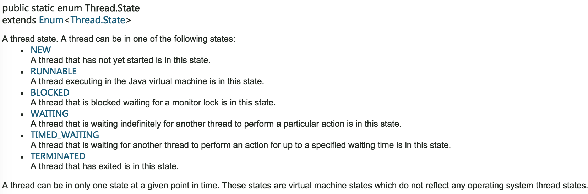
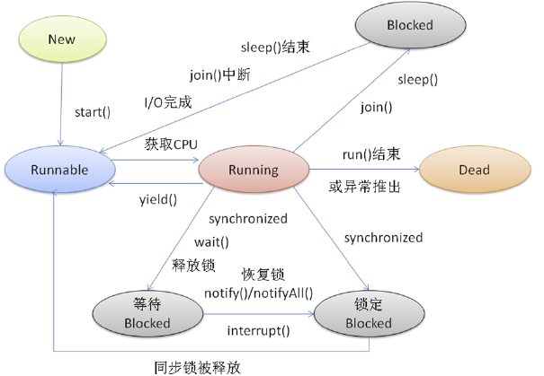

## 多线程
### 简介
多线程是多任务的一种特别的形式，但多线程使用了更小的资源开销

> 并发性和并行性是不同的概念：并行是指同一时刻，多个命令在多个处理器上同时执行；并发是指在同一时刻，只有一条命令是在处理器上执行的，但多个进程命令被快速轮换执行，使得在宏观上具有多个进程同时执行的效果


### 线程状态




1. 新建状态:  
	使用 new 关键字和 Thread 类或其子类建立一个线程对象后，该线程对象就处于新建状态。它保持这个状态直到程序 start() 这个线程。
2. 就绪状态:  
	当线程对象调用了start()方法之后，该线程就进入就绪状态。就绪状态的线程处于就绪队列中，要等待JVM里线程调度器的调度。  

 > 每个锁对象都有两个队列，一个是就绪队列，一个是阻塞队列，就绪队列存储了将要获得锁的线程，阻塞队列存储了被阻塞的线程，当一个被线程被唤醒 (notify)后，才会进入到就绪队列，等待获得锁  

3. 运行状态:  
	如果就绪状态的线程获取 CPU 资源，就可以执行 run()，此时线程便处于运行状态。处于运行状态的线程最为复杂，它可以变为阻塞状态、就绪状态和死亡状态。
4. 阻塞状态:  
	如果一个线程执行了sleep（睡眠）、suspend（挂起）等方法，失去所占用资源之后，该线程就从运行状态进入阻塞状态。在睡眠时间已到或获得设备资源后可以重新进入就绪状态。  
可以分为三种：
等待阻塞：运行状态中的线程执行 wait() 方法，使线程进入到等待阻塞状态。  
同步阻塞：线程在获取 synchronized 同步锁失败(因为同步锁被其他线程占用)。  
其他阻塞：通过调用线程的 sleep() 或 join() 发出了 I/O 请求时，线程就会进入到阻塞状态。当sleep() 状态超时，join() 等待线程终止或超时，或者 I/O 处理完毕，线程重新转入就绪状态。  

* 调用join()和sleep()方法，sleep()时间结束或被打断，join()中断,IO完成都会回到Runnable状态，等待JVM的调度。
* 调用wait()，使该线程处于等待池(wait blocked pool),直到notify()/notifyAll()，线程被唤醒被放到锁定池(lock blocked pool )，释放同步锁使线程回到可运行状态（Runnable）
* 对Running状态的线程加同步锁(Synchronized)使其进入(lock blocked pool ),同步锁被释放进入可运行状态(Runnable)。


5. 死亡状态:
	一个运行状态的线程完成任务或者其他终止条件发生时，该线程就切换到终止状态。  
	
### 创建线程
#### 创建
1. 继承Thread类
```java
class Thread1 extends Thread {
    @Override
    public void run() {
		// to do
    }
}
```

2. 实现 Runnable

```java
class class2 implements Runnable{
    @Override
    public void run() {

    }
}
```

3. 实现 Callable

```java
class class3 implements Callable<String> {
    @Override
    public String call() throws Exception {
        return null;
    }
}
```

#### 原理

```java
// 接受泛型参数
@FunctionalInterface
public interface Callable<V> {
    V call() throws Exception;
}

@FunctionalInterface
public interface Runnable {
    public abstract void run();
}

// 实现 Runnable
public class Thread implements Runnable {
}
```

Runnable没有返回值；Callable可以返回执行结果，是个泛型，和Future、FutureTask配合可以用来获取异步执行的结果

##### Future

Future就是对于具体的Runnable或者Callable任务的执行结果进行取消、查询是否完成、获取结果。
必要时可以通过get方法获取执行结果，该方法会阻塞直到任务返回结果

```java
public interface Future<V> {
	// 用来取消任务，如果取消任务成功则返回true，如果取消任务失败则返回false
	boolean cancel(boolean mayInterruptIfRunning);
	// 判断任务是否被取消成功
	boolean isCancelled();
	// 判断任务是否已经完成
	boolean isDone();
	// 用来获取执行结果，这个方法会产生阻塞，会一直等到任务执行完毕才返回
	V get() throws InterruptedException, ExecutionException;
	// 用来获取执行结果，如果在指定时间内，还没获取到结果，就直接返回null
	V get(long timeout, TimeUnit unit) throws InterruptedException, ExecutionException, TimeoutException;
}
```

##### RunnableFuture.class

```java
public interface RunnableFuture<V> extends Runnable, Future<V> {
    void run();
}
```
##### FutureTask.class

```java
public class FutureTask<V> implements RunnableFuture<V> {
	private volatile int state;
    private static final int NEW          = 0;
    private static final int COMPLETING   = 1;
    private static final int NORMAL       = 2;
    private static final int EXCEPTIONAL  = 3;
    private static final int CANCELLED    = 4;
    private static final int INTERRUPTING = 5;
    private static final int INTERRUPTED  = 6;

    /** The underlying callable; nulled out after running */
    private Callable<V> callable;
    /** The result to return or exception to throw from get() */
    private Object outcome; // non-volatile, protected by state reads/writes
    /** The thread running the callable; CASed during run() */
    private volatile Thread runner;
    /** Treiber stack of waiting threads */
    private volatile WaitNode waiters;

	public FutureTask(Callable<V> callable) {
        if (callable == null)
            throw new NullPointerException();
        this.callable = callable;
        this.state = NEW;       // ensure visibility of callable
    }

	public void run() {
        if (state != NEW ||
            !RUNNER.compareAndSet(this, null, Thread.currentThread()))
            return;
        try {
            Callable<V> c = callable;
            if (c != null && state == NEW) {
                V result;
                boolean ran;
                try {
					// 执行任务
                    result = c.call();
                    ran = true;
                } catch (Throwable ex) {
                    result = null;
                    ran = false;
                    setException(ex);
                }
                if (ran)
					// 设置值
                    set(result);
            }
        } finally {
            // runner must be non-null until state is settled to
            // prevent concurrent calls to run()
            runner = null;
            // state must be re-read after nulling runner to prevent
            // leaked interrupts
            int s = state;
            if (s >= INTERRUPTING)
                handlePossibleCancellationInterrupt(s);
        }
    }

	protected void set(V v) {
        if (STATE.compareAndSet(this, NEW, COMPLETING)) {
            outcome = v;
            STATE.setRelease(this, NORMAL); // final state
            finishCompletion();
        }
    }

	private void finishCompletion() {
        // assert state > COMPLETING;
        for (WaitNode q; (q = waiters) != null;) {
            if (WAITERS.weakCompareAndSet(this, q, null)) {
                for (;;) {
                    Thread t = q.thread;
                    if (t != null) {
                        q.thread = null;
                        LockSupport.unpark(t);
                    }
                    WaitNode next = q.next;
                    if (next == null)
                        break;
                    q.next = null; // unlink to help gc
                    q = next;
                }
                break;
            }
        }

        done();

        callable = null;        // to reduce footprint
    }

	protected void done() { }
}
```

### 线程管理
#### 睡眠
让当前正在执行的线程暂停一段时间，并进入阻塞状态，则可以通过调用Thread的sleep方法

```java
Thread.sleep(1000*1); // 休眠1秒
```

#### 线程让步——yield

yield()方法只是让当前线程暂停一下，重新进入就绪的线程池中，让系统的线程调度器重新调度器重新调度一次（不进入阻塞状态）

#### 线程合并

线程的合并的含义就是将几个并行线程的线程合并为一个单线程执行，应用场景是当一个线程必须等待另一个线程执行完毕才能执行时，Thread类提供了join方法来完成这个功能，注意，它不是静态方法

#### 线程的优先级  

每一个 Java 线程都有一个优先级，这样有助于操作系统确定线程的调度顺序。  
Java 线程的优先级是一个整数，其取值范围是 1 （Thread.MIN_PRIORITY ） - 10 （Thread.MAX_PRIORITY ）。  
默认情况下，每一个线程都会分配一个优先级 NORM_PRIORITY（5）。

### 线程调度
线程调度是指系统为线程分配处理器使用权的过程，主要调度方式分两种，分别是协同式线程调度和抢占式线程调度。   

* 协同式线程调度   
	线程执行时间由线程本身来控制，线程把自己的工作执行完之后，要主动通知系统切换到另外一个线程上。最大好处是实现简单，且切换操作对线程自己是可知的，没啥线程同步问题。坏处是线程执行时间不可控制，如果一个线程有问题，可能一直阻塞在那里。 
* 抢占式调度  
	每个线程将由系统来分配执行时间，线程的切换不由线程本身来决定（Java中，Thread.yield()可以让出执行时间，但无法获取执行时间）。线程执行时间系统可控，也不会有一个线程导致整个进程阻塞。  
	
> Java线程调度就是抢占式调度。 

### 线程同步

 java允许多线程并发控制，当多个线程同时操作一个可共享的资源变量时（如数据的增删改查），将会导致数据不准确，相互之间产生冲突，因此加入同步锁以避免在该线程没有完成操作之前，被其他线程的调用，从而保证了该变量的唯一性和准确性。

#### 同步方法
> 由于java的每个对象都有一个内置锁，当用此关键字修饰方法时，内置锁会保护整个方法。在调用该方法前，需要获得内置锁，否则就处于阻塞状态

```java
// 对象锁
public synchronized void fun(){
	// todo
}

// 类锁
public synchronized static void fun(){
	// todo
}
```

1. 内置锁（又叫 隐式锁）：synchronized 是内置于JDK中的，底层实现是native；同时，加锁、解锁都是JDK自动完成，不需要用户显式地控制，非常方便。

2. 同步锁：synchronized 用于同步线程，使线程互斥地访问某段代码块、方法。这就是意味着最多只有一个线程能够获得该锁，当线程A尝试去获得线程B持有的内置锁时，线程A必须等待或者阻塞，知道线程B释放这个锁，如果B线程不释放这个锁，那么A线程将永远等待下去
3. 对象锁：准确来说，是分为对象锁、类锁。synchronized 以当前的某个对象为锁，线程必须通过互斥竞争拿到这把对象锁，从而才能访问 临界区的代码，访问结束后，就会释放锁，下一个线程才有可能获取锁来访问临界区（被锁住的代码区域）。
	> synchronized锁 根据锁的范围分为 对象锁 和 类锁。  
	对象锁，是以对象实例为锁，当多个线程共享访问这个对象实例下的临界区，只需要竞争这个对象实例便可，不同对象实例下的临界区是不用互斥访问；  
	类锁，则是以类的class对象为锁，这个锁下的临界区，所有线程都必须互斥访问，尽管是使用了不同的对象实例

	> 临界区就是在同一时刻只能有一个任务访问的代码区

#### 同步代码块  

```java
public int fun(){
    synchronized( object ) {
       //代码块，一次只能有一个线程进入
    }
}
```

1. object 是 this，是对象锁，this指代当前对象
2. object 是一个普通对象实例  

	> 如果是静态对象，那么就是 类锁；  
	> 如果是非静态对象：成员对象变量、局部变量（甚至可以是 方法参数），那么就是对象锁
3. object 是一个类的class 对象，那么就是类锁

#### volatile

```java
private volatile int account = 100;
```

* volatile关键字为域变量的访问提供了一种免锁机制；
* 使用volatile修饰域相当于告诉虚拟机该域可能会被其他线程更新；
* 因此每次使用该域就要重新计算，而不是使用寄存器中的值；
* volatile不会提供任何原子操作，它也不能用来修饰final类型的变量。

#### 重入锁（Lock）

```java
ReentrantLock() : 创建一个ReentrantLock实例         
lock() : 获得锁        
unlock() : 释放锁
```

##### 公平锁/非公平锁（多线程执行顺序的维度）
* 公平锁：加锁前先查看是否有排队等待的线程，有的话优先处理排在前面的线程，先来先得。
* 非公平所：线程加锁时直接尝试获取锁，获取不到就自动到队尾等待。

```
//创建一个非公平锁，默认是非公平锁

Lock nonFairLock= new ReentrantLock();

Lock nonFairLock= new ReentrantLock(false);

//创建一个公平锁，构造传参true

Lock fairLock= new ReentrantLock(true);
```

##### 乐观锁/悲观锁（多线程操作共享数据的维度）

* 悲观锁：假设一定会发生并发冲突，通过阻塞其他所有线程来保证数据的完整性。
* 乐观锁：假设不会发生并发冲突，直接不加锁去完成某项更新，如果冲突就返回失败。

### 线程通信
#### Object类的wait()、notify()、notifyAll()

 * 线程执行wait()后，就放弃了运行资格，处于冻结状态；
 * 线程运行时，内存中会建立一个线程池，冻结状态的线程都存在于线程池中，notify()执行时唤醒的也是线程池中的线程，线程池中有多个线程时唤醒第一个被冻结的线程。
* notifyall(), 唤醒线程池中所有线程。

#### Condition控制线程通信
* 将同步synchronized替换为显式的Lock操作；
* 将Object类中的wait(), notify(),notifyAll()替换成了Condition对象，该对象可以通过Lock锁对象获取;
* 一个Lock对象上可以绑定多个Condition对象，这样实现了本方线程只唤醒对方线程，而jdk1.5之前，一个同步只能有一个锁，不同的同步只能用锁来区分，且锁嵌套时容易死锁。

#### 阻塞队列（BlockingQueue）控制线程通信

BlockingQueue是一个接口，也是Queue的子接口。  
BlockingQueue具有一个特征：当生产者线程试图向BlockingQueue中放入元素时，如果该队列已满，则线程被阻塞；但消费者线程试图从BlockingQueue中取出元素时，如果队列已空，则该线程阻塞。程序的两个线程通过交替向BlockingQueue中放入元素、取出元素，即可很好地控制线程的通信。

BlockingQueue提供如下两个支持阻塞的方法：  

（1）put(E e)：尝试把Eu元素放如BlockingQueue中，如果该队列的元素已满，则阻塞该线程。  
（2）take（）：尝试从BlockingQueue的头部取出元素，如果该队列的元素已空，则阻塞该线程。

```
ArrayBlockingQueue ：基于数组实现的BlockingQueue队列。
LinkedBlockingQueue：基于链表实现的BlockingQueue队列。
PriorityBlockingQueue：它并不是保准的阻塞队列，该队列调用remove（）、poll（）、take（）等方法提取出元素时，并不是取出队列中存在时间最长的元素，而是队列中最小的元素。
                       它判断元素的大小即可根据元素（实现Comparable接口）的本身大小来自然排序，也可使用Comparator进行定制排序。
SynchronousQueue：同步队列。对该队列的存、取操作必须交替进行。
DelayQueue：它是一个特殊的BlockingQueue，底层基于PriorityBlockingQueue实现，不过，DelayQueue要求集合元素都实现Delay接口（该接口里只有一个long getDelay（）方法），
            DelayQueue根据集合元素的getDalay（）方法的返回值进行排序。
```

## 线程池
在使用线程池之后，创建线程变成了从线程池获得空闲线程，关闭线程变成了向线程池归还线程。  
好处:  

* 降低资源消耗。通过重复利用已创建的线程降低线程创建和销毁造成的消耗。
* 提高响应速度。当任务到达时，任务可以不需要等到线程创建就能立即执行。
* 提高线程的可管理性。线程是稀缺资源，如果无限制的创建，不仅会消耗系统资源，还会降低系统的稳定性，使用线程池可以进行统一的分配，调优和监控。

### 内置线程池
DK并发包中提供了一套Executor线程池框架。Executors类为线程池工厂，通过Executors可以取得一个拥有特定功能的线程池

Executor线程池框架的最大优点是把任务的提交和执行解耦


使用Executors执行多线程任务的步骤如下：

  • 调用Executors类的静态工厂方法创建一个ExecutorService对象，该对象代表一个线程池；

  • 创建Runnable实现类或Callable实现类的实例，作为线程执行任务；

  • 调用ExecutorService对象的submit()方法来提交Runnable实例或Callable实例；

  • 当不想提交任务时，调用ExecutorService对象的shutdown()方法来关闭线程池

newFixedThreadPool()：通过该工厂方法返回一个固定线程数量的线程池。线程池中的线程数量始终不变。当没有空闲线程时，新提交的任务则被暂存在一个任务队列中。

newSingleThreadExecutor()：通过该方法返回一个只有一个线程的线程池。多余的任务被保存在任务队列中，待线程空闲，按先进先出的顺序执行队列中的任务。

newCachedThreadPool()：通过该方法返回一个可根据实际情况调整线程数量的线程池。线程池的线程数量不确定，当所有线程都在工作时，又有新的任务提交，则会创建新的线程来处理任务。所有线程在当前任务执行完毕之后，将返回线程池进行复用。

newSingleThreadScheduledExecutor()：通过该方法返回一个SheduledExecutorService对象，线程池大小为1。SheduledExecutorService接口在ExecutorService接口上扩展了在给定时间执行某任务的功能，如在某个固定时延之后执行，或者周期性执行某个任务。

newScheduledThreadPool()：通过该方法返回一个SheduledExecutorService的对象，但该线程池可以指定线程数量

### 线程池参数
内部实现均使用了ThreadPoolExecutor实现，都是通过ThreadPoolExecutor类进行封装之后得到的，实际上就是在ThreadPoolExecutor构造函数中指定不同的参数来构造不同的线程池

```java
public ThreadPoolExecutor(
			int corePoolSize,
			int maxnumPoolSize,
			long keepAliveTime,
			TimeUnit unit,
			BlockingQueue<Runnable> workQueue,
			ThreadFactory threadFactory,
			RejectedExecutionHandler handler
			)

```

* corePoolSize:指定了线程池中的线程数量。
* maxnumPoolSize:指定了线程池中的最大线程数量。
* keepAliveTime:当线程池线程数量超过corePoolSize时，多余的空闲线程的存活时间，即超过corePoolSize的空闲线程在多长的时间内会被销毁。
* unit: keepAliveTime的单位。
* workQueue:任务队列，被提交但尚未被执行的任务。
* threadFactory:线程工厂，用于创建线程，一般用默认的即可。
* handler:拒绝策略，当任务太多来不及处理时拒绝执行的策略。

#### 任务队列
参数任务队列指被提交但是未执行的队列任务，它是一个BlockingQueue接口的对象，用于存放Runnable对象

(1)	直接提交的队列：该功能由SynchronizedQueue对象提供。SynchronizedQueue是一个特殊的阻塞队列。SynchronizedQueue没有容量，每一个插入操作都要等待一个相应的删除操作，反之每一个删除操作都需要等待对应的插入操作。使用SynchronizedQueue时提交的任务不会被真实的保存，而总是将新任务提交给线程执行，如果没有空闲的线程则尝试创建新的线程，如果线程数量达到最大值就执行决绝策略。使用SynchronizedQueue队列通常要设置很大的maxnumPoolSize，否则很容易执行拒绝策略。可以当做大小为0的队列来理解。

(2)	有界的任务队列：有界的任务队列可以使用ArrayBlockingQueue实现。当使用有界的任务队列时，若有新的任务需要执行，如果线程池的实际线程数小于核心线程数，则有优先创建新的线程，若大于核心线程数，则会将新任务加入等待队列。若队列已满，无法加入则在总线程数不大于最大线程数的前提下，创建新的线程。若大于最大线程数，则执行拒绝策略。也就是说，有界队列仅当任务队列满时才可能将线程数提升到核心线程数只上，否则确保线程数维持在核心线程数大小。

(3)	无界任务队列：无界任务队列可以通过LinkedBlockingQueue类来实现。与有界队列相比，除非系统资源耗尽，否则无界队列不存在任务入队失败的情况。当有新的任务到来，系统的线程数小于核心线程数时线程池会生成新的线程执行任务，但当系统线程数大于核心线程数后，就不会继续增加。若后续有新的任务，则将任务放入无界队列中等待。

(4)	优先任务队列：优先任务队列是带有执行优先级的队列，通过PriorityBlockingQueue实现，可以控制任务的执行先后顺序，是一个特殊的无界队列。无论是有界队列还ArrayBlockingQueue还是未指定大小的无界队列LinkedBlockingQueue，都是按照先进先出算法处理任务的，而有限队列则可以根据任务自身的优先级顺序执行，在确保系统性能的同时，也能有很好的质量保证。

#### 拒绝策略
当线程池中的线程已经用完，无法继续为新任务服务，同时等待队列中已经排满，再也塞不下新任务了

* AbortPolicy：该策略会抛出异常，阻止系统正常工作。
* CallerRunsPolicy：只要线程池未关闭，该策略直接在调用者线程中运行当前被丢弃的任务。显然这样做不会真的丢弃任务，但是任务提交线程的性能可能会急剧下降。
* DiscardOledestPolicy：该策略将丢弃最老的一个请求，也就是即将被执行的一个任务，并尝试再次提交当前任务。
* DiscardPolicy：该策略默默丢弃无法处理的任务，不予任何处理。在允许任务丢失的情况下这是一种合适的方案。

以上内置的策略均实现了RejectedExecutionHandler接口，若仍无法满足实际需要，可以自己扩展RejectedExecutionHandler接口，通过复写rejectedExecution方法，来实现自己饿拒绝策略

```java
public ThreadPoolExecutor(5,5,
    			0L,TimeUnit.MICROSECONDS,
    			new LinkedBlockingQueue<Runnable>(10),
    			Executors.defaultThreadFactory(),
    			new RejectedExecutionHandler() {
    				public void rejected(Runnable r, ThreadPoolExecutor executor) {	 
    				  System.out.println(r.toString()+"is discard");                                                          
    				}
    			});

```

#### 线程池扩展
```java
ExecutorService eService = new ThreadPoolExecutor(5,5,
		0L,TimeUnit.MICROSECONDS,
		new LinkedBlockingQueue<Runnable>(10),
		Executors.defaultThreadFactory(),
		new RejectedExecutionHandler() {
            public void rejectedExecution(Runnable r, ThreadPoolExecutor executor) {
				System.out.println(r.toString()+"is discard");
		    }
		}) {
			@Override
			protected void beforeExecute(Thread thread ,Runnable r){
				System.out.println("准备执行"+((MyTask)r).name);
			}
			
			@Override
			protected void afterExecute(Runnable r,Throwable t){
				System.out.println("执行完成"+((MyTask)r).name);
			}
};
```

#### ExecutorService有如下几个执行方法

```java
- execute(Runnable)
- submit(Runnable)
- submit(Callable)
- invokeAny(...)
- invokeAll(...)
```

##### submit(Runnable)

   submit(Runnable)和execute(Runnable)区别是前者可以返回一个Future对象，通过返回的Future对象，我们可以检查提交的任务是否执行完毕，请看下面执行的例子：

```java
Future future = executorService.submit(new Runnable() {
public void run() {
    System.out.println("Asynchronous task");
}
});

future.get();  //returns null if the task has finished correctly.
```
> 注：如果任务执行完成，future.get()方法会返回一个null。注意，future.get()方法会产生阻塞。

##### invokeAny(…)

invokeAny(...)方法接收的是一个Callable的集合，执行这个方法不会返回Future，但是会返回所有Callable任务中其中一个任务的执行结果。这个方法也无法保证返回的是哪个任务的执行结果，反正是其中的某一个

##### invokeAll(…)
invokeAll(...)与 invokeAny(...)类似也是接收一个Callable集合，但是前者执行之后会返回一个Future的List，其中对应着每个Callable任务执行后的Future对象

##### ExecutorService关闭方法

 当我们使用完成ExecutorService之后应该关闭它，否则它里面的线程会一直处于运行状态。举个例子，如果的应用程序是通过main()方法启动的，在这个main()退出之后，如果应用程序中的ExecutorService没有关闭，这个应用将一直运行。之所以会出现这种情况，是因为ExecutorService中运行的线程会阻止JVM关闭。

  要关闭ExecutorService中执行的线程，我们可以调用ExecutorService.shutdown()方法。在调用shutdown()方法之后，ExecutorService不会立即关闭，但是它不再接收新的任务，直到当前所有线程执行完成才会关闭，所有在shutdown()执行之前提交的任务都会被执行。

  如果想立即关闭ExecutorService，我们可以调用ExecutorService.shutdownNow()方法。这个动作将跳过所有正在执行的任务和被提交还没有执行的任务。但是它并不对正在执行的任务做任何保证，有可能它们都会停止，也有可能执行完成。

### 死锁
#### 死锁的四个必要条件

* 互斥条件：资源不能被共享，只能被同一个进程使用
* 请求与保持条件：已经得到资源的进程可以申请新的资源
* 非剥夺条件：已经分配的资源不能从相应的进程中被强制剥夺
* 循环等待条件：系统中若干进程组成环路，该环路中每个进程都在等待相邻进程占用的资源

#### 处理死锁的方法
* 忽略该问题，也即鸵鸟算法。当发生了什么问题时，不管他，直接跳过，无视它;
* 检测死锁并恢复;
* 资源进行动态分配;
* 破除上面的四种死锁条件之一;