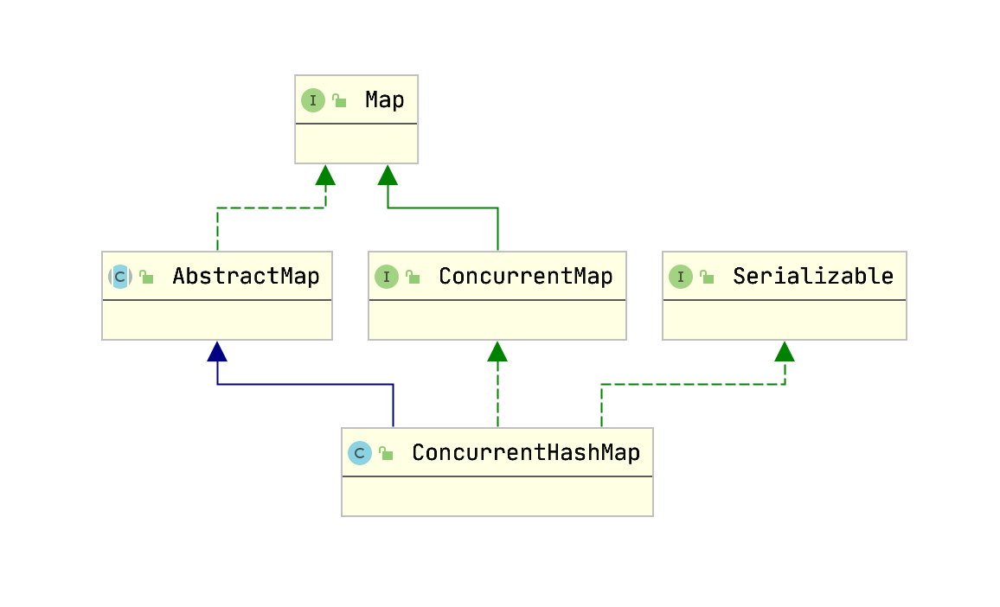
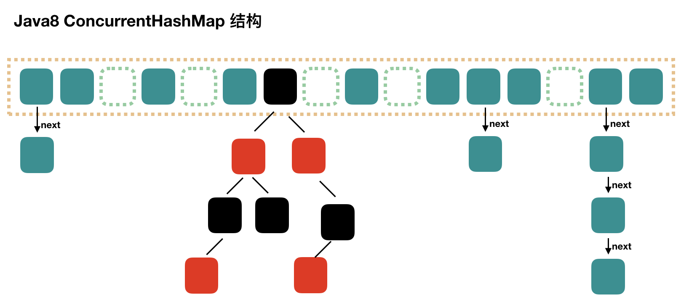
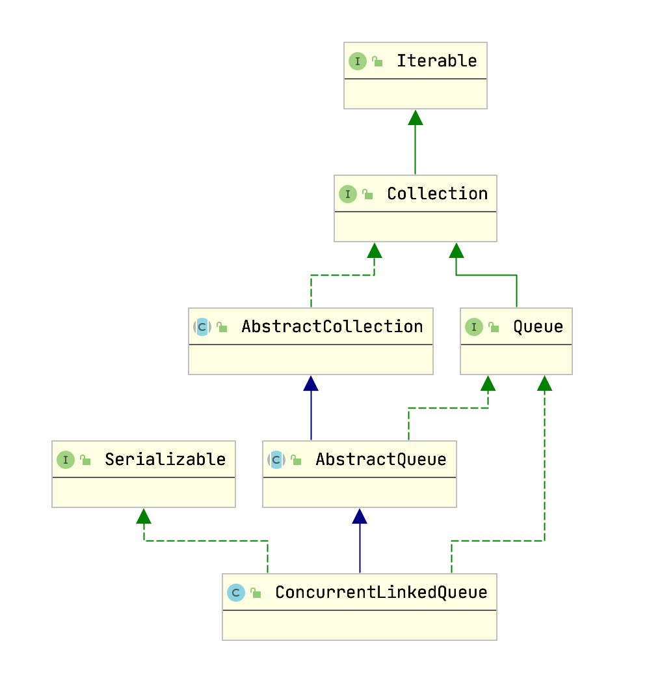
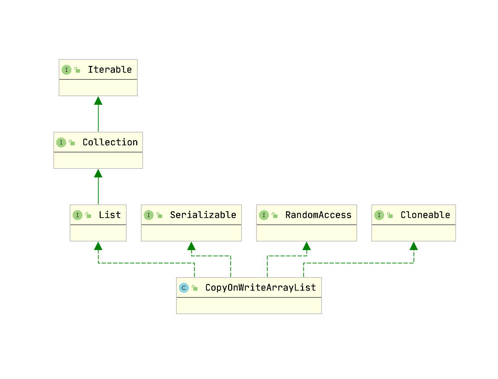

## ConcurrentHashMap

### 结构



CAS无锁算法与synchronized保证并发安全，支持并发扩容，数据结构变更为数组+链表+红黑树，提高性能。

### 源码



```java
public interface Map<K, V> {}

public interface ConcurrentMap<K,V> extends Map<K,V> {
}

public abstract class AbstractMap<K,V> implements Map<K,V> {
    public abstract Set<Entry<K,V>> entrySet();
}
```

`Map` [接口定义](../collection/Map.md)

```java
public class ConcurrentHashMap<K,V> extends AbstractMap<K,V>
    implements ConcurrentMap<K,V>, Serializable {
    private static final int MAXIMUM_CAPACITY = 1 << 30;
    private static final int DEFAULT_CAPACITY = 16;
    static final int MAX_ARRAY_SIZE = Integer.MAX_VALUE - 8;
    private static final int DEFAULT_CONCURRENCY_LEVEL = 16;
    private static final float LOAD_FACTOR = 0.75f;
    static final int TREEIFY_THRESHOLD = 8;
    static final int UNTREEIFY_THRESHOLD = 6;
    static final int MIN_TREEIFY_CAPACITY = 64;
    private static final int MIN_TRANSFER_STRIDE = 16;
    private static final int RESIZE_STAMP_BITS = 16;
    private static final int MAX_RESIZERS = (1 << (32 - RESIZE_STAMP_BITS)) - 1;
    private static final int RESIZE_STAMP_SHIFT = 32 - RESIZE_STAMP_BITS;

    static final int MOVED     = -1; // hash for forwarding nodes
    static final int TREEBIN   = -2; // hash for roots of trees
    static final int RESERVED  = -3; // hash for transient reservations
    static final int HASH_BITS = 0x7fffffff; // usable bits of normal node hash
    
    static final int NCPU = Runtime.getRuntime().availableProcessors();

    // 创建空表
    transient volatile Node<K,V>[] table;

    // 创建空表，扩容时使用
    private transient volatile Node<K,V>[] nextTable;
    private transient volatile long baseCount;

    // 控制 table 初始化或扩容
    // 0代表hash表还没有被初始化
    // 负数代表正在进行初始化或扩容操作
    // -1代表正在初始化
    // -（N+1） 表示有N个线程正在进行扩容操作
    // 正数数值表示下一次进行扩容的阈值，是当前ConcurrentHashMap容量的0.75倍，这与loadfactor是对应的
    private transient volatile int sizeCtl;


    // Map.Entry 实现类
    static final class MapEntry<K,V> implements Map.Entry<K,V> {
        final K key; // non-null
        V val;       // non-null
        final ConcurrentHashMap<K,V> map;
        MapEntry(K key, V val, ConcurrentHashMap<K,V> map) {
            this.key = key;
            this.val = val;
            this.map = map;
        }
        public K getKey()        { return key; }
        public V getValue()      { return val; }
        public int hashCode()    { return key.hashCode() ^ val.hashCode(); }
        public String toString() {
            return Helpers.mapEntryToString(key, val);
        }

        public boolean equals(Object o) {
            Object k, v; Map.Entry<?,?> e;
            return ((o instanceof Map.Entry) &&
                    (k = (e = (Map.Entry<?,?>)o).getKey()) != null &&
                    (v = e.getValue()) != null &&
                    (k == key || k.equals(key)) &&
                    (v == val || v.equals(val)));
        }

        public V setValue(V value) {
            if (value == null) throw new NullPointerException();
            V v = val;
            val = value;
            map.put(key, value);
            return v;
        }
    }

    public V put(K key, V value) {
        return putVal(key, value, false);
    }

    final V putVal(K key, V value, boolean onlyIfAbsent) {
        // key value 都不能为空
        if (key == null || value == null) throw new NullPointerException();
        // hash 值
        int hash = spread(key.hashCode());
        // 用于记录相应链表的长度
        int binCount = 0;
        // 自旋
        for (Node<K,V>[] tab = table;;) {
            Node<K,V> f;
            int n, i, fh;
            K fk;
            V fv;
            // 初始化
            if (tab == null || (n = tab.length) == 0)
                tab = initTable();

            // 找该 hash 值对应的数组下标，得到第一个节点 f
            else if ((f = tabAt(tab, i = (n - 1) & hash)) == null) {
                // 如果数组该位置为空 用一次 CAS 操作将这个新值放入其中
                if (casTabAt(tab, i, null, new Node<K,V>(hash, key, value)))
                    // cas 成功退出
                    break;                   // no lock when adding to empty bin
            }
            else if ((fh = f.hash) == MOVED)
                // 帮助数据迁移
                tab = helpTransfer(tab, f);
            else if (onlyIfAbsent // check first node without acquiring lock
                     && fh == hash
                     && ((fk = f.key) == key || (fk != null && key.equals(fk)))
                     && (fv = f.val) != null)
                return fv;
            else {
                V oldVal = null;
                // f 是该位置的头结点，而且不为空
                synchronized (f) {
                    if (tabAt(tab, i) == f) {

                        // 头结点的 hash 值大于 0，说明是链表
                        if (fh >= 0) {
                            // 用于累加，记录链表的长度
                            binCount = 1;
                            for (Node<K,V> e = f;; ++binCount) {
                                K ek;

                                // 如果发现了"相等"的 key，判断是否要进行值覆盖，然后也就可以 break 了
                                if (e.hash == hash &&
                                    ((ek = e.key) == key ||
                                     (ek != null && key.equals(ek)))) {
                                    oldVal = e.val;
                                    if (!onlyIfAbsent)
                                        e.val = value;
                                    break;
                                }

                                Node<K,V> pred = e;
                                // 到了链表的最末端，将这个新值放到链表的最后面
                                if ((e = e.next) == null) {
                                    pred.next = new Node<K,V>(hash, key, value);
                                    break;
                                }
                            }
                        }
                        // 红黑树
                        else if (f instanceof TreeBin) {
                            Node<K,V> p;
                            binCount = 2;
                            if ((p = ((TreeBin<K,V>)f).putTreeVal(hash, key,
                                                           value)) != null) {
                                oldVal = p.val;
                                if (!onlyIfAbsent)
                                    p.val = value;
                            }
                        }
                        else if (f instanceof ReservationNode)
                            throw new IllegalStateException("Recursive update");
                    }
                }

                // binCount != 0 说明上面在做链表操作
                if (binCount != 0) {
                    // 判断是否要将链表转换为红黑树
                    if (binCount >= TREEIFY_THRESHOLD)
                        treeifyBin(tab, i);
                    if (oldVal != null)
                        return oldVal;
                    break;
                }
            }
        }
        addCount(1L, binCount);
        return null;
    }

    static final int spread(int h) {
        return (h ^ (h >>> 16)) & HASH_BITS;
    }

    // 初始化一个合适大小的数组，然后会设置 sizeCtl
    private final Node<K,V>[] initTable() {
        Node<K,V>[] tab; int sc;
        while ((tab = table) == null || tab.length == 0) {
            // 初始化的操作被其他线程执行
            if ((sc = sizeCtl) < 0)
                Thread.yield(); // lost initialization race; just spin

            // CAS 一下，将 sizeCtl 设置为 -1，代表抢到了锁
            else if (U.compareAndSetInt(this, SIZECTL, sc, -1)) {
                try {
                    if ((tab = table) == null || tab.length == 0) {
                        // 默认容量大小
                        int n = (sc > 0) ? sc : DEFAULT_CAPACITY;
                        // 初始化 Node 数组
                        Node<K,V>[] nt = (Node<K,V>[])new Node<?,?>[n];
                        table = tab = nt;
                        sc = n - (n >>> 2);
                    }
                } finally {
                    // 12
                    sizeCtl = sc;
                }
                break;
            }
        }
        return tab;
    }

     private final void treeifyBin(Node<K,V>[] tab, int index) {
        Node<K,V> b; int n;
        if (tab != null) {
            // 数组小于 64，扩容
            if ((n = tab.length) < MIN_TREEIFY_CAPACITY)
                // 加倍
                tryPresize(n << 1);
            // 树化
            else if ((b = tabAt(tab, index)) != null && b.hash >= 0) {
                synchronized (b) {
                    if (tabAt(tab, index) == b) {
                        TreeNode<K,V> hd = null, tl = null;
                        for (Node<K,V> e = b; e != null; e = e.next) {
                            TreeNode<K,V> p =
                                new TreeNode<K,V>(e.hash, e.key, e.val,
                                                  null, null);
                            if ((p.prev = tl) == null)
                                hd = p;
                            else
                                tl.next = p;
                            tl = p;
                        }
                        setTabAt(tab, index, new TreeBin<K,V>(hd));
                    }
                }
            }
        }
    }

    // ABASE 表示 table中首个元素的内存偏移地址，所以(long)i << ASHIFT) + ABASE 得到 table[i] 的内存偏移地
    static final <K,V> Node<K,V> tabAt(Node<K,V>[] tab, int i) {
        return (Node<K,V>)U.getObjectAcquire(tab, ((long)i << ASHIFT) + ABASE);
    }

    static final <K,V> boolean casTabAt(Node<K,V>[] tab, int i,
                                        Node<K,V> c, Node<K,V> v) {
        return U.compareAndSetObject(tab, ((long)i << ASHIFT) + ABASE, c, v);
    }

    static final <K,V> void setTabAt(Node<K,V>[] tab, int i, Node<K,V> v) {
        U.putObjectVolatile(tab, ((long)i << ASHIFT) + ABASE, v);
    }

    // 1. 检测是否需要扩容 2. 更新结点数量
    private final void addCount(long x, int check) {
        CounterCell[] cs; long b, s;
        if ((cs = counterCells) != null ||
            !U.compareAndSetLong(this, BASECOUNT, b = baseCount, s = b + x)) {
            CounterCell c; long v; int m;
            boolean uncontended = true;
            if (cs == null || (m = cs.length - 1) < 0 ||
                (c = cs[ThreadLocalRandom.getProbe() & m]) == null ||
                !(uncontended =
                  U.compareAndSetLong(c, CELLVALUE, v = c.value, v + x))) {
                fullAddCount(x, uncontended);
                return;
            }
            if (check <= 1)
                return;
            s = sumCount();
        }
        if (check >= 0) {
            Node<K,V>[] tab, nt; int n, sc;
            while (s >= (long)(sc = sizeCtl) && (tab = table) != null &&
                   (n = tab.length) < MAXIMUM_CAPACITY) {
                int rs = resizeStamp(n);
                if (sc < 0) {
                    if ((sc >>> RESIZE_STAMP_SHIFT) != rs || sc == rs + 1 ||
                        sc == rs + MAX_RESIZERS || (nt = nextTable) == null ||
                        transferIndex <= 0)
                        break;
                    if (U.compareAndSetInt(this, SIZECTL, sc, sc + 1))
                        transfer(tab, nt);
                }
                else if (U.compareAndSetInt(this, SIZECTL, sc,
                                             (rs << RESIZE_STAMP_SHIFT) + 2))
                    transfer(tab, null);
                s = sumCount();
            }
        }
    }

    // put，remove等情况下遇到扩容，如果当前当前线程遇到Forwarding结点，
    // 发现正在扩容，就会帮助扩容；如果没有发现扩容，那么仍然可以继续操作
    final Node<K,V>[] helpTransfer(Node<K,V>[] tab, Node<K,V> f) {
        Node<K,V>[] nextTab; int sc;
        if (tab != null && (f instanceof ForwardingNode) &&
            (nextTab = ((ForwardingNode<K,V>)f).nextTable) != null) {
            int rs = resizeStamp(tab.length);
            while (nextTab == nextTable && table == tab &&
                   (sc = sizeCtl) < 0) {
                if ((sc >>> RESIZE_STAMP_SHIFT) != rs || sc == rs + 1 ||
                    sc == rs + MAX_RESIZERS || transferIndex <= 0)
                    break;

                // 通过CAS操作获取扩容名额
                if (U.compareAndSetInt(this, SIZECTL, sc, sc + 1)) {
                    // 数据迁移
                    transfer(tab, nextTab);
                    break;
                }
            }
            return nextTab;
        }
        return table;
    }

    private final void tryPresize(int size) {
        // c：size 的 1.5 倍，再加 1，再往上取最近的 2 的 n 次方。
        int c = (size >= (MAXIMUM_CAPACITY >>> 1)) ? MAXIMUM_CAPACITY : tableSizeFor(size + (size >>> 1) + 1);
        int sc;
        while ((sc = sizeCtl) >= 0) {
            Node<K,V>[] tab = table; int n;
            // 初始化数组
            if (tab == null || (n = tab.length) == 0) {
                n = (sc > c) ? sc : c;
                if (U.compareAndSetInt(this, SIZECTL, sc, -1)) {
                    try {
                        if (table == tab) {
                            @SuppressWarnings("unchecked")
                            Node<K,V>[] nt = (Node<K,V>[])new Node<?,?>[n];
                            table = nt;
                            sc = n - (n >>> 2);
                        }
                    } finally {
                        sizeCtl = sc;
                    }
                }
            }
            else if (c <= sc || n >= MAXIMUM_CAPACITY)
                break;
            else if (tab == table) {
                int rs = resizeStamp(n);
                if (U.compareAndSetInt(this, SIZECTL, sc, (rs << RESIZE_STAMP_SHIFT) + 2))
                    transfer(tab, null);
            }
        }
    }

    private static final int tableSizeFor(int c) {
        int n = -1 >>> Integer.numberOfLeadingZeros(c - 1);
        return (n < 0) ? 1 : (n >= MAXIMUM_CAPACITY) ? MAXIMUM_CAPACITY : n + 1;
    }

    private final void transfer(Node<K,V>[] tab, Node<K,V>[] nextTab) {
        int n = tab.length, stride;
        // NCPU = cpu 核心数
        // 计算每条线程处理的桶个数，每条线程处理的桶数量一样；每个线程处理桶的最小数目，可以看出核数越高步长越小，最小16个，。
        if ((stride = (NCPU > 1) ? (n >>> 3) / NCPU : n) < MIN_TRANSFER_STRIDE)
            stride = MIN_TRANSFER_STRIDE; // subdivide range

        // 还未指定下一个表，则新建目标表的大小；
        if (nextTab == null) {            // initiating
            try {
                @SuppressWarnings("unchecked")
                Node<K,V>[] nt = (Node<K,V>[])new Node<?,?>[n << 1];
                nextTab = nt;
            } catch (Throwable ex) {      // try to cope with OOME
                sizeCtl = Integer.MAX_VALUE;
                return;
            }
            nextTable = nextTab;
            // 扩容总进度，>=transferIndex的桶都已分配出去
            transferIndex = n;
        }
        int nextn = nextTab.length;

        // 标明此节点正在进行迁移，扩容期间的元素查找要调用其find()方法在nextTable中查找元素。
        ForwardingNode<K,V> fwd = new ForwardingNode<K,V>(nextTab);
        
        // 当前线程是否需要继续寻找下一个可处理的节点
        boolean advance = true;

        // 所有桶是否都已迁移完成
        boolean finishing = false; // to ensure sweep before committing nextTab
        for (int i = 0, bound = 0;;) {
            Node<K,V> f; int fh;
            while (advance) {
                int nextIndex, nextBound;

                // 处理一个桶就i减1
                if (--i >= bound || finishing)
                    advance = false;

                // 迁移总进度<=0，表示所有桶都已迁移完成，i置-1，advance为false，后续根据这个退出扩容
                else if ((nextIndex = transferIndex) <= 0) {
                    i = -1;
                    advance = false;
                }

                // 首次进入for循环会进入该函数，设置任务区间
                else if (U.compareAndSetInt
                         (this, TRANSFERINDEX, nextIndex,
                          nextBound = (nextIndex > stride ?
                                       nextIndex - stride : 0))) {// transferIndex减去已分配出去的桶。

                    // 确定当前线程每次分配的待迁移桶的范围为[bound, nextIndex)
                    bound = nextBound;
                    i = nextIndex - 1;
                    advance = false;
                }
            }

            // 扩容结束，nextTable 只有扩容时才不为null；将table指向新表，重新设置sizeCtl
            if (i < 0 || i >= n || i + n >= nextn) {
                int sc;
                if (finishing) {
                    nextTable = null;
                    table = nextTab;
                    sizeCtl = (n << 1) - (n >>> 1);
                    return;
                }

                // 每当一条线程扩容结束就会更新一次 sizeCtl 的值，进行减1操作,扩容中，sizeCtl表示有多少个线程
                if (U.compareAndSetInt(this, SIZECTL, sc = sizeCtl, sc - 1)) {
                    // 还记得addCount()处给sizeCtl赋的初值吗？相等时说明没有线程在参与扩容了，
                    // 置finishing=advance=true，为保险让i=n再检查一次。
                    if ((sc - 2) != resizeStamp(n) << RESIZE_STAMP_SHIFT)
                        return;
                    // 将i设置为n，再重新检查是不是所有的结点都完成转移了
                    finishing = advance = true;
                    i = n; // recheck before commit
                }
            }
            // 空桶，放fwd标识扩容状态
            else if ((f = tabAt(tab, i)) == null)
                // 如果i处是ForwardingNode表示第i个桶已经有线程在负责迁移了。
                advance = casTabAt(tab, i, null, fwd);
            // 已经放置了fwd，扩容了，检查下一个
            else if ((fh = f.hash) == MOVED)
                advance = true; // already processed
            else {
                // 桶内元素迁移需要加锁
                synchronized (f) {
                    if (tabAt(tab, i) == f) {
                        Node<K,V> ln, hn;
                        if (fh >= 0) {
                            // 由于n是2的幂次方（所有二进制位中只有一个1)，如n=16(0001 0000)，第4位为1，那么hash&n后的值第4位只能为0或1。
                            // 所以可以根据hash&n的结果将所有结点分为两部分。
                            int runBit = fh & n;
                            Node<K,V> lastRun = f;
                            for (Node<K,V> p = f.next; p != null; p = p.next) {
                                int b = p.hash & n;
                                if (b != runBit) {
                                    runBit = b;
                                    lastRun = p;
                                }
                            }
                            if (runBit == 0) {
                                ln = lastRun;
                                hn = null;
                            }
                            else {
                                hn = lastRun;
                                ln = null;
                            }

                            // 找出最后一段完整的 fh&n 不变的链表，这样最后这一段链表就不用重新创建新结点了
                            for (Node<K,V> p = f; p != lastRun; p = p.next) {
                                int ph = p.hash; K pk = p.key; V pv = p.val;
                                if ((ph & n) == 0)
                                    ln = new Node<K,V>(ph, pk, pv, ln);
                                else
                                    hn = new Node<K,V>(ph, pk, pv, hn);
                            }
                            // 低位链表放在i处
                            setTabAt(nextTab, i, ln);
                            // 高位链表放在i+n处
                            setTabAt(nextTab, i + n, hn);
                            setTabAt(tab, i, fwd);
                            advance = true;
                        }
                        else if (f instanceof TreeBin) {
                            TreeBin<K,V> t = (TreeBin<K,V>)f;
                            TreeNode<K,V> lo = null, loTail = null;
                            TreeNode<K,V> hi = null, hiTail = null;
                            int lc = 0, hc = 0;
                            for (Node<K,V> e = t.first; e != null; e = e.next) {
                                int h = e.hash;
                                TreeNode<K,V> p = new TreeNode<K,V>
                                    (h, e.key, e.val, null, null);
                                if ((h & n) == 0) {
                                    if ((p.prev = loTail) == null)
                                        lo = p;
                                    else
                                        loTail.next = p;
                                    loTail = p;
                                    ++lc;
                                }
                                else {
                                    if ((p.prev = hiTail) == null)
                                        hi = p;
                                    else
                                        hiTail.next = p;
                                    hiTail = p;
                                    ++hc;
                                }
                            }
                            ln = (lc <= UNTREEIFY_THRESHOLD) ? untreeify(lo) :
                                (hc != 0) ? new TreeBin<K,V>(lo) : t;
                            hn = (hc <= UNTREEIFY_THRESHOLD) ? untreeify(hi) :
                                (lc != 0) ? new TreeBin<K,V>(hi) : t;
                            setTabAt(nextTab, i, ln);
                            setTabAt(nextTab, i + n, hn);
                            setTabAt(tab, i, fwd);
                            advance = true;
                        }
                    }
                }
            }
        }
    }

    static final class ForwardingNode<K,V> extends Node<K,V> {
        final Node<K,V>[] nextTable;
        ForwardingNode(Node<K,V>[] tab) {
            super(MOVED, null, null);
            this.nextTable = tab;
        }

        Node<K,V> find(int h, Object k) {
            // loop to avoid arbitrarily deep recursion on forwarding nodes
            outer: for (Node<K,V>[] tab = nextTable;;) {
                Node<K,V> e; int n;
                if (k == null || tab == null || (n = tab.length) == 0 ||
                    (e = tabAt(tab, (n - 1) & h)) == null)
                    return null;
                for (;;) {
                    int eh; K ek;
                    if ((eh = e.hash) == h &&
                        ((ek = e.key) == k || (ek != null && k.equals(ek))))
                        return e;
                    if (eh < 0) {
                        if (e instanceof ForwardingNode) {
                            tab = ((ForwardingNode<K,V>)e).nextTable;
                            continue outer;
                        }
                        else
                            return e.find(h, k);
                    }
                    if ((e = e.next) == null)
                        return null;
                }
            }
        }
    }

    public V get(Object key) {
        Node<K,V>[] tab; Node<K,V> e, p; int n, eh; K ek;
        // 计算hash值
        int h = spread(key.hashCode());
        if ((tab = table) != null && (n = tab.length) > 0 && (e = tabAt(tab, (n - 1) & h)) != null) {

            // 判断头结点是否就是我们需要的节点
            if ((eh = e.hash) == h) {
                if ((ek = e.key) == key || (ek != null && key.equals(ek)))
                    return e.val;
            }
            // 如果头结点的 hash 小于 0，说明 正在扩容或者该位置是红黑树
            else if (eh < 0)
                return (p = e.find(h, key)) != null ? p.val : null;

            // 遍历链表
            while ((e = e.next) != null) {
                if (e.hash == h &&
                    ((ek = e.key) == key || (ek != null && key.equals(ek))))
                    return e.val;
            }
        }
        return null;
    }
}
```


put 方法流程:

* 根据 key 计算出 hashcode 。
* 判断表是否需要进行初始化。
* 定位出的目标桶，如果为空表示当前位置可以写入数据，利用 CAS 尝试写入，失败则自旋。
* 如果当前位置的 hashcode == MOVED == -1,则帮助扩容，扩容完成后才进行插入。
* 如果没有特殊情况，则利用 synchronized 锁写入数据。
* 如果数量大于 TREEIFY_THRESHOLD（8） 则要转换为红黑树。
* 插入完成，我们判断一下是不是要扩容，并记录一下Node数量;方便统计

## ConcurrentLinkedQueue

一个基于链接节点的无界线程安全队列，它采用先进先出的规则对节点进行排序，当我们添加一个元素的时候，它会添加到队列的尾部，当我们获取一个元素时，它会返回队列头部的元素

### 架构图



### 源码
```java
public class ConcurrentLinkedQueue<E> extends AbstractQueue<E>
        implements Queue<E>, java.io.Serializable {
    transient volatile Node<E> head;
    private transient volatile Node<E> tail;

    private static final VarHandle HEAD;
    private static final VarHandle TAIL;
    static final VarHandle ITEM;
    static final VarHandle NEXT;

    public ConcurrentLinkedQueue() {
        head = tail = new Node<E>();
    }

    static final class Node<E> {
        volatile E item;
        volatile Node<E> next;

        /**
         * Constructs a node holding item.  Uses relaxed write because
         * item can only be seen after piggy-backing publication via CAS.
         */
        Node(E item) {
            ITEM.set(this, item);
        }

        /** Constructs a dead dummy node. */
        Node() {}

        void appendRelaxed(Node<E> next) {
            // assert next != null;
            // assert this.next == null;
            NEXT.set(this, next);
        }

        boolean casItem(E cmp, E val) {
            // assert item == cmp || item == null;
            // assert cmp != null;
            // assert val == null;
            return ITEM.compareAndSet(this, cmp, val);
        }
    }

    public boolean add(E e) {
        return offer(e);
    }

    // 入队
    public boolean offer(E e) {
        // 创建节点
        final Node<E> newNode = new Node<E>(Objects.requireNonNull(e));

        // 根据tail节点定位出尾节点
        for (Node<E> t = tail, p = t;;) {
            Node<E> q = p.next;
            // 放入尾部
            if (q == null) {
                // p is last node
                // 将新节点置为尾节点的下一个节点
                if (NEXT.compareAndSet(p, null, newNode)) {
                    // Successful CAS is the linearization point
                    // for e to become an element of this queue,
                    // and for newNode to become "live".
                    if (p != t) // hop two nodes at a time; failure is OK
                        TAIL.weakCompareAndSet(this, t, newNode);
                    return true;
                }
                // Lost CAS race to another thread; re-read next
            }
            else if (p == q)
                // We have fallen off list.  If tail is unchanged, it
                // will also be off-list, in which case we need to
                // jump to head, from which all live nodes are always
                // reachable.  Else the new tail is a better bet.
                p = (t != (t = tail)) ? t : head;
            else
                // 寻找尾节点
                // Check for tail updates after two hops.
                p = (p != t && t != (t = tail)) ? t : q;
        }
    }

    // 出队
    public E poll() {
        restartFromHead: for (;;) {
            for (Node<E> h = head, p = h, q;; p = q) {
                final E item;
                if ((item = p.item) != null && p.casItem(item, null)) {
                    // Successful CAS is the linearization point
                    // for item to be removed from this queue.
                    if (p != h) // hop two nodes at a time
                        updateHead(h, ((q = p.next) != null) ? q : p);
                    return item;
                }
                else if ((q = p.next) == null) {
                    updateHead(h, p);
                    return null;
                }
                else if (p == q)
                    continue restartFromHead;
            }
        }
    }
        
}
```

## CopyOnWriteArrayList

Copy-On-Write简称COW，是一种用于程序设计中的优化策略。
其基本思路是，从一开始大家都在共享同一个内容，当某个人想要修改这个内容的时候，才会真正把内容Copy出去形成一个新的内容然后再改，这是一种延时懒惰策略

CopyOnWrite并发容器用于读多写少的并发场景 比如: 白名单，黑名单，商品类目的访问和更新场景

缺点:
* 内存占用问题 因为CopyOnWrite的写时复制机制，所以在进行写操作的时候，内存里会同时驻扎两个对象的内存，旧的对象和新写入的对象

* 数据一致性问题 只能保证数据的最终一致性，不能保证数据的实时一致性

### 架构图



### 源码
```java
public class CopyOnWriteArrayList<E>
    implements List<E>, RandomAccess, Cloneable, java.io.Serializable {

    final transient Object lock = new Object();

    // 容器
    private transient volatile Object[] array;

    final Object[] getArray() {
        return array;
    }

    final void setArray(Object[] a) {
        array = a;
    }

    // 默认构造器
    public CopyOnWriteArrayList() {
        setArray(new Object[0]);
    }

    // 获取元素
    public E get(int index) {
        return elementAt(getArray(), index);
    }

    static <E> E elementAt(Object[] a, int index) {
        // 读的时候不需要加锁，如果读的时候有多个线程正在向CopyOnWriteArrayList添加数据，读还是会读到旧的数据
        return (E) a[index];
    }

    public boolean add(E e) {
        // 加锁
        synchronized (lock) {
            // 获取容器
            Object[] es = getArray();
            int len = es.length;
            // 复制出新数组
            es = Arrays.copyOf(es, len + 1);
            // 把新元素添加到新数组里
            es[len] = e;
            // 把原数组引用指向新数组
            setArray(es);
            return true;
        }
    }
}
```

## 参考

[Java并发编程之ConcurrentLinkedQueue详解](https://blog.csdn.net/qq_38293564/article/details/80798310)