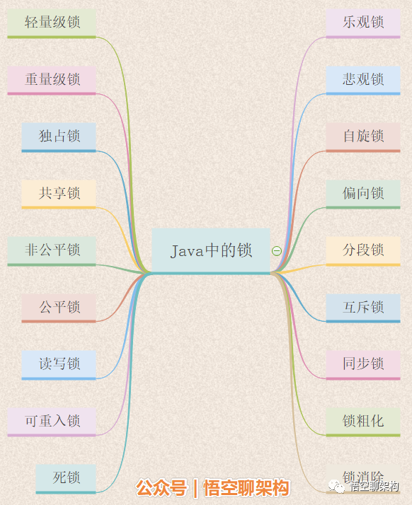
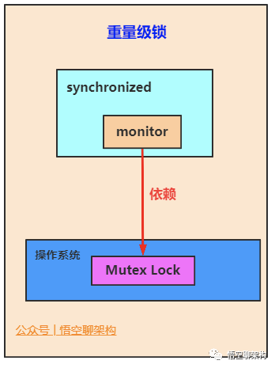
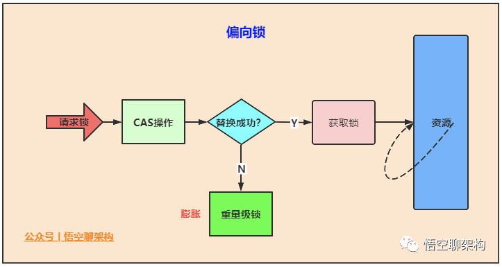
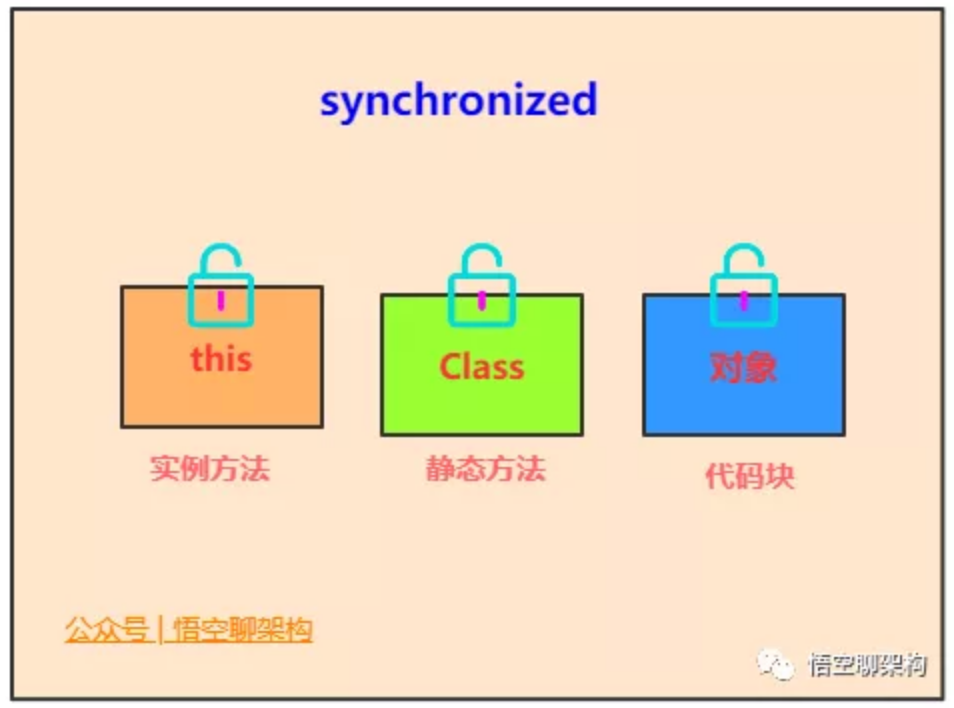
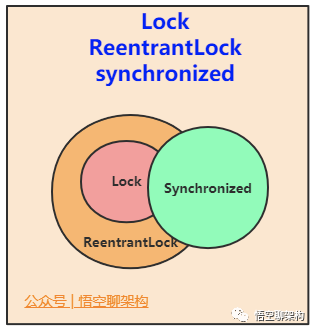

## java 中的锁

| 锁名称 | 应用     |                                                              |
| :----- | :------- | ------------------------------------------------------------ |
| 1      | 乐观锁   | CAS                                                          |
| 2      | 悲观锁   | synchronized、vector、hashtable                              |
| 3      | 自旋锁   | CAS                                                          |
| 4      | 可重入锁 | synchronized、Reentrantlock、Lock                            |
| 5      | 读写锁   | ReentrantReadWriteLock，CopyOnWriteArrayList、CopyOnWriteArraySet |
| 6      | 公平锁   | Reentrantlock(true)                                          |
| 7      | 非公平锁 | synchronized、reentrantlock(false)                           |
| 8      | 共享锁   | ReentrantReadWriteLock中读锁                                 |
| 9      | 独占锁   | synchronized、vector、hashtable、ReentrantReadWriteLock中写锁 |
| 10     | 重量级锁 | synchronized                                                 |
| 11     | 轻量级锁 | 锁优化技术                                                   |
| 12     | 偏向锁   | 锁优化技术                                                   |
| 13     | 分段锁   | concurrentHashMap                                            |
| 14     | 互斥锁   | synchronized                                                 |
| 15     | 同步锁   | synchronized                                                 |
| 16     | 死锁     | 相互请求对方的资源                                           |
| 17     | 锁粗化   | 锁优化技术                                                   |
| 18     | 锁消除   | 锁优化技术                                                   |

### 乐观锁

**乐观锁是一种乐观思想**

假定当前环境是读多写少，遇到并发写的概率比较低，读数据时认为别的线程不会正在进行修改（所以没有上锁）。写数据时，判断当前 与期望值是否相同，如果相同则进行更新（更新期间加锁，保证是原子性的）

### 悲观锁

**悲观锁是一种悲观思想**

认为写多读少，遇到并发写的可能性高，每次去拿数据的时候都认为其他线程会修改，所以每次读写数据都会认为其他线程会修改，所以每次读写数据时都会上锁。其他线程想要读写这个数据时，会被这个线程 block，直到这个线程释放锁然后其他线程获取到锁

### 自旋锁

为了让线程等待，我们只须让线程执行一个忙循环（自旋）

自旋锁的优点：避免了线程切换的开销。挂起线程和恢复线程的操作都需要转入内核态中完成，这些操作给 Java 虚拟机的并发性能带来了很大的压力。

自旋锁的缺点：占用处理器的时间，如果占用的时间很长，会白白消耗处理器资源，而不会做任何有价值的工作，带来性能的浪费。因此自旋等待的时间必须有一定的限度，如果自旋超过了限定的次数仍然没有成功获得锁，就应当使用传统的方式去挂起线程。
自旋次数默认值：10次。可以使用参数 -XX:PreBlockSpin 来自行更改。

自适应自旋：自适应意味着自旋的时间不再是固定的，而是由前一次在同一个锁上的自旋时间及锁的拥有者的状态来决定的。有了自适应自旋，随着程序运行时间的增长及性能监控信息的不断完善，虚拟机对程序锁的状态预测就会越来越精准。

### 可重入锁（递归锁）

任意线程在获取到锁之后能够再次获取该锁而不会被锁所阻塞

* 再次获取锁：识别获取锁的线程是否为当前占据锁的线程，如果是，则再次成功获取。获取锁后，进行计数自增，
* 释放锁：释放锁时，进行计数自减

面试题1：可重入锁如果加了两把，但是只释放了一把会出现什么问题？
答：程序卡死，线程不能出来，也就是说我们申请了几把锁，就需要释放几把锁。

面试题2：如果只加了一把锁，释放两次会出现什么问题？
答：会报错，抛出 java.lang.IllegalMonitorStateException。

### 读写锁

通过 ReentrantReadWriteLock 类来实现

为了提高性能， Java 提供了读写锁。在读的地方使用读锁，在写的地方使用写锁，灵活控制。如果没有写锁的情况下，读是无阻塞的。在一定程度上提高了程序的执行效率。读写锁分为读锁和写锁，多个读锁不互斥，读锁与写锁互斥，这是由 JVM 自己控制的

* 读锁：允许多个线程获取读锁，同时访问同一个资源
* 写锁：只允许一个线程获取写锁，不允许同时访问同一个资源

### 公平锁
**公平锁是一种思想**

多个线程按照申请锁的顺序来获取锁

在并发环境中，每个线程会先查看此锁维护的等待队列，如果当前等待队列为空，则占有锁，如果等待队列不为空，则加入到等待队列的末尾，按照 FIFO 的原则从队列中拿到线程，然后占有锁

### 非公平锁

**非公平锁是一种思想**

线程尝试获取锁，如果获取不到，则再采用公平锁的方式

多个线程获取锁的顺序，不是按照先到先得的顺序，有可能后申请锁的线程比先申请的线程优先获取锁

* 优点：非公平锁的性能高于公平锁。
* 缺点：有可能造成线程饥饿（某个线程很长一段时间获取不到锁）

### 共享锁

**共享锁是一种思想**

可以有多个线程获取读锁，以共享的方式持有锁。和乐观锁、读写锁同义

### 独占锁
**独占锁是一种思想**

只能有一个线程获取锁，以独占的方式持有锁。和悲观锁、互斥锁同义

### 重量级锁

重量级锁是一种称谓：synchronized 是通过对象内部的一个叫做监视器锁（monitor）来实现的。监视器锁本身依赖底层的操作系统的 Mutex Lock 来实现。操作系统实现线程的切换需要从用户态切换到核心态，成本非常高。这种依赖于操作系统 Mutex Lock来实现的锁称为重量级锁。为了优化 synchonized 引入了轻量级锁，偏向锁

### 轻量级锁

轻量级锁是 JDK6 时加入的一种锁优化机制：轻量级锁是在无竞争的情况下使用 CAS 操作去消除同步使用的互斥量。轻量级是相对于使用操作系统互斥量来实现的重量级锁而言的。轻量级锁在没有多线程竞争的前提下，减少传统的重量级锁使用操作系统互斥量产生的性能消耗。如果出现两条以上的线程争用同一个锁的情况，那轻量级锁将不会有效，必须膨胀为重量级锁。

优点：如果没有竞争，通过 CAS 操作成功避免了使用互斥量的开销。
缺点：如果存在竞争，除了互斥量本身的开销外，还额外产生了 CAS 操作的开销，因此在有竞争的情况下，轻量级锁比传统的重量级锁更慢

### 偏向锁

偏向锁是 JDK6 时加入的一种锁优化机制：在无竞争的情况下把整个同步都消除掉，连 CAS 操作都不去做了。偏是指偏心，它的意思是这个锁会偏向于第一个获得它的线程，如果在接下来的执行过程中，该锁一直没有被其他的线程获取，则持有偏向锁的线程将永远不需要再进行同步。持有偏向锁的线程以后每次进入这个锁相关的同步块时，虚拟机都可以不再进行任何同步操作（例如加锁、解锁及对 Mark Word 的更新操作等）。

优点：把整个同步都消除掉，连 CAS 操作都不去做了，优于轻量级锁。
缺点：如果程序中大多数的锁都总是被多个不同的线程访问，那偏向锁就是多余的

### 分段锁

### 互斥锁

互斥锁与悲观锁、独占锁同义，表示某个资源只能被一个线程访问，其他线程不能访问。

读读互斥；
读写互斥；
写读互斥；
写写互斥。

### 同步锁

同步锁与互斥锁同义，表示并发执行的多个线程，在同一时间内只允许一个线程访问共享数据

### 死锁

死锁是一种现象：如线程 A 持有资源 x，线程 B 持有资源 y，线程 A 等待线程 B 释放资源 y，线程 B 等待线程 A 释放资源 x，两个线程都不释放自己持有的资源，则两个线程都获取不到对方的资源，就会造成死锁。

Java 中的死锁不能自行打破。所以线程死锁后，线程不能进行响应。所以一定要注意程序的并发场景，避免造成死锁

### 锁粗化

锁粗化是一种优化技术：如果一系列的连续操作都对同一个对象反复加锁和解锁，甚至加锁操作都是出现在循环体体之中，就算真的没有线程竞争，频繁地进行互斥同步操作将会导致不必要的性能损耗。所以就采取了一种方案：把加锁的范围扩展（粗化）到整个操作序列的外部，这样加锁解锁的频率就会大大降低，从而减少了性能损耗

### 锁消除

锁消除是一种优化技术：就是把锁干掉。当 Java  虚拟机运行时发现有些共享数据不会被线程竞争时就可以进行锁消除。

那如何判断共享数据不会被线程竞争？

利用逃逸分析技术：分析对象的作用域，如果对象在 A 方法中定义后，被作为参数传递到B方法中，则称为方法逃逸；如果被其他线程访问，则称为线程逃逸。

在堆上的某个数据不会逃逸出去被其他线程访问到，就可以把它当作栈上数据对待，认为它是线程私有的，同步加锁就不需要了

### synchronized

synchronized 是 Java中的关键字：用来修饰方法、对象实例。属于独占锁、悲观锁、可重入锁、非公平锁。

* 作用于实例方法时，锁住的是对象的实例（this）；
* 当作用于静态方法时，锁住的是类（class）。相当于类的一个全局锁， 会锁所有调用该方法的线程；
* synchronized 作用于一个非 null 的对象实例时，锁住的是所有以该对象为锁的代码块。它有多个队列，当多个线程一起访问某个对象监视器的时候，对象监视器会将这些线程存储在不同的容器中。

每个对象都有个 monitor 对象， 加锁就是在竞争 monitor 对象。代码块加锁是在代码块前后分别加上 monitorenter 和 monitorexit 指令来实现的，方法加锁是通过一个标记位来判断的

###  Lock 和 synchronized 的区别

Lock 是 Java 中的接口，可重入锁、悲观锁、独占锁、互斥锁、同步锁。

* Lock 需要手动获取锁和释放锁。就好比自动挡和手动挡的区别；
* Lock 是一个接口，而 synchronized 是 Java 中的关键字。synchronized 是 Java 语言内置的实现；
* * synchronized 在发生异常时，会自动释放线程占有的锁，因此不会导致死锁现象发生；而 Lock 在发生异常时，如果没有主动通过 unLock() 去释放锁，则很可能造成死锁现象，因此使用 Lock 时需要在 finally 块中释放锁；
Lock 可以让等待锁的线程响应中断，而 synchronized 却不行。使用 synchronized 时，等待的线程会一直等待下去，不能够响应中断；
* 通过 Lock 可以知道有没有成功获取锁，而 synchronized 却无法办到；
* Lock 可以通过实现读写锁提高多个线程进行读操作的效率。

synchronized 的优势：

* 足够清晰简单，只需要基础的同步功能时，用 synchronized；
* Lock 应该确保在 finally 块中释放锁。如果使用 synchronized，JVM确保即使出现异常，锁也能被自动释放；
* 使用 Lock 时，Java 虚拟机很难得知哪些锁对象是由特定线程锁持有的

### ReentrantLock 和 synchronized 的区别

ReentrantLock 是 Java 中的类：继承了 Lock 类，可重入锁、悲观锁、独占锁、互斥锁、同步锁。

相同点：

* 主要解决共享变量如何安全访问的问题；
* 都是可重入锁，也叫做递归锁，同一线程可以多次获得同一个锁；
* 保证了线程安全的两大特性：可见性、原子性。

不同点：

* ReentrantLock 就像手动汽车，需要显示的调用 lock 和 unlock 方法， synchronized 隐式获得释放锁；
* ReentrantLock 可响应中断， synchronized 是不可以响应中断的，ReentrantLock 为处理锁的不可用性提供了更高的灵活性；
* ReentrantLock 是 API 级别的， synchronized 是 JVM 级别的；
* ReentrantLock 可以实现公平锁、非公平锁，默认非公平锁。synchronized 是非公平锁，且不可更改；
* ReentrantLock 通过 Condition 可以绑定多个条件。

## 参考

[24张图带你彻底理解Java中的21种锁](https://mp.weixin.qq.com/s/kMyyHaDQn-Da8MTmpPUyfg)