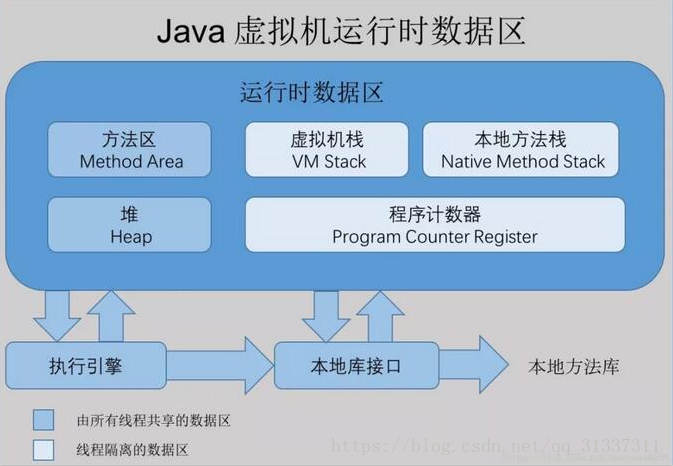
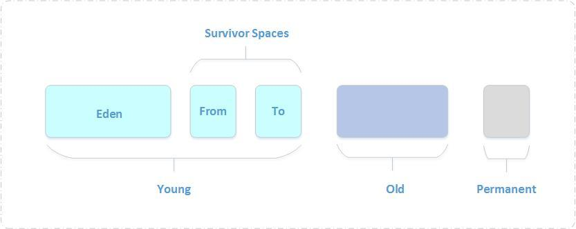

## 模型

## 程序计数器

程序计数器是一块很小的内存空间，它是线程私有的，可以认作为当前线程的行号指示器

倘若当前执行的是 JVM 的方法，则该寄存器中保存当前执行指令的地址；倘若执行的是native方法，则PC寄存器中为空

## 虚拟机栈

可以被用来快速访问的存储区域，通过栈指针访问处理器。栈描述的是Java方法执行的内存模型
每个方法被执行的时候都会创建一个栈帧用于存储局部变量表，操作栈，动态链接，方法出口等信息。每一个方法被调用的过程就对应一个栈帧在虚拟机栈中从入栈到出栈的过程

### 栈帧

栈帧是一种数据结构，用于虚拟机进行方法的调用和执行

结构内容:
* 局部变量表
* 操作数栈
* 动态链接
* 方法返回地址
* 附加信息

#### 局部变量表
**局部变量表被定义成 从0开始的数字数组**

是一片逻辑连续的内存空间，最小单位是 `Slot` ，用来存放方法参数和方法内部定义的局部变量。

#### 操作数栈

每个栈帧都包含一个被叫做操作数栈的后进先出的栈

1.栈桢刚创建时，里面的操作数栈是空的。

2.Java虚拟机提供指令来让操作数栈对一些数据进行入栈操作，比如可以把局部变量表里的数据、实例的字段等数据入栈。

3.同时也有指令来支持出栈操作。

4.向其他方法传参的参数，也存在操作数栈中。

5.其他方法返回的结果，返回时存在操作数栈中。

#### 动态链接

每一个栈帧内部都要包含一个指向运行时常量池的引用，来支持动态链接的实现

#### 方法返回地址

返回一个值给调用它的方法，方法正常完成发生在一个方法执行过程中遇到了方法返回的字节码指令的时候，使用哪种返回指令取决于方法返回值的数据类型（如果有返回值的话）

## 堆

java堆在虚拟机启动的时候建立，它是java程序最主要的内存工作区域。几乎所有的java对象实例和数组都存放在java堆中。堆空间是所有线程共享的，这是一块与java应用密切相关的内存空间

### 堆结构

Java虚拟机将堆内存划分为新生代、老年代和永久代

#### 新生代

新生成的对象优先存放在新生代中，大对象直接进入老年代，或回收的内存不够用也进入老年代

收集过程

1. 计算 `From Survivor` 区的对象的年龄，超过阀值(15) 进入，老年代
2. 未超过阀值，将 `Eden` 区和 `From Survivor` 复制到 `To Survivor` 区
3. 清空 `Eden` 和 `From Survivor`

#### 老年代

在新生代中经历了多次（具体看虚拟机配置的阀值）GC后仍然存活下来的对象会进入老年代中。老年代中的对象生命周期较长，存活率比较高，在老年代中进行GC的频率相对而言较低，而且回收的速度也比较慢

## 方法区

方法区与Java堆一样，是各个线程共享的内存区域，它用于存储已被虚拟机加载的类信息、常量、静态变量、即时编译器编译后的代码等数据

是jvm规范里面的运行时数据区的一个组成部分，jvm规范中的运行时数据区还包含了：pc寄存器、虚拟机栈、堆、方法区、运行时常量池、本地方法栈。主要用来存储class、运行时常量池、字段、方法、代码、JIT代码等。运行时数据区跟内存不是一个概念，方法区是运行时数据区的一部分。方法区是jvm规范中的一部分，并不是实际的实现，切忌将规范跟实现混为一谈

## 参考

[JVM结构及堆的划分](https://www.cnblogs.com/guanghe/p/10524314.html)
[Java8虚拟机内存模型](https://www.cnblogs.com/cjsblog/p/9850300.html)