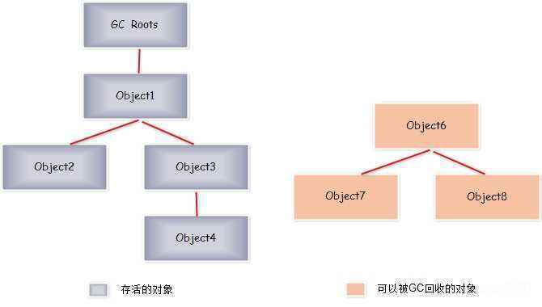
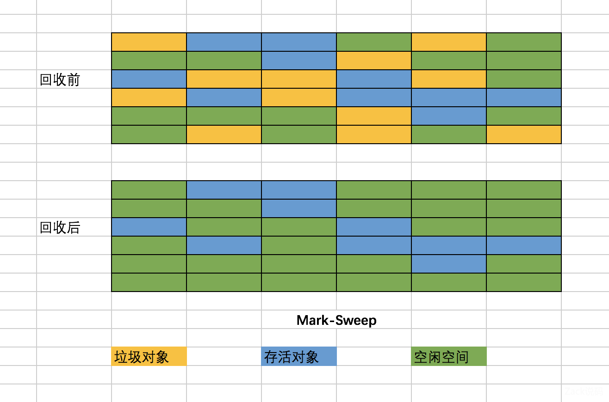
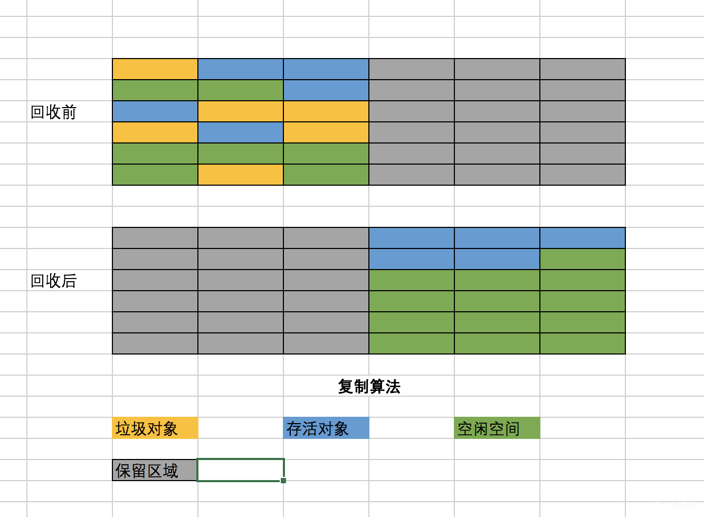
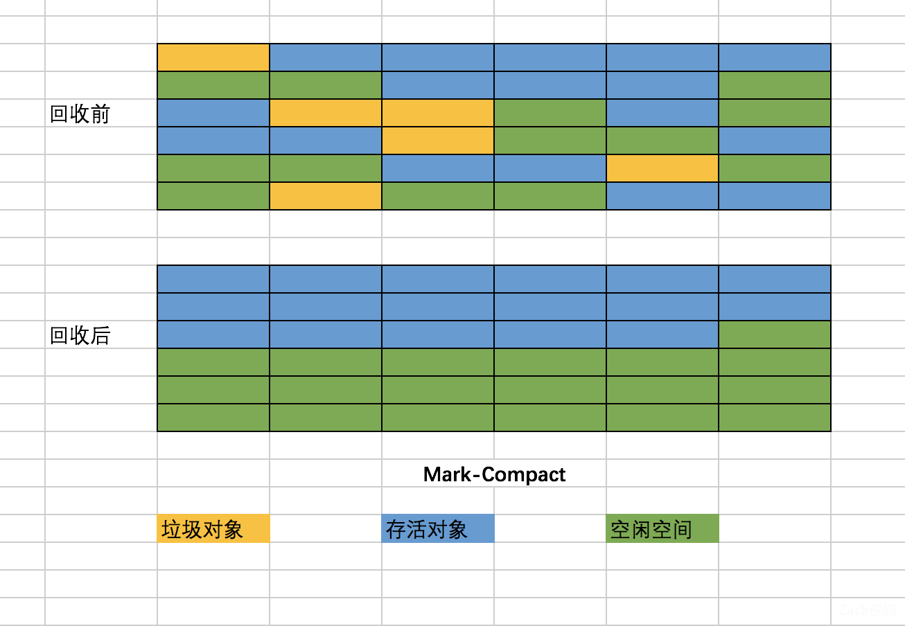

## java 对象回收

### GC对象搜索算法

#### 引用计数算法
给对象一个计数器，每当这个对象被引用了，计数器值加一；引用失效，则减一。但这个对象计数值为0的时候，证明是无用对象，可以被GC程序回收掉。

#### 可达性分析算法

可达性分析算法（GC roots算法），广泛应用于主流的商用语言。设置一个根节点，从图论角度来看，只要从该节点可达一个对象，证明这个对象是存活的（被引用）

通常地，GC会包含以下区域的对象：

虚拟机栈（栈帧中的本地变量表）中引用的对象；  
方法区中类静态属性引用的对象；  
方法区中常量引用的对象；  
本地方法栈中JNI（即一般说的Native方法）引用的对象；

### 垃圾回收算法
#### 标记-清除算法（Mark-Sweep）
标记-清除，顾名思义，先标记垃圾，再清除。它是GC最基础的算法，后续很多算法都是基于它上面去改进的。 被标记的对象，在统一GC的时候会把标记的对象清除掉

缺点:垃圾回收后会产生大量不连续的碎片空间，导致程序要申请较大的对象时常无法找到合适的内存空间，迫使再次GC。

#### 复制算法
复制算法的存在，正是为了解决内存碎片问题。并且这个算法也是分代算法的基础。

将内存分为大小相等的两块，每次程序只使用其中一块，当GC发生的时候，把存活的对象复制到另外一块内存中，整齐的排列，然后清空原来的那块内存。

可以看到，这种算法有点新生代转移到老年代的感觉。

缺点：

把内存可使用的空间减少了一半，造成空间的浪费。
对象存活数量较多的时候，复制性能比较差
这种缺点，在老年代中，对象存活率比较高的场景下是非常场景间。

#### 标记-整理算法（Mark-Compact）

针对复制算法的两个缺点，在老年代一般会用这种标记-整理算法。
把存活的对象移到内存的一端，然后把剩余的空间全部清空掉。

#### 分代收集算法

分代算法并不是一个特定的算法，也没有什么新的内容。而是把内存分成多个区域，一般为新生代、老年代等。然后根据不同区域不同的特点，用不同回收算法去回收垃圾。

例如新生代，对象存活率低，比较适用复制算法。老年代存活率高，比较适用Mark-Compact算法。

目前几乎所有的商业虚拟机都是采用分代收集的。