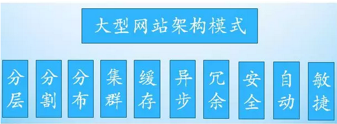

## 分布式

### CAP

* 一致性：在分布式系统中的所有数据备份，在同一时刻是否同样的值。
* 可用性：在集群中一部分节点故障后，集群整体是否还能响应客户端的读写请求。
* 分区容忍性：以实际效果而言，分区相当于对通信的时限要求。系统如果不能在时限内达成数据一致性，就意味着发生了分区的情况，必须就当前操作在C和A之间做出选择

### BASE理论

* Basically Available（基本可用）
* Soft state（软状态）
* Eventually consistent（最终一致性）

### 分布式ID

* 唯一性：确保生成的ID是全网唯一的。
* 有序递增性：确保生成的ID是对于某个用户或者业务是按一定的数字有序递增的。
* 高可用性：确保任何时候都能正确的生成ID。
* 带时间：ID里面包含时间，一眼扫过去就知道哪天的交易

1. 数据库自增ID

业务系统每次需要一个ID时，都需要请求数据库获取，性能低，并且如果此数据库实例下线了，那么将影响所有的业务系统

2. UUID

没有排序，无法保证趋势递增。
UUID往往是使用字符串存储，查询的效率比较低

3. 雪花算法

4. Redis生成ID

incr 和 increby 这样的自增原子命令

## 高并发

### 高并发下如何使用redis

不是使用单机模式，主从结构（读写分离），集群模式

### 集群、微服务、分布式

1. 分布式：一个业务分拆多个子业务，部署在不同的服务器上

2. 集群：同一个业务，部署在多个服务器上

3. 微服务 微服务是一种架构风格，一个大型复杂软件应用由一个或多个微服务组成

### 如何设计高可用架构

可分为前端优化、浏览器优化、应用层优化、代码层优化与存储层优化：

前端优化：网站业务逻辑之前的部分。

浏览器优化：减少 HTTP 请求数，使用浏览器缓存，启用压缩，CSS JS 位置，JS 异步，减少 Cookie 传输；CDN 加速，反向代理。

应用层优化：处理网站业务的服务器。使用缓存，异步，集群。

代码优化：合理的架构，多线程，资源复用（对象池，线程池等），良好的数据结构，JVM调优，单例，Cache 等。

存储优化：缓存、固态硬盘、光纤传输、优化读写、磁盘冗余、分布式存储（HDFS）、NoSQL 等

应用层：一般设计为无状态的，对于每次请求，使用哪一台服务器处理是没有影响的。一般使用负载均衡技术（需要解决 Session 同步问题）实现高可用。

服务层：负载均衡，分级管理，快速失败（超时设置），异步调用，服务降级，幂等设计等。

数据层：冗余备份（冷，热备[同步，异步]，温备），失效转移（确认，转移，恢复）。数据高可用方面著名的理论基础是 CAP 理论。（持久性，可用性，数据一致性[强一致，用户一致，最终一致]）

### 分布式一致性

Paxos