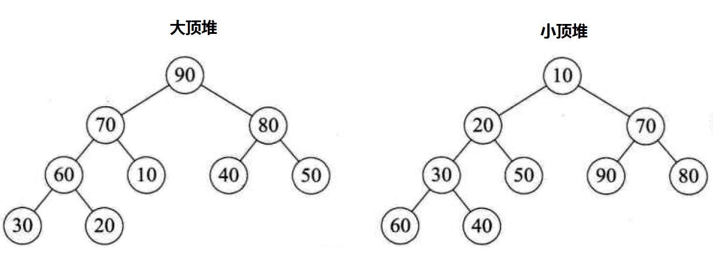

## 排序

### 快排

1. 先从数列中取出一个数作为基准数
2. 分区过程，将比这个数大的数全放到它的右边，小于或等于它的数全放到它的左边
3. 再对左右区间重复第二步，直到各区间只有一个数 基于递归

#### 双路快排

在有些带有许多重复数据的数组里，使用随机快速排序或者最简单的快速排序算法时，由于重复的数据会放在原来的索引位置不动，就回导致划分数组时划分的某一部分太长，起不到分段排序的效果，这样就导致算法退化成O(n^2)的复杂度

1. 避免数组近乎有序，先随机取出一个val，和第一个元素交换。
2. 定义两个指针，i从头开始指向小于val的区域后一个元素，j从尾开始指向大于val的第一个元素。
3. 当i所指向的值小于等于val，i++，否则暂停。当j所指向的值大于等于val，j--，否则暂停。当i和j都暂停时，交换i和j所指位置的元素。直到i>j结束，让start赋给j所指向的位置，返回j。
4. 重复2.3 直到start>end，排序完成

```java
public static void qiuckSort3(int[] array){
    if(array.length <=1)return;
    int start = 0;
    int end = array.length-1;
    qiuck3(array,start,end);
}
private static void qiuck3(int[] array ,int start, int end){
    if(start >end) return;
    if(end - start <=15){
        //如果数据量少就使用直接插入
        insert(array,start,end);
        return;
    }

    int random = (int)(Math.random()*(end-start+1)+start);
    swap(array,random,start);
    //找到一个随机key
    int value = array[start];
    int lt = start; 
    int gt = end+1; 
    int i = start+1;
    for(;i<gt;i++){
        if(array[i]<value){
            //放到小于的区域
            swap(array,lt+1,i);
            lt++;
            i++;
        }else if(array[i]>value){
            //放到大于区域
            swap(array,gt-1,i);
            gt--;
        }
    }
    swap(array,lt,start);
    //直接跳过相等元素的比较
    qiuck3(array,start,lt-1);
    qiuck3(array,gt,end);
}
```

### 堆排序

堆排序，即借助堆这种数据结构将一个数组进行排序

1. 将数组原地转换为一个大顶堆结构；
2. 交换堆顶和堆中最后一个元素的位置，堆中元素数量减1；
3. 从堆顶开始按照大顶堆规则构建堆结构后，重复第2步操作，直到堆中只剩下一个元素，堆排序操作完毕



#### 大顶堆

根结点（亦称为堆顶）的关键字是堆里所有结点关键字中最大者，称为大顶堆。
大根堆要求根节点的关键字既大于或等于左子树的关键字值，又大于或等于右子树的关键字值

#### 小顶堆

根结点（亦称为堆顶）的关键字是堆里所有结点关键字中最小者，称为小顶堆。

小根堆要求根节点的关键字既小于或等于左子树的关键字值，又小于或等于右子树的关键字值

### 归并排序

归并的含义是将两个或两个以上的有序表合并成一个新的有序表。

归并排序有多路归并排序、两路归并排序 , 可用于内排序，也可以用于外排序

O(nlgn)

思路:

将一个数列先分后治 先对半分，数列对半分，分到最后一个，然后在两两治，合并成一个有序列 在从2个有序列合并一个有序，知道合并完成

#### 两路归并排序

分而治之(divide - conquer);
每个递归过程涉及三个步骤
第一, 分解: 把待排序的 n 个元素的序列分解成两个子序列, 每个子序列包括 n/2 个元素.
第二, 治理: 对每个子序列分别调用归并排序 MergeSort, 进行递归操作
第三, 合并: 合并两个排好序的子序列,生成排序结果

### 插入排序

O(n平方)

直接插入排序的基本操作是将一个记录插入到已经排好的有序表中，从而得到一个新的、记录数增1的有序表

### 希尔排序

是对直接插入排序进行的一种改进排序算法，采用跳跃分割的方法，将整个待排序列分割成若干个子序列，对这些子序列进行直接插入排序，使其得到的结果基本有序，然后再不断缩减分割的区间，使其完全有序

### 外排序

外排序采用分块的方法（分而治之），首先将数据分块，对块内数据按选择一种高效的内排序策略进行排序。然后采用归并排序的思想对于所有的块进行排序，得到所有数据的一个有序序列

1. 采用适当的内部排序方法对输入文件的每个片段进行排序，将排好序的片段（成为归并段）写到外部存储器中（通常由一个可用的磁盘作为临时缓冲区），这样临时缓冲区中的每个归并段的内容是有序的

2. 利用归并算法，归并第一阶段生成的归并段，直到只剩下一个归并段为止

## 算法

### 数字反转

1. `%10` 取余数，得到最低位
2. `/10` 降低位数
3. 重复 1.2

```java
static void reverse(int a) {
    int rs = 0;
    while (a > 0) {
        rs *= 10;
        rs += a % 10;
        a /= 10;
    }
    System.out.println(rs);
}
```

## 数据结构

### 堆和栈

#### 空间分配的区别

#### 数据结构的区别

堆：可以被看成是一颗树
栈: 先进后出