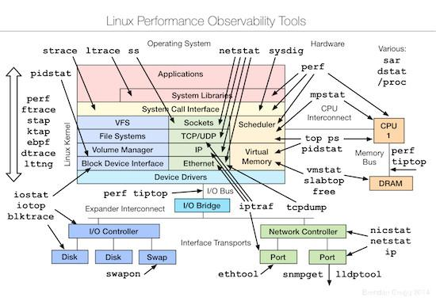

#### uptime

查看机器的负载情况

```shell
# uptime 
 22:24:34 up  2:14,  2 users,  load average: 0.00, 0.01, 0.05
```
> “22:24:34“表示当前时间
> “up 2:14“ 表示系统已经连续运行2小时14分
> “load average: 0.00, 0.01, 0.05“ 中显示的分别是系统过去1分钟、5分钟和15分钟的平均负载

