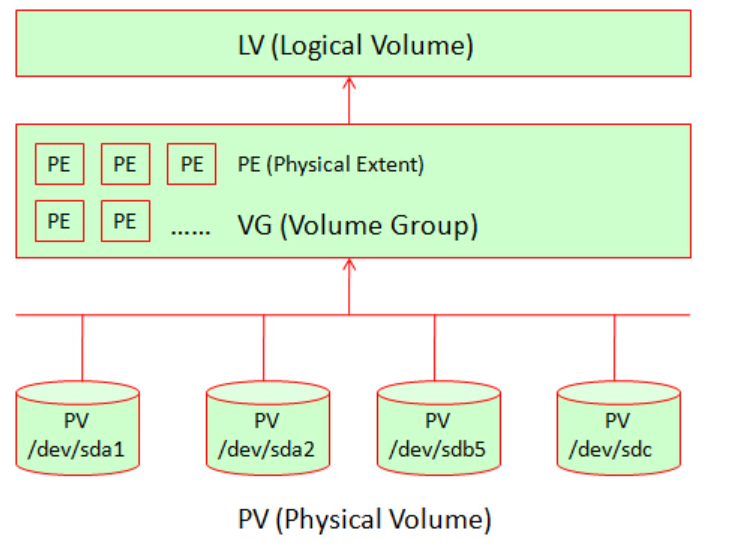

**PV(Physical Volume) - 物理卷**

物理卷在逻辑卷管理中处于最底层，它可以是实际物理硬盘上的分区，也可以是整个物理硬盘，也可以是raid设备

**VG(Volume Group) - 卷组**

卷组建立在物理卷之上，一个卷组中至少要包括一个物理卷，在卷组建立之后可动态添加物理卷到卷组中。一个逻辑卷管理系统工程中可以只有一个卷组，也可以拥有多个卷组

**LV(Logical Volume) - 逻辑卷**

逻辑卷建立在卷组之上，卷组中的未分配空间可以用于建立新的逻辑卷，逻辑卷建立后可以动态地扩展和缩小空间。系统中的多个逻辑卷可以属于同一个卷组，也可以属于不同的多个卷组



**创建LVM步骤**

1. 添加新硬盘；
2. 给新硬盘创建分区；
3. 创建PV；
4. 创建VG；
5. 创建LV；
6. 格式化LV；
7. 挂载LV到指定目录；

**扩容步骤**

LV的扩容

- (1) 使用VG的Free空间，对LV扩容；
- (2) 完成后需要在对文件系统扩容；

VG的扩容

- 方式1： 通过增加PV来实现
- 方式2： 通过扩展raid（磁盘阵列）设备的容量来间接对VG扩容

**LVM的缩减**

- \1. LV的缩减
- \2. VG的缩减

### 创建LVM

**创建系统分区**
```
fdisk /dev/vdb
欢迎使用 fdisk (util-linux 2.23.2)。

更改将停留在内存中，直到您决定将更改写入磁盘。
使用写入命令前请三思。

Device does not contain a recognized partition table
使用磁盘标识符 0x09261bf7 创建新的 DOS 磁盘标签。

命令(输入 m 获取帮助)：n    #创建分区
Partition type:
   p   primary (0 primary, 0 extended, 4 free)
   e   extended
Select (default p): p    #创建主分区
分区号 (1-4，默认 1)：1     #选择1
起始 扇区 (2048-629145599，默认为 2048)： #回车
将使用默认值 2048
Last 扇区, +扇区 or +size{K,M,G} (2048-629145599，默认为 629145599)：  #回车
将使用默认值 629145599
分区 1 已设置为 Linux 类型，大小设为 300 GiB

命令(输入 m 获取帮助)：p  #查看创建的主分区

磁盘 /dev/vdb：322.1 GB, 322122547200 字节，629145600 个扇区
Units = 扇区 of 1 * 512 = 512 bytes
扇区大小(逻辑/物理)：512 字节 / 512 字节
I/O 大小(最小/最佳)：512 字节 / 512 字节
磁盘标签类型：dos
磁盘标识符：0x09261bf7

   设备 Boot      Start         End      Blocks   Id  System
/dev/vdb1            2048   629145599   314571776   83  Linux    #系统默认为83，即：Linux

命令(输入 m 获取帮助)：t          #更改分区格式
已选择分区 1  
Hex 代码(输入 L 列出所有代码)：8e       #8e为Linux LVM格式
已将分区“Linux”的类型更改为“Linux LVM”

命令(输入 m 获取帮助)：p

磁盘 /dev/vdb：322.1 GB, 322122547200 字节，629145600 个扇区
Units = 扇区 of 1 * 512 = 512 bytes
扇区大小(逻辑/物理)：512 字节 / 512 字节
I/O 大小(最小/最佳)：512 字节 / 512 字节
磁盘标签类型：dos
磁盘标识符：0x09261bf7

   设备 Boot      Start         End      Blocks   Id  System
/dev/vdb1            2048   629145599   314571776   8e  Linux LVM  #已改成8e

命令(输入 m 获取帮助)：w #保存
The partition table has been altered!
```

**创建PV**

```
[root@VM_8_76_centos ~]# pvcreate /dev/vdb1  
  Physical volume "/dev/vdb1" successfully created.
```

**创建VG**

```
[root@VM_8_76_centos ~]# vgcreate datavg  /dev/vdb1    #创建一个名为datavg的Volume Group 
  Volume group "datavg" successfully created
```

**创建LV**

```
[root@VM_8_76_centos ~]# lvcreate -l 100%free -n datalv  datavg    
  Logical volume "datalv" created.
```

**格式化LV**

```
 mkfs.ext4 /dev/datavg/datalv 
```

**挂载LV**

```
mount /dev/datavg/datalv  /data/ 
```