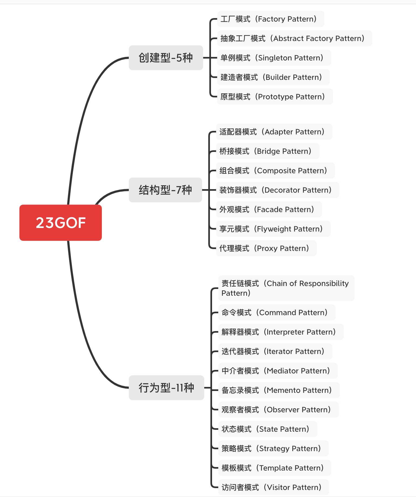
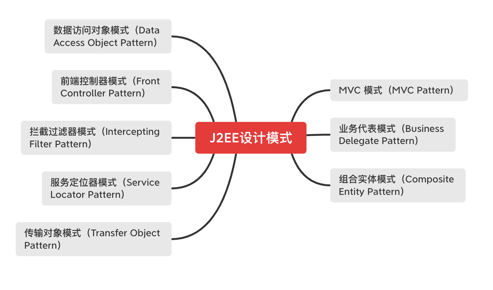

## 什么是设计模式

设计模式是软件开发人员在软件开发过程中的一般问题的解决方案。这些解决方案是众多软件开发人员经过相当长的一段时间的试验和错误总结出来的。
使用设计模式是为了重用代码、让代码更容易被他人理解、保证代码可靠性

### GOF

在 1994 年，由 Erich Gamma、Richard Helm、Ralph Johnson 和 John Vlissides 四人合著出版了一本名为 Design Patterns - Elements of Reusable Object-Oriented Software（中文译名：设计模式 - 可复用的面向对象软件元素） 的书，该书首次提到了软件开发中设计模式的概念。
四位作者合称 GOF（四人帮，全拼 Gang of Four）

* 对接口编程而不是对实现编程。
* 优先使用对象组合而不是继承。

### 23

### J2EE模式

## 关系图

