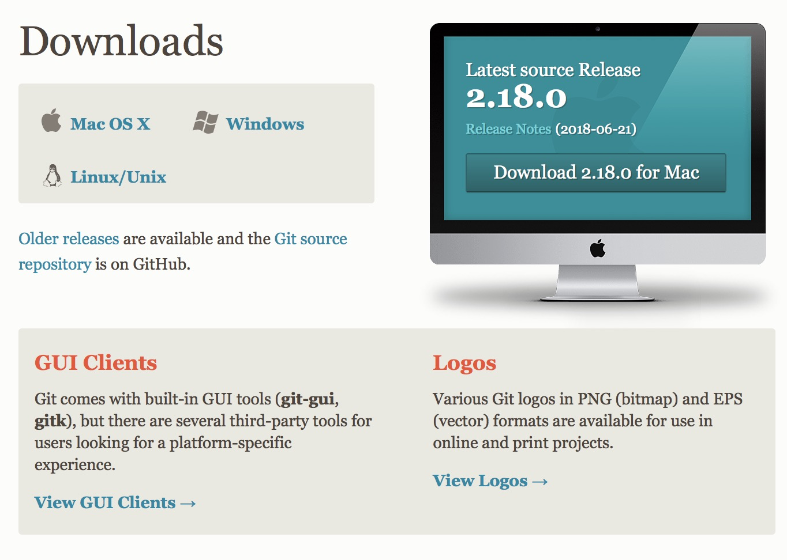
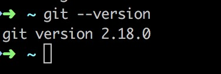
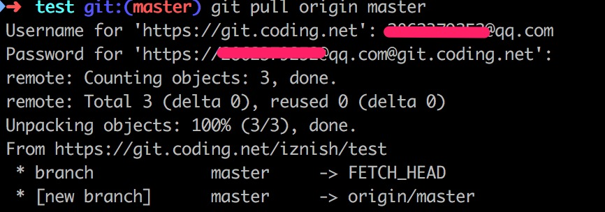
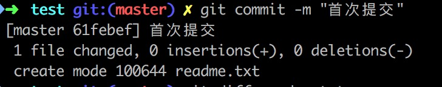
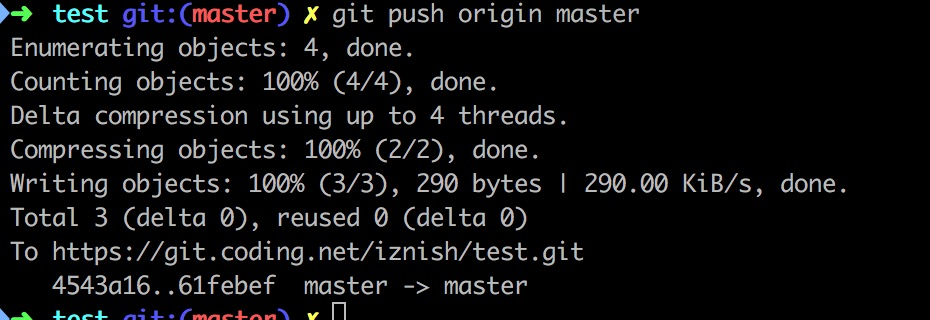
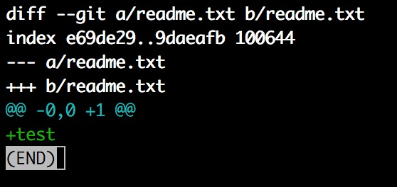
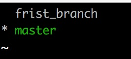
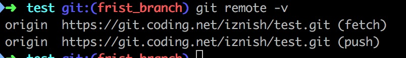
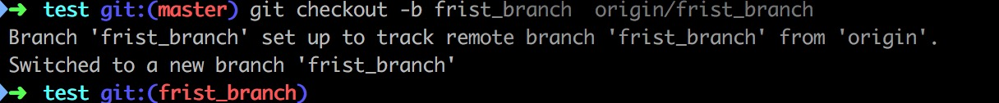

# Git 教程
##一、安装
#### 1. macos 下安装  
##### a. 通过brew 包管理器安装  

> [brew包管理安装](../os/macos.md)

```shell
brew install git
```
#####b.  [官网下载](https://git-scm.com/downloads)   


#### 2. 是否安装成功  
打开终端输入命令  
```shell
git -version
```
结果如下：  
  

#### 3.基本设置  
```shell
git config --global user.name "输入你的用户名"  
git config --global user.email "输入你的邮箱"
```
```shell
git config --list
```
##二、本地初始化 
### A. 本地已存在仓库
#### 1. 创建本地仓库
```
git init test # test 为创建的仓库名称  
Initialized empty Git repository in /Users/wangwei/Documents/ztmp/repo/test/.git/
```
#### 2. 将本地仓库与远程仓库g关联
```shell
cd test # 进入本地仓库
git remote add origin https://git.coding.net/iznish/test.git
## https://git.coding.net/iznish/test.git 为远程仓库地址
git pull origin master ## 远程仓库同步到本地
```
  
#### 3. 首次提交
```shell
git add readme.txt ##添加单个文件
git commit  -m "首次提交"
```
 
#### 4.本地推送
```shell
git push origin master ## 本地推送到远程仓库
```
 
#### 5. 文件比较 
```shell
git deff readme.txt # 文件变更明细
```
 
### B、从远程仓库克隆
```shell
git clone https://git.coding.net/iznish/test.git test #test 为目录
```
## 文件操作
#### 撤销修改

```shell
git checkout -- readme.txt ## 将文件回退到最近一次commit状态
```
#### 删除文件

```shell
git rm test.txt
git commit -m "删除test.txt"
git checkout -- text.txt ## 恢复被删除的文件
```

#### 版本库（Repository）

工作区有一个隐藏目录.git，这个不算工作区，而是Git的版本库。  
Git的版本库里存了很多东西，其中最重要的就是称为stage（或者叫index）的暂存区，还有Git为我们自动创建的第一个分支master，以及指向master的一个指针叫HEAD  
> 对文件的修改，新增都加入到暂存区。提交操作将暂存区的文件同步到master

## 分支操作
>HEAD严格来说不是指向提交，而是指向master，master才是指向提交的，所以，HEAD指向的就是当前分支。
>一开始的时候，master分支是一条线，Git用master指向最新的提交，再用HEAD指向master，就能确定当前分支，以及当前分支的提交点
>
>
>
> 

#### 创建分支
```shell
git branch frist_branch
```
#### 查看分支
```shell
git branch
```
 

#### 切换分支

```shell
git checkout frist_branch
```
#### 创建+切换分支
```shell
git checkout -b frist_branch
```
#### 合并某分支到当前分支
```shell
git checkout master ## 切换到主分支
git merge frist_branch ## 将分支合并到主分支
```
#### 删除分支
```shell
git branch -d frist_branch
```

## 多人协作
>首先，可以试图用git push origin <branch-name>推送自己的修改；
>如果推送失败，则因为远程分支比你的本地更新，需要先用git pull试图合并；
>如果合并有冲突，则解决冲突，并在本地提交；
>没有冲突或者解决掉冲突后，再用git push origin <branch-name>推送就能成功！
>
>如果git pull提示no tracking information，则说明本地分支和远程分支的链接关系没有创建，用命令git branch --set-upstream-to <branch-name> origin/<branch-name>。

#### 查看远程信息
```shell
git remote -v
```
 
>没有push 权限，看不到push 链接

#### 分支获取
```shell
git clone https://git.coding.net/iznish/test.git
git checkout -b frist_branch  origin/frist_branch
```
 
## 标签管理
```shell
git tag v.1.0.1
```

## 配置git

#### 配置 .gitignore
>忽略文件的原则是：  
>忽略操作系统自动生成的文件，比如缩略图等；  
>忽略编译生成的中间文件、可执行文件等，也就是如果一个文件是通过另一个文件自动生成的，那自动生成的文件就没必要放进版本库，比如Java编译产生的.class文件；  
>忽略你自己的带有敏感信息的配置文件，比如存放口令的配置文件

[java .gitingore](./Java.gitignore)

[官网.gitignore 文件](https://github.com/github/gitignore)