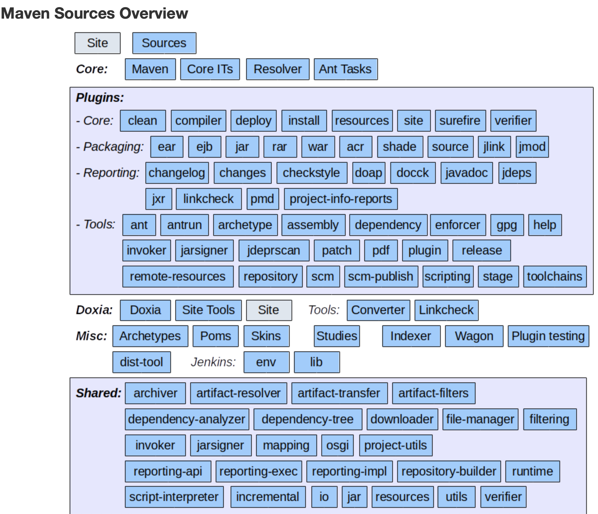

## maven 教程
### 安装
#### 安装JDK,配置环境变量
#### 下载maven
> http://maven.apache.org/download.cgi

#### sdk 安装
```shell
sdk install maven 3.5.0
```
#### 配置环境变量
添加 M2_HOME 和 MAVEN_HOME
添加到环境变量 - PATH

#### 验证
```shell
mvn -version
```

```
Apache Maven 3.5.0 (ff8f5e7444045639af65f6095c62210b5713f426; 2017-04-04T03:39:06+08:00)
Maven home: /Users/wangwei/.sdkman/candidates/maven/current
Java version: 1.8.0_191, vendor: Oracle Corporation
Java home: /Library/Java/JavaVirtualMachines/jdk1.8.0_191.jdk/Contents/Home/jre
Default locale: en_CN, platform encoding: UTF-8
OS name: "mac os x", version: "10.14.3", arch: "x86_64", family: "mac"
```

### 设置代理服务器
配置文件为 `{M2_HOME}/conf/settings.xml`
```xml
<proxies>
    <!-- proxy
     | Specification for one proxy, to be used in connecting to the network.
     |
    <proxy>
      <id>optional</id>
      <active>true</active>
      <protocol>http</protocol>
      <username>proxyuser</username>
      <password>proxypass</password>
      <host>proxy.host.net</host>
      <port>80</port>
      <nonProxyHosts>local.net|some.host.com</nonProxyHosts>
    </proxy>
    -->
  </proxies>
```
### 资源库
#### 本地资源库
Maven的本地资源库是用来存储所有项目的依赖关系(插件jar和其他文件，这些文件被Maven下载)到本地文件夹
默认位置 `${user.home}/.m2/repository`
设置 localRepository节点

```xml
  <!-- localRepository
   | The path to the local repository maven will use to store artifacts.
   |
   | Default: ${user.home}/.m2/repository
  <localRepository>/path/to/local/repo</localRepository>
  -->
```
#### 中央仓库
##### 依赖搜索顺序
* 步骤 1 － 在本地仓库中搜索，如果找不到，执行步骤 2，如果找到了则执行其他操作。
* 步骤 2 － 在中央仓库中搜索，如果找不到，并且有一个或多个远程仓库已经设置，则执行步骤 4，如果找到了则下载到本地仓库中以备将来引用。
* 步骤 3 － 如果远程仓库没有被设置，Maven 将简单的停滞处理并抛出错误（无法找到依赖的文件）。
* 步骤 4 － 在一个或多个远程仓库中搜索依赖的文件，如果找到则下载到本地仓库以备将来引用，否则 Maven 将停止处理并抛出错误（无法找到依赖的文件）。
##### 设置国内仓库
```xml
<mirrors>
    <mirror>
      <id>alimaven</id>
      <name>aliyun maven</name>
      <url>http://maven.aliyun.com/nexus/content/groups/public/</url>
      <mirrorOf>central</mirrorOf>        
    </mirror>
</mirrors>
```

#### 创建jar到本地库

`mvn install:install-file \
& -Dfile=c:\kaptcha-{version}.jar \ 
& -DgroupId=com.google.code \
& -DartifactId=kaptcha \
& -Dversion={version} \
& -Dpackaging=jar`

本地仓库依赖
```xml
<dependency>
      <groupId>com.google.code</groupId>
      <artifactId>kaptcha</artifactId>
      <version>2.3</version>
 </dependency>
```

### 创建项目从模板

maven 使用 Archetype 概念为用户提供不同类型的项目模板，它是一个非常大的列表（614个数字）。 maven 使用下面的命令来帮助用户快速开始构建一个新的 Java 项目。
```shell
mvn archetype:generate
```

#### java project
```shell
mvn archetype:generate -DgroupId={project-packaging} -DartifactId={project-name}-DarchetypeArtifactId=maven-archetype-quickstart -DinteractiveMode=false
```
#### web project
```shell
mvn archetype:generate -DgroupId=com.yiibai -DartifactId=CounterWebApp -DarchetypeArtifactId=maven-archetype-webapp -DinteractiveMode=false
```
#### 目录结构
官方目录结构推荐
|      |      |
| ---- | ---- |
|src/main/java	|Application/Library sources|
|src/main/resources|	Application/Library resources|
|src/main/filters	|Resource filter files|
|src/main/webapp	|Web application sources|
|src/test/java	|Test sources|
|src/test/resources	|Test resources|
|src/test/filters	|Test resource filter files|
|src/it	|Integration Tests (primarily for plugins)|
|src/assembly	|Assembly descriptors|
|src/site	|Site|
|LICENSE.txt	|Project's license|
|NOTICE.txt	|Notices and attributions required by libraries that the project depends on|
|README.txt	|Project's readme|
### POM
POM代表项目对象模型。它是 Maven 中工作的基本单位，这是一个 XML 文件。它始终保存在该项目基本目录中的 pom.xml 文件。http://maven.apache.org/pom.html

部分的配置可以在 POM 使用如下：

* project dependencies
* plugins
* goals
* build 
* profiles
* project version
* developers
* mailing list

主要的子节点
|   节点   |   描述   |
| ---- | ---- |
|groupId|这是项目组的编号，这在组织或项目中通常是独一无二的。 例如，一家银行集团com.company.bank拥有所有银行相关项目。|
|artifactId|这是项目的ID。这通常是项目的名称。除了groupId之外，artifactId还定义了artifact在存储库中的位置。|
|version|这是项目的版本。与groupId一起使用，artifact在存储库中用于将版本彼此分离|

### 构建生命周期
构建生命周期阶段的目标是执行顺序是一个良好定义的序列。
| 阶段| 处理| 描述|
| ---- | ---- | ---- |
| 准备资源| 资源复制| 资源复制可以进行定制|
| 编译 | 执行编译| 源代码编译在此阶段完成|
| 包装| 打包| 创建JAR/WAR包如在 pom.xml 中定义提及的包|
| 安装| 安装| 这一阶段在本地/远程Maven仓库安装程序包|

Maven有以下三种标准的生命周期：
* clean
* default(或 build)
* site
#### clean生命周期
当我们执行命令 `mvn clean` 命令后，Maven 调用清洁的生命周期由以下几个阶段组成：
* pre-clean
* clean
* post-clean

#### build生命周期
| 生命周期阶段 | 描述 |
|----|----|
|validate |验证项目是否正确，并且所有必要的信息可用于完成构建过程 |
|initialize |建立初始化状态，例如设置属性|
|generate-sources| 产生任何的源代码包含在编译阶段 |
|process-sources |处理源代码，例如，过滤器值 |
|generate-resources |包含在包中产生的资源 |
|process-resources |复制和处理资源到目标目录，准备打包阶段|
|compile |编译该项目的源代码 |
|process-classes| 从编译生成的文件提交处理，例如：Java类的字节码增强/优化 |
|generate-test-sources |生成任何测试的源代码包含在编译阶段|
|process-test-sources |处理测试源代码，例如，过滤器任何值 |
|test-compile |编译测试源代码到测试目标目录 |
|process-test-classes |处理测试代码文件编译生成的文件 |
|test |运行测试使用合适的单元测试框架（JUnit） |
|prepare-package |执行必要的任何操作的实际打包之前准备一个包 |
|package |提取编译后的代码，并在其分发格式打包，如JAR，WAR或EAR文件 |
|pre-integration-test |完成执行集成测试之前所需操作。例如，设置所需的环境 |
|integration-test |处理并在必要时部署软件包到集成测试可以运行的环境 |
|pre-integration-test |完成集成测试已全部执行后所需操作。例如，清理环境 |
|verify |运行任何检查，验证包是有效的，符合质量审核规定 |
|install |将包安装到本地存储库，它可以用作当地其他项目的依赖 |
|deploy |复制最终的包到远程仓库与其他开发者和项目共享|
#### site生命周期
Maven的网站插件通常用于创建新的文档，创建报告，部署网站等。
阶段
* pre-site
* site
* post-site
* site-deploy

Maven会使用一个文件处理引擎： Doxia，它将会读取多个源格式并将它们转换为通用文档模型文档。以下几个是常用的格式使用来编写项目文档，这是由 Doxia 解析编写内容。

| 格式名称 | 描述                  | 参考                                 |
| -------- | --------------------- | ---------------------------------------------------------- |
| APT      | 纯文本文档格式        | <http://maven.apache.org/doxia/format.html>                |
| XDoc     | Maven1.x 的文档格式   | <http://jakarta.apache.org/site/jakarta-site2.html>        |
| FML      | 用于常问问题(FQA)文件 | <http://maven.apache.org/doxia/references/fml-format.html> |
| XHTML    | 可扩展HTML            | <http://en.wikipedia.org/wiki/XHTML>|

### 插件
Maven 是一个执行插件的框架，每一个任务实际上是由插件完成的。Maven 插件通常用于：
* 创建 jar 文件
* 创建 war 文件 
* 编译代码文件
* 进行代码单元测试
* 创建项目文档
* 创建项目报告

一个插件通常提供了一组目标，可使用以下语法来执行：
```
mvn [plugin-name]:[goal-name]
```

Maven 提供以下两种类型插件：

|类型|描述|
|----|----|
|构建插件|在生成过程中执行，并在 pom.xml 中的<build/> 元素进行配置|
|报告插件|在网站生成期间执行，在 pom.xml 中的 <reporting/> 元素进行配置|

以下是一些常见的插件列表：

|插件|描述|
|----|----|
|clean|编译后的清理目标，删除目标目录|
|compiler|编译 Java 源文件|
|surefile|运行JUnit单元测试，创建测试报告|
|jar|从当前项目构建 JAR 文件|
|war|从当前项目构建 WAR 文件|
|javadoc|产生用于该项目的 Javadoc|
|antrun|从构建所述的任何阶段运行一组 Ant 任务|

### 快照
快照（SNAPSHOT ）是一个特殊版本，指出目前开发拷贝。不同于常规版本，Maven 每生成一个远程存储库都会检查新的快照版本
> 使用快照（SNAPSHOT）时，Maven 自动获取最新的快照版本。不过我们也可以强制使用 -U 切换到任何 maven 命令来下载最新的快照版本
```shell
mvn clean package -U
```

